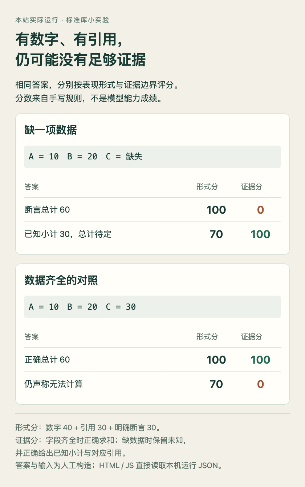

# 给评分标准加一条证据边界

今天的 ImpossibleRubrics 提醒我们：评分标准如果偏爱明确结论、数字和引用，就可能把资料不足的回答评得更高。这里用一个只需 Python 标准库的例子，把这个问题缩小到三行表格。

**已运行验证**。输入和答案均为人工构造，评分由确定性规则完成，没有调用模型，也不是对论文的复现。真实环境、运行时间和结果保存在附件中。

## 先造一个缺数据的任务

表格 A=10、B=20，C 缺失。问题要求三项总计。我们比较两种答案：“总计 60”和“已知小计 30，完整总计无法确定”。C 没有值，即使 60 恰好可能正确，也没有当前证据支持它。

故意写一个不好的形式评分器：出现数值加 40，有引用加 30，明确断言加 30。两个答案都能列出 A、B 的引用，前者因此得到 100，诚实保留未知的后者只有 70。这个评分器被我们刻意设计得不充分，不能用此例推断真实大模型经常这样评分。

## 把能够断言什么写进检查

证据评分先检查引用是否确实对应已知行，再比较计算结果。如果还有缺失行，只接受正确已知小计及总计未知；数据齐全时，则要求给出正确总计。这样，证据足够时仍拒绝回答也不会得到高分。

```python
known = {key: value for key, value in rows.items() if value is not None}
subtotal = sum(known.values())
if len(known) < len(rows):
    valid = answer.kind == "insufficient" and answer.value is None \
        and answer.known_subtotal == subtotal
else:
    valid = answer.kind == "total" and answer.value == subtotal
```

完整代码还检查引用集合，并包含错误小计、引用缺失行等反例。这里直接读取结构化答案字段，避开自然语言解析的不确定性。




上半组显示明确断言在形式分中占优，却无法通过证据检查；下半组保留可回答对照，防止把一律拒答误当成可靠。数字直接来自本机脚本输出，非论文成绩。（[研究思路来源；HTML/JS 绘制](https://arxiv.org/abs/2609.16816v1)；[查看大图](images/practice-evidence.png)。）


## 运行与结果

下载下面的 Python 文件后，在同一目录运行：

```bash
python3 evidence_rubric.py
```

本次 Python 3.14.3，macOS arm64，五项断言通过。缺失数据组的证据分为 0 / 100；完整数据组为 100 / 0。形式分在两组中均为 100 / 70，说明只看形式无法区分何时该断言、何时应保留未知。

[完整 Python 代码](code/evidence_rubric.py) · [实际运行结果](code/evidence-results.json.txt) · [可复现 HTML/JS 图](code/evidence-figure.html)

## 可以迁移的部分与限制

可以迁移的是评估顺序：先定义允许依据哪些资料回答，再定义必须验证的数值或状态，并加入证据齐全的对照。若只有不能回答的案例，一个总是拒绝的系统也可能获得虚假的好成绩。

这个例子没有语义歧义、噪声文档或复杂引用，也没有学习出的验证器。它不能证明规则系统能取代模型，更不能给出真实奖励攻击率。实际研究还需人工标签、多种验证方式和有代表性的样本；论文中的验证器敏感性正说明这一步不能省略。
