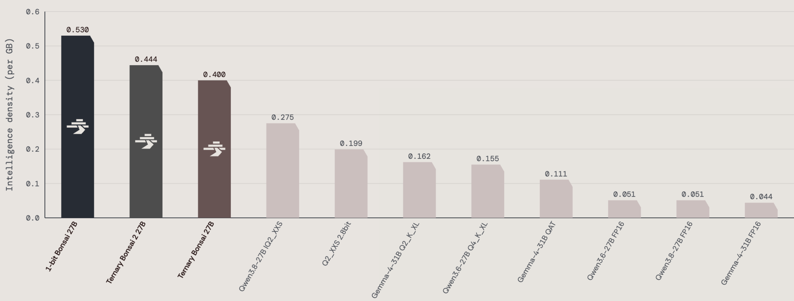

# AI 动态｜5 条重点详解 + 10 条速读

今天重点看三个变化：专业检索怎样保留证据链，小模型与系统优化怎样真正节省资源，以及 Agent 的行动如何受授权和验收约束。本文把发布日期与北京时间采集日分开；只有日期的公告不猜首发时刻。单篇报道、厂商知名度和漂亮成绩均不足以证明“真正热门”。

以下 15 个独立事件从不少于 25 条候选中筛出。官方内部测试不等于本站实测；地区、等待名单、未来路线图和许可限制均随条目说明。

## 01 · Astra for Law：先找到可核验的法律依据，再组织答案

2026-09-17。入选：新近实用／创新进展；以下区分已开放能力、实验报告与计划，热度待验证。

OpenAI 发布 Astra for Law，将 GPT-6 Astra、法律任务指令与专用法律索引组合起来。新增能力的关键是检索层：索引覆盖超过 2.3 亿个相关 URL，围绕美国判例、法规和条例组织信息。官方称其覆盖 Free Law Project 所列判例的 99.9%；这是指定语料的覆盖率，不能理解成任何法律问题都有答案。

普通搜索可能找到一篇转述，法律工作还要确认原文、管辖区、日期及引用关系。这个产品希望把检索到的依据接入后续合同审阅、尽职调查和文书工作流。对使用者而言，有价值的流程是先打开原始法条或判例，核对结论是否适用于自己的材料，再审阅模型生成的分析；专业索引并不替代这些判断。

官方披露的 Vals 测试包含 200 个私有美国法律问题。在最高推理设置下，正确率为 54.0%，使用普通网页检索的 Astra 为 38.7%。这是同一特定测试的比较，不能写成所有法律任务准确率提升四成，更不能据此推断已达到无人审阅的水平。错误答案仍占相当比例，来源存在也不保证推理正确。

这次还把法律插件、社区技能与 Word 中的工作连接起来，适合律师把已有材料带入同一工作流程。我们将它们合并为一次产品发布，没有把每个插件拆成新闻。公告里的合同审阅和尽调案例属于官方示例，本站没有测试真实案件，也没有验证各插件的权限与输出质量。

开放仍有明确边界：首先通过 Trusted Access 面向部分律所，在 ChatGPT 与 Codex 中提供访问；API 型号 gpt-6-astra-law 仍是即将提供。符合条件的企业数据安排也有申请与产品范围要求。研究读者最值得追踪的是“专用索引、引用核验、工作流验收”这条链路，而不是只看模型名称。

[原始来源](https://openai.com/index/astra-for-law/)

## 02 · GLM Infra Agent：用密集反馈改进推理系统

2026-09-17。入选：新近实用／创新进展；以下区分已开放能力、实验报告与计划，热度待验证。

智谱团队公开 GLM Infra Agent 的工程案例：从国产加速器上的首次运行到 GLM-5.3-Flash 生产流量接入，作者报告用时两周，端到端吞吐提升 3.2 倍。这里的新事件是这套实践与结果的公开说明。相关改动跨越不同时间，不能把旧代码合并记录都说成今天才完成，也不能把作者报告直接当成独立系统基准。

方法的核心是把“把系统变快”拆成很多能迅速判定对错的小回路。第一层检查输出与数值是否正确；第二层定位系统耗时，例如 Python 调度与数据搬运；第三层才比较计算内核的性能。反馈越便宜、越具体，Agent 越容易知道哪次修改有效，失败后也更容易退回一个可检查的状态。

一个例子涉及长上下文计算：较低精度的中间乘法误差会逐步累积，局部测试看似通过，长序列却偏离。作者关联的 [FLA PR 1180](https://github.com/fla-org/flash-linear-attention/pull/1180) 使用更高精度的仿射链路并加入多卡测试。该 PR 已在 8 月 27 日合并，说明案例有公开实现可追查，却不能据此证明整套生产性能数字。

另一个瓶颈出现在 KV 传输路径的 Python 锁和调度，作者称相关开销从超过 30% 降至不足 1%。解码内核还去掉了重复的归一化计算，单个内核报告 1.71 倍加速。这些数字对应不同分母：局部开销占比、内核速度和端到端吞吐不能相乘，也不能都理解为用户等待时间的同等缩短。

对研究与开发者，最可复用的是先建设验收环境：固定输入、留存基线、检查数值容差、测量真实关键路径，再让 Agent 提议和测试改动。目标设定、反馈环境和高风险审阅仍有人参与。原作者也明确与完全自主的递归自我改进保持距离；本条按内部工程报告收录，未写成已经开放的通用优化产品。

[原始来源](https://x.com/jietang/status/2100482019088060470)

## 03 · 华为公布昇腾路线图：芯片交付与超节点系统要分开看

2026-09-17。入选：新近实用／创新进展；以下区分已开放能力、实验报告与计划，热度待验证。

华为在全联接大会公布昇腾 960 系列与 Atlas 系统进展。官方给出的安排是：昇腾 960DT 计划于 2027 年第一季度推出，较原计划提前三个季度；960PR 计划于第三季度推出，提前一个季度。这是未来产品路线图，今天不能据此写成两款芯片已经交付，更不能直接代入现有云实例的价格和速度。

系统层面的重点是 Atlas 960E。官方介绍将 NPO 近封装光互联与 Hi-ONE 光引擎用于跨芯片连接，单引擎带宽标为 7.2 Tb/s，并给出 4096 个 NPU、8 EFLOPS FP8 算力、最高 1 PB HBM 的超节点配置。算力数字描述指定精度下的系统能力规划，并非某个大模型已经达到的训练吞吐。

为什么互联值得关注？一台加速器算得快，仍可能在等待另一台的数据。模型切分、专家路由与 KV 状态传输越频繁，连接带宽、通信延迟和软件调度越影响最终效率。超节点尝试让更多设备更紧密地协作，但“能够互联多少卡”与“把多少卡稳定用于同一训练任务”之间，还有软件与运维条件。

同场介绍的 CPU、存储及 KV 相关方案，也说明大模型基础设施不只是一张芯片。较长上下文与大量并发请求既消耗计算，也占用内存并产生搬运开销。对使用者，后续需要比较的是完整任务的成本、完成时间和稳定性；峰值算力、内存容量与网络带宽分别回答不同问题。

本次公告给出了清楚的时间与架构方向，因此列入重点。本站尚无交付系统或可复跑的同条件测评，不据宣传参数排列国产与海外芯片的实际优劣。若正在规划训练平台，可以把这些节点列入后续验证清单；真正选型还需要等待可采购配置、软件支持与任务级测试。

[原始来源](https://www.huawei.com/en/news/2026/9/hc-wang-keynote)

## 04 · Bonsai 2 27B：约 5.9 GB 的语言权重，部署还要看运行时

2026-09-17。入选：新近实用／创新进展；以下区分已开放能力、实验报告与计划，热度待验证。

Prism 发布基于 Qwen3.8-27B 的 Bonsai 2 27B。其权重主要取 −1、0、+1 三种值，再用分组缩放恢复数值范围；算入缩放等开销后，官方博客给出的有效精度约为 1.76 bit，而非“每个参数只有一位”。语言模型部分约 5.9 GB，使较大参数模型进入更多本地设备的存储范围。

这与把原始模型文件简单压缩成 ZIP 不同：推理计算必须理解这种表示，并用相应内核读取和运算。官方提供 GGUF 与 MLX 等路径，但需要 Prism 对应的运行时分支或内核支持。下载到文件，不代表任意版本的通用推理软件都能直接获得公告里的性能。

博客的综合成绩为 83.9，对照模型为 85.4；作者据此称保留约 98.2% 的该项综合表现。模型卡另有采用不同集合的平均分，不能把两个口径拼成同一实验。部分任务可能损失更多，准备采用时应选自己的代码、问答或多模态样本核对，不能只看一列总平均。

官方报告 RTX 5090 最高约 143 token/s，Apple M5 Max 约 46.8 token/s。这些是作者指定环境下的结果，本站没有复测。原图将成绩与体积结合展示，帮助理解“小体积保留多少能力”，但比值优势并不等于质量、延迟、并发能力都优于其他模型。

权重按 Apache-2.0 提供，使用视觉能力还要配置单独的视觉组件。262K 上下文是支持范围，不是低内存设备随时能跑满的承诺：KV 缓存、激活、运行时和图像处理仍会占内存。实用价值在于让本地部署有新的体积与质量选择；判断是否适合自己的机器，要把语言权重、视觉组件和目标上下文预算一起算。

横轴为模型与量化版本，纵轴为作者定义的每GB智能密度；比值不能代替绝对质量或实际内存测量。图为作者指定比较，非本站实测。（[来源原图](https://prismml.com/news/bonsai-2-27b)；[查看大图](images/bonsai-density.png)。）

[原始来源](https://prismml.com/news/bonsai-2-27b)

## 05 · Google CC 扩展到家庭小组：共享信息与对外行动分别授权

2026-09-17。入选：新近实用／创新进展；以下区分已开放能力、实验报告与计划，热度待验证。

Google Labs 将 CC 从个人邮件助手扩展到家庭小组实验，最多支持六名成员。当前范围是美国、18 岁以上的个人 Google 账号，仍有等待名单与早期实验条件。公告不是全球正式上线，也不意味着家庭中的所有 Google 账号都会自动接入；成员资格和主动参与是流程的起点。

一个小组中的 CC 拥有独立且经过验证的 Google 账号，在独立云端计算环境中工作，由 Antigravity 运行框架与 Gemini 支撑。这个身份可以接收家人发来的邮件、照片、邀请，以及主动分享的日历与文件。独立身份让共享对象更清楚，但它本身不等于对隐私或安全效果的完整保证。

典型场景是把学校活动、旅行安排和家庭事项交给同一个助手汇总。用户可选择将特定发件人的邮件转发给它，也可只发送某一次消息；共享的内容再进入早间简报、日历或待办。这里最容易误解的是“能处理家庭信息”与“默认读取每位成员的全部邮箱”并不相同，原公告描述的是有选择的分享。

CC 还会维护共同记忆与个人偏好，帮助理解同一件事对不同成员的影响。需要联系小组外的人或执行外部行动时，系统要求取得许可。图中用三名成年成员说明两个边界：先决定哪些信息进入共享空间，再决定哪些行动可以离开这个空间；它是概念示意，不是产品截图或底层权限审计。

这类产品的价值在协调，而不只是生成一份更漂亮的摘要。共享信息缺失、过期或互相矛盾时，助手仍需要澄清；用户也应能看出事项依据来自哪里。本站没有获得该实验的实际使用记录，因此按新近产品能力收录，不宣称已经证明能替代家庭成员的最终确认。

AI 生成的概念示意。箭头表示主动共享与行动许可，不表示产品真实界面或未经核验的安全保证；当前实验仅面向18岁以上成员。（[事实来源](https://blog.google/innovation-and-ai/models-and-research/google-labs/cc-expanding-to-groups/)；[查看大图](images/cc-sharing.png)。）

[原始来源](https://blog.google/innovation-and-ai/models-and-research/google-labs/cc-expanding-to-groups/)

---

接下来是十条速读。

## 06 · UN System Data Commons：让统计查询保留指标与来源

2026-09-17。入选：新近实用／创新进展；以下区分已开放能力、实验报告与计划，热度待验证。

Google 与联合国推出 UN System Data Commons，用 Data Commons 的知识图谱把不同机构的指标、地区和时间口径连接起来，并提供自然语言查询与图表。相关 MCP 接口让 Agent 可以提取有来源的数据。对研究者，价值在于先核对指标定义和时间，再用数字回答问题；“2027 年覆盖 80% 联合国统计数据集”是目标，不是已完成覆盖。本期核对公告与联合国原始说明，未测试所有查询。

[原始来源](https://blog.google/innovation-and-ai/technology/ai/google-un-data-commons-platform/)

## 07 · Anthropic 为生命科学研究设置验证通道

2026-09-17。入选：新近实用／创新进展；以下区分已开放能力、实验报告与计划，热度待验证。

Life Sciences Verification Program 进入机构与团队测试阶段，通过身份、资质和监督安排区分访问。标准通道与高风险项目通道的期限和可用模型不同，后者并非一次认证后永久放开；个人 Pro、Max 的支持仍在后续计划中。对科研团队，新变化是申请与审查流程更明确，不能理解成生物领域限制全部取消。公告仍保留其他安全规则，实际研究用途需按获批范围使用。

[原始来源](https://www.anthropic.com/news/life-sciences-verification-program)

## 08 · Anthropic 披露内部 AI 研发参与度：26% 不等于全自主

2026-09-17。入选：新近实用／创新进展；以下区分已开放能力、实验报告与计划，热度待验证。

Anthropic 公布内部研发测量框架，把工作分为不同自主等级。8 月原型测量中，26% 被归为 AI 主导、仍有人监督的 AL4，超过 90% 达到协作等级 AL3 或以上，没有 AL5 完全自主项目。下图适合看等级边界，不适合推断整个行业的研发自动化率。这是公司内部测量及其定义下的比例，非独立审计，也不能把平台拦截比例直接当危险行为发生率。

图表采用作者内部等级与测量范围。AL4仍有人监督，不能把它改写成无需人的完全自主研发。（[来源原图](https://www.anthropic.com/institute/measuring-pace-of-ai-development)；[查看大图](images/anthropic-autonomy.png)。）

[原始来源](https://www.anthropic.com/institute/measuring-pace-of-ai-development)

## 09 · Pinterest Restyle：把房间照片带进装修探索

2026-09-17。入选：新近实用／创新进展；以下区分已开放能力、实验报告与计划，热度待验证。

Pinterest 的视觉搜索更新加入 Restyle 测试，让用户围绕自己的房间照片探索不同布置与风格，当前公告范围为美国和加拿大。实际价值是从具体空间开始寻找想法，减少只靠关键词猜测风格的步骤。它仍是视觉构思工具，生成图不证明家具尺寸、库存或施工可行性。本站依据官方发布核对开放状态，未运行产品，也不将广告业务指标当成装修效果的独立验证。

[原始来源](https://newsroom.pinterest.com/news/new-pinterest-visual-search-performance-ads/)

## 10 · Instinct Concierge：高接触任务进入小范围服务测试

2026-09-16 · 近期补充。入选：新近实用／创新进展；以下区分已开放能力、实验报告与计划，热度待验证。

Instinct 公布 Concierge，面向需要电话沟通、预订等较多外部协调的任务，采取缓慢放量的早期访问方式。原帖发布于 9 月 16 日 16:38 UTC，对应北京时间 17 日 00:38。值得关注的是任务从信息回答延伸到实际办理；但该条公告未完整公开人与自动化系统如何分工，不能说已由 AI 全自动完成所有电话。本站未体验，服务范围与可用性以获邀后的说明为准。

[原始来源](https://x.com/noahrshinn/status/2100262985491231101)

## 11 · 云知声 U2-Flash：把 Agent 训练接入可执行环境

2026-09-15 · 近期补充。入选：新近实用／创新进展；以下区分已开放能力、实验报告与计划，热度待验证。

云知声介绍 U2-Flash，官方模型页强调异步 Agent 强化学习、可执行环境和不同能力轨迹之间的训练。它对开发者的意义是模型面向工具执行与任务过程优化，而不只是对话得分。现有入口是 MaaS 模型服务，需要账号与相应调用条件；本期没有查到可据此认定开放权重的证据。宣传对比受训练、测试与预算影响，本站未将其写成独立确认的全面领先。

[原始来源](https://maas.unisound.com/models/u2-flash)

## 12 · GitHub Actions 执行保护正式可用：约束谁能触发工作流

2026-09-17。入选：新近实用／创新进展；以下区分已开放能力、实验报告与计划，热度待验证。

GitHub Actions 的 workflow execution protections 正式可用，可按组织、仓库、触发主体与事件设置执行规则，并借助观察模式检查影响。AI 辅助开发产生更多自动化改动后，谁能启动带权限的工作流比“文件能否写出来”更关键。公告同时给出部分公共仓库 pull_request_target 默认策略的后续执行安排；11 月 2 日是相关默认策略的计划执行节点，不能写成今天已全面禁用该事件。

[原始来源](https://github.blog/changelog/2026-09-17-workflow-execution-protections-in-github-actions-generally-available)

## 13 · Copilot 新增采用情况统计：调用次数与有效使用分开

2026-09-17。入选：新近实用／创新进展；以下区分已开放能力、实验报告与计划，热度待验证。

Copilot impact dashboard 新增 28 天窗口的功能参与度：某功能至少在两天使用过才计入该口径，用户可同时计入多个功能，不能简单相加得人数。同日 CLI 自定义项 API 还区分技能、插件与 MCP 交互；MCP 连接尝试包含失败，不能等同成功工具调用。两项放在一次统计能力更新中阅读。它们有助于判断功能是否进入日常流程，仍不能单靠使用次数证明产出更好。

[原始来源](https://github.blog/changelog/2026-09-17-copilot-impact-dashboard-now-shows-feature-engagement)

## 14 · Base Labs 与 Baseten 等合作：训练与运行期安全仍是建设计划

2026-09-16 · 近期补充。入选：新近实用／创新进展；以下区分已开放能力、实验报告与计划，热度待验证。

Base Labs 宣布与 Baseten、Hugging Face、Goodfire 等合作，方向包括训练阶段的监测方法与运行阶段的服务集成。原帖 9 月 16 日 18:10 UTC 发布，对应北京时间 17 日 02:10。新信息在合作分工和拟公开方法，当前公告不足以证明已有通用、可直接部署的完整安全标准。研究者可以跟踪后续实现和评测材料，本站没有把合作意向写成已验证的防护效果。

[原始来源](https://x.com/baselabs/status/2100286099121705396)

## 15 · 微软发布内部转型复盘：工具采用之外，开始对照业务结果

2026-09-17。入选：新近实用／创新进展；以下区分已开放能力、实验报告与计划，热度待验证。

微软发布自身 AI 转型复盘及 Frontier Playbook，重点是先明确业务问题，再调整数据、权限和工作流程。报告中的销售与供应链数字来自指定内部团队或流程，不能推断任意公司安装 Copilot 就有同样收益。值得借鉴的是把“多少人在用”与“任务是否更快、更好完成”分开测量，也与本日报筛选真正实用项目的标准一致。这是新的内部实践报告，非新模型发布，尚无本站独立复核。

[原始来源](https://blogs.microsoft.com/blog/2026/09/17/what-weve-learned-from-microsofts-own-ai-transformation/)

## 阅读边界

本期访问了十五家主要厂商的官方入口，并结合中英文媒体和公开社区线索。腾讯等动态入口覆盖不完整，X、Reddit 专用趋势后端仍不可用；本期读到个别公开原帖，不代表覆盖了它们的当天热门。完整候选取舍与收尾复查时间保存于本期来源审计。
