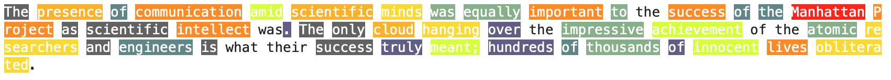

# 六个模型｜从输入输出看实际用途

本期分别选择通用推理、流式转写、判断式重排、音视频生成、稀疏检索和端侧工具调用。均核对到实际权重或适配器文件；开放范围不同，不能把本栏名称理解成六项都采用宽松许可。本站未部署，性能均为作者报告，热度待验证。

| 任务 | 模型 | 先检查什么 |
| --- | --- | --- |
| 多步推理与代码 | Xing4.0-29B-A4B | 完整权重、上下文和运行时内存 |
| 稳定追加的实时字幕 | Confucius4-R2T2 | 音频块长、延迟口径、自定义模型许可 |
| 判断候选答案是否受前提支持 | openjev | 三类输出含义、4B与35B不同路径 |
| 分块生成同步音视频 | TaoMate-H3 | 基座加LoRA、Hopper多卡与地域许可 |
| 可检查词项的英文检索 | SPARSEUP | 稀疏表示、索引实现与语料长度 |
| 本地选择工具、抽取字段 | Needle 3 | 端侧引擎、工具定义与置信度阈值 |

## 01 · Xing4.0-29B-A4B：稀疏激活不等于只加载4B

2026-09-16。新近实用／创新：9月16日建立公开权重仓库，提供面向推理与代码的MoE模型。

模型采用混合专家结构，一次推理只激活其中部分专家。卡片将核心规模写为 29B、激活约 4B，Hugging Face 文件统计包含其他组件后约为 31.22B 参数。选中的专家少，主要减少每步参与计算的参数，并不意味着机器只需容纳 4B 权重；实际下载有 41 片 safetensors。

结构结合 MLA、mHC 与多 token 预测等设计，原生上下文为 256K，卡片另报告扩展到 512K 的能力。长上下文能否实用还取决于缓存、并发和运行时支持。仅按目录的 BF16 参数计算，权重约 62.4 GB，尚未加入缓存与工作空间，不能把它推荐为任意16GB显卡可直接运行的模型。

作者提供代码与推理接入说明，并报告国产昇腾与 MindSpore 训练路径及多项代码、Agent 测试。成绩应连同具体运行框架阅读；本站未复核其训练过程或端到端任务表现。Apache-2.0 权重适合有足够硬件的研究部署，先用短上下文固定任务检验输出与资源占用，再考虑扩展窗口。

[模型卡与权重](https://huggingface.co/XingChen-AGI/Xing4.0-29B-A4B)

## 02 · Confucius4-R2T2：只提交不会反复改写的字幕前缀

2026-09-10 · 近期补充。新近实用／创新：本月公开流式识别权重，9月17日模型目录仍在更新；本期首次收录。

普通流式识别可能先显示一句话，听到后文后又回头修改。R2T2 基于 Qwen3-ASR，用稳定前缀数据、时间对齐与音频切分训练，让模型决定哪些文字可以提交，哪些还要等更多声音。已经提交的文本保持不变，适合字幕、实时翻译和下游 Agent；稳定输出不等于识别永不出错。

解码音频块可在 80ms 到 2s 间配置。作者报告的平均延迟约 200–600ms，与“每块80ms”不是同一个指标；切块间隔、等待足够语义、推理计算和网络传输都可能影响观众看到字幕的时间。原图按时间推进展示音频与稳定文字如何对齐，比只看一个最低延迟数字更有帮助。

权重目录约 2.04B BF16 参数，纯参数约 4.08GB，实际服务还需缓存和运行空间。支持 Python 3.10以上，团队测试 Python 3.12，提供 Transformers、vLLM 与 WebSocket 路径；vLLM 需匹配 CUDA/PyTorch，不能据参数量承诺特定显卡吞吐。

代码为 Apache-2.0，模型另用 [网易许可](https://raw.githubusercontent.com/netease-youdao/Confucius4-R2T2/master/MODEL_LICENSE)：超过月活1亿或年收入10亿元的主体须另获授权，并限制用于改进其他商业模型。使用时需分别核对模型、衍生物与代码条件。

网易原图：观察时间轴上逐步到来的音频、暂缓输出与稳定前缀。已经提交的字幕不再回改；等待提交仍会产生延迟。（[来源原图](https://huggingface.co/netease-youdao/Confucius4-R2T2)；[查看大图](images/confucius-framework.png)。）

[模型卡与权重](https://huggingface.co/netease-youdao/Confucius4-R2T2)

## 03 · openjev：把回答选择转成三类判断

2026-09-16。新近实用／创新：将Qwen3.5-4B训练为读取前提与假设的交叉编码器，公开检查点与结果。

输入是一段前提与一个候选陈述，输出为蕴含、矛盾或中立三类概率。比如已有材料是否支持某个答案，可逐候选打分后重排；中立表示材料未充分支持或反驳，不应简单等同“答案错误”。这让同一个判断接口用于重排与评分，但效果仍受前提质量和任务分布影响。

公开目录包含4B分类检查点、自定义包装代码、训练与评估脚本及原始JSON结果。模型卡另外展示35B-A3B冻结骨干加每任务MLP头的实验；这一路径有任务特定训练，不能与4B示例一起笼统称为所有任务都零样本。

最小路径是加载 qwen3.5-4b-nli 子目录，给一对前提与假设调用 predict，再检查三类分数。需要相应 Transformers 与模型内存，官方没有给本期可复核的通用最低显存承诺。许可在卡片标为MIT；本期未运行自定义代码，也未用游戏演示证明严肃评测中的可靠性。

[模型卡与权重](https://huggingface.co/AlexWortega/openjev)

## 04 · TaoMate-H3：三步LoRA让音视频按块生成

2026-09-08 · 近期补充。新近实用／创新：9月8日公开T2AV流式迁移与适配器，属于近30天首次收录的实现。

输入按时间段组织的提示词，模型把同步音视频分成小块生成，用三步LoRA减少Stage3去噪计算，并在块之间维护状态。实际开放的是T2AV适配器和运行代码；FL2AV、Ref2AV仍列为待发布。它不是下载一份LoRA就能独立运行，还需要MiniMax H3基座和各媒体组件。

官方验证环境是Linux、Python3.10/3.11、CUDA12.8、PyTorch2.8，以及8张H20 96GB；程序支持4或8张Hopper卡。在480×864、十秒输出、固定种子的实验中，纯DiT耗时从169.572秒降到14.810秒，首次可播放视频从183.313秒降到17.287秒。后者仍排除了命令内部的音频准备，不能改写成完整请求只需17秒或普遍实时生成。

适合已有多卡音视频研究环境。权重与使用遵循 [H3自定义许可](https://huggingface.co/TaoLiveAIGC/TaoMate-H3/blob/main/LICENSE)，排除欧盟、英国、韩国和美国等适用地域，并对年收入超过2000万美元的商业使用要求另行授权。低延迟不等于低硬件门槛，商业可用性也不能只看代码是否公开。

[模型卡与权重](https://huggingface.co/TaoLiveAIGC/TaoMate-H3)

## 05 · SPARSEUP：把检索向量展开成可检查的词项

2026-09-16。新近实用／创新：近期公开稀疏编码器，用共享骨干与训练数据比较检索表示的取舍。

它把查询与文档变成带权词项：不仅保留原词，也可能激活有关联的词。两份表示按点积评分，适合稀疏索引。训练在LateOn基础上接入掩码语言模型头，通过阈值、每位置保留少量词项、合并大小写与空格形式控制稀疏度。输出不是只能人工检索的关键词列表，而是可计算的语义扩展表示。

作者在固定骨干家族与训练数据的比较中，报告不含MS MARCO的BEIR均值56.4；DenseOn为57.9、LateOn为58.9。SPARSEUP采用Seismic近似检索，对照为精确检索，应连同效率取舍阅读，不能称同条件全面领先。官方将骨干称149M，文件统计含预测头等约188.39M存储参数，F32主体约0.75GB，实际索引和批处理另需内存。

支持英文，作者评测查询长128、文档长512。最小调用为 encode_to_dict(texts, kind="query")，检查扩展词与权重，再与文档表示匹配。自定义代码需在运行前审阅；图是作者输出示例，亮色表示贡献，不是已经验证的因果解释。Apache-2.0，本站未部署或重测检索速度。

作者示例将原文中贡献较大的词标亮，帮助诊断哪些位置推动稀疏表示。颜色是模型输出归因，不保证这些词是唯一正确的语义依据。（[来源原图](https://huggingface.co/Linkup-Platform/linkup-sparseup-embed-v1)；[查看大图](images/sparseup-attribution.png)。）

[模型卡与权重](https://huggingface.co/Linkup-Platform/linkup-sparseup-embed-v1)

## 06 · Needle 3：小设备上先选工具，再填参数

2026-09-16。新近实用／创新：近期公开端侧工具调用模型、检查点与平台引擎，支持按层数裁出小版本。

Needle 3 面向有限工具集、结构化抽取与嵌入，不追求通用聊天。输入请求和函数定义，输出工具名与字段；语法约束保证输出符合格式，不能保证字段事实正确或动作符合用户意图。设计还加入置信度，用于在执行、确认和拒绝之间选择，阈值仍要按真实业务校准。

架构用可部署的多层子网络、查表式记忆和低比特权重表示，把更多参数放到较少算术计算的部分。官方称完整121M模型文件与子网络约9–35MB；这个文件大小不等于运行时峰值内存。仓库提供完整20层 .cact、可微调检查点和不同平台引擎，初次下载后可缓存，但要检查目标设备对应构建。

最小方式是在Python中定义一个无副作用的查询函数，用 needle.Needle 加载工具，再看返回的 function_calls 与 confidence；正式接设备控制前应单独校验参数和权限。代码与权重标为Apache-2.0。普通LoRA构建导出4bit文件，而官方2bit后训练与量化涉及其平台和专有数据，不应写成整套训练配方完全开放。本站未运行端侧速度或准确率测试。

[模型卡与权重](https://huggingface.co/Cactus-Compute/needle3)
