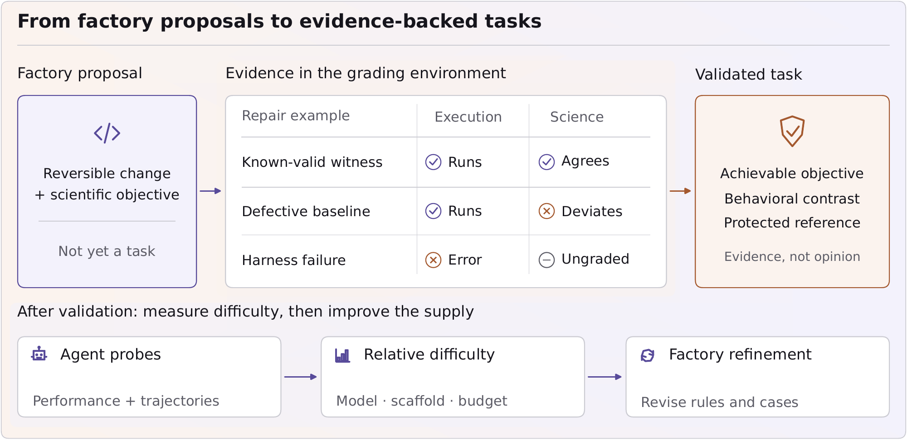

# 六篇论文｜从可验证任务到低精度推理

从十二篇近期候选中选择六篇，分别讨论科学代码验收、强化学习的价值估计、置信度校准、网页应用重建、视频注意力和线性注意力的长上下文。HF 每日榜提供发现线索，但现存票数不是当天新增关注；尚无第二类独立采用或复现证据，均按新近方法价值入选，热度待验证。

本期阅读原文方法、实验、结果与必要附录，未在本站复现训练或大型评测。四篇 CC BY 4.0 论文归档原始 PDF；ScienceIDE 与 ProgramDistill 的版本仅授予 arXiv 非独占分发权，本站保存阅读卡并链接原文，方法图仅限研究评论所需引用。

## 01 · ScienceIDE：科学代码跑通之后，还要核对科学结果

2026-09-16 · arXiv:2609.19134 v1 · 预印本。入选：新近创新。已读原文方法与实验；本站未复现。

科学软件没有报错，不等于计算的物理量正确。ScienceIDE 从27个科学代码库组织64个环境、2812项任务，并设置1076项检查。任务以2515项修复和295项实现为主，仅2项加速任务；不能把总量理解成各科学任务类型都已得到均衡覆盖。

每个任务需有科学目标、参考行为与容差。已知有效的修复应通过检查，故意损坏的基线应出现科学偏差；运行框架本身出错则不应混入模型能力得分。原图中央三行正好说明这个区别：程序可以运行但科学结果不对，也可能根本没进入可评分状态。

作者以85项Hard任务、18个环境和五个代码库比较15种模型与执行框架组合，每项最多一小时。最高单次观测成绩67.1%，邻近系统的置信区间存在重叠，因此细微排名不能当成稳定能力差距。模型速度、框架和重复次数也会影响结果。

训练部分探索SFT与带提示的RL，但结论有范围：SFT按任务ID隔离，相关变体仍可能共享代码；RL在训练环境内做留出任务，没有证明迁移到未见代码库。作者还指出，部分72B C++收益没有通过独立确认阶段。

最值得借鉴的是构建可验收科学任务的程序：先校准检查，再扩展任务。所选观测量只是科学建模的一部分，符合这些检查不保证一切科学结论正确；外部审计、对抗性奖励钻空子评估与更广领域仍有缺口。适合研究科学Agent评价，不能据任务数宣称实现开放式科学发现。

作者验证流程原图：中间区分有效修复、科学上有缺陷但仍可执行的基线、以及运行框架故障。只有先确认这些对照成立，才进入难度与模型评测。（[作者原图](https://arxiv.org/abs/2609.19134v1)；[查看大图](images/paper-scienceide.png)。）

[论文原文](https://arxiv.org/abs/2609.19134v1) · [站内阅读卡](../../../../papers/frontiers/scienceide/00-阅读卡.md)（本站仅归档阅读卡）

## 02 · SP3O：为什么每个token都训练价值网络，反而可能抹平差异

2026-09-16 · arXiv:2609.18708 v1 · 预印本。入选：新近创新。已读原文方法与实验；本站未复现。

在只给最终成败奖励的推理训练中，一条回答的所有位置常被赋予同一目标值。论文指出：当折扣与GAE参数均为1、没有中间KL奖励时，密集平方损失可拆成“平均预测接近最终回报”与“同一回答内预测差异变小”两部分。后一项会把价值曲线压平，削弱不同推理位置之间的差别。

相邻状态又共享大部分文本，其更新方向高度相关。SP3O只在相隔较远的状态施加critic损失，典型位置为回答进度30%、60%、90%；长度达到6144时再加95%。critic仍对全部位置产生预测，actor目标与采样流程保持一致，不是只生成或评分三个token。

作者在Qwen3-4B/8B-Base、DAPO-Math-17k上实验，最大回答长度8192、KL系数0。七项数学任务的平均成绩，4B为45.57，对照PPO37.60、GRPO39.26；8B为50.51，对照48.50、47.91。这里采用多次采样后的avg@32口径，不是32次机会有一次成功就算通过的pass@32。

原图通过受控FrozenLake实验显示同样问题：较大的状态空间里，真实价值仍有明显区域差异，critic图却趋于平坦。左侧散点也显示实际价值发生变化时，预测变化仍可能接近零。它支持问题诊断，不直接证明所有语言模型训练都会这样。

附录用固定状态多次续写估计价值，另比较稀疏位置、数量及过程误差。数学与部分分布外任务的作者实验值得复核，但模型规模、终局奖励和超参数范围有限。复现应先匹配奖励与返回目标，再比较梯度、价值分辨率和最终任务成绩，不能把“监督越少越好”当普遍规律。

作者问题诊断原图：右侧上排为FrozenLake真实价值，下排为critic估计；n表示迷宫规模。对照左上角预测变化接近零的散点，可以直观看到价值被抹平。（[作者原图](https://arxiv.org/abs/2609.18708v1)；[查看大图](images/paper-sp3o.png)。）

[论文原文](https://arxiv.org/abs/2609.18708v1) · [站内阅读卡](../../../../papers/frontiers/sp3o-sparse-critic/00-阅读卡.md) · [归档 PDF](../../../../papers/frontiers/sp3o-sparse-critic/2609.18708v1.pdf)

## 03 · XConf：拿自己的历史成败校准现在的把握

2026-09-15 · arXiv:2609.17708 v1 · 预印本。入选：新近创新。已读原文方法与实验；本站未复现。

模型说“我有九成把握”，并不代表类似回答有九成正确。XConf让系统保存过去任务、给分前的反思、初始置信度、验证结果及给分后的教训。面对新任务，先完成一次回答，再检索相关历史，最后修正置信度；当前任务的结果必须等之后验证才进入经验库。

方法分为Recall与Reflect。前者根据任务与初始置信度检索相似经历，用约50个近邻的成败率估计当前可靠性；后者把这些经历和教训交回模型，让它判断自己是否重复了过去的失误，再调整分数。最终组合两类估计。所谓免训练指不更新大模型权重，检索度量仍利用带结果的历史库拟合，绝非不需要标注。

实验覆盖四种模型、九类推理、代码、多模态与Agent基准。与十次自一致性采样相比，作者报告24个主表比较中23个胜出或打平，但事实短答类仍有落后。一个MMLU-Pro设置中，Gemini2.5的ECE由口头置信度0.117降到XConf的0.024；该数值只描述对应设置，不能推广成所有任务的错误率。

五折轮换保证每个估计的经验库来自其他折，额外实验还按真实时间先后增长经验库。置信度好不好不只看均值：作者一起报告校准、区分正确错误以及选择性回答的指标，避免把所有分数压成一个常数也说成成功。

成本优势来自少生成候选，但检索、反思与构建已评分历史仍有成本。换模型、跨领域或模型持续改进时，旧经历可能不再适用，遗忘策略仍待研究。本站的[技术实践](05-技术实践.md)用分离的合成历史与留出样本解释这一思路，不是XConf复现或大模型质量评测。

作者方法示意：先解答与自评，再查历史，分别计算成败率与反思，最后组合。图中的0.90、0.60、0.50和0.55是解释流程的示例；新任务真实结果在右下角之后才写入经验库。（[作者原图](https://arxiv.org/abs/2609.17708v1)；[查看大图](images/paper-xconf.png)。）

[论文原文](https://arxiv.org/abs/2609.17708v1) · [站内阅读卡](../../../../papers/frontiers/xconf-experience-confidence/00-阅读卡.md) · [归档 PDF](../../../../papers/frontiers/xconf-experience-confidence/2609.17708v1.pdf)

## 04 · ProgramDistill：用可重放的应用行为生成修复任务

2026-09-16 · arXiv:2609.18805 v1 · 预印本。入选：新近创新。已读原文方法与实验；本站未复现。

给Agent看一个网站，让它照着重建，怎样判断真的完成？ProgramDistill把问题拆成mine、craft、patch：先探索应用中可重放的行为，记录操作和前置依赖；再遮蔽部分实现生成任务；最后要求Agent参考正常应用修复，并重放原行为验证。目标是恢复行为，代码不必逐字相同。

作者在26个自包含Web应用中提出2800个目标，得到1975条通过最终重放检查的行为，再构造4063项修复任务。无效或不可稳定重放的过程被排除，不能把提出的目标数直接写成可靠测试数。部分任务仅缺单个行为，另一些缺失完整依赖链。

局部修复评测选定300项任务，对比九种系统；随着恢复链加深，成功率下降。与之不同，完整应用重建从最小可执行骨架开始，在12个应用中用590项原子行为测试和413条累积流程测试验收。Astra与Opus5的累积成功比例分别约49.2%和28.8%，不能与局部修复的较高分数混写。

图中登录、聊天、搜索依次恢复到第二步，链分数可获2/3，但整条流程的二元成功仍不通过。这一区分比“页面看起来像”更接近有状态软件的实际可用性；同样，观测次数更多也未保证恢复行为更多。

实验Agent读取的是可见文字、无障碍信息和可交互元素等结构化浏览器观测，没有配套截图输入；视觉保真也不在现有行为检查覆盖内。外部服务、随机状态、桌面和移动应用尚需扩展。方法适合授权的软件测试与修复，价值是构建和验收链条，不能把演示相似度当完整产品复制能力。

作者流程原图：挖掘带依赖的行为、遮蔽成任务、参考原应用修复，最后重放。右端2/3是前缀恢复的部分分数，搜索仍失败，整条流程并没有完成。（[作者原图](https://arxiv.org/abs/2609.18805v1)；[查看大图](images/paper-programdistill.png)。）

[论文原文](https://arxiv.org/abs/2609.18805v1) · [站内阅读卡](../../../../papers/frontiers/programdistill/00-阅读卡.md)（本站仅归档阅读卡）

## 05 · VC Attention：把相似值分组，再做低精度计算

2026-09-14 · arXiv:2609.15810 v1 · 预印本。入选：新近创新。已读原文方法与实验；本站未复现。

视频扩散模型的注意力需要处理大量时空token。VC Attention从数值表示入手：V-Smooth在线把相似的V向量分组，相应重排K，减去块均值后再量化残差，并在计算中恢复均值。先把相近内容放到一起，均值才能消除更多共同成分，给低比特表示留下更容易处理的残差。

另一项ExpCast直接从对数分数近似得到FP8表示，减少指数和类型转换的开销。它给出的误差界有格式、范围和下溢尾部等条件，不能将3.64%写成整个视频系统的总误差保证。分组本身也有成本，作者在去噪早期做聚类并复用排列。

作者在四种视频DiT、100条MovieGen提示上比较，保持种子与硬件一致。B200的8bit路径相对BF16 FlashAttention4，注意力约快1.59倍，端到端约1.19倍；H200对应1.46与1.13。RTX5090使用4bit V-Smooth路径，分别约3.58与1.70倍，不能把不同设备、精度与算子配置拼成一个通用数字。

均值消除图解释分组为何有帮助：按内容重新排列后，同块共享成分更多，去均值移除的能量比例提高；它不是画质提升百分比。下方速度图则明确区分内核和端到端。与Attn-QAT的对照采用免训练设置，不是该方法充分重训练后的最佳结果。

输出比较主要衡量与BF16参考的接近程度，不代表真实视觉质量完整提高；加入ExpCast相对仅V-Smooth还会牺牲部分PSNR。适合研究低精度注意力的性能与误差取舍，部署前要对目标模型、提示分布和硬件分别复核。

作者速度原图：上排是注意力，下排是端到端；左两列8bit含ExpCast，右两列4bit仅V-Smooth。各列以同机BF16 FlashAttention4作基线，不能跨列拼接倍数。（[来源原图](https://arxiv.org/abs/2609.15810v1)；[查看大图](images/paper-vc-speed.png)。）

作者分组分析原图：纵轴为去块均值移除的能量比例，比较顺序分块、静态时空块与按内容排序。比例提高解释共同成分更集中，不是画质或速度提升比例。（[作者原图](https://arxiv.org/abs/2609.15810v1)；[查看大图](images/paper-vsmooth.png)。）

[论文原文](https://arxiv.org/abs/2609.15810v1) · [站内阅读卡](../../../../papers/frontiers/vc-attention/00-阅读卡.md) · [归档 PDF](../../../../papers/frontiers/vc-attention/2609.15810v1.pdf)

## 06 · SpectralShift：长上下文既要记得住，也要忘得掉

2026-09-13 · arXiv:2609.14320 v1 · 预印本。入选：新近创新。已读原文方法与实验；本站未复现。

线性注意力把历史压进有限状态，节省了随序列增长的缓存，却可能过早遗忘。SpectralShift从Gated DeltaNet状态传递的谱动态分析：慢衰减方向帮助保留远处信息，快衰减方向帮助写入新内容、处理上下文切换。把全部记忆都一味延长，也可能带来另一种干扰。

方法调整alpha投影围绕均值的偏差，并同步调整相关学习率，缩放因子由参考长度与目标长度之比的平方根决定，然后继续预训练。图下方的变换作用于参数和训练动态；它不是推理时打开一个开关，就能免费得到更长上下文。

实验使用作者自建1.5B、激活0.6B的GDN MoE，先在8K窗口预训练500B token，再以32K、64K或128K继续训练。两阶段128K设置的RULER平均分为55.18，对照52.38，差值2.8个百分点，约5.35%相对提高；两种百分比不能互换。通用能力总体接近，也不意味着每项任务都提升。

原图右上角展示慢谱方向随距离传播的变化，为为什么要调整遗忘速度提供直觉。理论分析有模型和局部动力学假设，实验目前仅在较小规模模型验证。作者明确未在更大型开放Hybrid模型上完整重复，因此适合用于研究长上下文机制，而非承诺直接改善任意Qwen或其他混合架构。

作者方法原图：右上角看慢衰减方向怎样随token距离保留，右下角看alpha投影及学习率的调整。曲线不是下游准确率；延长上下文仍包含继续预训练。（[作者原图](https://arxiv.org/abs/2609.14320v1)；[查看大图](images/paper-spectral.png)。）

[论文原文](https://arxiv.org/abs/2609.14320v1) · [站内阅读卡](../../../../papers/frontiers/spectralshift/00-阅读卡.md) · [归档 PDF](../../../../papers/frontiers/spectralshift/2609.14320v1.pdf)
