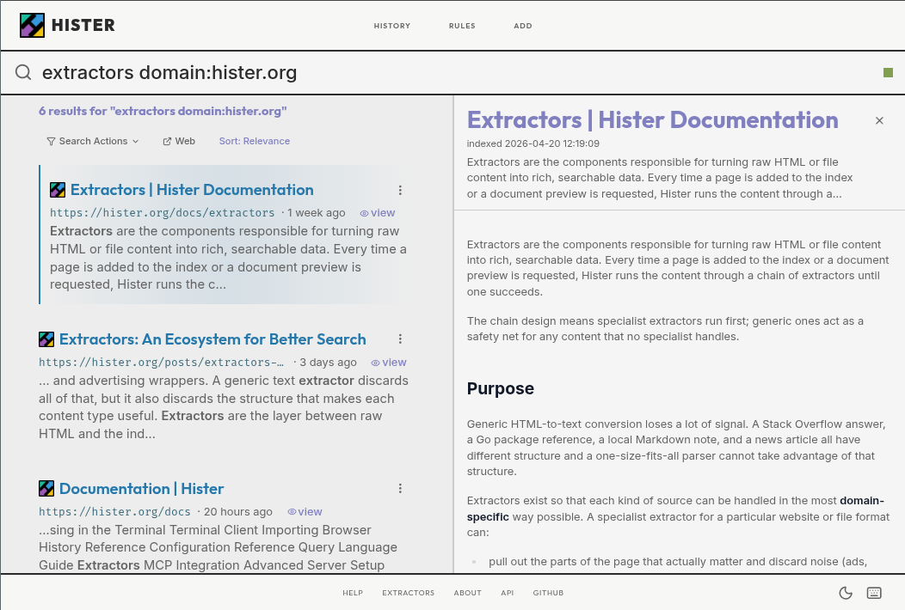
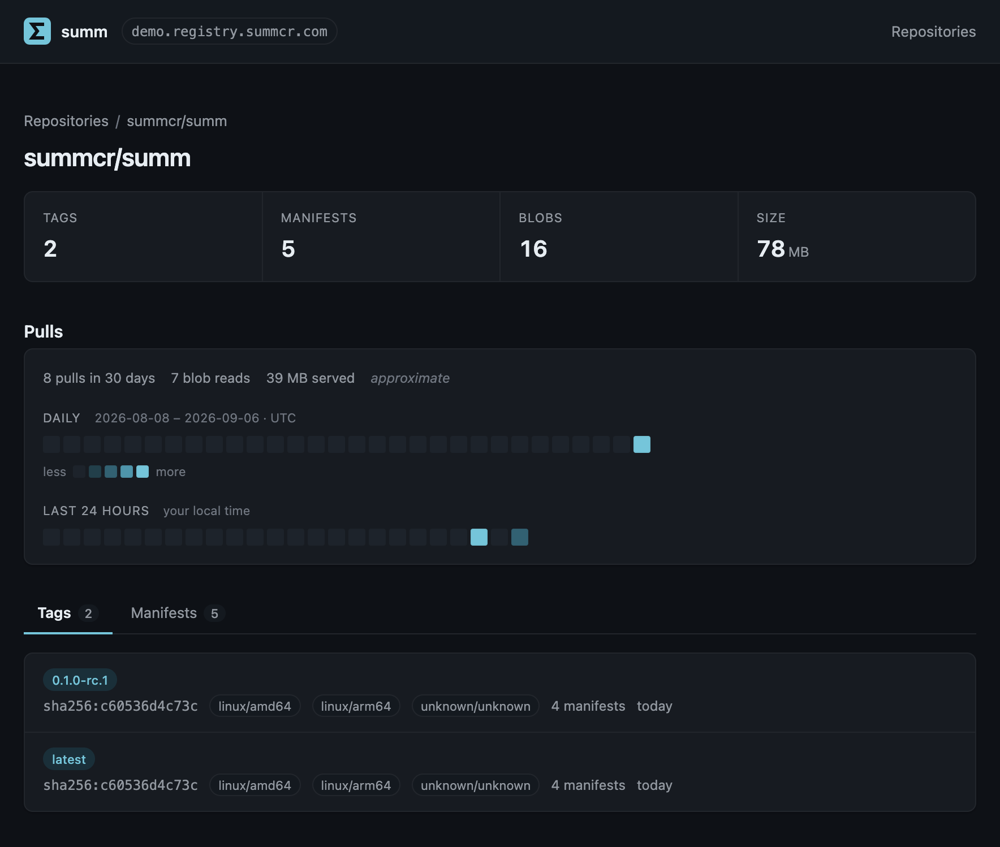
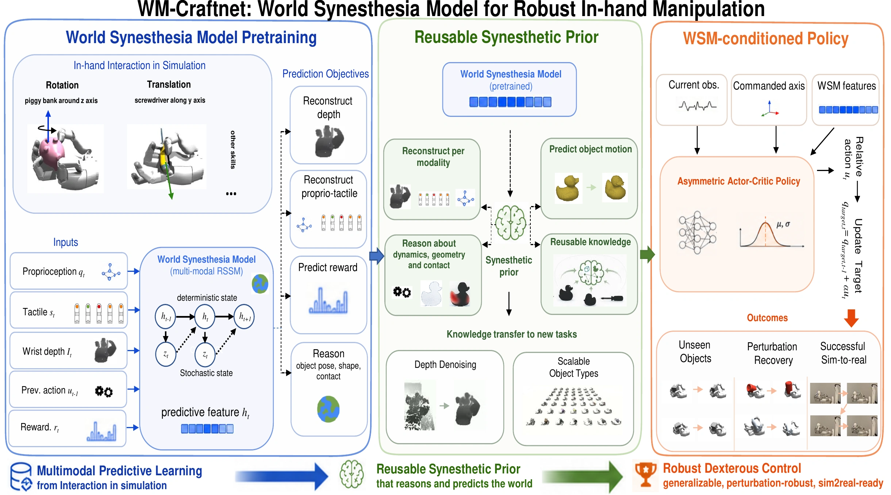

# 十个开源项目｜从真实任务挑工具

本期同时查看新项目、近期版本、GitHub增长与开发者讨论。旧工具必须有本周新的使用关注或实质变化，不能靠历史总Star入选。所有项目均为文档、公开实现或作者演示核验，本站未安装运行；具体用户反馈也不等于独立性能测试。

| 任务 | 项目 | 使用条件 |
| --- | --- | --- |
| 让Agent操作已登录浏览器 | BrowserSkill | CLI、扩展、明确授权与版本检查 |
| 多人自托管助手与文档知识库 | Octop | 本地服务、模型与渠道配置 |
| 一份定义连接不同语音Agent框架 | Unmute | Python、目标运行栈、模型服务 |
| 找到以前浏览过的资料 | Hister | 本地索引服务与浏览器扩展 |
| 了解镜像标签与真实拉取 | summ | 单二进制、容器客户端、访问配置 |
| 研究动态动作空间的浏览器控制 | Jev Ultrafast | TypeSafe和文本模型API、Chrome |
| 管理多分支工作区 | Worktrunk | Git、Shell集成与Hook迁移 |
| 在桌面查看多个Agent工作区 | Orca | 桌面客户端与各Agent账号 |
| 在浏览器编译React演示 | OJ | WebAssembly路径及受支持依赖 |
| 复核视触觉机器人控制方法 | WM-Craftnet | Linux、NVIDIA GPU、Isaac Gym |

## 01 · BrowserSkill：把观察、操作与真实浏览器连接起来

近期热门候选（短期关注与使用反馈）。仓库6月22日建立；9月17日CLI0.3.0补充交互原语、跨frame坐标与本地执行历史。

输入浏览器任务，CLI/守护进程通过扩展读取页面并执行操作；支持使用真实登录状态，在独立Agent窗口工作，必要时交回用户。适合已经登录的资料整理与表单任务，本次新增焦点、失焦、滚动到元素和鼠标滚轮等原语，让动作表达更具体。

最小路径是按发布文档安装对应平台CLI与扩展，运行 bsk doctor，再在专用测试页面观察和截图。检查通过只说明连接条件，不代表实际任务已完成。

近期用户报告包括多浏览器配置下的CDP失效，以及扩展来源验证问题：[Issue273](https://github.com/Tencent/BrowserSkill/issues/273)提出本地守护进程的权限疑问，本站未复现或判定修复状态。真实登录态会放大影响，采用前应核对维护者结论与所用版本。

日榜窗口新增1,350 Star；[具体使用反馈](https://github.com/Tencent/BrowserSkill/issues/272)。 [榜单快照来源](https://github.com/trending?since=weekly)。

[源码与上手文档](https://github.com/Tencent/BrowserSkill) · [MIT](https://github.com/Tencent/BrowserSkill/blob/main/LICENSE) · 版本：cli-v0.3.0（2026-09-17）。

## 02 · Octop：把多人助手、知识库和渠道放进同一服务

近期热门候选（短期关注与使用反馈）。仓库7月8日建立，9月14日发布1.0.0；本周有知识库与多用户的具体使用反馈。

它把网页面板、CLI、定时任务、聊天渠道与可迁移记忆连接到一个自托管进程。典型输入是自己的文档和问题，输出带检索上下文的回答或经授权的工具操作，适合愿意维护服务的小团队。

按对应平台发布文档安装后，先运行 octop init、octop run，在127.0.0.1:8088配置模型，再上传少量测试文档。运行环境是Python3.12以上，浏览器和聊天渠道另有组件及凭据。

“自托管”指控制面与本地状态可在自己机器上，若选外部模型、嵌入或渠道，相关内容仍会传往对应服务。近期Issue755报告向量模型未就绪，说明知识库不是安装后必然立即可用；本期未把功能列表当完成任务的证明。

日榜窗口新增386 Star；[具体使用反馈](https://github.com/TencentCloud/Octop/issues/755)。 [榜单快照来源](https://github.com/trending?since=weekly)。

官方面板原图：左侧有专家、连接器与记忆等入口，中央提供摘要、计划等任务入口。图中版本为0.9.8，仅用于说明布局，不冒充1.0.0新截图；非本站数据。（[来源原图](https://github.com/TencentCloud/Octop)；[查看大图](images/project-octop.png)。）

[源码与上手文档](https://github.com/TencentCloud/Octop) · [MIT](https://github.com/TencentCloud/Octop/blob/main/LICENSE) · 版本：v1.0.0（2026-09-14）。

## 03 · Unmute：同一份语音Agent定义迁移到不同运行栈

新近实用／创新候选。仓库7月15日建立，9月17日v0.5.4明确区分普通初始化与显式载入组织约定。

输入agent.yaml与targets.yaml，工具生成面向LiveKit、Pipecat等目标栈的项目，把模型、语音和运行配置从业务描述中分离。适合希望同一语音流程比较不同基础设施的开发者；它减少迁移配置工作，并不消除各运行时行为差异。

最小路径是 unmute init my-agent --example，查看生成的文件和所用模板，填入自己的服务配置，再做 unmute validate 与本地开发。不同目标需要Docker Compose或相应Python环境，外部语音和模型可能计费。

这次版本不再把默认manifest静默带入新项目，需显式选择。组织约定被写进文件不代表所有规则都能在运行时强制执行，仍须逐项检查生成代码。新Show HN帖子仅是发现入口，尚不足以证明流行。

[HN讨论](https://news.ycombinator.com/item?id=49747623)：1点、0条评论。 热度待验证，不以单一计数认定热门。

[源码与上手文档](https://github.com/slng-ai/unmute) · [MIT](https://github.com/slng-ai/unmute/blob/main/LICENSE) · 版本：v0.5.4（2026-09-17）。

## 04 · Hister：从浏览过的全文里找回资料

近期热门候选（短期关注与使用反馈）。仓库1月4日建立；9月17日HN重新集中讨论，另有本周内容提取的实际用户记录。

浏览器历史通常只保存标题和URL，Hister索引选定网页与本地文件的正文，便于用一句记得的内容找回来源，也能从终端或MCP查询。输入访问过的内容，输出本地检索结果，适合积累技术资料的人。

下载平台对应发行版，运行 hister listen，在127.0.0.1:4433安装并连接浏览器扩展，先用一篇公开网页验证索引。默认不强制云服务；可选语义检索会把文本发到配置的嵌入端点。

本周Mastodon提取问题涉及跨实例URL，另有9月17日favicon XSS报告Issue760，采集时已关闭，但关闭本身不能证明自己使用的稳定版已修复。本期未复现，部署前应核对修复提交与版本。AGPLv3及之后版本的要求仍适用。

[具体使用反馈](https://github.com/asciimoo/hister/issues/753)；[HN讨论](https://news.ycombinator.com/item?id=49743097)：407点、123条评论。

Hister官方搜索界面：结果摘要让用户从记得的内容返回原页面，而不只依赖历史标题。示例索引属于作者演示，隐私范围由实际配置决定。（[来源原图](https://github.com/asciimoo/hister)；[查看大图](images/project-hister.png)。）

[源码与上手文档](https://github.com/asciimoo/hister) · [AGPL-3.0](https://github.com/asciimoo/hister/blob/master/LICENSE) · 版本：稳定版v0.19；另有滚动构建（2026-09-03）。

## 05 · summ：镜像仓库里直接看标签变化和拉取记录

新近实用／创新候选。仓库9月2日建立，9月13日v0.1.1；9月17日Show HN介绍，近期补充。

summ是单二进制的OCI容器镜像仓库，内置网页界面、标签历史与拉取统计。输入推送的镜像和标签，输出可拉取的仓库及时间记录，适合想知道团队实际用了哪个镜像的小型自托管环境。

最小方式是获取并核对对应发布产物，在本机运行 ./summ serve，再用测试镜像做一次推送与拉取。访问策略有open、public-pull和private等选择，远程使用前需配置认证与服务边界。

界面里的30天与24小时拉取图有助于追查使用过程，但拉取次数不是独立用户数，也不能当镜像质量评分。当前仍是0.1阶段，作者吞吐比较未经本站重测；先检查备份、标签策略和回收行为是否适合自己的流程。

[HN讨论](https://news.ycombinator.com/item?id=49747573)：1点、1条评论。 热度待验证，不以单一计数认定热门。

summ作者界面：上方看仓库对象数量，中间看拉取时间分布，下方核对标签和平台。拉取统计帮助追踪使用，不能直接换算成独立用户。（[来源原图](https://github.com/summcr/summ)；[查看大图](images/project-summ.png)。）

[源码与上手文档](https://github.com/summcr/summ) · [Apache-2.0](https://github.com/summcr/summ/blob/main/LICENSE) · 版本：v0.1.1（2026-09-13）。

## 06 · Jev Ultrafast：先选操作和元素，需要文字时才生成

新近实用／创新候选。仓库9月16日建立，9月17日出现开发者讨论，公开浏览器执行循环。

每次观察把可交互元素编号，TypeSafe Jev在同一次请求中选择操作与相容目标，只有TYPE_TEXT才调用小语言模型生成文字。输入一个网页目标，输出可追踪动作与页面结果，适合研究浏览器Agent为什么把时间花在模型、网络或等待上。

最小路径为克隆仓库、uv sync、配置TYPESAFE_API_KEY与文本模型API，再运行 uv run jev 打开本地检查器。默认依赖Chrome与Browser Harness，不是完全离线工具；与模型栏社区openjev检查点没有直接兼容承诺。

7.073秒航班搜索是作者一条指定轨迹，从首次观察之后计时，不含购票，也不代表所有网站都同样快。输入、元素引用和页面新鲜度仍需复核。MIT覆盖客户端实现，外部API另有账号与费用条件。

[HN讨论](https://news.ycombinator.com/item?id=49735979)：85点、11条评论。 热度待验证，不以单一计数认定热门。

[源码与上手文档](https://github.com/browser-use/jev-ultrafast) · [MIT](https://github.com/browser-use/jev-ultrafast/blob/main/LICENSE) · 版本：当前主分支，未见正式Release（2026-09-16）。

## 07 · Worktrunk：修正会误删工作区的边界，升级也要迁移Hook

新近实用／创新候选。仓库2025年10月建立；9月16日v0.78.0修复未跟踪文件、继承GIT_DIR和锁定工作区的清理判断。

Worktrunk用分支名管理Git worktree，适合同时推进多个任务的人。输入新分支或已有分支，wt switch -c 与 wt list 帮助创建、切换和查看独立目录，减少手工记路径的负担。

本次价值具体到数据保留：发行说明称此前某些Git状态设置下，未跟踪文件可能没有进入清理判断；新版还保留锁定工作区，并在配置被并发修改时拒绝覆盖。本站未重现故障，这些属于作者披露的修正，值得既有用户检查。

最小试用应在临时仓库创建两个工作区，查看状态，再验证保留未提交文件的行为。0.78同时重命名Hook JSON上下文键，直接读JSON的脚本需迁移；不要只升级二进制而忽略脚本。许可MIT或Apache-2.0，不把本周Star增长单独认定为持续热门。

周榜窗口新增998 Star。 热度待验证，不以单一计数认定热门。 [榜单快照来源](https://github.com/trending?since=weekly)。

[源码与上手文档](https://github.com/max-sixty/worktrunk) · [MIT OR Apache-2.0](https://github.com/max-sixty/worktrunk/blob/main/LICENSE) · 版本：v0.78.0（2026-09-16）。

## 08 · Orca：在桌面查看Agent会话与隔离工作区

近期热门候选（短期关注与使用反馈）。仓库3月17日建立，9月17日v1.4.205更新归档与进程清理；周榜增长并有外部使用报告。

Orca把多种编码Agent的会话、终端、文件和worktree组织在桌面界面里。输入独立任务与仓库，输出各自工作区中的修改，适合需要同时查看多个过程的开发者；模型或Agent账号仍需自己配置。

本次发行说明强调：归档Hook失败时阻止删除工作区，超时Hook终止对应进程树，并让暂存等失败可见。它改善的是任务恢复与清理边界，不能理解成从此不会丢数据。

最小路径是下载对应系统客户端，连接已有Agent，在测试仓库建立单个任务并检查diff。近期Windows恢复会话的问题仍有用户报告，未由本站复现或确认适用于全部版本。界面集成降低操作负担，但最终合并仍需按项目检查。

周榜窗口新增5,337 Star；[具体使用反馈](https://github.com/stablyai/orca/issues/21306)。 [榜单快照来源](https://github.com/trending?since=weekly)。

[源码与上手文档](https://github.com/stablyai/orca) · [MIT](https://github.com/stablyai/orca/blob/main/LICENSE) · 版本：v1.4.205（2026-09-17）。

## 09 · OJ：把React编译流程放到浏览器内

新近实用／创新候选。仓库8月8日建立；9月17日PR175合并WebAssembly编译路径，这是本周的实质新进展。

OJ原本是优化React开发冷启动与内存的Rust构建工具。本周新增oj_wasm，把逐文件编译路径带入浏览器：编辑器写入内存文件树，转换TS/JSX与样式，再通过模块映射预览，减少演示依赖后台开发服务器的需求。

最小研究路径是查看 [PR175](https://github.com/lovablelabs/oj/pull/175) 与crates/oj_wasm、官网演示实现；普通CLI则可从crates.io安装后运行 oj dev 或 oj build。浏览器演示的包依赖仍可能来自外部CDN，不能称完全离线。

作者README的性能数字来自合成组件树和特定Mac，对真实项目应重新测量。当前WebAssembly路径还有不支持的CSS导入等边界，演示预览也不应当作任意不可信代码的隔离环境。MIT，本站未替换本网站构建工具。

热度待验证：没有两类独立近期信号。

[源码与上手文档](https://github.com/lovablelabs/oj) · [MIT](https://github.com/lovablelabs/oj/blob/main/LICENSE) · 版本：当前主分支，未见正式Release（2026-08-08）。

## 10 · WM-Craftnet：用视触觉历史形成可复用控制状态

新近实用／创新候选。代码仓库9月10日建立，论文9月7日，近期补充；公开仿真、检查点入口与部署代码。

它把本体感觉、腕部深度、触觉接触和动作历史编码成递归状态，再交给策略控制手内物体旋转。这里世界模型提供状态表示，没有靠想象轨迹进行规划；方法适合研究遮挡、接触和滑动怎样影响操作。

最小复核是先在仿真中下载指定z轴检查点，运行仓库测试脚本，观察输出轨迹。环境要求Linux、NVIDIA GPU、Python3.8、PyTorch2.1/CUDA11.8及Isaac Gym Preview4；真实Sharpa Wave硬件与部署环境另有条件。

仓库默认训练并行数低于论文设置，以降低主机内存需求，不能直接宣称复现论文预算。代码为Apache-2.0，机器人资产、数据与仿真器另看第三方许可。本站仅审阅公开流程，未训练、运行仿真或控制机器人。

热度待验证：没有两类独立近期信号。

作者方法原图：感觉与动作历史形成世界模型状态，再供控制策略使用；辅助预测约束表示。图里的仿真和真实机器人是作者实验，本站未运行。（[来源原图](https://github.com/sharpa-robotics/WM-Craftnet)；[查看大图](images/project-wm.webp)。）

[源码与上手文档](https://github.com/sharpa-robotics/WM-Craftnet) · [Apache-2.0](https://github.com/sharpa-robotics/WM-Craftnet/blob/main/LICENSE) · 版本：当前主分支，未见正式Release（2026-09-10）。

## 候选取舍

Agora虽然有新论文与清晰机制图，当前仓库树只有说明、图片和网页，未见可运行平台实现，因此没有把它列为本期可上手工具。采用公开源码限制性许可的respawn、context-mode也未混入本栏。完整候选与排除理由保存在来源审计。
