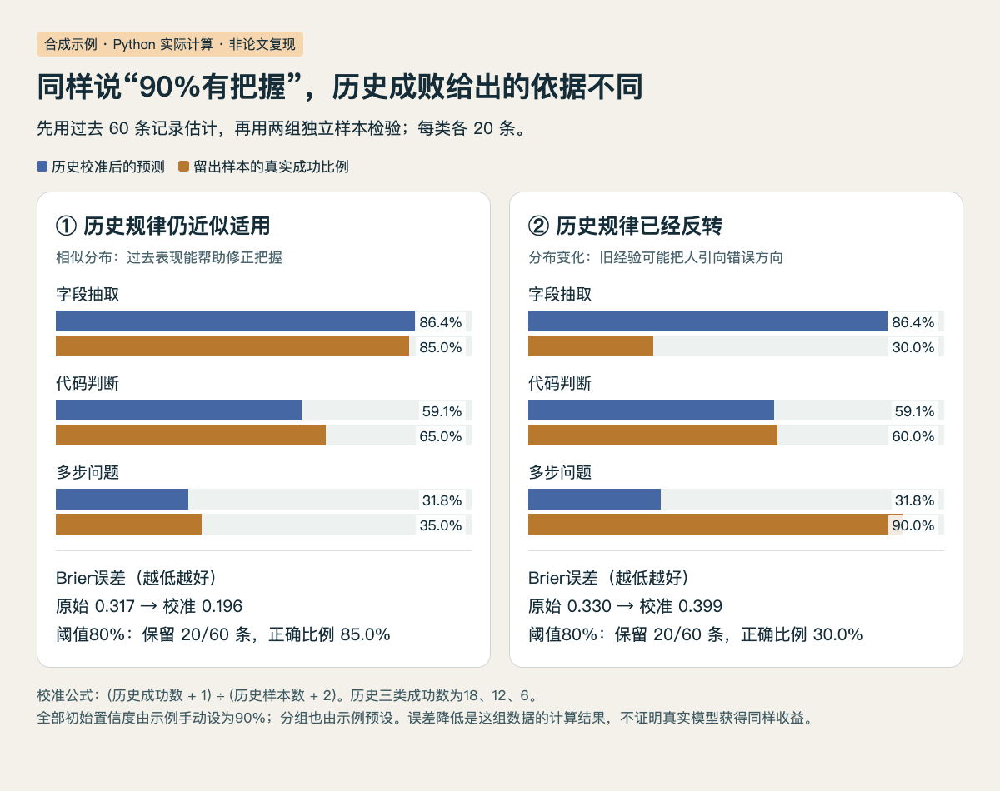

# 历史成败怎样校准“我有把握”

**已运行验证：Python 标准库计算，合成数据，不调用大模型，也不是 XConf 论文复现。** 本例只解释：可以用过去已验证的成败修正当前置信度，但历史失效时同一方法也会误导。

## 数据与步骤

手工构造三类任务，每类有20条历史记录、20条未来留出记录和20条分布变化记录。所有初始置信度统一设为90%；这不是模型实际说出的分数。历史三类成功数为18、12、6，未来同分布成功数为17、13、7；变化场景则为6、12、18。样本ID分离，当前结果不参与拟合。

按任务组估计概率，用加一平滑避免少量样本直接给出0或1：

```python
p = (历史成功数 + 1) / (历史样本数 + 2)
```

由此得到86.36%、59.09%、31.82%。这只是预设分组的经验频率；XConf实际还有语义检索、度量拟合与反思，本例没有实现这些部分。

## 实际运行结果

| 方法 | 留出集Brier误差↓ | 10箱ECE↓ | 阈值80%保留比例 | 保留样本正确比例 |
| --- | ---: | ---: | ---: | ---: |
| 全部原始90% | 0.317 | 0.283 | 100% | 61.7% |
| 只用全局历史平均 | 0.237 | 0.020 | 0% | 无样本 |
| 按组历史校准 | 0.196 | 0.035 | 33.3% | 85.0% |

Brier是预测概率与0/1结果之差的平方均值。ECE将预测落在同一区间的样本分组，比较平均把握与真实成功率。本例全局常数的ECE甚至更低，却完全不能在80%阈值下挑出任务。因此判断置信度是否有用，还要看它能否区分任务、保留多少，以及保留下来的正确比例。



HTML/JS读取本机实际计算的JSON绘图。左面板是相似分布，右面板是历史规律反转；蓝色预测固定来自同一历史库，橙色是各组20条留出样本的真实比例。（[图表源码](code/confidence-figure.html)；[运行数据](code/confidence-results.json.txt)；[查看大图](images/practice-confidence.png)。）

分布变化后，分组校准的Brier由原始0.330变为0.399，反而更差。仍按80%阈值保留20条，但正确比例只剩30%。这不是模型突然被校准算法“变笨”：预测的答案没有改变，改变的是我们对它的信任与筛选。

## 重跑

下载 [Python源码](code/confidence_calibration.py)，使用Python3执行：

```bash
python3 confidence_calibration.py
```

脚本在自身目录生成confidence-results.json.txt，记录合成输入、全部结果与环境。本站执行于2026-09-18T08:15:05.338781+08:00，Python 3.14.3、macOS arm64。仅使用标准库；图表通过本地HTTP服务读取结果，不需第三方图表包。

## 能带走什么

真实使用时，先保存任务、版本、原始置信度和独立验收结果；按时间分开用于拟合与评估的数据，再检查分布变化。不要把当前答案结果提前放入经验库。分组、阈值和样本量会影响结果，60条手工例子没有统计代表性，也不能证明实际Agent可以减少多少错误。

来源思路：[XConf原文](https://arxiv.org/abs/2609.17708v1)；[本期论文解读](03-论文精选.md)。
