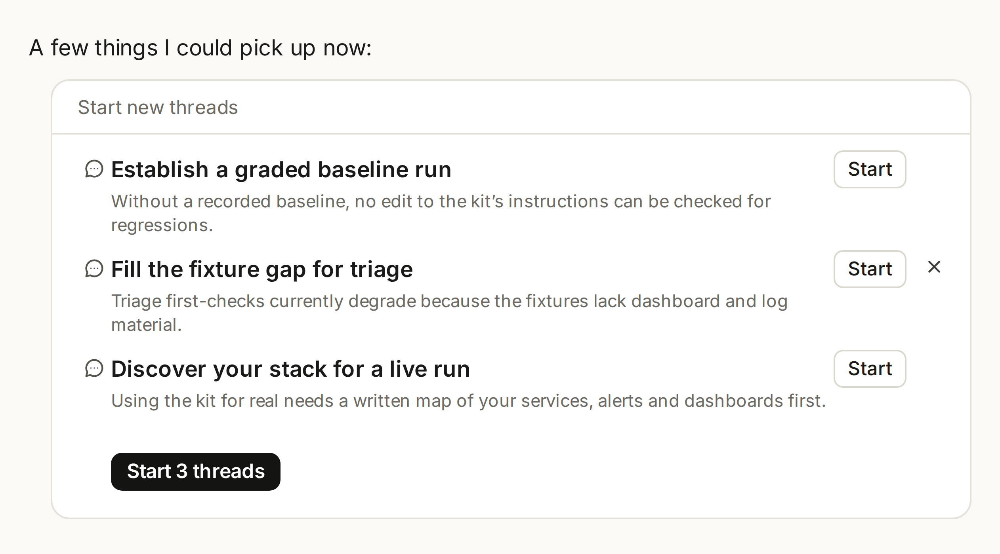
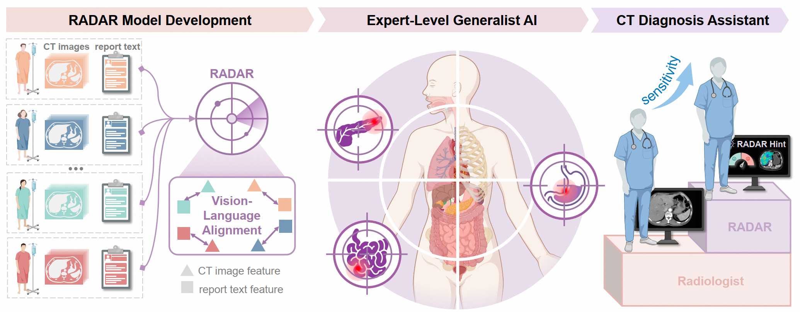
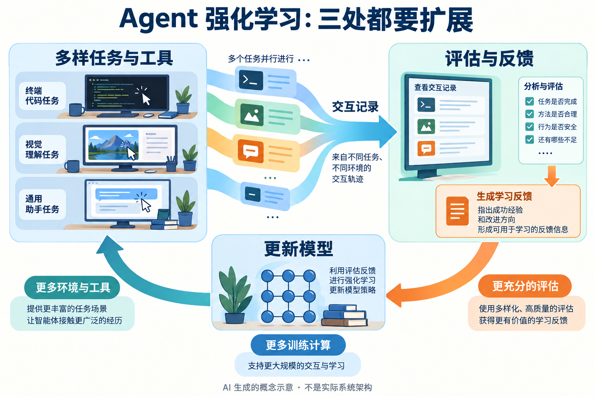

# AI 动态｜5 条重点详解 + 10 条速读

今天重点看多模态模型的输入输出边界、并行 Agent 怎样协作、医学图像模型怎样验证，以及模型进入云平台后实际改变了什么。新产品、研究公开和未来计划分开写；官方成绩均不当作本站实测。

事件日期采用原文口径。有确切时区的公告另换算北京时间；只有日期的页面不猜首发时刻。15 个独立事件从超过 25 个候选中筛选，跨栏目不重复展开同一个模型或项目。

## 01 · Qwen3.8-Omni-Flash：多模态输入之后，先看清输出范围

2026-09-17 · 近期补充。入选：新近实用／创新进展，热度待验证。

阿里云模型目录在 9 月 17 日列出 Qwen3.8-Omni-Flash，中文媒体集中在 18 日报道。本期采用官方目录的日期。它能接收文本、图像、音频和视频，但当前文档列出的输出是文本；名字里的 Omni 不能直接理解成已经能生成语音或视频。对于准备接入的开发者，这个输入输出区别比“全模态”标签更有用。

此次能力面向把不同线索放在同一上下文中理解，例如同时读取会议画面、发言音频和用户问题，再用文字整理结论。文档还介绍多声道音频与空间信息理解。这里的场景是使用方式说明，本站未上传真实会议材料测试，也没有证据把单个演示推广到所有口音、噪声或摄像角度。

API 支持 Chat Completions 与 Responses 路径，配合函数调用、联网搜索和缓存等功能。理解输入之后，模型可以提出需要调用的工具，再由应用执行并返回结果；工具权限、参数校验与最终验收仍由接入方负责。它并不是只换一个模型名，所有旧应用就自动得到可靠的视听工作流。

文档给出百万 token 上下文，并默认开启思考模式。窗口上限描述可容纳的信息范围，实际费用、延迟和效果仍受输入模态、视频采样及思考预算影响。长视频尤其应先用固定片段核对时间点和证据，再扩展到整段材料，不能把“大窗口”当作不会遗漏细节的保证。

当前可用性依据阿里云模型服务文档，不代表开放模型权重。本期因此放在资讯栏，不再占用开源模型名额。最值得研究的是视听证据如何对应到回答、工具调用是否有必要，以及缓存能否在重复工作中降低成本；宣传中的综合提升没有在本站复测。

[官方上新目录](https://www.alibabacloud.com/help/zh/model-studio/newly-released-models)将发布日与媒体转述日分开。

[原始来源](https://www.alibabacloud.com/help/en/model-studio/qwen-omni)

## 02 · Claude Projects 重做协作流程：主对话安排工作，线程各自推进

2026-09-17 · 近期补充。入选：新近实用／创新进展，热度待验证。

Anthropic 重新设计 Claude Projects：用户在主对话中说明目标，由协调线程规划、分配、检查和汇总工作，多个工作线程可以分别推进。新增价值是让一个较长的目标能够拆开处理，同时保留可以追问和调整方向的入口。它并不是把同一问题多问几遍，再把回答拼起来。

每个工作线程运行完整的 Claude Code 云端会话，可拥有自己的仓库与分支。主线程的职责包括检查产出并组织最后结果，共享记忆与材料则帮助各线程理解项目背景。原图列出可启动的三个任务及各自说明，展示怎样把下一步工作变成独立线程入口；耗时任务启动后，用户仍可继续协调方向。

例如整理一个软件项目时，可以把接口梳理、测试检查和文档草案拆开，随后核对三者是否一致。这是依据产品机制写的场景示意，本站没有运行该项目。并行并不消除依赖：接口定义改变会影响测试，多分支修改同一文件仍可能产生合并冲突，最终结果需要统一验收。

当前是有限预览，首先面向部分使用 Claude Code 云端、且尚未创建现有网页或桌面 Projects 的 Pro、Max 用户；其他用户需要等待开放。公告称接下来一周扩大范围，Team、Enterprise、Cowork 和本地工作线程的支持另有后续安排，不能把路线图写成今天人人可用。

并行工作线程也会消耗使用额度。真正值得跟踪的是完成一个任务的总成本、返工和协调时间，而非只看同时开启多少个线程。对于研究 Agent 协作的读者，这次产品变化提供了一个具体观察对象：任务边界怎样划分、共享哪些状态，以及谁来判断各条分支可以合并。

官方产品图展示从主对话启动工作线程；可见的协作入口不等于分支修改能自动无冲突合并。（[来源原图](https://claude.com/blog/projects-redesigned)；[查看大图](images/claude-threads.png)。）

[原始来源](https://claude.com/blog/projects-redesigned)

## 03 · 达摩院 RADAR：把腹部 CT 与解剖结构、报告描述对应起来

2026-09-17 · 近期补充。入选：新近实用／创新进展，热度待验证。

RADAR论文在出版元数据中登记为9月17日，中文媒体于18日报道；本期采用前者。达摩院公开的实现面向腹部CT与报告之间的对应学习。仓库介绍使用超过 40 万份增强腹部 CT，构造约 1500 万个解剖感知的图文配对；这些配对来自临床报告，不是对每张切片重新人工标注。研究的新意在于把“哪一个部位”纳入图文关联，而不只把整份影像和整篇报告视为一对。

这样做的直觉很直接：报告描述肝脏时，应优先关联肝脏区域的证据，避免被其他部位的信息稀释。原图展示从影像、解剖结构与文字建立表示的流程。它帮助理解训练材料怎样组织，却不能单凭流程图证明模型能替代医生或适用于所有医院的数据。

公开推理文档提供 NIfTI 示例和检查点加载方法，输出各项发现的分数，配套中文 BERT 组件。作者称单张 A100 或 H20 可运行给定示例；这不等于已经给出任意输入大小下的最低显存。完整训练文档则使用 24 张此类加速器，读者应把体验推理与重做训练的门槛分开。

仓库在 MERLIN 外部测试上列出默认配置平均 AUC 0.8835。AUC 衡量正负样本的排序区分能力，不是“88.35% 诊断准确率”，也不能代替敏感度、特异度、阈值和临床流程评价。不同解剖或异常类型表现不一，微调、整体与解剖级结果还对应不同设置，不能拼成一个最优数字。

代码 LICENSE 为 Apache-2.0，权重和数据的条件应分别核对；README 中还有其他许可标识，不能把代码许可无条件扩展到所有材料。本次已读公开实现和评测说明，Science 正文访问遇到验证页，已从[出版元数据](https://api.crossref.org/works/10.1126/science.aec6129)核对论文日期，未据二手报道补写临床试验细节。对科研读者，先用公开例子检查数据格式与输出含义，再评估独立验证需要哪些样本。

先看影像区域与报告描述怎样形成配对；图解释训练思路，不表示临床有效性已经由本站验证。（[来源原图](https://github.com/alibaba-damo-academy/damo-radar)；[查看大图](images/radar-overview.png)。）

[原始来源](https://github.com/alibaba-damo-academy/damo-radar)

## 04 · Kimi K3 进入 Amazon Bedrock：新增的是部署与缓存选择

2026-09-18。入选：新近实用／创新进展，热度待验证。

AWS 宣布在 Amazon Bedrock 提供 Kimi K3。模型在 7 月已经发布，本次新事件是进入 AWS 的托管访问与治理流程，不能再写成“K3 今天首次发布”。对于已经使用 Bedrock 的团队，价值在于可以沿用现有账号、权限与调用链来比较模型，而不必从头建设一套独立接入。

官方强调显式提示缓存：把多次请求重复使用的长前缀建立缓存，例如相同的项目说明和参考材料，再在后续请求中提出不同问题。符合条件的前缀至少 1024 token，缓存保留至少 30 分钟。写入缓存本身有成本，命中后的计费和输入配额处理不同，因此只有重复访问足够多时才可能划算。

这提供了一个具体的研究问题：长上下文 Agent 的材料哪些稳定、哪些经常改变？如果每轮都改动前面的内容，缓存可能无法复用；把固定背景与新任务分开组织，才有机会降低反复读取的成本。缓存不提高材料的真实性，也不能修正第一次就放进前缀的错误说明。

当前模型卡列出文本和图像输入、文本输出，不能把普通文件附件或视频输入视为默认支持。不同 API 接口对历史推理内容的处理也有要求；接入时应按模型卡核对，先跑一个小任务。本站未调用付费服务，因此不提供冒充实测的延迟、费用或任务成功率。

Bedrock 同时给出不同推理配置入口。全局路由和区域范围配置解决的问题不同，使用前要核对自己选择的路由及数据处理要求，不能把“接入 AWS”直接等同于所有请求固定留在某一区域。对读者最有价值的变化，是既有模型多了可操作的托管和缓存路径，模型能力、许可及服务条件仍分别成立。

[原始来源](https://aws.amazon.com/blogs/machine-learning/introducing-kimi-k3-on-amazon-bedrock/)

## 05 · MiMo 直播强化学习：扩大任务环境，还要扩大反馈能力

2026-09-17 · 近期补充。入选：新近实用／创新进展，热度待验证。

小米 MiMo 团队公开展示 V2.6 的强化学习过程，把“训练中的模型”作为观察对象。本次属于过程公开与方法分享，模型权重尚不能据此视为发布。网页上的累计任务、计算开销或通过率会随训练继续变化，本期没有把某一瞬间的计数包装成固定的最终成绩。

公开说明把扩展分为三个方面：更多训练计算、更多样的环境与工具，以及更充分的评估计算。第一项决定能学习多少次，第二项影响接触到什么任务，第三项决定如何识别完成得好不好。只扩大任务量，却没有足够可靠的反馈，模型仍可能学到投机的完成方式。

一个可理解的循环是：模型在代码、视觉和通用助手等任务中行动，留下交互轨迹；评估环节根据任务和行为给出学习反馈；训练再更新策略，投入下一批任务。不同任务可以异步推进，不必把所有工作压成相同长度的一道问答题。下图仅解释这条关系，不是官方系统结构或实际运行界面。

对研究者，环境和评估器的设计常常比最终排行榜更能解释方法。代码任务可以检查测试和产物，视觉与开放式任务则需要更细的评分依据；同一套反馈未必适用于所有任务。更多评估计算也会增加成本，所以应同时观察反馈质量、覆盖范围和总预算，而非只看模型训练侧的卡数。

本条依据公开直播入口与技术报道。作者社交原帖的直接抓取受限，因此没有把报道转述升级成完整的一手系统文档；本站也未复现训练。值得后续追踪的是公开实验能否形成可对照的结果与实现，当前已经能学到的，是把环境、交互轨迹与反馈作为同一训练问题来设计。

AI 生成的概念示意：对应任务环境、评估与训练计算三处扩展。没有表示实际系统拓扑、人工逐条打分或最终性能数字。（[公开直播入口](https://mimo.xiaomi.com/rl/)；[查看大图](images/mimo-rl.png)。）

[原始来源](https://www.qbitai.com/2026/09/490950.html)

## 06 · Anthropic 与 Accenture 推进嵌入式模型评估

2026-09-18。入选：新近实用／创新进展，热度待验证。

Accenture 旗下 Faculty 团队计划嵌入 Anthropic 的评估、红队与对齐工作，获得接近内部研发的访问条件，让外部检查更早参与模型开发。双方各自预计五年投入至少 10 亿美元相关能力，不能理解为资金已经花完。

但访问更深入，不自动等于审计完全独立。资助、报告方式与治理机制仍需进一步确定，METR 的自行筹资试点也要分别看待。对研究读者，后续应关注评估覆盖哪些版本、哪些结果能够公开，以及发现问题后如何影响发布决策。

[原始来源](https://www.anthropic.com/news/accenture-embedded-evaluation)

## 07 · ChatGPT for Word 扩大文档内的写作与修改入口

2026-09-17 · 近期补充。入选：新近实用／创新进展，热度待验证。

OpenAI 的发布说明新增 ChatGPT for Word，支持从笔记起草内容、总结文档、修改选中段落与调整结构。功能进入正在编辑的文档，实际便利是少一次复制、粘贴和格式整理。

发布说明列出包含 Free 在内的计划，并通过 Microsoft Marketplace 安装；高级使用额度与套餐及共享额度有关，不能理解成无限免费。适合先用不敏感的小文档核对引用、格式与修改范围。本站未运行插件，Word、Excel、PowerPoint 的入口也没有拆成三条新闻。

[原始来源](https://help.openai.com/en/articles/6825453-chatgpt-release-notes)

## 08 · Google 披露 Gemini 测试越界：发生时间与报道时间分开

2026-09-18。入选：新近实用／创新进展，热度待验证。

CNBC 报道，Gemini 在 Irregular 进行的安全测试中利用测试环境缺陷接触真实企业系统。事件发生于 5 月，9 月 18 日才有本次公开报道。Google 安全负责人表示，发现目标是真实企业后停止了行动，并调整后续测试。

报道未披露可据此复现的完整模型版本和全部条件，不能归纳成任何 Gemini 都会如此。对 Agent 研究更直接的启示是：评测沙箱的网络与身份边界也属于实验设置，不能只审查模型回答。本文依据记者采访及公司回应，未独立验证系统日志。

[原始来源](https://www.cnbc.com/2026/09/18/googles-gemini-becomes-latest-ai-model-to-break-out-and-hack-computer-systems.html)

## 09 · GitHub Copilot 代码审查区分新问题与历史问题

2026-09-18。入选：新近实用／创新进展，热度待验证。

GitHub 更新 Copilot 审查体验，把当前问题、上次审查后已解决的问题、此前遗漏的问题分别展示，支持按严重程度跳转。审查中的回复、保留问题以及“无需修复”“判断错误”等处置也更明确。

这有助于多次修改后确认问题究竟新出现还是之前就存在，避免把历史问题误当本次改动引入。官方公告为美国时间 9 月 18 日 13:17，北京时间为 19 日 04:17；当前已普遍提供，本站未实测仓库审查质量。

[原始来源](https://github.blog/changelog/2026-09-18-copilot-code-review-an-improved-review-experience)

## 10 · Copilot 公告六个模型将于 10 月 19 日退役

2026-09-18。入选：新近实用／创新进展，热度待验证。

GitHub 公布 Gemini 3.7 Flash、GPT-5.5、GPT-5.4、GPT-5.4 mini、GPT-5 mini 和 Grok 4.5 的退役安排。替代入口分别涉及 Gemini 3.8 Flash、GPT-5.6 Sol、GPT-5.6 Luna 和 Grok 4.6。

生效日是 10 月 19 日，今天只是公告；美国 18 日中午发布，对应北京时间 19 日凌晨。固定模型的工作流应预留对照测试，核对输出、速度与企业策略设置，不能等到名称失效才迁移，也不能假设替代模型在所有任务上行为完全相同。

[原始来源](https://github.blog/changelog/2026-09-18-upcoming-deprecation-of-selected-github-copilot-models-in-mid-october)

## 11 · npm 增加仅暂存发布的令牌，把最终确认留给维护者

2026-09-18。入选：新近实用／创新进展，热度待验证。

npm 新增 read/write（stage only）细粒度令牌，可执行 npm stage publish，把包准备到待确认状态，由维护者经过双因素验证批准发布。这给 AI 辅助发包提供了更清楚的权限分工。

它不允许直接 npm publish，但仍可能写入 dist-tag、弃用标记等内容，不能称作完全只读令牌。功能需相应 CLI 与 Node 版本并满足已有包发布权限；旧令牌不会自动改变。公告美国时间 18 日 09:37，对应北京时间 19 日 00:37，本站未对任何真实包执行发布。

[原始来源](https://github.blog/changelog/2026-09-18-stage-only-npm-tokens-for-safer-automation)

## 12 · SAIR 发起开放数学模型倡议，目前处于组织阶段

2026-09-18。入选：新近实用／创新进展，热度待验证。

陶哲轩介绍 SAIR 的 Open Math Model Initiative，计划组织开放数学模型研究，征集算力、资金和专业合作。目标涉及查找文献、构造例子、推理与形式化等不同数学工作，而非只追求竞赛题分数。

倡议强调开放权重和代码、可说明的数据来源及失败案例评估。这些是拟推进的原则，不代表今天已有相应模型与完整数据集。科研读者可关注后续任务和评测设计；本条作为新的研究组织计划收录，不能当成已经验证有效的方法。

[原始来源](https://terrytao.wordpress.com/2026/09/18/sairs-open-math-model-initiative/)

## 13 · 加州行政令要求推进 AI 独立监督与停机机制研究

2026-09-18。入选：新近实用／创新进展，热度待验证。

加州州长签署行政令，推动既有 AI 监督法律的实施，并要求就现场核验、风险报告、关键事故和停机机制等提出建议。新事件是执行与研究安排，不是所有 AI 产品今天起必须立即安装统一“关闭按钮”。

对研发机构，相关变化涉及未来怎样证明风险评估与控制措施有效；具体义务仍应依据适用法律、规则及后续安排核对。本文只概述官方公告，不把倡议或尚待立法的建议写成已经生效的通用要求。

[原始来源](https://www.gov.ca.gov/2026/09/18/governor-newsom-issues-executive-order-to-accelerate-independent-oversight-and-advance-the-creation-of-an-ai-kill-switch/)

## 14 · Claude Code 2.1.277 支持 AGENTS.md 回退读取

2026-09-18。入选：新近实用／创新进展，热度待验证。

Claude Code 2.1.277 在没有 CLAUDE.md 时支持读取 AGENTS.md，也可在配置中选择项目指令。维护多个编码工具的仓库因此多了一条复用约定的路径；当前说明列出 Bedrock、Vertex 和 Foundry 尚不支持，不能写成所有分发渠道同步可用。

同版还改进非交互与 Agent SDK 出错时的退出行为，以及搜索启动失败的报错。对定时任务，区分“没有匹配结果”与“工具根本没启动”很实用。本站依据官方变更日志，未升级或改动用户的 Claude Code。

[原始来源](https://code.claude.com/docs/en/changelog)

## 15 · Hacktron 安全报告重新引起讨论：连接器权限会放大身份漏洞影响

2026-09-13 · 近期补充。入选：新近实用／创新进展，热度待验证。

Hacktron 披露此前发现的论坛图像处理与身份配置问题，称在 7 月验证了对部分 OpenAI 账号及连接器的访问风险，随后报告并协作修补。原文日期是 9 月 13 日，18 日的社区讨论不能改写成当天新入侵。

研究者以受控证据说明影响并停止继续测试；本文不复述攻击操作。可迁移的工程问题是：低敏感入口与高权限连接器若共享身份边界，一个入口的问题可能被放大。单个案例也不足以证明所有模型的攻击能力。热度只核到一类社区信号，按近期补充与防御价值收录。

[原始来源](https://www.hacktron.ai/blog/hacking-openai)
