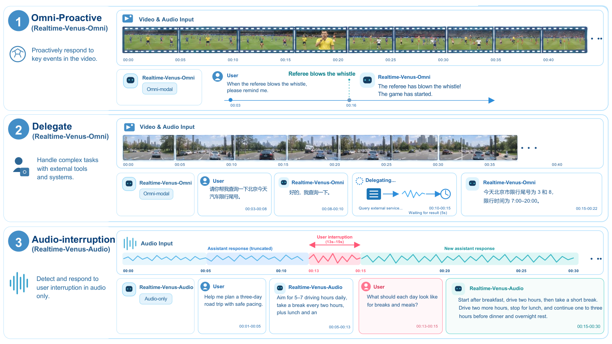
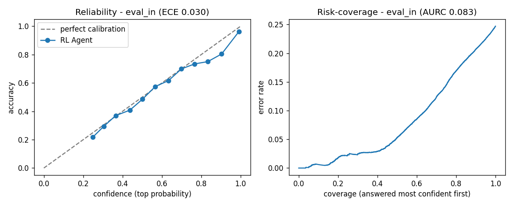

# 六个模型｜先看输入、输出和运行门槛

本期选择文档解析、实时交互、结构化判断、表单操作、棋类搜索和电脑操作六种任务。日期按可核实的权重库创建记录说明，仓库创建不等于首次对外发布的准确时刻。均已查到模型文件；本站未部署，不把作者演示称作实测。

“开源模型”沿用栏目名称，具体开放程度以每项许可为准。Chess 使用带商业条件的 LFM Open License，不能与 Apache-2.0 或 MIT 混为一谈。未核到持续采用证据的模型按新近价值收录，热度待验证。

| 任务 | 模型 | 最先确认的条件 |
| --- | --- | --- |
| 页面转可编辑结构 | WeVisDoc 4B／2B | 表格与公式输出、页级评测和目标文档分布 |
| 边看边听边回答 | Realtime-Venus | 多组件运行、异步工具桥接、显存预算 |
| 候选分类与评分 | Laya | 英文、512 token 问题长度、跨领域校准 |
| 从表单候选中选动作 | cua-s1-forms | 外部提取候选与执行代码，非通用 GUI Agent |
| 棋局估值与落子 | LFM2.5-230M-Chess | 合法着法约束与搜索深度、定制许可 |
| 电脑视觉操作 | Hunmin CUA | 397B 全权重、多卡推理和历史截图设置 |

## 01 · WeVisDoc：把页面变成 Markdown、公式和表格

2026-09-16。新近实用／创新：本周公开2B与4B同系列权重，提供文档解析的具体输入输出。

腾讯 WeVisDoc 基于 Qwen3-VL，把页面图像转成结构化文本：普通内容用 Markdown，公式用 LaTeX，表格用 HTML 表达。2B 与 4B 是同一系列，本期合并介绍，不用不同尺寸凑名额。适合整理扫描论文或将版式复杂的资料送入后续检索，但仍应保留原页面供核对。

作者给出 OmniDocBench 1.6 的综合分 95.38；另一个 PureDoc 三类集合的平均分为 75.54，其中真实文档更难。两者的任务和分母不同，不能写成“真实文档识别准确率95%”。原图用于理解不同文档能力的取舍；表格结构恢复、公式内容和阅读顺序仍需分别检查。

代码与权重采用 Apache-2.0，模型卡提供 Python 3.10 及以上、vLLM 等推理路径。4B 目录有实际 safetensors 分片，2B 可作为较小配置选择；文档没有给出可无条件采用的最低显存，本期不自行推定。最小试用是拿一页含公式与表格的自有材料，比对导出内容与原图，再决定是否批量处理。

作者结果原图：按任务或文档集合比较，分数来自指定评测设置。各面板纵轴范围不同且有截断，不能横跨面板比较柱高。综合分不是任意扫描件的逐字正确率。（[来源原图](https://huggingface.co/tencent/WeVisDoc-4B)；[查看大图](images/wevisdoc-results.png)。）

[模型卡与权重](https://huggingface.co/tencent/WeVisDoc-4B)

## 02 · Realtime-Venus：听、看、说可以交叠进行

2026-09-16。新近实用／创新：公开Omni与Audio检查点，研究连续感知、打断和异步工具协作。

Realtime-Venus 面向连续音视频交互。它希望在说话时仍能听见用户、观察画面，并判断打断是否改变当前意图。卡片分别提供 Omni-9B 与 Audio-9B，涉及语言、视觉和音频多个组件；这些并不是下载一个普通聊天权重后自然获得的能力。

另一条机制是把需要耗时的任务交给异步工具，模型继续保持对话。特殊的委派标记只是模型发出的请求，应用仍需连接工具、跟踪状态并把结果送回。长视频归档与检索也需要外围流程支持，不能只凭模型名称假设已有完整个人助手。

代码与权重按 Apache-2.0 提供，另有模型使用说明。部署涉及 Python 3.10、CUDA、FFmpeg 及自定义模型代码，应先检查加载内容；文档未给出可普遍复用的最小显存。原图是作者的交互示例，本站未验证噪声环境、多人插话或长时运行稳定性，适合有音视频系统经验的读者做小规模原型。

作者交互示例：注意连续输入、回答和工具行为在时间上的配合。示例说明预期工作方式，不是本站录制，也不是任意噪声与延迟条件下的性能保证。（[来源原图](https://huggingface.co/inclusionAI/Realtime-Venus)；[查看大图](images/venus-interaction.png)。）

[模型卡与权重](https://huggingface.co/inclusionAI/Realtime-Venus)

## 03 · Laya：直接给候选打分，但跨领域要重看置信度

2026-09-18。新近实用／创新：新公开的非自回归判断模型，提供域内与迁移评测。

Laya 把一些任务从“生成一段答案”改成“对给定选项直接打分”。权重约 421M 参数，以 ModernBERT 和任务头输出选项、真假或有序等级，适合标签判断、内容路由等已有候选集合的场景。格式稳定可以减少解析 JSON 的麻烦，但不会自动消除判断错误。

当前主要面向英文，每个问题最多 512 token，提供 CPU、MPS 与 CUDA 路径。模型卡列出域内准确率 0.838、未见任务家族 0.651；校准误差也从 0.060 增至 0.207。这说明模型说“有把握”的概率，在新领域不一定仍然可靠，不能只看域内成绩设置自动放行阈值。

下面两张作者原图可比较预测置信度与实际正确率的偏离。图标题ECE为0.030与0.204，与卡片的宏平均0.060与0.207不同；卡片未解释两者的完整换算，本期不混用这些数值，只据图观察迁移后的偏离趋势。本站未部署，未复核作者延迟数据。权重为 Apache-2.0，建议先用一批带答案的自有样例核验分类和阈值，再接入自动流程。

作者域内可靠性图，反映对应数据分布中的校准情况；直方或分箱结果不能直接当作新业务的保证。（[来源原图](https://huggingface.co/convaiinnovations/laya)；[查看大图](images/laya-in.png)。）

作者未见任务家族的可靠性图：与上一张配合阅读，分布变化后准确率和置信度关系明显改变。不同数据集不能用同一个域内阈值直接担保。（[来源原图](https://huggingface.co/convaiinnovations/laya)；[查看大图](images/laya-transfer.png)。）

[模型卡与权重](https://huggingface.co/convaiinnovations/laya)

## 04 · cua-s1-forms：一个很小的模型，专门做表单候选选择

2026-09-19。新近实用／创新：权重库UTC9月18日晚创建，对应北京时间19日；公开表单动作评分权重。

这个模型约 70.6 万参数，权重文件约 2.8 MB。它接收外部代码已提取的界面元素和候选值，用小型编码器给候选评分，再由程序按顺序执行填写、勾选或跳过。它并不直接理解整个桌面，也不独立规划任意电脑任务；实用之处恰好是把一个窄任务做成轻量组件。

作者在约一万条合成训练情景、55类概念上训练，并按表单结构划分数据。合成决策评测约99.95%，另有三份真实表单与三份PDF、196次决策的演示。后者规模很小，不能写成真实业务表单成功率100%，更不能代表跨语言、复杂联动校验都已解决。

模型采用 MIT，代码在 trycua/cua 的相应组件中。最小集成需要已有页面或PDF元素提取器，把标签与候选值送入模型，再由受控执行器操作。主要资料为英文，作者也未把分数标定成可靠概率。本站只核对权重、实现入口与评测口径，没有操作实际业务表单。

[模型卡与权重](https://huggingface.co/cua-ai/cua-s1-forms)

## 05 · LFM2.5-230M-Chess：模型估值加搜索，别把两者成绩混在一起

2026-09-15。新近实用／创新：9月14日UTC创建权重库，北京时间15日；提供230M棋类模型及浏览器路径。

作者把棋盘、局面状态和近期着法编码成紧凑输入，分别预测局面价值和下一步着法。宿主程序提供合法着法约束，搜索再利用模型估值比较后续局面。这是研究“小模型做判断、程序负责约束与搜索”的清楚例子，不需要把每一步都转成冗长自然语言。

模型卡将策略直接落子的约1500 Elo，与加入深度3搜索后的约2004 Elo分别报告。提升包含搜索带来的额外计算，不能说230M模型不经搜索就达到2000分；作者使用的对局条件也不等于任意正式棋力等级。可从浏览器ONNX演示或模型卡代码理解流程，本站未跑棋局评测。

基座及衍生权重受 [LFM Open License v1.0](https://huggingface.co/LiquidAI/LFM2.5-230M-Base/blob/main/LICENSE) 约束，商业使用设有年收入门槛及其他条款。它是公开权重模型，不能标成无条件宽松开源；部署前应直接读许可，而非因文件可下载就默认适合所有商业用途。

[模型卡与权重](https://huggingface.co/mlabonne/LFM2.5-230M-Chess)

## 06 · Hunmin CUA：把电脑操作能力迁入更大的多语底座

2026-09-07 · 近期补充。新近实用／创新：9月7日创建、9日更新的权重本期首次收录，不按18日媒体报道改写首发日期。

Hunmin CUA 基于 Qwen3.5 的397B、激活17B底座，通过低秩能力迁移，再结合监督训练与强化学习，把电脑操作能力接入较大的多语模型。公开目录包含122片BF16权重；只激活部分专家不意味着只需加载17B，模型卡的vLLM示例使用8路张量并行，不适合按普通笔记本方案推荐。

作者在OSWorld设置下报告70.5%，底座为48.2%，对照的Qwen CUA为77.1%。这说明获得操作能力的同时仍有取舍，不能写成全面超越专门CUA模型。该对照采用最多5张历史截图等设置，应与同条件结果比较，不能直接混入常见的另一种历史长度榜单。

权重采用Apache-2.0，模型卡还给出视觉定位与韩语任务结果。适合有多卡资源、希望研究跨能力迁移的团队，先按示例短任务检查截图预处理、动作格式和历史窗口。本站未复现训练或实际电脑任务，入选依据是本月公开的可研究实现与明确对照，持续热度尚待验证。

[模型卡与权重](https://huggingface.co/mncai/Hunmin-397B-A17B-CUA)
