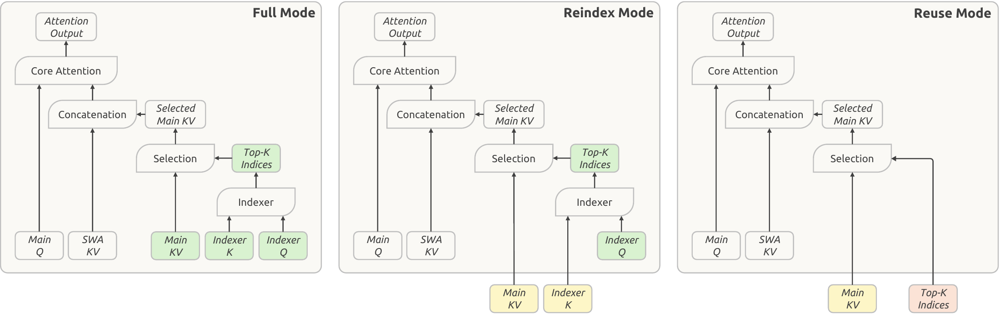

# 六篇论文｜Agent 怎样省成本，又不悄悄改变任务

本期从24条近期论文线索比较主题与摘要，选出6篇阅读核心方法、实验和局限。编码 Agent 框架实证研究同时出现于9月18日HF论文榜和独立开发者讨论，优先阅读；其余按新近方法价值入选，不靠榜单票数单独认定热门。

六篇均为9月17日的arXiv v1。RetireOPD与Self-Index采用CC BY 4.0，保存原始PDF；其余版本为arXiv非独占分发许可，本站只建阅读卡，引用一幅必要方法或实验原图。密集原图保留原尺寸入口，并在图注中说明阅读顺序。

## 01 · 编码 Agent 框架实证：压缩、规划和工具接口，谁真正省钱

2026-09-17 · arXiv:2609.20804 v1 · 预印本。入选：近期热门讨论＋新近创新。已读核心方法与结果，本站未复现。

论文比较运行框架如何影响编码 Agent：上下文太长时怎样保留信息，是否显式规划，以及使用专用工具还是只用终端。它在9月18日HF列表获得37票，HN讨论快照为203点；mini-SWE-agent维护者和其他读者讨论其结论与适用范围。这构成两类近期关注，但不是两份独立性能复现。

实验覆盖三种Nemotron 3规模和Mistral Medium 3.5，在SWE-bench Verified的500项任务与Terminal-Bench 2.1的89项任务上比较。20组上下文配置加规划、bash-only变体，总计176个模型／框架／基准设置，每任务一次运行。没有测试GPT、Claude、Qwen或DeepSeek，不能把结论直接套到所有编码模型。

原图中的上下文控制先做低成本内容省略和外部保存，接近预算后再摘要，最近交互与固定说明得到保留。最完整的T4方案在八个模型／基准组合中七个平均费用最低、成绩总体相近。成本下降有清楚条件，不等于每个配置的成功率都提高。

另外两个结果更适合指导自己的对照实验：按需取回被省略内容没有稳定收益；规划对小模型较有帮助，对大模型可能降低费用但略损成绩。bash-only对照同时改变工具、说明、文件跟踪和诊断，无法把所有差异归因于工具数量。小基准、单次运行以及不少不显著对照，都限制了普遍化结论。

复现时应先固定模型、任务和预算，再一次改变一个机制；直接更换整套框架很难知道收益来自哪里。本期未核验可运行的作者发布包，也未重复评测，阅读重点是实验设计与条件。[HN技术讨论](https://news.ycombinator.com/item?id=49753878)与[当日论文榜](https://huggingface.co/papers/date/2026-09-18)保留为关注证据。

作者框架图：沿输入、工具交互与上下文管理阅读。压缩、外部存储和摘要承担不同工作；框架示意不表示每个模块都单独证明有效。（[作者原图](https://arxiv.org/abs/2609.20804v1)；[查看大图](images/harness-overview.png)。）

[论文原文](https://arxiv.org/abs/2609.20804v1) · [站内阅读卡](../../../../papers/frontiers/coding-harness-empirical/00-阅读卡.md)（本站不另存全文PDF）

## 02 · DeepSeek V4.1 Flash：让长上下文缓存少存一些、重复用一些

2026-09-17 · arXiv:2609.19969 v1 · 预印本。入选：新近创新，热度待验证。已读核心方法与结果，本站未复现。

V4.1 Flash 已在9月10日发布，并于[9月11日日报](../2026-09-11/01-AI动态.md)介绍；本次新增的是9月17日技术报告，聚焦缓存机制，不重报一次模型上线。模型总参数约552B，条件编解码将预填充与解码的激活计算分开，分别约8B和16B；这两个数也不能代替全模型存储需求。

CSA2的直觉是不要每层都重复计算和保存完全相同种类的历史信息。部分层计算KV及索引，部分复用KV但重算索引，另一些连索引也复用；解码时先缩小候选块，再选择更少的位置。原图里不同层的共享关系比单独记住压缩倍数更关键。

报告给出FP4全局HBM缓存约890字节／token，相同上下文下约为V4 Flash的四分之一。另一方面，滑动窗口的有限重放减少持久缓存量，约八分之一属于另一种存储口径。两者不能相乘成整个模型显存降低到三十二分之一，权重、激活和运行空间也仍然存在。

有限重放是近似地重建所需状态，不是无条件恢复与完整历史完全一样的中间表示。实验中的质量维持应结合任务读；推理预算和Agent运行框架也会影响成绩，较高思考设置消耗更多输出token。适合研究长上下文的缓存组织与分层复用，本站未复测报告吞吐或质量；[官方权重](https://huggingface.co/deepseek-ai/DeepSeek-V4.1-Flash)属于先前已发布对象。

作者CSA2原图：区分完整计算、重算索引、复用KV与索引的层，再看候选选择路径。图中的共享关系解释全局缓存节省，不能将不同缓存口径的倍数直接相乘。（[作者原图](https://arxiv.org/abs/2609.19969v1)；[查看大图](images/deepseek-csa2.png)。）

[论文原文](https://arxiv.org/abs/2609.19969v1) · [站内阅读卡](../../../../papers/frontiers/deepseek-v41-flash-report/00-阅读卡.md)（本站不另存全文PDF）

## 03 · SoL-Pi：让 Agent 改进自己的运行框架，验收条件先固定

2026-09-17 · arXiv:2609.20519 v1 · 预印本。入选：新近创新，热度待验证。已读核心方法与结果，本站未复现。

SoL-Pi搜索的是Agent外围框架：哪些动作能合并、什么时候压缩上下文、长输出怎样保留可取回证据，以及如何提炼测试日志。作者把能力容差与费用条件放在优化器之外，候选改动先经过独立的验收，再到最终留出任务比较，避免优化器自行放宽目标。

四类机制各有边界。ActionFusion只合并不需要中间观察的动作；上下文压缩按预算和时机触发；ObservationPack为长输出保存完整内容及稳定句柄；EvidenceReducer处理构建、测试等日志，并用结构、哈希、引用和退出码核验，失败退回原内容。后者不直接过滤所有文件读取，避免把关键代码误当冗长日志丢掉。

在论文的效率配置下，相对Pi，Sol后端token下降49.0%、API费用下降33.2%，但平均分从44.833降至42.003；Opus后端也有费用下降与分数损失。不能把“保留大部分能力”改写成“完全无损省一半”，更不能将另一个性能配置的高分嫁接过来。

搜索覆盖152个假设及535个环境，其中有合成环境；最终比较仍受任务集、价格日期与后端模型限制，搜索自身的费用也不等于部署后单次成本。适合已有可验收Agent任务的团队研究，不证明无限递归自我改进。作者提供[SoL-Pi代码入口](https://github.com/NVlabs/SoL-Pi)，本站未运行；最可复用的是冻结验收、保留原证据和失败回退。

作者四机制原图：分别对应动作合并、上下文压缩、长输出封装和日志提炼。优先读每个机制保留什么证据、何时回退；图示并不表示四项在所有后端都同时提高质量。（[作者原图](https://arxiv.org/abs/2609.20519v1)；[查看大图](images/solpi-mechanisms.png)。）

[论文原文](https://arxiv.org/abs/2609.20519v1) · [站内阅读卡](../../../../papers/frontiers/sol-pi/00-阅读卡.md)（本站不另存全文PDF）

## 04 · EOS 不一致：学生已经想停，老师却把它当成错误

2026-09-17 · arXiv:2609.20511 v1 · 预印本。入选：新近创新，热度待验证。已读核心方法与结果，本站未复现。

在策略蒸馏让学生先生成，再用老师的概率信号指导学习。如果学生与老师偏好的结束token不同，学生正确地结束回答，也可能得到很低的教师概率。论文强调：两者即使共享词表，预训练与后训练形成的停止习惯仍可能不同。

把两种EOS都加入解码器停止列表，还不能解决这个问题。解码器知道遇到它就停，不等于模型愿意生成它；老师偏好的另一种EOS可能在学生端几乎没有概率。方法将各自多个结束token的概率相加，按同一个语义事件STOP比较，让停止动作的反馈不再取决于具体按钮名称。

作者在Qwen3、Llama3.2和Gemma3家族内部的数学蒸馏设置中分析，Qwen设置包含1.7B基础学生与4B老师。主要报告Avg@16等重复回答的平均表现，不能改写成十六次中任意一次成功率。对齐能够缓解停止概率塌缩，但其他原因仍可能造成回答变长，部分较长训练仍出现后续退化。

原图跟踪同一最终输出前缀上的EOS概率，帮助定位分歧；它不是所有任务自然终止的总体比例。复现价值在于训练前核对词表、停止配置与两边的真实概率，而非只改max_tokens。作者给出[项目说明](https://uncsciml.github.io/opd-eos-website)，本站未跑蒸馏训练；[技术实践](05-技术实践.md)仅用一个合成概率例子计算错误信号，不重复论文评测。

作者EOS概率原图：先比较教师和学生偏好的结束token，再看概率如何随训练变化。观察单位是指定输出前缀上的token概率，不是整个数据集的停止成功率。（[作者原图](https://arxiv.org/abs/2609.20511v1)；[查看大图](images/eos-probabilities.png)。）

[论文原文](https://arxiv.org/abs/2609.20511v1) · [站内阅读卡](../../../../papers/frontiers/opd-eos/00-阅读卡.md)（本站不另存全文PDF）

## 05 · RetireOPD：老师什么时候应该退出训练

2026-09-17 · arXiv:2609.20784 v1 · 预印本。入选：新近创新，热度待验证。已读核心方法与结果，本站未复现。

RetireOPD关心蒸馏的后半程：老师能提供细粒度指导，但学生接近老师后，持续模仿可能限制进一步探索。作者先给老师额外的技能知识，再训练学生从自己的交互轨迹学习，结合任务奖励与较小权重的蒸馏信号。

退出不是固定跑多少步。方法同时检查老师与学生的对数概率差是否长期停滞，以及学生任务表现是否达到老师一定比例；满足门槛后停止蒸馏，保留纯强化学习。原图左边的技能教师、中间的联合学习、右边的退出开关应连起来读，前期准备老师本身也需要计算。

主实验使用Qwen2.5的1.5B、3B和7B，在ALFWorld与WebShop两个环境比较。3B的ALFWorld由GRPO基线75.0升到93.8，1.5B的WebShop由56.8升到75.8，分别是18.8与19.0个百分点。某个退出消融表中的92.2属于另一设置，不能与主表93.8混为同一运行。

这些结果支持在所测任务里考察退出机制，不说明任意老师、任务和阈值都有效。两个模拟环境与额外技能教师的成本限制了外推；本站未复现训练，论文关联[作者实现仓库](https://github.com/ZJU-REAL/SDAR)，应按其版本与训练配置检查。实用的研究问题是：模仿的收益何时结束，后续进步来自探索还是预算差异？

作者方法图，CC BY 4.0：先构造有技能帮助的教师，再进行任务奖励与蒸馏联合学习，条件满足后退役教师。右侧退出条件依赖能力与概率差的变化，不能简化为固定步数。（[作者原图](https://arxiv.org/abs/2609.20784v1)；[查看大图](images/retireopd-method.png)。）

[论文原文](https://arxiv.org/abs/2609.20784v1) · [站内阅读卡](../../../../papers/frontiers/retireopd/00-阅读卡.md) · [归档 PDF](../../../../papers/frontiers/retireopd/2609.20784v1.pdf)

## 06 · Self-Index：文档不动，改进它被搜索到的方式

2026-09-17 · arXiv:2609.19656 v1 · 预印本。入选：新近创新，热度待验证。已读核心方法与结果，本站未复现。

Self-Index不直接重写原始文档，而是维护每篇文档可被检索的索引键。先模拟多种查询、观察哪些相关材料没有一起被找到，再提出局部键修改；通过忠实性、具体性与区分性检查后才接受。原始文本对应的键保持不变，因此增强检索与修改事实被分开处理。

方法的关键在闭环，而非一次性给文档生成几个问题。优化器根据共同检索不足等现象诊断，再尝试更能表达信息的键；查询模拟器也过滤过度相似的问题。正式实验的索引演化使用模拟查询，留出的评测问题不参与迭代，避免把已知答案直接写进索引。

作者以同一生成底座比较Doc2Query、SPIKE、RLIndex等方法，并检查BM25、BGE与Qwen嵌入检索器。在BRIGHT中，Qwen检索器平均nDCG@10由18.8升至26.1，是7.3个绝对点，作者报告约38.8%相对提升；并非所有子任务都最好。长记忆的一些易错子集甚至下降，说明重写键可能改变不同查询的收益分布。

主要结果对多次运行取均值，但离线构建索引仍需付费生成与验证，不能只看在线少调用几次搜索。适合研究资料检索与RAG召回，先固定原文、记录每次键变更及成本，再评估未知查询。作者给出[Self-Index实现](https://github.com/augustinLib/Self-Index)，本站未运行；公开PDF按CC BY 4.0归档。

作者方法原图，CC BY 4.0：查询模拟、检索诊断、索引键修订与验证构成循环。原始文档保持不变，优化的是可检索表示；框架不保证任何新键都忠实，仍需验证与留出评测。（[作者原图](https://arxiv.org/abs/2609.19656v1)；[查看大图](images/self-index-method.png)。）

[论文原文](https://arxiv.org/abs/2609.19656v1) · [站内阅读卡](../../../../papers/frontiers/self-evolving-search-index/00-阅读卡.md) · [归档 PDF](../../../../papers/frontiers/self-evolving-search-index/2609.19656v1.pdf)
