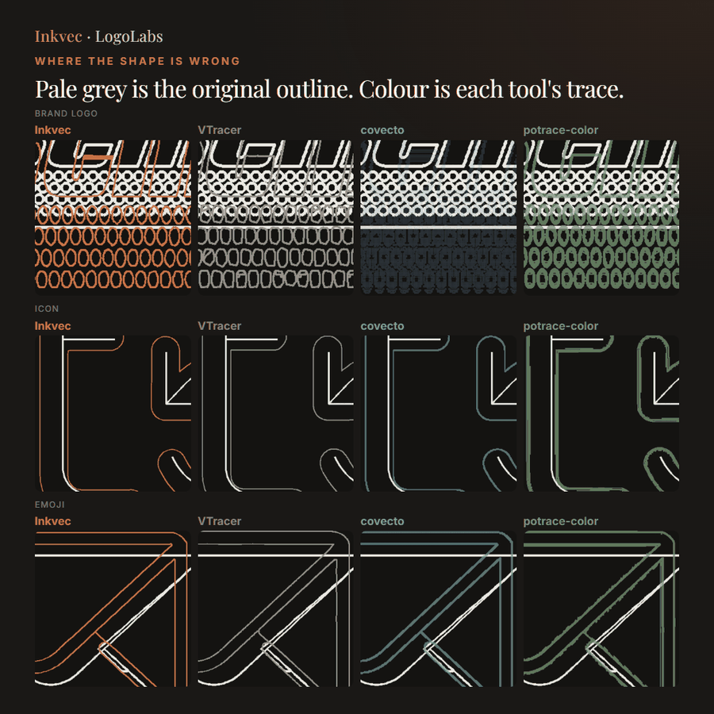
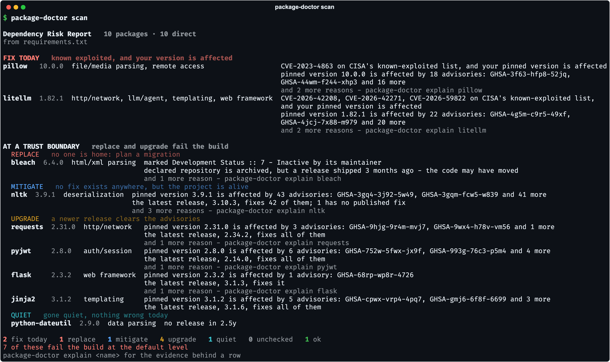

# 十个项目｜从一个具体任务开始选

本期比较19个项目候选，核对公开代码、许可、版本与实际产出。SemIf同时有近期Star增长和独立使用讨论，其余按新近可用实现或方法入选，热度仍待验证。不能因为某项目出现在这里，就推断它已被大规模采用。

ToolReplay已在本机运行自带示例；其他项目依据公开实现、文档与作者演示整理，未安装或部署。下表先按任务找工具，再看每项的最小路径与边界。

| 任务 | 项目 | 最先检查 |
| --- | --- | --- |
| 给固定候选做语义判断 | SemIf | 正确率、并行分支和浏览器下载体积 |
| 分层编辑研究或创作图片 | Compositor | macOS／Xcode版本与支持格式 |
| 看清代码模块与改动位置 | Birdview | 图里的关系是否有源码依据 |
| 读写新Xcode项目格式 | xcode-project-format | 新格式适配，非任意旧项目转换器 |
| 本地图片去背景 | BG0 | 首次模型下载、WebGPU和边缘质量 |
| 位图标识转SVG | Inkvec | 几何质量与速度取舍、图片类型 |
| 给依赖漏洞排修复顺序 | package-doctor | 版本锁定、可达性和数据新鲜度 |
| 检查Agent工具日志 | ToolReplay | 记录完整性与声明权限的范围 |
| 为数据Agent维护业务语义 | EvoOntology | 候选变化的证据、对照和回滚 |
| 管理多个Agent部署与观测 | WSO2 Agent Manager | Docker／Kubernetes与团队运维成本 |

## 01 · SemIf：让模型直接给候选打分

近期热门讨论＋新近实用。9月16日新建仓库，18日新增浏览器模型路径；原名OpenJev。 日期：2026-09-18。

SemIf输入状态、判断标准和候选项，读取候选的概率分数，减少为一个分类问题生成整段JSON的成本。共享前缀并行处理多个判断，是它当前实现的重点。可先看WebGPU演示，或按仓库的Python、CUDA路径运行；浏览器也要先下载约0.64GB至3.01GB的不同模型，并非零启动成本。

作者3090上的4B示例中，21题耗时1.023秒，对照JSON生成5.332秒，但两者只在18题上一致；因此不能宣称等价输出下普遍快五倍。量化与批处理也可能改变选择，业务样本仍要核对。

GitHub历史接口记录9月16–18日新增1607 Star；9月18日[HN讨论](https://news.ycombinator.com/item?id=49752041)快照559点，含具体M2使用反馈。两类证据支持近期受到关注，但项目还不足一周，不能说持续热门。它与TypeSafe没有隶属关系，也不等于前期同名NLI权重的发布；本站未运行模型。

[源码与上手文档](https://github.com/TheoLeeCJ/SemIf) · [MIT](https://github.com/TheoLeeCJ/SemIf/blob/master/LICENSE) · 版本：当前主分支（未见正式Release）。

## 02 · Compositor：研究图片需要分层编辑时的原生工具

新近实用／创新，热度待验证。本周公开原生编辑器，9月18日发布v1.0.4。 日期：2026-09-18。

Compositor是面向macOS的图像编辑器，提供图层、蒙版、剪贴、非破坏调整、变换和选择等操作。一个具体用途是把实验截图、注释与背景分层管理，之后单独调整其中一层；原始实验数字仍应保持，不能用编辑效果修改证据。

仓库提供Xcode工程，可按README打开并选择Compositor方案构建，要求macOS26和Xcode26。支持PNG、JPEG、HEIC、TIFF等输入及所列导出格式，不能据此假设能完整往返Photoshop工程。它有实际界面实现与近期版本，适合苹果开发或创作用户试用；本站未安装，稳定性、超大文件性能与色彩工作流仍需自行核对。

[源码与上手文档](https://github.com/robbietilton/Compositor) · [MIT](https://github.com/robbietilton/Compositor/blob/main/LICENSE) · 版本：v1.0.4。

## 03 · Birdview：把模块关系与Agent活动放到一张可检查的图里

新近实用／创新，热度待验证。9月12日创建仓库，本周0.2系列增加架构与活动视图。 日期：2026-09-17。

Birdview将架构JSON和活动记录生成独立HTML视图，帮助回答“这次改登录限流会影响哪些模块”。Agent按源码整理节点和关系，活动日志再把工作位置叠到架构中；图的价值是定位和讨论，而不是自动证明依赖一定正确。

最小路径按仓库技能说明生成.birdview/architecture.json和对应活动记录，再校验并构建页面，环境要求Node18及以上。校验器能检查结构，不会替读者确认每条边都来自真实代码；随口编出的架构仍会产生漂亮但错误的图。

下图为作者提供的示范项目视图，不是本站真实仓库分析。项目采用MIT，适合代码浏览与协作说明，实际采用前应抽查几个节点及边与源码的对应。本站未运行生成流程。

作者示范架构视图：节点关系帮助定位改动范围，活动覆盖帮助理解Agent正在做什么。示例并非生产架构事实，结构校验不等于关系已经由源码证明。（[来源原图](https://github.com/Qiuner/birdview)；[查看大图](images/birdview-overview.png)。）

[源码与上手文档](https://github.com/Qiuner/birdview) · [MIT](https://github.com/Qiuner/birdview/blob/main/LICENSE) · 版本：v0.2.1。

## 04 · xcode-project-format：用类型化接口读写新的Xcode项目格式

新近实用／创新，热度待验证。9月15日UTC创建官方仓库，对应北京时间16日。 日期：2026-09-16。

Apple公开的Swift包面向新的project.xcproj格式，提供类型化XCSchema、读写能力与xcproj命令行工具。适合生成工程、格式化、校验，以及让自动化工具用明确字段修改项目配置，减少只靠字符串拼接的脆弱性。

可从Swift包与CLI示例开始：读取一个对应格式的工程，做一项可审查修改，再比较输出。工具链要求Swift6.1，macOS部署条件按仓库说明；它不是任意旧pbxproj文件的通用转换承诺，也不能假设所有已有Xcode工程都已经换格式。

代码采用Apache-2.0，公开类型与序列化实现是当前可复用价值。本站未运行工程生成或兼容性测试，选择它是因为近期官方开放实现，而非苹果品牌本身能证明工具已经热门。

[源码与上手文档](https://github.com/apple/xcode-project-format) · [Apache-2.0](https://github.com/apple/xcode-project-format/blob/main/LICENSE.txt) · 版本：当前主分支（未见正式Release）。

## 05 · BG0：在浏览器本地给图片去背景

新近实用／创新，热度待验证。9月14日UTC创建仓库，本周公开浏览器应用与SDK。 日期：2026-09-15。

BG0把图片去背景放在浏览器中运行，使用WebGPU，并提供WASM后备路径。输入图片留在本地处理，输出带透明通道的PNG；但首次仍要下载模型文件，不能把“图片不上传”误解成应用完全不联网。

可先在作者应用用一张非敏感图片体验，再按SDK把removeBackground接入自己的页面。源码构建有Bun版本要求，模型采用BiRefNet相关ONNX文件，应用与模型的许可应分别确认。头发、透明物体、阴影和复杂背景的效果需要目标样例检验，本期没有独立测量准确率或设备速度。

Apache-2.0的本地应用实现适合创作素材整理，也可作为浏览器端模型部署示例。本站未运行；若需要严格离线流程，还要确认资源已缓存及应用自身依赖。

[源码与上手文档](https://github.com/opencoredev/bg0) · [Apache-2.0](https://github.com/opencoredev/bg0/blob/main/LICENSE) · 版本：当前主分支（未见正式Release）。

## 06 · Inkvec：把标识位图变成可继续编辑的SVG

新近实用／创新，热度待验证。9月18日UTC发布v0.1.3，北京时间19日；新近Rust矢量化工具。 日期：2026-09-19。

Inkvec从位图边缘、抗锯齿和几何结构中拟合曲线与图元，输出SVG。适合整理小图标、标识与较规则的插画；最小命令是inkvec logo.png -o logo.svg，可用发布包或按Rust1.88要求构建，也有WASM路径。

原图展示几何叠加，帮助检查路径是否跟随输入边界。它不恢复原作者的设计文件，文字通常仍是形状，不是OCR后的可编辑文本；照片也不是主要目标。

作者样例对照中，Inkvec平均处理时间约1.17秒，VTracer约0.04–0.06秒，体现的是几何质量与速度取舍，不能只宣传效果而省略耗时。样例数量与素材来源有限，本站未跑批处理。代码采用Apache-2.0，输入标识自身的权利并不随工具许可转移。

作者几何叠加原图：对照边界与拟合路径，观察共享边缘、曲线和规则图元怎样表达输入。图为作者样例，不代表照片或所有字体都能高质量恢复。（[来源原图](https://github.com/logolabs/inkvec)；[查看大图](images/inkvec-geometry.png)。）

[源码与上手文档](https://github.com/logolabs/inkvec) · [Apache-2.0](https://github.com/logolabs/inkvec/blob/main/LICENSE) · 版本：v0.1.3。

## 07 · package-doctor：把依赖告警排成可以处理的顺序

新近实用／创新，热度待验证。9月12日UTC创建仓库，16日UTC发布1.0系列与1.0.2。 日期：2026-09-16。

package-doctor把锁文件、漏洞信息、已利用漏洞目录和导入可达性等线索放在一起，帮助先处理真正影响当前应用的依赖问题。适合“扫描出现几十条告警，但不知道先修哪条”的项目，输出解释应回到具体版本与使用路径核对。

按Python CLI文档在一个小项目目录扫描，先检查它识别了哪些包和版本，再阅读排序依据。缺少锁文件时推断可能不完整，漏洞库与利用概率也会更新；可达性分析和启发式风险分数不构成安全证明，应与现有包审计工具配合。

下图是作者用刻意保留旧版本的示例生成的输出，不能当作本站仓库今天的漏洞结论。MIT代码已公开，本站未扫描用户其他项目，也未启用安装拦截钩子。

作者9月16日示例扫描：使用有意固定旧依赖的测试项目，展示版本、告警与优先级的对应。不是本网站依赖的实时安全报告。（[来源原图](https://github.com/binuka200/package-doctor)；[查看大图](images/package-doctor.png)。）

[源码与上手文档](https://github.com/binuka200/package-doctor) · [MIT](https://github.com/binuka200/package-doctor/blob/main/LICENSE) · 版本：v1.0.2。

## 08 · ToolReplay：先检查日志，再讨论Agent是否可靠

新近实用／创新，热度待验证。9月14日公开0.6.0，标准库即可运行，本站已验证自带样例。 日期：2026-09-14。

ToolReplay读取JSONL工具调用记录，查重复调用、相同输入得到不同记录响应，以及不在声明权限内的工具。适合保存了Agent轨迹、想快速找出异常位置的开发者；Python3.11及以上即可运行，没有第三方运行依赖。

本站以0.6.0执行作者的六条合成记录：replay检出index2的重复读取和index5的响应差异，scope检出index4的write_file越权。命令返回1表示发现问题，符合预期；[完整执行记录](code/toolreplay-check.json.txt)保存版本、提交号和输出。

它比较的是已记录响应，不会重新调用真实工具；权限检查只匹配工具名，不能判断具体路径、金额或参数是否越界。哈希链能查记录一致性，但没有数字签名，能重写全部日志的人也能重新封链。这个小工具的价值和边界都很清楚，不能当完整Agent安全系统。

[源码与上手文档](https://github.com/Matthew0822/ToolReplay) · [MIT](https://github.com/Matthew0822/ToolReplay/blob/main/LICENSE) · 版本：v0.6.0。

## 09 · EvoOntology：业务术语也需要版本、证据与回滚

新近实用／创新，热度待验证。9月15日新公开数据Agent语义层与演化流程。 日期：2026-09-15。

EvoOntology把业务术语、数据结构、映射、约束和工具语义组织为可按需检索的层。具体场景是同样的“活跃用户”，不同表和部门口径并不一致：Agent需要先找到定义与证据，再决定查询方式，不能只靠字段名字猜。

流程从实际工作负载构建初版，检查轨迹中的错误，再提出局部候选；在相同Agent与预算下与旧版本对照，通过后发布，并保留回滚。原图展示内容、结构和工具三层如何与改进回路连接。

可按仓库的Codex／Claude插件或MCP说明接入，先选一个只读数据任务，检查查到的术语是否能指回真实来源。安装路径和服务权限仍需配置，不能只增加一份术语表就保证SQL正确。MIT实现已公开，作者报告的多个基准增益口径不同，本站没有复现，故不把它们压成一个通用提升数字。

作者方法原图：先看内容、数据结构和工具三层，再沿候选提出、对照评估与发布回滚阅读。语义层变更要受真实任务和证据约束，不是任意扩写知识库。（[来源原图](https://github.com/ruc-datalab/EvoOntology)；[查看大图](images/evoontology-framework.png)。）

[源码与上手文档](https://github.com/ruc-datalab/EvoOntology) · [MIT](https://github.com/ruc-datalab/EvoOntology/blob/master/LICENSE) · 版本：当前主分支（未见正式Release）。

## 10 · WSO2 Agent Manager：多个Agent的部署与观测需要一个管理面

新近实用／创新，热度待验证。9月7日发布1.0.0正式版，本期近期补充；18日报道并非首发。 日期：2026-09-07（近期补充）。

Agent Manager把部署、注册、访问和可观测性放进一个管理平台，可管理平台内外的Agent，并通过OpenTelemetry等采集运行轨迹。适合已有多个Agent服务的团队，排查“哪条调用链变慢或失败”，对个人一次性脚本则可能过重。

官方[快速开始](https://wso2.github.io/agent-manager/docs/latest/get-started/quick-start/)使用开发容器安装K3d、OpenChoreo及观测组件，要求Docker，至少分配8GB内存和4个CPU。先按文档搭测试平台，再注册一个演示Agent，核对日志和权限；不是安装一个轻量Python包就完成。

核心Apache-2.0，当前文档与1.0.0发行记录分别核对。本站没有启动容器或部署集群，生产使用还需检查身份、数据和升级安排。本次按正式版带来的可用实现收录，未获得足够独立采用证据，不称已证实热门。

[源码与上手文档](https://github.com/wso2/agent-manager) · [Apache-2.0](https://github.com/wso2/agent-manager/blob/main/LICENSE) · 版本：amp/v1.0.0。
