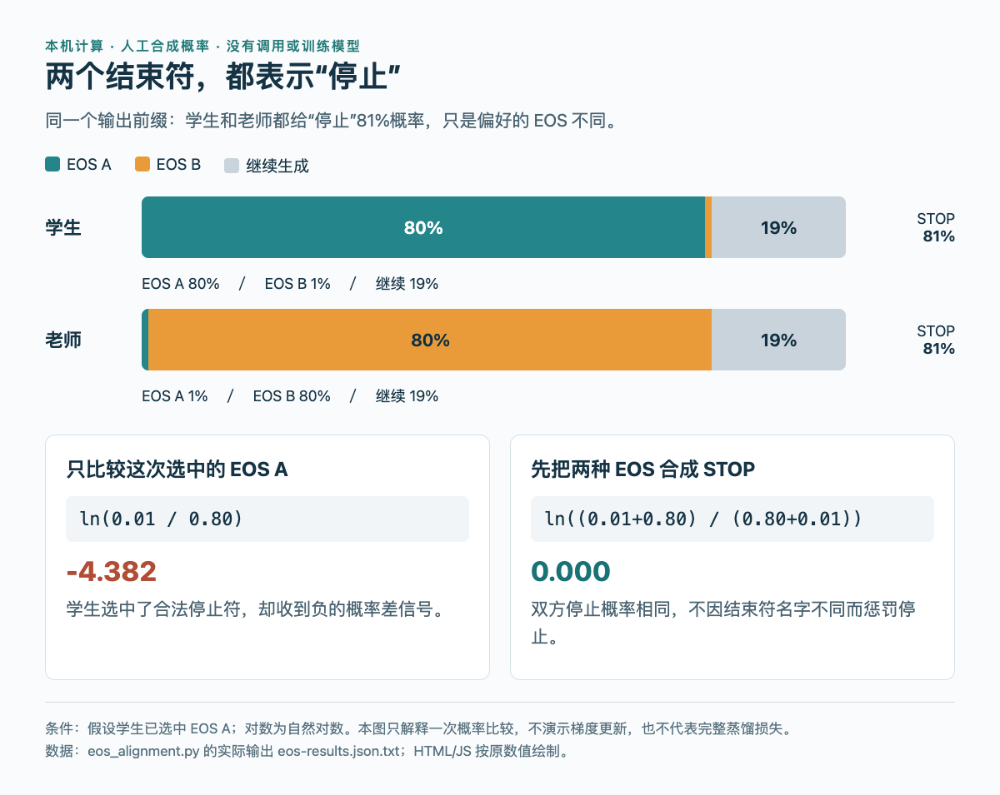

# 两个结束符，为什么会把“该停了”变成负反馈

已运行验证：Python 3.14.3 标准库，无第三方依赖、API调用或模型训练。数据为手工构造的一个输出前缀，目的只是解释[EOS论文](03-论文精选.md)里的机制，不是复现论文曲线、质量成绩或完整损失函数。

## 先看这个很小的例子

假设词表里EOS A和EOS B都能结束回答。学生给A的概率是0.80、B为0.01；老师恰好反过来。两边继续生成的概率都为0.19，所以语义上的“停止概率”都是0.81。

现在条件化地看学生已经选中A这一种情况。如果反馈用老师与学生对这个token的对数概率差，就得到 `ln(0.01 / 0.80) = -4.382`。负值来自老师不喜欢A这个名字，不能据此说明老师更希望继续回答。

把A和B先合成同一个STOP事件后，比较的是 `ln(0.81 / 0.81) = 0`。这一步保留了两边对停止的真实分歧，同时去掉了结束符偏好造成的假分歧。



HTML/JS按本机实际输出绘制。绿色与橙色分别为两种EOS，灰色为继续；两条停止总概率相同。没有采样、训练或梯度更新，图中的概率全部为人工合成。（[可复算数据](code/eos-results.json.txt) · [绘图源码](code/eos-figure.html) · [查看大图](images/eos-comparison.png)。）

## 核心计算

```python
import math

student = {"eos_a": 0.80, "eos_b": 0.01, "continue": 0.19}
teacher = {"eos_a": 0.01, "eos_b": 0.80, "continue": 0.19}
eos = ("eos_a", "eos_b")

token_signal = math.log(teacher["eos_a"] / student["eos_a"])
stop_signal = math.log(
    sum(teacher[t] for t in eos) / sum(student[t] for t in eos)
)
```

完整脚本还检查各分布的概率和为1，并计算老师更愿意停止、较不愿意停止两种对照。它不会把所有停止信号强行变成零：

| 教师STOP概率 | 学生STOP概率 | 逐token信号（选中A） | 合并STOP后的信号 |
| --- | --- | --- | --- |
| 0.81 | 0.81 | −4.382 | 0.000 |
| 0.90 | 0.81 | −4.382 | +0.105 |
| 0.50 | 0.81 | −4.382 | −0.482 |

在第二、三行，教师A的概率仍为0.01，仅改变B和继续的概率。逐token比较察觉不到这个变化；合并后则保留了停止倾向真实的增强或减弱。

## 怎样复算

下载[Python脚本](code/eos_alignment.py)，在目录中执行：

```bash
python3 eos_alignment.py
```

脚本打印结果，并在同目录写出`eos-results.json.txt`。若要重绘，保存[HTML](code/eos-figure.html)和结果文件到同一目录，用本地HTTP服务打开，浏览器按JSON中的实际数值绘图。无需GPU，Python 3.11及以上可运行。

## 这个例子没有证明什么

这里只看一个前缀和指定的已选动作，未对所有token求期望，没有展示完整反向KL或蒸馏目标，也没有声称一次更新必然怎样改变长度。真实训练还涉及采样分布、奖励、截断和优化器。

在工程中，首先应核对老师与学生的tokenizer、聊天模板、停止列表及其输出概率。只把两个ID加入停止列表，可以让程序识别结束，却不会自动改变模型对这两个ID的偏好。论文的停止对齐是训练信号层面的处理，是否适合自己的任务仍需独立对照。

[论文原文](https://arxiv.org/abs/2609.20511v1) · [本站论文解读](03-论文精选.md)
