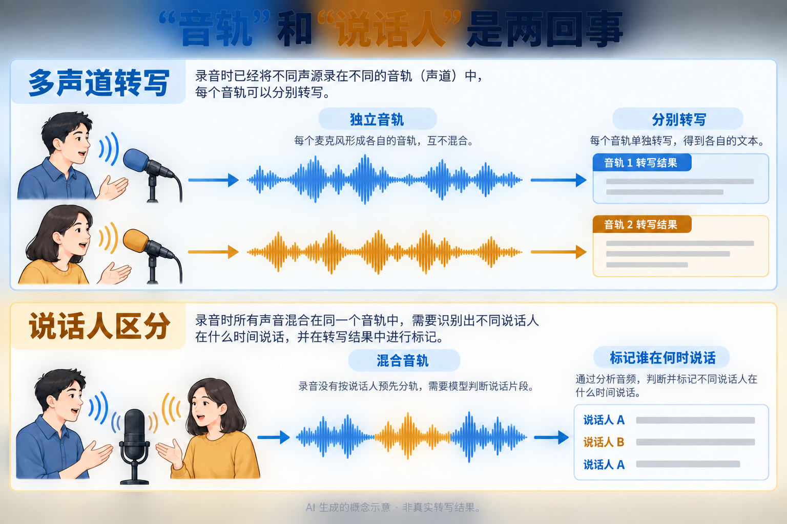
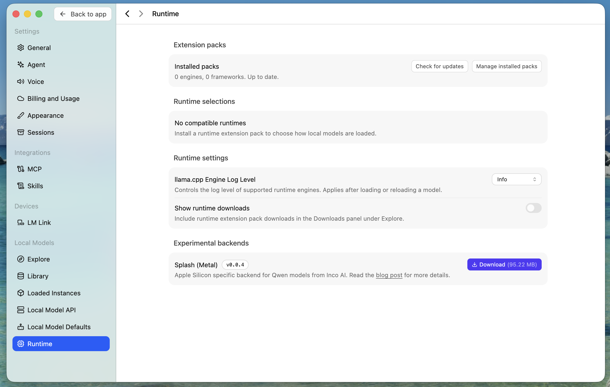
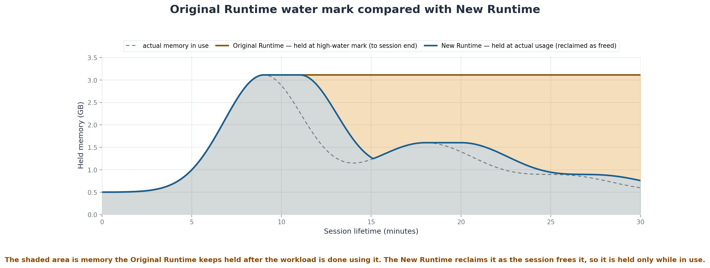
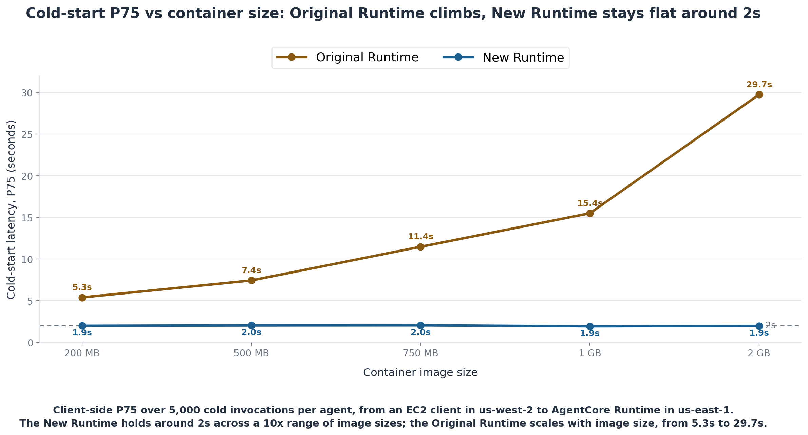
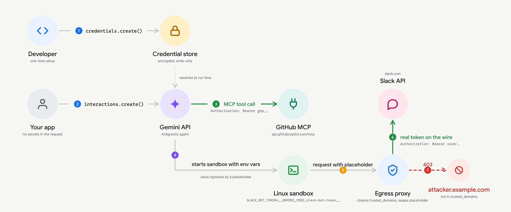

# AI 动态｜语音、本地推理与 Agent 运行环境

5 条重点详解，10 条速读。优先搜索近24小时，再扩至72小时与7天；本次值得新增的事件主要集中在9月16–18日，因此保留原日期，统一标注近期补充。9月19日的转载不算9月19日新发布。

本期按可核实的新能力与使用变化入选。公告能证明发布，不能独自证明热门；下文的性能数字均注明出处与条件，未把作者实验写成本机实测。

## 01 · Grok Voice Transcribe 2：把转写接进真实语音流程

2026-09-18 · 近期补充 · 新近实用／创新线索，热度待验证。

xAI 发布 Grok Voice Transcribe 2，面向录音批处理和实时音频流。它的实用变化不只是把一句话识别得更准，还包括逐词时间戳、置信度、说话人区分、最多八个独立音频通道，以及最多一百个关键词提示。整理访谈、检索客服电话、给语音指令加确认步骤时，这些结构化信息往往比一整段无标记文本更有用。

多音轨与说话人区分要分开理解。两支麦克风分别录下的音轨，输入时就已分开；一支麦克风录到两人交谈，则需要模型判断哪些片段属于同一人。后者的标签可以辅助整理发言，但不能证明现实身份。下图用概念示意解释这两个任务，未展示产品真实界面或测试结果。

先看输入有几条轨，再看输出是在逐轨转写还是划分说话片段。AI生成的概念示意，依据公告中的两项能力；不是准确率证据。（[事实依据](https://x.ai/news/grok-voice-transcribe-2)；[查看大图](images/audio-channels-concept.png)。）

公告还列出数字格式化、去除填充词和检测发言结束等处理。一个可理解的接入流程是：先让转写服务保留时间位置，再由业务规则检查人名、号码或订单词，最后把需要确认的字段交还用户。关键词能提示领域词，却不保证出现相近声音时一定选对；置信度也不宜直接当成整段对话的正确率。

作者在电话、Grok对话、口述凭据信息和多语言短指令等内部集合上评估，其中短句集合的词错误率由20.6%降到6.8%。这是特定集合、特定指标的结果，不能简写成所有语言准确率翻倍。公告提及第三方榜单，但本期未独立复核榜单当前配置，因此不据此给“全球第一”结论。

当前提供批量和流式接口。公告表示新版本将很快成为默认、旧版随后弃用，不能写成所有现有请求已经完成切换；需要暂时保留旧行为的集成应核对显式模型版本。对使用者而言，优先用自己的口音、背景噪声和专有词样本做小规模回归，再决定是否替换已有流程。本站未调用该服务。

[原始来源](https://x.ai/news/grok-voice-transcribe-2)。

## 02 · Splash：在合适的 Mac 上，为少数模型深度优化

2026-09-18 · 近期补充 · 新近实用／创新线索，热度待验证。

LM Studio 引入 Splash 推理引擎，首批重点支持 Qwen3.6-35B-A3B 与 Qwen3.8-27B。这次更新值得本地模型用户看，是因为它把优化目标收窄到具体模型和苹果硬件，结合专用计算内核、内存安排与配套的 DFlash2 草稿模型。它仍是实验性运行时，不能把两种受支持模型上的收益推到全部权重。

可以把推测解码理解为先由较小的草稿模块提出若干后续 token，再由主模型一起核验。是否省时，取决于草稿被接受的比例与核验成本；长上下文、并发请求和不同任务都可能改变结果。因此选择运行时后，还要使用官方列出的兼容模型包，不能只看到模型名称相近就假设普通文件能得到同样加速。[引擎实现](https://github.com/incoai/splash)已公开，采用 Apache-2.0。

官方示例在48GB内存的 M5 Pro 上运行 Qwen3.8-27B：短上下文约74 token/s，32K上下文约54 token/s；四个短请求并发时，合计吞吐约170 token/s。最后一个数是四路总量，不能写成每个对话都达到170。文章没有证明所有提示词都维持这些速度，也没有给本站设备的复测结果。

原始设置界面帮助定位运行时入口。看到可下载引擎后，仍需核对兼容硬件、系统和指定模型文件。（[来源原图](https://lmstudio.ai/blog/splash-engine)；[查看大图](images/splash-runtime.png)。）

使用入口在 LM Studio 的 Runtime 设置中，打开实验性功能并下载 Splash Metal，再从推荐模型进入新会话。公告要求 Bionic 1.1.5及以上、M3或更新芯片、macOS26.4及以上，内存至少36GB，建议48GB。这里的门槛说明它更适合已有相应设备的用户评估，不宜仅为一张速度表作硬件采购判断。

对研究者，一个有价值的小实验是固定模型、量化、提示和输出长度，对照普通运行时与 Splash 的首字延迟、生成速度及长上下文行为。吞吐之外还要观察内存压力，避免把交换内存时的偶然慢点当成普遍差异。本期核验了公告和公开仓库，未安装运行时。

[原始来源](https://lmstudio.ai/blog/splash-engine)。

## 03 · AgentCore Runtime V2：长会话不再一直占着峰值内存

2026-09-18 · 近期补充 · 新近实用／创新线索，热度待验证。

AWS 正式推出新版 AgentCore Runtime，重点处理两种 Agent 基础设施成本：会话偶尔用到大量内存，之后却一直保留峰值占用；每次冷启动重新拉起较大容器，等待时间随镜像和并发变化。V2保留按需扩缩、会话隔离和缩到零的服务方式，同时重做内存管理与启动路径。

旧模式下，一次处理大文件形成的内存高点可能持续到会话结束。新版按需载入内存页，并在内存释放或变冷后回收。下图中应看峰值之后的两条曲线：节省来自随后一段时间不再占着同样资源，不是把那次计算本身删掉。AWS也说明新版单价更高，所以不能只凭占用下降就承诺每种负载都省钱。

官方机制示意：看峰值之后的占用面积。图示解释回收方式，不是特定读者账单的测量值。（[来源原图](https://aws.amazon.com/blogs/machine-learning/the-new-agentcore-runtime-elastic-optimized-and-consistently-fast-starts/)；[查看大图](images/agentcore-memory.png)。）

启动过程则先把环境初始化一次，等容器健康后保存精简快照；新实例恢复快照，不必从头执行相同初始化。初始化静态配置、载入必要组件与真正收到任务后调用模型，是三个不同阶段。快照优化解决前两者的重复工作，并不意味着复杂研究任务会在两秒内结束。

官方用不调用模型和工具的空回声 Agent 测试：五种200MB到2GB镜像，每个 Agent 做5000次冷调用。客户端位于us-west-2，服务位于us-east-1，通过公网与boto3调用，客户端计时包含跨区域往返。V2的P75冷启动约两秒，旧版随镜像增大由约5.4秒升至近30秒。这个对照较清楚地隔离了平台启动开销，但并非真实业务的完整响应时间。

原始实验图。纵轴为P75冷启动，空回声Agent、跨区域客户端计时；不能当成模型生成或任务完成耗时。（[来源原图](https://aws.amazon.com/blogs/machine-learning/the-new-agentcore-runtime-elastic-optimized-and-consistently-fast-starts/)；[查看大图](images/agentcore-coldstart.png)。）

接入时需在创建或更新运行时明确设置 platformVersion 为 V2，先核对[区域与可用说明](https://aws.amazon.com/about-aws/whats-new/2026/09/new-agentcore-runtime-generally-available)。更大的计算规格、x86支持及更多挂起恢复能力仍被列在后续计划中，不属于本次全部兑现的功能。适合先拿有明显内存峰谷的会话对照资源账单与延迟；本站未部署AWS实例。

[原始来源](https://aws.amazon.com/blogs/machine-learning/the-new-agentcore-runtime-elastic-optimized-and-consistently-fast-starts/)。

## 04 · Gemini 托管 Agent：文件能取出来，密钥由出口代理注入

2026-09-17 · 近期补充 · 新近实用／创新线索，热度待验证。

Google 上线 antigravity-preview-09-2026，把更新后的 Agent 工具与行为带到 AI Studio 和 Interactions API。默认使用 Gemini3.8 Flash，也允许按交互配置模型；这是一套托管运行框架的升级，不是把已发布模型再算一次新模型。它为任务提供持续的Linux沙箱，模型可以执行代码、编辑文件、使用搜索并根据结果继续操作。

其中最容易转化为实际工作的是 Files API。首次交互建立环境并返回环境标识，后续可以列目录、上传数据、下载单个文件或整个目录。官方以CSV生成单文件HTML看板举例：数据进沙箱，程序在里面产出文件，使用者再取回结果；下一轮还可以上传新数据，继续修改同一产物。这个流程补齐了“回答说做完了，文件在哪里”的交付环节。

另一个变化是 Credentials API。凭据先在服务端登记，模型环境只看到占位符；出站请求匹配受信任目标时，代理才换入真实值。它支持Bearer token、环境变量映射和OAuth2等形式。下图的关键不是画了几个组件，而是真实秘密在哪一步出现：它位于请求出口，不必作为任务文本交给模型。

Google原始流程图。沿沙箱到出口代理阅读，区分占位符与真实值；允许访问的服务和操作范围仍由开发者配置。（[来源原图](https://aistudio.google.com/learn/managed-agents-updated-harness-files-credentials)；[查看大图](images/google-credentials.webp)。）

这改善了接入方式，却不自动证明Agent会正确使用每项权限。一个能够访问代码托管服务的Agent，仍应只获得完成任务所需的目标和操作范围。文件下载成功，也只说明产物已取回，CSV计算、图表和结论仍需要检查。这里是官方功能与示例解读，本站未把个人凭据交给该服务，也未运行示例任务。

迁移时还要检查工具事件名称：新版文件工具会报告 view_file、write_to_file、replace_file_content 等名称，按旧名称过滤日志的代码可能需要更新。官方目前计划10月5日弃用五月预览标识并重定向，使用者应按[文档](https://ai.google.dev/gemini-api/docs/antigravity-agent)跟踪实际日期。公告中的内部效率实验可作为线索，本期不混用不同转述中的缓存率与任务提升数字。

[原始来源](https://aistudio.google.com/learn/managed-agents-updated-harness-files-credentials)。

## 05 · Unsloth：Docker、AMD 与多用户工作区接到一起

2026-09-17 · 近期补充 · 新近实用／创新线索，热度待验证。

Unsloth 在9月17日更新中扩展 Docker 与 Studio 的使用路径，支持NVIDIA以及AMD ROCm环境，并增加多用户账户相关能力。它面对的是一个常见问题：模型本身能运行，安装训练依赖、管理缓存和让几个人共用一台机器却仍要反复配置。容器与账户机制把这些工作集中到明确入口，降低的是环境组织成本，不是取消显存和驱动条件。

用户工作区分开保存；当模型配置匹配时，可以共享已载入模型，避免每个人都重复装载同一份。这个取舍适合小团队共用机器，但“账户分开”与“为每个人分配独立GPU”并非同一件事。多人同时训练或推理的吞吐与资源争用，仍要按机器和任务评估，不能从功能列表推导并发服务等级。

新版镜像还调整了CUDA环境、清理预置缓存，并恢复部分训练适配。数据通过持久卷保留，而应用代码不应被旧卷固定住，否则更新镜像后可能继续运行旧程序。对已有部署，实际要检查的是项目文件、模型缓存、Studio数据分别挂在哪里，以及升级后启动的版本是否一致；只看镜像拉取完成还不足以确认迁移完成。

[Docker安装说明](https://unsloth.ai/docs/get-started/install/docker)给出了Studio与JupyterLab入口、持久化目录和不同GPU路径。NVIDIA示例要求570.26或更新驱动；AMD有单独的ROCm运行方式，应按其硬件与系统支持说明执行。文档中“依赖预装好”不能读成任意电脑免配置，包括没有对应GPU驱动的机器。

这次选择它，是因为部署和协作流程已有具体实现与操作文档，适合正在尝试本地微调或共用训练机的读者。首次评估可以先用小模型验证一次加载、一次短训练和重启后的文件保留，再扩到实际工作量。本文未执行训练，也不把更新中分散的速度主张拼成一个通用加速倍数；容器入口与账户说明比再画一张安装框图更直接。

[原始来源](https://unsloth.ai/docs/new/changelog)。

## 06 · Muse 来到 Mac：本次新增的是桌面入口

2026-09-18 · 近期补充 · 新近实用／创新线索，热度待验证。

Meta的Muse新增Mac应用，官方页面列出文件整理、填写表单，以及经允许使用Messages、Calendar、Notes等能力。实际意义是同一任务可从移动端延续到桌面，并接触本机工作材料；具体权限仍需用户授予。Muse本体已在[9月9日日报](../2026-09-09/01-AI动态.md)介绍，本次只记录桌面可用范围变化。下载入口已核验；9月18日时间由[同期报道](https://techcrunch.com/2026/09/18/metas-muse-hits-mac-letting-the-ai-take-actions-on-your-computer/)交叉确认，原X公告抓取受限，本站未安装。

[原始来源](https://ai.meta.com/muse/download/)。

## 07 · LimiX-2：表格分类、回归与补缺共享一个模型

2026-09-16 · 近期补充 · 新近实用／创新线索，热度待验证。

LimiX-2于9月16日公开400M权重与推理代码，把分类、回归、缺失值补全放到同一预训练模型中，针对新表格通过上下文工作，不必每个任务都更新参数。研究重点从仅预测目标列转向学习给定上下文的联合结构，训练使用结构因果模型生成的合成数据。因果骨架恢复属于作者实验，不能等同于任意真实表格的因果识别保证。权重采用专门的非商业许可，代码与权重条款也需分开核对；因此这里称公开权重，不称无条件开源可商用。

[原始来源](https://huggingface.co/stable-ai/LimiX-2)。

## 08 · Unity 给 Codex 提供面向引擎工作的插件

2026-09-16 · 近期补充 · 新近实用／创新线索，热度待验证。

Unity发布Codex插件，把引擎相关工作组织为技能与工具路径，例如识别项目采用的UI方案、检查包、管理编辑器、构建、测试和读取日志。对游戏开发者，价值是让AI先理解工程约束，再在可验证的引擎流程中修改；创建新项目的技能可以整理平台和工程配置，并不等于自动完成可玩的游戏逻辑。Claude相关插件更早发布，不能合并成9月19日的全新事件。本站核对官方说明，未执行Unity构建，兼容性仍以当前插件和编辑器要求为准。

[原始来源](https://unity.com/blog/unity-plugin-codex)。

## 09 · 华为发布金融启元体系与 openJiuwen、FAB2 进展

2026-09-18 · 近期补充 · 新近实用／创新线索，热度待验证。

华为在金融场景发布启元智能体相关体系，介绍openJiuwen金融Agent平台与FAB2工程能力。公告列出场景、资产与工程组件，重点是把领域数据、工具接入和开发运行流程组织起来，供金融机构及伙伴构建具体应用。列出的机构采用量、并发和用户规模属于厂商案例口径，不能当成全部公开实现都已复现的通用成绩。对读者，更有价值的下一步是检查目标组件是否已有代码、许可和示例；本次为平台发布新闻，不把整套商业金融方案写成已完整开源。

[原始来源](https://www.huawei.com/cn/news/2026/9/hc-agenticai-openjiuwen-fab2)。

## 10 · Earth-2 用在空气污染预测：分辨率与时间演化分开处理

2026-09-16 · 近期补充 · 新近实用／创新线索，热度待验证。

曼彻斯特大学研究团队把化学气候模拟与观测结合，使用CorrDiff做空间降尺度、StormCast处理时间演化。官方案例称训练数据覆盖英国一年逐小时模拟，网格约2–3平方公里；这和已经覆盖每条街道不同，街道级仍是后续目标。数据与工作流程也被列为计划开放，不能写成已经可下载的完整数据集。它的研究价值在于把空间细化与动态预测拆开检验；模型仍需要当地观测、误差评估与极端事件验证。

来源对照图用于理解空间降尺度；更细的图像不自动表示更准确，仍要结合真实观测验证。（[来源原图](https://blogs.nvidia.com/blog/uk-air-pollution-research-earth-2/)；[查看大图](images/earth2-corrdiff.png)。）

[原始来源](https://blogs.nvidia.com/blog/uk-air-pollution-research-earth-2/)。

## 11 · DeepMind Institute：把 AGI 的社会问题放进持续研究入口

2026-09-16 · 近期补充 · 新近实用／创新线索，热度待验证。

DeepMind启动Institute，集中讨论AGI的经济、社会与治理问题。对技术读者，首批[推理透明性文章](https://institute.deepmind.com/essays/the-case-for-reasoning-transparency/)更值得读：可观察的推理过程能提供监控线索，但未必完整反映内部计算，未来系统也可能减少这种可见性。这是研究主张与制度讨论，不是新模型发布或已经生效的监管规则。上期出现过的负责人意见不重复算新闻，本次新增事实是独立入口及成组文章；日期由同期报道交叉确认，本站未将观点当实验结论。

[原始来源](https://institute.deepmind.com/)。

## 12 · Crusoe 完成F轮首次交割，整轮预计39亿美元

2026-09-17 · 近期补充 · 新近实用／创新线索，热度待验证。

Crusoe公告称，F轮融资已完成首次交割，整轮规模预计39亿美元，投后估值309亿美元，用于扩展大型园区、模块化Spark单元与云业务。准确状态是融资及扩建计划，不能把计划容量当成今天可用GPU。公司还报告合约容量与已经交付容量，两者不同；合同总额也不是当期收入。它反映AI供给的约束仍包含供电、建设与运维，而非只取决于芯片数量。原公告为9月17日18:25 UTC，对应北京时间18日02:25；数字均来自公司披露。

[原始来源](https://www.globenewswire.com/news-release/2026/09/17/3364326/0/en/crusoe-raises-3-9-billion-series-f-for-its-vertically-integrated-ai-infrastructure-platform.html)。

## 13 · Copilot CLI 使用统计新增技能、MCP 与插件维度

2026-09-17 · 近期补充 · 新近实用／创新线索，热度待验证。

GitHub在组织与企业使用指标API中增加CLI技能、自定义Agent、MCP、斜杠命令和插件等维度，可用于观察团队实际用了哪些扩展。读数要留意定义：MCP interaction_count表示连接尝试，包含失败，并非工具执行次数；插件相关技能又可能是技能统计的子集，不能直接相加。它比仅看安装数更接近使用流程，但不等于任务成功或生产率提升。公告美国日期9月17日，北京时间18日；与前期采用概览是不同新增指标，本期未调用企业数据。

[原始来源](https://github.blog/changelog/2026-09-17-agentic-cli-customizations-now-in-the-usage-metrics-api/)。

## 14 · AWS Security Agent 在测试前检查登录凭据

2026-09-18 · 近期补充 · 新近实用／创新线索，热度待验证。

AWS Security Agent新增测试前的凭据预检：先尝试登录目标应用，并收集过程中发现的域名，作为用户审核的范围建议。这样可在长任务启动前发现登录配置问题，减少测试直到中途才卡在入口的情况。登录失败或超时也可能产生域名建议，因此看到建议不代表认证成功，更不表示这些域名自动获得测试授权。功能已在该服务支持区域提供，适合已有授权测试流程的团队核查准备状态；本次不是新基础模型，也不是替用户扩大测试范围。

[原始来源](https://aws.amazon.com/about-aws/whats-new/2026/09/aws-security-agent/)。

## 15 · HappyOyster 进入百炼国际目录：模型首发与服务上架分开看

2026-09-17 · 近期补充 · 新近实用／创新线索，热度待验证。

阿里百炼国际模型目录在9月17日列入HappyOyster Adventure、Directing和Acting：分别侧重探索移动、文本驱动剧情与角色演绎。模型本体此前已有发布，本次新增事实是国际服务目录上架，不能称9月首次发明世界模型。开发者可以沿[官方API文档](https://www.alibabacloud.com/help/en/model-studio/happyoyster)核对SDK与接入方式，其中Acting明确标注邀请预览，并非所有账号都已可用。本次不推断生成质量或实时性能，本站也未调用；目录上架时间与具体账号可用状态仍需分别核对。

[原始来源](https://www.alibabacloud.com/help/zh/model-studio/newly-released-models)。
