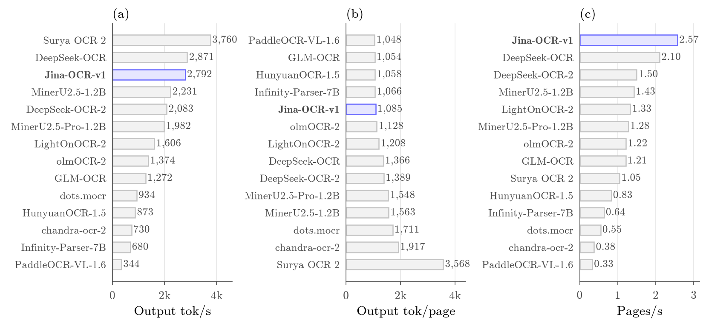
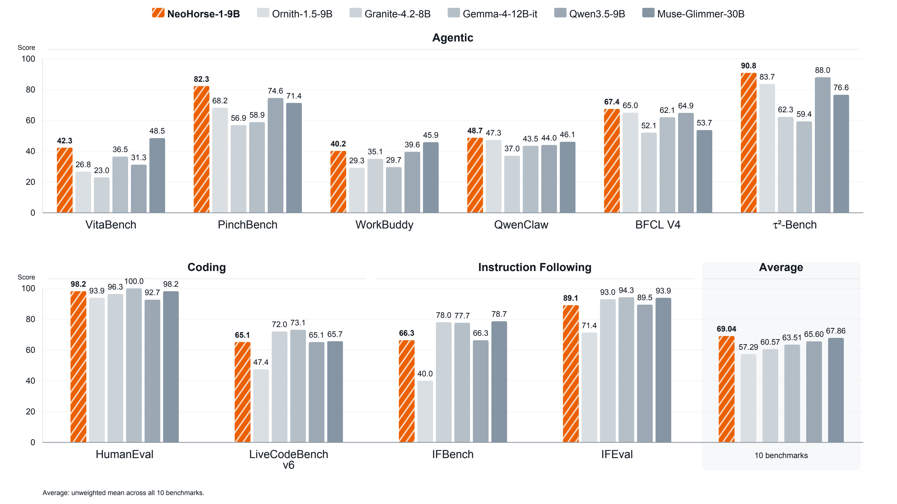
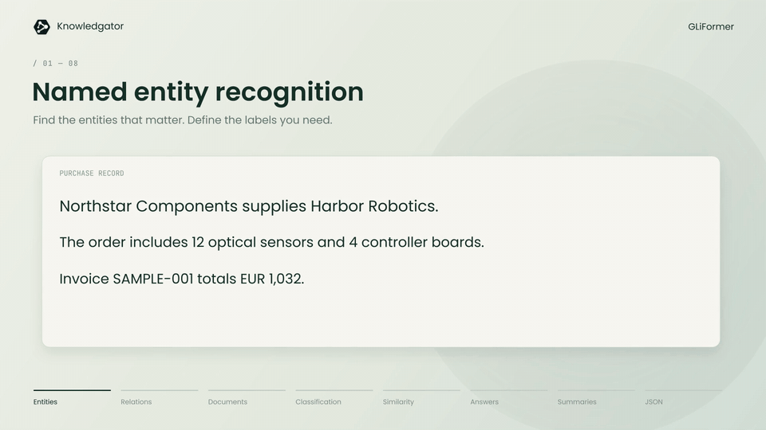

# 六个模型｜看具体任务，也看权重到底开放了什么

本期比较近期模型卡与实际文件，选出六项不同用途。名称沿用网站“开源模型”栏目，但逐项区分开放权重、适配器和使用限制；Jina OCR采用非商业许可，不应与Apache-2.0混为一谈。全部依据作者材料整理，本站未下载大权重或运行推理。

| 想做的事 | 模型 | 首先核对 |
| --- | --- | --- |
| 对给定文本做有限选项判断 | Bespoke Nimble | 仅有LoRA，需要基础模型 |
| 把扫描页面变成结构化文本 | Jina OCR | 非商业许可，MTP后端条件 |
| 研究俄语基础模型 | AliceAI Base | 80B总权重，尚未聊天对齐 |
| 研究Agent后训练的收益分布 | NeoHorse | 纯文本，部分基准没有提高 |
| 小体积英文语音合成 | Kokoro 7M | 单音色与专用加载器 |
| 英文实体和结构化抽取 | GLiFormer | 标签、阈值与关系抽取限制 |

## 01 · Bespoke Nimble：给固定选项打分的9B适配器

2026-09-18。新近实用／研究价值，热度待验证。

Nimble把文本状态与判断标准转成布尔值、枚举或分档评分，读取候选token的分数，不为一个有限选择生成长篇回答。例如把一条支持工单映射到几个已定义类别，比要求通用模型自由写一段JSON更容易约束输出；这是适合验证的使用场景，不是本站测得的准确率。

这里发布的是约165MiB的LoRA适配器，必须配套Qwen3.5-9B基础权重及指定版本；不能把下载适配器的大小写成整个模型只占165MiB。仓库提供inference与提示构造文件，作者路径采用CUDA/BF16。支持的上下文上限为2048 token、选择项最多26个，超过限制需先改变任务组织，不能静默截断后假装判断的是全文。

当前逐字段处理，适合小而明确的决策接口；它并不自动替代开放问答或复杂推理。模型卡所列适配器许可为Apache-2.0，基础模型条款也需一并遵守。代码仓库与模型卡的开放范围分开核对，本期只将有明确许可的模型适配器收进本栏。

[模型卡、文件与许可](https://huggingface.co/bespokelabs/Bespoke-Nimble-9B)。

## 02 · Jina OCR：吞吐看每秒页面，也要看每页输出长度

2026-09-14。新近实用／研究价值，热度待验证。

Jina OCR建立在DeepSeek OCR架构上，约3B总参数、570M激活参数，以全局视图和局部图块解析页面。它面向版面、文本、公式等文档内容，不是通用图像问答模型。输入一页扫描件、输出结构化文本，是更适合它的评估路径。

下图给同一批OCR系统按不同吞吐口径排序。读OCR速度时，token/s会受输出冗长程度影响：一个系统写得更多，未必处理更多页面。因此应同时看页吞吐、质量与使用条件。作者报告OmniDocBench1.6得分91.14、olmOCR-Bench83.4；图中的A100并发32条件也不能与另一个L4单样本的FastMTP实验混成同一结果。

官方效率原图：对照页面与token口径，保留设备、并发和数据集条件。图中比较不是本站复现。（[来源原图](https://jina.ai/news/jina-ocr-v1-faster-document-parsing-on-low-budget-gpus/)；[查看大图](images/jina-ocr-efficiency.png)。）

权重及定制建模代码同仓提供，采用CC-BY-NC-4.0，商业用途须另行核对授权。FastMTP通过草稿预测减少串行生成，需vLLM0.21及以上和相应架构注册；普通Transformers的generate路径并不自动启用它。自定义代码加载前应阅读内容。官方文章原日期为9月14日欧洲时区，北京时间15日；9月18日卡片修改不是首次发布。

[模型卡、文件与许可](https://huggingface.co/jinaai/jina-ocr-v1)。

## 03 · AliceAI Base：80B总参数与3B激活参数是两件事

2026-09-12 · 近期补充。新近实用／研究价值，热度待验证。

AliceAI是从头训练的基础语言模型，80B总参数、每token约3B激活，混合KDA线性注意力、门控注意力和MoE，支持262144上下文。激活参数描述一次计算动用多少专家，不代表只需保存3B权重；本仓49个权重分片也提醒部署者别用激活规模估算完整存储。

作者同时给出俄语WikiWebFacts与HardMultiQA数据及评估协议。内部vLLM、temperature=0的对照中，WikiWebFacts得分86.5，Qwen3.5-35B-A3B-Base为62.4。这个结果支持继续研究俄语事实能力，不能变成所有语言、所有任务都领先的结论。

权重采用Apache-2.0，提供定制代码与微调示例。它仍是Base模型，没有自动套用的统一聊天模板；卡片中的模板主要服务微调数据准备。官方LoRA示例面向四张80GB GPU，不能据此给出消费级单卡承诺。适合有多卡条件、关注俄语或混合架构的研究者；普通聊天用户应先明确是否需要基础模型。

[模型卡、文件与许可](https://huggingface.co/yandex/AliceAI-Foundation-80B-A3B-Base)。

## 04 · NeoHorse：路由反馈驱动的Agent后训练原型

2026-09-05 · 近期补充。新近实用／研究价值，热度待验证。

NeoHorse由Qwen3.5-9B后训练而来，路由框架先把任务分给不同能力的模型，再用任务与工具交互反馈调整后续训练混合。作者称其为递归自改进方向的初步原型；连续多轮稳定改进仍是后续目标，不能写成已经验证无限自提升。

当前文件仅包含语言模型权重，没有视觉部分。作者在十个基准上的宏平均由基础模型65.60提高到69.04，但变化并不均匀：PinchBench为74.55→82.25，LiveCodeBench与IFBench持平，IFEval略降。先看任务分项，比记住一个总分更有助于判断是否适合自己的Agent。

作者对照原图。不同基准包含不同运行次数；一个宏平均不能代替代码、工具调用和指令遵循的分别检查。（[来源原图](https://huggingface.co/TokenRhythm/NeoHorse-1-9B)；[查看大图](images/neohorse-bench.jpg)。）

公开BF16权重，Apache-2.0；报告采用SGLang0.5.17及明确采样配置，部分Agent基准仅一次运行。部署时还要考虑9B权重、KV缓存和长上下文开销。它适合做任务固定、采样一致的对照，本期未运行模型，也未独立复现路由后训练。

[模型卡、文件与许可](https://huggingface.co/TokenRhythm/NeoHorse-1-9B)。

## 05 · Kokoro 7M：小体积英文单音色语音合成

2026-09-08 · 近期补充。新近实用／研究价值，热度待验证。

这个社区蒸馏模型把Kokoro82M压缩为约7.477M参数，FP32模型约28.7MB，生成24kHz英文单音色语音。适合研究离线语音界面如何缩小模型与加快合成，不适合据此承诺多语言、多音色或真人音色复刻。

加载时需仓库的load_model.py与修改后的Kokoro实现，不能直接当普通Kokoro权重塞入旧结构。卡片明确使用af_msa.pt音色；同仓出现其他音色文件，不代表每个都能得到相同结果。

作者在CPU四线程、24句文本上报告实时率RTF约0.0220，对照82M为0.0902，但计时排除了音素转换。这不是手机端完整文本到声音的耗时。权重许可为Apache-2.0，模型与所用语音组件的条款仍应分别检查；本站未试听或做主观音质评估，不能把体积缩小写成音质无损。

[模型卡、文件与许可](https://huggingface.co/oddadmix/Kokoro-7M-Distill)。

## 06 · GLiFormer：一个编码器接实体、分类与结构化抽取

2026-09-11 · 近期补充。新近实用／研究价值，热度待验证。

GLiFormer用共享DeBERTa编码器接不同任务头，推理时输入标签或字段模式。比如“Alice works at Acme”可以抽取人名、组织和任职关系，也可以按指定模式组成字典。它把抽取任务限制在给定结构中，适合资料整理管线；模式校验只证明形状符合要求，不证明内容正确。

官方演示展示同一编码器支持的任务，重点看输入文本如何对应输出字段，而不是把任务数量当质量指标。作者给出26个NER数据集平均严格实体F1为50.45，结构化任务500例的宽容JSON F1为87.20；后者允许有限边界修复，不是87.2%的完整JSON完全正确。

模型卡的官方工作流演示。重点看输入文本与标签或字段如何对应；GIF中的PDF画面不能证明该权重能直接解析视觉页面，当前模型没有视觉编码器，也不能据此推断多语言质量。（[来源原图](https://huggingface.co/knowledgator/gliformer-base-v1)；[查看大图](images/gliformer-tasks.gif)。）

Apache-2.0，Python3.10及以上，可用CPU的eager attention或相应GPU实现。当前权重没有独立视觉、音频和开放关系头，联合关系抽取应按卡片指定接口；公开关系抽取结果仍明显弱于其结构化结果。选择它的理由是接口与评估路径具体，适合用自己的英文样本检查漏抽、错配与阈值敏感性，本站未运行。

[模型卡、文件与许可](https://huggingface.co/knowledgator/gliformer-base-v1)。
