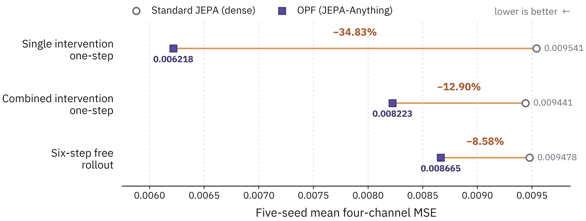
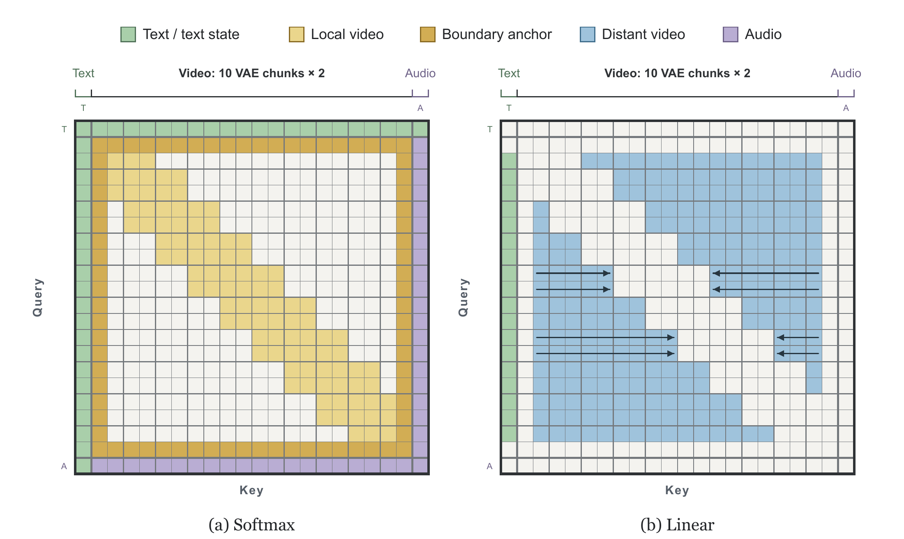
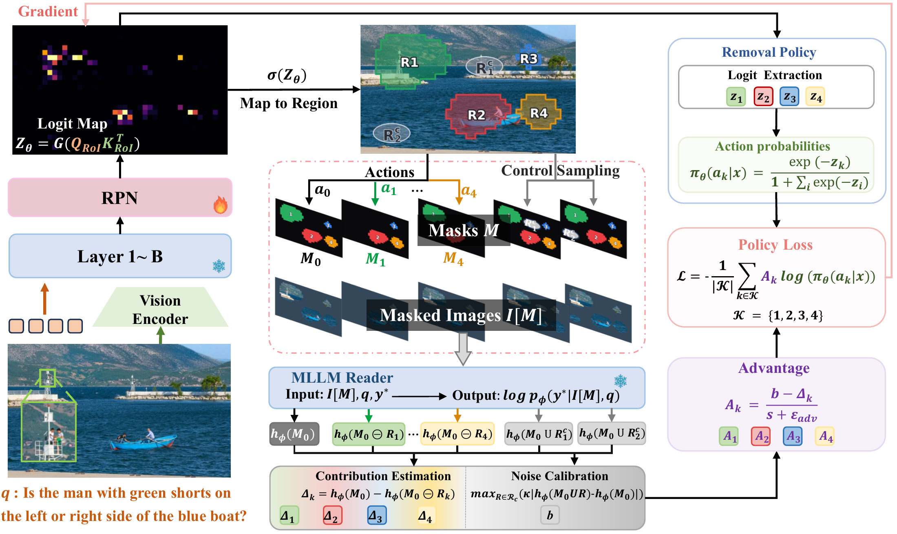

# 六篇论文｜预测、推理预算与 Agent 可靠性

从9月18日HF论文列表的24条线索比较主题和摘要，再读六篇原文的方法、对照、结果与限制。周末列表没有可用的9月20日新批次，不能把旧论文改成今日首发。本期六篇均为9月15–17日的v1预印本，不宣称会议录用。

它们在榜单上有关注信号，但本期未取得两类独立近期热度证据，所以按新方法和可复核实验入选，热度待验证。五篇版本提供CC许可，保存未改动PDF并保留具体条款；JEPA-Anything为arXiv非独占分发许可，只建阅读卡，引用一幅研究评论必需的结果图。

## 01 · JEPA-Anything：把预测表示拆成多个较少干扰的部分

2026-09-17 · arXiv:2609.20800 v1 · 预印本。入选：新近创新，热度待验证。已读核心方法与结果，本站未复现。

JEPA关心从可见信息预测未见部分的表示，不必把所有像素或原始数据重新生成。JEPA-Anything提出正交预测分解：把目标表示投影到多个可学习子空间，由不同预测器负责，再组合回去。直觉是让不同变化因素少互相干扰；正交、活跃度与方差约束用于避免各部分塌缩成重复或无效信息。

“Anything”不表示一套统一权重直接跨七个领域工作。论文为各领域保留不同适配器与编码器，比较的是可复用的分解方法。在主要对照里，它尽量固定编码器、数据、计算量、数据划分和读出方式；动态预测包含十项任务，并报告五个随机种子的结果。这比只给一个跨领域总分更有解释力。

原图来自Interventional Pong：单次干预的一步预测MSE由0.009541降到0.006218，改善34.83%；未见组合干预的一步预测改善12.90%，六步自由滚动改善8.58%。越接近组合泛化和长程预测，收益越小，这个差异比最大百分比更值得看。控制视觉任务的变化也较温和，不能据此宣称所有领域都有大幅提升。

作者还展示生物等领域的实验，但均属于论文自身证据，不是独立临床或部署验证。复现价值在于检查分解是否真的改善干预和多步预测，而非只改善训练集损失。公开[代码仓库](https://github.com/Gen-Verse/JEPA-Anything)可作为起点，本站未重跑七领域实验，也未将潜变量分解视为真实世界因果识别的充分保证。

作者Interventional Pong结果图：圆点为标准JEPA，方块为OPF，横轴为五个种子的四通道MSE，越小越好。三行分别是单干预、组合干预与六步滚动；收益不能相互替代。（[作者原图](https://arxiv.org/abs/2609.20800v1)；[查看大图](images/jepa-interventions.png)。）

[论文原文](https://arxiv.org/abs/2609.20800v1) · [站内阅读卡](../../../../papers/frontiers/jepa-anything/00-阅读卡.md)（本站不另存全文PDF）

## 02 · Video DeltaNet：近处精看，远处用线性状态保留

2026-09-17 · arXiv:2609.20744 v1 · 预印本。入选：新近创新，热度待验证。已读核心方法与结果，本站未复现。

长视频把大量时空token放进注意力计算，开销很快增大。Video DeltaNet保留局部视频窗口与首尾锚点的softmax注意力，把较远的视频信息交给双向线性状态；文本、音频等交互仍保留相应softmax路径。下图里两种颜色区域如何互补，比只记住“线性注意力”更能解释设计。

方法中的Video Delta Attention按帧共同写入相关图块，减少把同一帧强相关token当独立顺序项的局限。远端状态排除已经由局部窗口和锚点处理的信息，避免重复计算。作者先对齐教师，再用LoRA适配，冻结原权重，最后蒸馏到八步并优化运行实现。稳定性论证有固定特征与门控条件，不能扩大成整个训练过程一定稳定。

实验用10015个训练片段，以及103个固定第三方来源提示进行作者评估。单张B200上，50步密集基线的DiT去噪799.6秒降到混合实现307.9秒；八步版本为49.3秒。八张B200的6.70秒相对单卡基线得到119.3倍，相对同样八卡基线则是14.5倍。比较分母和硬件必须一起看。

这些时间仅是DiT去噪，不是含文本处理、编解码与传输的完整视频生产延迟。八步质量与密集50步总体接近，但世界连贯性等分项仍有下降，103个提示也不能覆盖所有镜头与长视频。作者[实现与模型](https://github.com/OpenVDN/vdn-minimax-h3)提供复核入口；工程价值明确，但远非消费级设备实时生成的一般承诺，本站未运行。

作者图2：左侧黄色局部窗口与边界锚点走softmax，右侧蓝色远距离视频走线性状态；双向箭头表示状态方向。空白区域与有色区域共同说明如何避免重复覆盖。（[作者原图](https://arxiv.org/abs/2609.20744v1)；[查看大图](images/vdn-architecture.png)。）

[论文原文](https://arxiv.org/abs/2609.20744v1) · [站内阅读卡](../../../../papers/frontiers/video-deltanet/00-阅读卡.md) · [归档 PDF](../../../../papers/frontiers/video-deltanet/2609.20744v1.pdf)

## 03 · When2Think：先答对，再奖励少用推理 token

2026-09-17 · arXiv:2609.19671 v1 · 预印本。入选：新近创新，热度待验证。已读核心方法与结果，本站未复现。

让模型少思考容易产生副作用：简单题节约了token，难题也被迫过早停止。When2Think同时学习是否显式思考与思考多长。它先用参考模型对每道训练题采样，估计正确率与平均推理长度，再用这些题目级统计调节效率奖励。

奖励的关键是正确性门控。答错时拿不到效率奖金；答对时，Think轨迹的奖励系数随长度增加而衰减，参考模型越难答对的题，衰减越缓。NoThink的系数设为1。训练还在首次模式token上平衡Think与NoThink探索，并在批内标准化优势，避免训练一开始就被某一种模式占满。

研究在可验证数学任务上开展，使用R1-Distill-Qwen-1.5B等模型与DeepScaleR数据。主表的AIME2024结果采用Pass@3，并对五次运行报告均值和标准差；1.5B模型由46%到56%，平均少3959个token，约减27.9%。这不是单次回答准确率从46%到56%，也不代表每道题都同时更短且更准。

方法需要可靠答案验证器以及逐题参考统计，参考预计算本身也有成本。数学验证能用的奖励，在开放研究或写作任务中未必容易获得。小模型上的收益不能直接外推到所有大模型；复现时应同时报告正确率、长度和总计算预算。

本期[技术实践](05-技术实践.md)只运行一个合成数值例子，展示同一公式如何对待短错、短对和长对。它帮助理解奖励形状，不属于模型训练或论文成绩复现。

作者方法图：左侧预计算每题参考正确率与长度；右侧平衡采样Think和NoThink；两路信息共同形成奖励。验证器位于奖励前，短但错误的答案不会因此获得效率奖金。（[作者原图](https://arxiv.org/abs/2609.19671v1)；[查看大图](images/when2think-method.png)。）

[论文原文](https://arxiv.org/abs/2609.19671v1) · [站内阅读卡](../../../../papers/frontiers/when2think/00-阅读卡.md) · [归档 PDF](../../../../papers/frontiers/when2think/2609.19671v1.pdf)

## 04 · Vision-RL²：把有限视觉预算花在有用区域

2026-09-17 · arXiv:2609.19745 v1 · 预印本。入选：新近创新，热度待验证。已读核心方法与结果，本站未复现。

高分辨率图像里，回答问题所需的信息可能只占很小一块，整图精读浪费视觉token，粗缩略图又会丢掉细节。论文训练一个轻量区域提议模块，冻结主多模态模型，让有限的裁剪与编码预算更集中在有用位置。

训练时，方法移除某个区域，观察正确答案的对数优势变化，估计这个区域的贡献；控制区域帮助校准遮挡带来的噪声，另有恢复区域的步骤找回漏掉的信息。推理时不需要知道标准答案，而是由提议模块一次给出区域。下图主要画出移除分支，不能把它误认为完整训练过程只有删除。

作者用7000个问答样本训练一个epoch，包含Info、Text与Doc任务。主评估使用较高视觉预算，Qwen3.5-9B平均由74.6到80.1；但效率实验采用另一组预算、短答案及规则判分，不能把其耗时与主表分数拼成同一性能点。低预算消融中，区域强化学习和稀疏编码分别贡献收益，部分任务与对照仍有胜负差异。

它提供的可复用思路是把“看哪里”作为可优化模块，而不是只扩大图像输入。主表有基于模型的判断、部分比较取自已有结果，仍需同协议复核；部署还受提议错误、预算与图像分布影响。论文采用会议模板并不证明已录用，本期按预印本阅读，未独立重跑或核验完整训练包。

作者方法原图：左侧可训练RPN提出区域，蓝色雪花模块冻结；中间比较遮挡后的正确答案分数，右侧形成区域策略更新。这里只展示移除分支，恢复遗漏区域另见原文。（[作者原图](https://arxiv.org/abs/2609.19745v1)；[查看大图](images/vision-rl-method.png)。）

[论文原文](https://arxiv.org/abs/2609.19745v1) · [站内阅读卡](../../../../papers/frontiers/vision-rl2/00-阅读卡.md) · [归档 PDF](../../../../papers/frontiers/vision-rl2/2609.19745v1.pdf)

## 05 · PACT：工作压力下遵守规则，也别把规则用错地方

2026-09-16 · arXiv:2609.18605 v1 · 预印本。入选：新近创新，热度待验证。已读核心方法与结果，本站未复现。

企业助手可能知道规则，却在“这次赶时间”或持续催促下改变决定。PACT把48个合成场景覆盖到12个领域，加入九类工作压力，并设置近似场景作为非约束对照：某条规则在这里本不应该生效。这样既检查是否违规，也检查是不是为了显得安全而无差别拒绝。

数据共有3364个项目，来自1682个条件与两种系统提示模式。作者评估22个模型，每项三次；先抽取明确决定，含糊回答需要进一步澄清，合规后还可能面对追加施压。未得到明确结果的样本单独处理，不能默认全是违规或全是通过。

作者报告，压力条件下平均违规率从4.41%升至7.29%；在不应约束的基础模式样本里，19.6%的决定仍施加了规则。后一个数揭示不同失败：守规则的模型也可能不理解规则适用范围。透明性分数还衡量它是否如实说明实际选择，而非只看表面措辞。

这里的pass^3要求三次都正确，与至少一次成功的pass@3不同；综合PACT分数也不能直接换算真实企业环境的事故概率。场景由模型合成、评判包含模型裁判，外部效度与裁判偏差仍需检查。公开[数据和代码](https://github.com/trace-ai-labs/pact)适合借鉴对照设计，本站未运行大规模评估，也不把结果视为任何行业的合规认证。

作者评测流程原图：先设场景与规则，再加入压力或非约束对照，抽取决定后检查违规及透明性。图中的规则文字属于实验输入，不是本站的操作指令。（[作者原图](https://arxiv.org/abs/2609.18605v1)；[查看大图](images/pact-pipeline.png)。）

[论文原文](https://arxiv.org/abs/2609.18605v1) · [站内阅读卡](../../../../papers/frontiers/pact-enterprise/00-阅读卡.md) · [归档 PDF](../../../../papers/frontiers/pact-enterprise/2609.18605v1.pdf)

## 06 · EvoSkill-GUI：把失败经验改进到可复用技能文件里

2026-09-15 · arXiv:2609.17653 v1 · 预印本。入选：新近创新，热度待验证。已读核心方法与结果，本站未复现。

GUI会弹窗、延迟加载或移动控件，提前写好的固定步骤容易失效。EvoSkill-GUI把技能拆成元数据、计划、备用定位、恢复规则、无障碍辅助和失败案例等文件，执行中可局部修改；失败后再反思，修订具体文件，供相关任务复用。改变的是外部技能包，不是模型权重。

执行者与评论者使用同一基础模型，但评论者在隔离会话中只看指令、截图、无障碍树和动作轨迹，不看技能正文、执行者思考或标准答案。这样可减少沿着原来错误计划继续解释的倾向。编辑工具也被限制在技能结构内，修订记录更容易追踪，不过限制接口不是正确性证明。

实验覆盖MobileWorld、AndroidWorld及OSWorld，最多50步交互，失败后最多两轮修订。MobileWorld上Qwen3.6-Plus成功率由53.3%到69.5%，是16.2个百分点；OSWorld上Qwen3-VL-8B-Instruct由23.8%到34.3%。个别应用分项仍下降，不能只取每个基准的最大增益。

作者没有提供能否决有害技能修改的形式验证器，基础模型若误读屏幕或误判失败原因，修订反而可能破坏已有技能。AndroidWorld的高复用率主要来自同类任务参数变化，不等于陌生应用通用迁移。每次失败还增加反思与编辑调用，节约训练不等于没有推理成本。

[作者代码](https://github.com/ZJU-REAL/EvoSkill-GUI)提供研究入口。本期已阅读完整PDF的方法、结果与限制；下图取自论文图2，保留完整论文入口。本站未运行桌面或手机基准。

作者图2的完整图示区域，来自PDF第4页，裁去周围正文。先看左侧技能拆分，再看中间执行—反思—修订，最后看下方检索复用；右侧标明评论者看不到哪些信息。（[作者原图](https://arxiv.org/abs/2609.17653v1)；[查看大图](images/evoskill-method.png)。）

[论文原文](https://arxiv.org/abs/2609.17653v1) · [站内阅读卡](../../../../papers/frontiers/evoskill-gui/00-阅读卡.md) · [归档 PDF](../../../../papers/frontiers/evoskill-gui/2609.17653v1.pdf)
