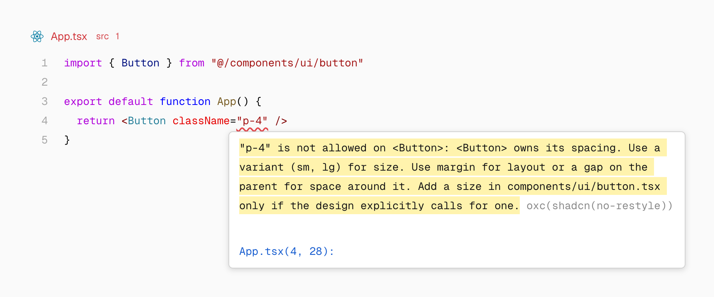
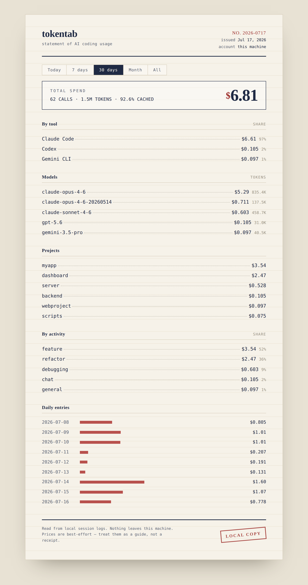

# 十个项目｜实用证据与热度证据分开看

本期比较23个近期候选，检查代码、许可、版本和最小使用路径。fast-jev-compaction与shadcn/lint同时有近期Star增长及外部开发者的具体反馈；其余按新近可复用实现入选，不因为总Star高就自动标热门。

已在本机给tokentab运行独立的合成日志样本；其他项目为源码与作者文档核验，未安装到日常工作环境。项目创建日期、版本发布日期与今天的抓取日期分别记录。

| 任务 | 项目 | 先检查的条件 |
| --- | --- | --- |
| 精简Agent历史中的旧工具结果 | fast-jev-compaction | 外部判断服务、错误删除的代价 |
| 让Agent遵守组件设计约束 | shadcn/lint | Tailwind v4与规则覆盖 |
| 多台Agent共享有版本的技能 | Skillbox | Docker、数据库、客户端权限 |
| 用多个网络下载大文件 | Plexo | Range支持、网络路由、预发布状态 |
| 用可视化入口接触AI编码 | QCode | Windows预览与自行配置模型 |
| 管理多个Agent工作线程 | Herdr Projects | Herdr、Rust与本机常驻条件 |
| 把界面草图写成实现提示 | M3E Canvas | 输出仍需编码与验证 |
| 汇总本地Agent token记录 | tokentab | 日志格式、价格表、重复记录 |
| 让跨会话记忆保留可读文件 | agent-memory | Python、宿主Agent、来源记录 |
| 浏览器页面操作与文档产出 | PawWork | Chrome开发者模式与自备模型 |

## 01 · fast-jev-compaction：保留原话，筛掉不再需要的工具结果

近期热门讨论＋新近实用。9月17日新公开上下文压缩库与Claude Code插件。 版本／仓库日期：2026-09-17。

它配对工具调用和结果，再让Jev判断保留结果、仅保留调用或删除整对；留下的内容保持原文，用户和助手文本不在最终输出中被重写。适合研究“摘要丢了路径和错误信息”的问题，但原文保留不等于删得一定正确。

作为npm库接入需TypeSafe服务或自备传输实现；插件依赖Claude Code函数钩子的早期功能。评分请求会携带会话文本与工具输入，并不是完全本地压缩。失败时回退逻辑和历史备份必须一起评估，本站未调用服务。

GitHub日桶显示9月17–19日新增4208 Star；[外部开发者反馈](https://github.com/tamaratran/fast-jev-compaction/pull/61)指出“可重新读取”不代表“当前不需要”，并提出另一种问题表述。两类信号支持近期受到关注，也暴露了方法局限；该提议不等于已经合入默认行为。

[源码与上手说明](https://github.com/tamaratran/fast-jev-compaction) · [MIT](https://github.com/tamaratran/fast-jev-compaction/blob/main/LICENSE) · 当前主分支，未见正式Release。

## 02 · shadcn/lint：把设计约束变成Agent能修正的错误信息

近期热门讨论＋新近实用。9月新公开规则工具，9月17日发布0.1.1。 版本／仓库日期：2026-09-17。

它在Tailwind v4项目中检查颜色、任意值、内联样式和组件外观约束。例如按钮内部间距由组件掌管时，页面直接加p-4会得到解释和可用size建议，减少AI改完一处又破坏设计一致性的情况。无需先采用shadcn/ui组件库。

可接ESLint9.30+或Oxlint1.80+，Node20.19+；先写一条组件约定，再运行检查。规则只能覆盖可分析代码与配置，不证明页面可用或视觉一定正确。原图展示诊断怎样关联到修复方向。

本周Star日桶新增2174；[独立用户的问题记录](https://github.com/shadcn-ui/lint/issues/36)给出CSS注释导致主题识别异常的具体复现。两类信号支持近期关注，同时说明解析边界仍在修补。本站读了规则实现，未在真实产品运行完整设计检查。

官方诊断原图：错误指出Button的间距由组件拥有，并提示使用已有size。它说明规则如何提供修改方向，不是网页视觉质量的自动评分。（[来源原图](https://github.com/shadcn-ui/lint)；[查看大图](images/shadcn-lint.png)。）

[源码与上手说明](https://github.com/shadcn-ui/lint) · [MIT](https://github.com/shadcn-ui/lint/blob/main/LICENSE) · @shadcn/lint@0.1.1。

## 03 · Skillbox：自建有版本与权限的技能库

新近实用，热度待验证。9月17日UTC创建仓库，北京时间18日。 版本／仓库日期：2026-09-17。

Skillbox把技能文件存为可管理的库，保留不可变修订、冲突检查和恢复能力，再通过MCP或客户端工具提供给Agent。适合几台机器共用一套技能，同时追踪某次行为究竟使用哪个版本。它管理和分发文件，本身不执行上传技能代码。

最小路径是Docker Compose启动服务，建立技能与授权配置，再为客户端创建单独连接。需Bash、Docker以及持久数据库；可选Jev推荐另需自己的服务密钥，基础库不必因此绑定收费模型。已核对文件校验与版本实现，尚未部署。

项目采用MIT，适合愿意维护服务的小团队。新实例从空库开始，实际内容和权限仍需整理；备份不只包括技能文本，还要按文档处理数据库及服务配置。

[源码与上手说明](https://github.com/kitze/skillbox) · [MIT](https://github.com/kitze/skillbox/blob/main/LICENSE) · 当前主分支，未见正式Release。

## 04 · Plexo：多个网络共同下载同一个大文件

新近实用，热度待验证。9月15日创建，9月19日发布1.0.0-rc.7预览。 版本／仓库日期：2026-09-19。

Plexo把文件拆成8MB范围请求，让Wi-Fi、以太网或手机共享网络分别取块，再按顺序合并。下载模型与数据集时，输入仍是文件URL，输出仍是完整文件；收益取决于各网络、服务器限速和磁盘，并非多连一条网线就固定翻倍。

可用当前预发布包或按源码以Node22.12+运行。服务端若不支持Range，会回到单连接。9月19日rc.7专门修复Linux多网络路由，要求内核5.7+；README中“暂无预编译包”已落后于实际Release，应以版本资产为准。

MIT。断点续传会检查ETag和修改时间，但长度检查不等于发布者的密码学摘要验证，重要权重仍应比对官方哈希。本站检查下载实现与上游测试设计，未做多网络速度实测。

[源码与上手说明](https://github.com/anmolkapil/plexo) · [MIT](https://github.com/anmolkapil/plexo/blob/main/LICENSE) · v1.0.0-rc.7（预发布）。

## 05 · QCode：用角色和场景组织AI编码入口

新近实用，热度待验证。9月14日创建，本周提供Windows便携预览。 版本／仓库日期：2026-09-18。

QCode把项目、对话与文件入口放进可探索的小岛：Q负责对话与执行，其他角色连接项目历史和文件查看，高级工作台仍展示工具与人工确认。对刚接触AI编码的人，这种组织方式可能更直观；教育引导和更多玩法仍有规划内容，不能都写成已完成课程。

目前公开Windows x64便携预览；macOS可走源码开发，便携包尚未发布。源码要求Node22.19或24+、Git子模块，导出世界还涉及Godot4.7.2。用户需自行配置模型和项目工具，预览包未签名、无自动更新。

MIT核心，底层使用固定版本的DeepSeek Harness。下图为作者当前界面；本站核对桥接协议和版本说明，未运行模型或教学流程，也未验证这种交互能提升学习效果。

作者当前小岛界面：角色是项目、文件和执行的入口。它帮助理解交互组织，不代表规划中的全部教学内容已实现。（[来源原图](https://github.com/Qiuner/QCode)；[查看大图](images/qcode-island.png)。）

[源码与上手说明](https://github.com/Qiuner/QCode) · [MIT](https://github.com/Qiuner/QCode/blob/master/LICENSE) · v0.1.0-preview.2（预发布）。

## 06 · Herdr Projects：把多个Agent任务放进可追踪线程

新近实用，热度待验证。9月18日创建的Herdr项目协作插件。 版本／仓库日期：2026-09-18。

插件用一个协调会话组织任务，各线程在自己的Git worktree与分支工作，状态分为工作中、待回复、待审查等。统一说明和项目记忆进入任务简报，减少手动反复交代背景。它安排工作，最后如何合并仍需要检查结果与冲突。

最小路径是安装Herdr插件、创建项目，再通过协调会话提出任务；要求macOS或Linux、Herdr0.9.1+、Rust/Cargo、Git和可用Agent CLI。本次公开源码已成功取得，但README安装段仍残留私库访问提示，完整安装成熟度待验证。

MIT。已读线程记录和状态实现，未启动多Agent任务。图示中的分支隔离不能阻止Agent越权执行任意shell操作，记忆传播也会传播错误，实际使用应检查任务简报与权限范围。

作者流程图：一个协调入口对应多条任务线程，最后按是否需要用户处理分组。图示说明任务管理，不承诺自动无冲突合并。（[来源原图](https://github.com/eliasstravik/herdr-projects)；[查看大图](images/herdr-threads.svg)。）

[源码与上手说明](https://github.com/eliasstravik/herdr-projects) · [MIT](https://github.com/eliasstravik/herdr-projects/blob/main/LICENSE) · 当前主分支，未见正式Release。

## 07 · M3E Canvas：先画界面与跳转，再交给编码工具

新近实用，热度待验证。9月2日新项目，作为近30天实用补充。 版本／仓库日期：2026-09-02（近期补充）。

M3E Canvas在浏览器里拖放Material3 Expressive组件、连接页面跳转，再把结构、样式与行为导出为提示词。输入是界面草图，输出是给编码工具的实现说明；它本身不会自动保证生成的应用与设计一致。可先打开官方演示，画两个页面并检查跳转，再复制提示。

基础画布在浏览器本地保存，不需要后端；可选AI辅助需自备服务密钥。源码采用MIT，已检查提示导出如何表示组件位置和图片等信息。导出后仍要验证响应式布局与交互。

9月13–19日新增1189 Star，前一UTC周为2437，关注仍在但增速放缓，不能把7539总Star写成今日爆发。近期用户也报告图标从提示到Android实现时出错，说明输出是可检查的交接材料，不能直接视为完成品。本站未生成应用。

[源码与上手说明](https://github.com/lnkiai/m3e-canvas) · [MIT](https://github.com/lnkiai/m3e-canvas/blob/main/LICENSE) · 当前主分支，未见正式Release。

## 08 · tokentab：从本地日志分清token用在哪里

新近实用，热度待验证。9月7日公开的本地统计工具，作为近30天补充。 版本／仓库日期：2026-09-07（近期补充）。

tokentab读取Claude Code、Codex和Gemini CLI留在本机的记录，按模型、项目、日期汇总；Cursor目前只是未完成的接入占位。可从源码运行CLI或本地Web面板，主要依赖Python与rich，无需统计服务账号。

本期实际运行Claude解析器的合成样本：三行日志包含一条重复消息，输出两条唯一记录；输入140、输出25、缓存读50、缓存写10，均与预设一致。[验证源码](code/check-tokentab.py)与[运行结果](code/tokentab-check.json.txt)只验证这个解析路径，未读取个人日志，也未核对真实账单。

MIT。金额来自维护者手写价格表，未知模型、过期单价和套餐计费都可能使它与实际付款不同；活动类型也只是规则猜测。图中是作者面板示例，不能当成本站花费。

作者本地面板示例：先看时间与项目，再分解输入、输出及缓存。展示金额为示例，本站验证的是合成日志解析，不是这些账单。（[来源原图](https://github.com/crwdla/tokentab)；[查看大图](images/tokentab-dashboard.png)。）

[源码与上手说明](https://github.com/crwdla/tokentab) · [MIT](https://github.com/crwdla/tokentab/blob/main/LICENSE) · 当前主分支，未见正式Release。

## 09 · agent-memory：检索先给路径，记忆仍是普通文件

新近实用，热度待验证。9月1日UTC创建，作为近30天方法补充。 版本／仓库日期：2026-09-01（近期补充）。

这个记忆运行时以Markdown为事实存储，SQLite作为可重建检索缓存。查询先返回路径、摘要与分数，Agent再按需要读提纲或全文，适合跨会话保存项目决策和来源，减少每次把所有记忆塞进上下文。

要求Python3.12+并接入宿主Agent，最小体验可从独立记忆目录写入少量有来源的材料，再运行mem recall与mem read。检索无需联网模型，整理和判断仍可借用宿主CLI，因此“无需额外API key”不等于所有操作没有模型成本。

MIT。已有检索排序、有效期与历史路径实现；后台整理的删除被设计为待确认提议，但记忆内容是否正确仍需验证。作者有受限LongMemEval实验，本站未复现，也不把局部对照外推成长期记忆问题已解决。

[源码与上手说明](https://github.com/tigerless-labs/agent-memory) · [MIT](https://github.com/tigerless-labs/agent-memory/blob/main/LICENSE) · 当前主分支，未见正式Release。

## 10 · PawWork：在已登录浏览器里处理页面与文档

新近实用，热度待验证。8月28日创建，9月16日1.1.0新增页面内等待机制。 版本／仓库日期：2026-09-16。

PawWork是Chrome侧栏Agent，能操作当前页面，并在会话中保留表格、文档和HTML产物。1.1.0新增sys.waitFor，把“等流式输出完成或某个控件出现”的轮询放在页面内，减少反复短调用与手动等待；这是本次值得看的一项具体变化。

它是加载已解压目录的MV3扩展，不在商店发行。需要Chrome135+，部分用户脚本能力需在138+开启相应选项，自备兼容模型密钥。最小路径是加载扩展、配置模型，在普通网页上做一个可核查的小任务；受限浏览器页面不可用。

MIT核心，第三方组件另列许可。已核对会话工作区实现与Release，本站未在个人登录页面运行。它会以浏览器已有身份访问内容，页面操作和产物质量都应逐项验证，不能把能调用脚本视为任务必然可靠完成。

[源码与上手说明](https://github.com/Player-YN/PawWork_ZhuaZhua) · [MIT](https://github.com/Player-YN/PawWork_ZhuaZhua/blob/main/LICENSE) · v1.1.0。
