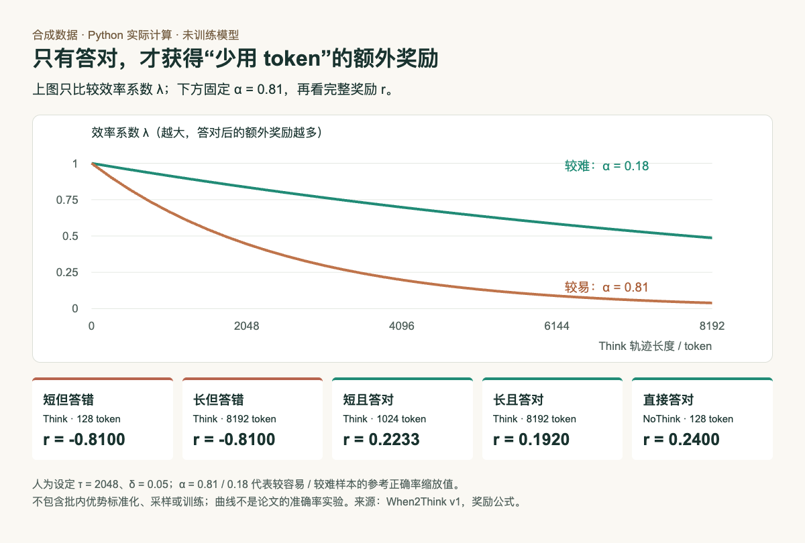

# 先答对，再讨论推理 token 的节省

本篇已在本机Python 3.14.3 执行，只用标准库。数据由我们人为设定，用来理解[When2Think论文](https://arxiv.org/abs/2609.19671v1)的奖励公式；没有调用模型、采样答案或训练权重，不是论文复现。

## 从一个容易误解的问题开始

如果只奖励短答案，模型可能迅速给出错误结果，仍拿到“省token”的好处。论文把效率奖金乘上正确性信号：只有验证器判对，奖金才生效。

记V为是否答对，L为轨迹长度，α为参考模型正确率的缩放值，τ为参考平均长度，δ控制奖金大小。Think模式中λ = exp(−Lα/τ)，NoThink模式中λ = 1；完整奖励为r = V × (1 + δλ) − α。α越大表示参考模型越容易答对，不能把它误读成难度越高。

```python
import math

def reward(correct, length, alpha, tau, delta=0.05, think=True):
    efficiency = math.exp(-length * alpha / tau) if think else 1.0
    return int(correct) * (1 + delta * efficiency) - alpha
```

这里设τ=2048、δ=0.05，以α=0.81和0.18示意较易与较难题。实际论文的统计来自参考采样；本实验没有进行那一步。曲线只比较效率系数，不把不同题目的原始奖励直接当成统一排名。




上半图比较λ，下半图固定α=0.81看完整奖励：两种错误答案均为−0.81；答对后短轨迹才获得更多奖金。Python实际计算合成值，HTML/JS绘图，非论文实验曲线。（[公式来源](https://arxiv.org/abs/2609.19671v1)；[查看大图](images/when2think-rewards.png)。）


## 运行与核对

下载[Python完整源码](code/when2think-demo.py)，在一个空目录运行：

```bash
python3 when2think-demo.py
```

无需第三方Python依赖，会生成JSON计算结果与可单独打开的HTML图。本站保存[实际结果](code/when2think-results.json.txt)和[HTML/JS绘图源码](code/when2think-chart.html)。PNG由浏览器渲染该HTML得到，数字与曲线都来自同一结果对象。

| 人为设定的轨迹 | token数 | 完整奖励r |
| --- | --- | --- |
| Think，答错 | 128 | −0.8100 |
| Think，答错 | 8192 | −0.8100 |
| Think，答对 | 1024 | 0.2233 |
| Think，答对 | 8192 | 0.1920 |
| NoThink，答对 | 128 | 0.2400 |

实际断言检查了错误轨迹的长度不改变奖励，以及同一题、同为正确时短Think高于长Think。原始精度保存在JSON，表格四舍五入到四位。

## 能说明什么，不能说明什么

这里能验证公式没有单独奖励“短但错误”，并直观看到难题的效率系数衰减更缓。它不能证明模型一定学会合理分配推理，也没有模拟首次模式采样、批内优势标准化或优化过程。

真实训练还需要好的验证器、足够的参考样本和合理的δ。验证器误判、参考统计偏差以及过早偏向NoThink，都可能改变实际效果。想进一步复现，应先固定数据、模型和采样协议，同时报告正确率、长度、预计算成本及训练开销，不能只展示减少了多少token。
