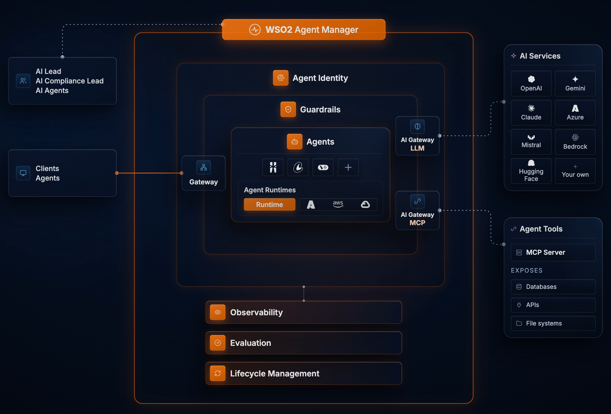

# AI 动态｜图像编辑、长任务模型与 Agent 运行条件

今天15条，前5条重点详解、后10条速读。按重要发布、具体能力变化与可核验采用情况选择；没有两类独立近期信号的条目不标“热门”。过去报道过的模型、重复转载和一般教程已排除，保留事件原日期。

## 01 · Qwen-Image-2.1：把多图编辑与透明素材放进同一流程

2026-09-20 · 近期热门＋新近实用。已核原始公告/文档；本站未运行。

Qwen发布图像生成与编辑模型2.1，开放权重和推理入口。值得关注的变化是原生RGBA透明背景、最多十张参考图、圈选或遮罩控制局部编辑，以及原生2K输出。它让“生成背景、保留人物、替换商品、提取主体”这些步骤更接近一个统一流程，而不是每次生成后再交给不同工具修补。

对设计素材任务，透明通道尤其具体：输出可以保留透明区域，便于继续合成。多参考输入则允许同时指定人物、服装、鞋包等不同约束。官方示例能展示接口与目标效果，但不等于每次都能保持全部细节；若用于真实商品，仍要逐项核对标识、结构和文字。下面采用官方输入—输出示例，帮助看清“参考多张图”到底指什么。

工程上，7B指视觉生成组件，不能理解成整个流水线只有7B。模型把文本指令、参考图与目标图放入混合粒度注意力；启用相应因果条件时，指令和参考图只需在首次去噪计算，后续复用缓存，目标图仍逐步更新。提示改写器另有Qwen3.5-VL-9B组件，加载成本不能忽略。

Diffusers、ComfyUI、SGLang等已提供接入路径。HN有具体讨论，Diffusers也出现实际适配，这支持“发布后正在受到关注和采用”，尚不足以证明长期持续热度。研究者可先固定几组人物与产品参考图，检查身份、局部修改、透明边缘及显存；不宜只看精选样图判断成功率。

最容易忽略的是许可：本版采用Qwen Research License，仅限非商业研究或评估，商业用途需要另行许可。不能沿用对其他Qwen版本的Apache印象。本站未运行生成或测量显存；具体运行依赖与组件卸载方式以本版示例为准。随图保留[研究许可](code/qwen-research-license.txt)与[版权声明](code/qwen-NOTICE.txt)。

左列为五张参考，右侧为官方生成结果。图解释输入与输出关系，属于精选演示，不是本站的成功率测试。（[来源原图](https://github.com/QwenLM/Qwen-Image-2.1)；[查看大图](images/qwen-multi-reference.png)。）

纵轴Q、横轴K。上方条件区计算一次并复用，底部目标图区域逐步更新；灰格是被屏蔽的注意力位置，不能把全图理解成每一步都重算。（[来源原图](https://github.com/QwenLM/Qwen-Image-2.1)；[查看大图](images/qwen-architecture.png)。）

[原始来源](https://github.com/QwenLM/Qwen-Image-2.1)

## 02 · Step 5 Preview：长上下文与长任务能力进入 API 预览

2026-09-20 · 新近进展；热度待验证。已核原始公告/文档；本站未运行。

阶跃星辰发布Step 5 Preview，主打复杂知识工作与长程Agent任务。官方给出的规模是600B总参数、27B激活参数，支持原生视觉和百万token上下文。现在可用的是API预览；公告把开放权重日期写为10月15日，不能把未来计划当成今天已经能下载和本地部署。

这次重点不只是能放进多少文字，而是模型能否围绕同一个目标连续检索、处理数据并交付结果。官方展示了跨地点、多年份气候资料的搜集与表格整理，也展示较复杂的金融工作簿。这类演示让“长任务”有了具体形态：输入一个研究目标，中间调用工具，输出可检查的文件。它们仍是厂商选择的案例，不代表无人监管即可稳定完成任意同规模项目。

读基准时尤其要避免拿一个高分概括所有能力。官方表中Step 5的DeepSWE为67.7，但Terminal类任务没有全面领先；不同Agent脚手架、工具权限和预算也会改变结果。百万上下文表示容量上限，不能直接推导为在全窗口内信息都同样可靠，更不能由激活参数推导出普通显卡的部署需求。

对研究和开发读者，比较合适的试用方式是准备一个有明确验收项的长任务，例如整理一组公开材料并生成引用可追溯的表格。先限制工具范围和调用预算，逐项检查漏项、错误引用、途中恢复和最终文件完整性，再决定是否接入自己的流程。这个建议是编辑设计的验收方法，本站没有执行其云端API。

[Vercel AI Gateway的模型页](https://vercel.com/ai-gateway/models/step-5-preview)已列出9月20日的服务入口；公开社区也有讨论，但目前没有足够的长期使用与独立复现数据。此次按新近能力与可用API入选，性能结论保留为官方测评，权重发布计划后续还需再次核实。

[原始来源](https://www.stepfun.com/step-5-preview)

## 03 · 星辰 Xing4.0：29B 总参数、4B 激活的开放模型

2026-09-17 · 近期补充 · 新近进展；热度待验证。已核原始公告/文档；本站未运行。

中国电信星辰团队开放Xing4.0-29B-A4B。它以29B总参数、约4B激活参数组织混合专家模型，原生上下文256K，可扩展至512K。这里的稀疏激活减少每个token参与计算的部分，但全部专家权重仍需要存放；“只激活4B”不能读成只要为4B参数准备内存。

模型把mHC、MLA与MTP放进同一架构：前者调整层间信息通道，MLA压缩注意力缓存表示，MTP提供多token预测相关能力。对读者更实用的理解是，计算、缓存与层间传递分别有优化位置，不能将三项名称相加就得出统一提速倍数。哪些路径在具体推理后端可用，要看对应实现。

另一项有意义的公开信息是训练栈：团队采用MindSpore和昇腾910C，给出相对开箱配置的吞吐优化结果。该比较描述同一平台的工程优化，并非和其他GPU的同条件对比。若研究国产训练栈，这些配置与训练经验比一个脱离条件的总分更值得继续查看。

使用上，官方给出Transformers、自定义模型代码以及SGLang、vLLM、KTransformers等路线。权重与仓库采用Apache-2.0，开放范围比限制研究用途的模型更宽。文档中的单张3090路径依赖量化与相应运行方式，不能照搬为BF16完整模型的硬件需求；长上下文还会额外增加运行开销。

它适合希望研究稀疏模型、长上下文或昇腾训练实现的开发者。上手时先用短输入验证模板、输出与后端版本，再逐步扩大上下文，并把量化带来的质量变化单独测试。本期依据模型卡、代码仓库和发布记录整理，未运行权重，也没有取得足以认定持续热门的独立使用趋势。

[原始来源](https://huggingface.co/XingChen-AGI/Xing4.0-29B-A4B)

## 04 · WSO2 Agent Manager 正式可用：把 Agent 身份与运行记录管起来

2026-09-15 · 近期补充 · 新近进展；热度待验证。已核原始公告/文档；本站未运行。

WSO2宣布Agent Manager正式可用，聚焦企业里多个Agent的身份、工具权限、运行与观测。它要解决的具体问题是：当不同团队使用不同框架开发助手后，谁能访问哪些数据、一次工具调用代表谁、异常时如何暂停，以及事后如何追溯，往往分散在各自代码中。

平台把Agent本身的业务逻辑与公共管理能力分开。每个Agent及运行环境可以有自己的身份，委托关系与令牌交换用于界定其代表谁行事；MCP和模型流量经过相应网关与策略检查。身份验证回答“你是谁”，授权还需回答“这一步可以做什么”，两者都不能由模型在提示词里自行决定。

GA公告同时强调隔离运行环境、MCP治理和生命周期管理。企业可把Agent放在平台运行，也可接入运行在其他环境的Agent，逐步从开发、预发布走向生产。OpenTelemetry轨迹与评估帮助把模型调用、工具操作和异常串起来，方便检查真实流程，而不是只看最后一句回答。

官方提供四十余项内置保护规则及自定义评估，但规则数量不是无故障的保证。涉及敏感字段、URL和内容的检查，需要根据任务配置并持续验证；不同环境的凭据、网络和业务权限也仍由部署者管理。较实际的试点是选一个已有明确权限边界的内部流程，检查授权、暂停和审计链是否完整。

产品提供自托管与托管选择，核心以Apache-2.0开放。本站核对的是正式发布及公开产品文档，没有部署集群或验证企业规模运行。它按近期实用进展入选：新增的是可采用的治理与运行方案，不是基础模型能力提升，也不代表接入后自动获得任何合规认证。

官方架构动画第27秒的原始画面。先看中部Agent与运行时，再看身份、网关和业务资源的连接；这是产品设计关系，不是本站部署截图。（[来源原图](https://wso2.com/agent-platform/agent-manager/)；[查看大图](images/wso2-architecture.png)。）

[原始来源](https://wso2.com/about/news/wso2-agent-manager-sovereign-ai-governance/)

## 05 · Optimum Intel 2.2：导出、量化与推理运行时一起更新

2026-09-18 · 近期补充 · 新近进展；热度待验证。已核原始公告/文档；本站未运行。

Optimum Intel发布2.2，与OpenVINO 2026.4及相关GenAI、NNCF版本协同更新。它面向希望把Hugging Face模型接入Intel硬件的开发者：模型导出、权重量化和实际生成分别由不同组件承担，升级时必须看整条链路，不能只替换一个包就假设所有新模型都自动可用。

可以把流程理解为三个阶段。先把支持的模型导出为OpenVINO能够读取的表示；再按需要使用NNCF压缩权重、选择精度；最后交给OpenVINO或GenAI接口执行。新的语言、视觉和音频模型支持扩展了这条路线，但CPU、GPU和NPU的算子与模型覆盖并不完全一致，具体任务还要回查支持表。

推理侧加入DFlash及多token预测头等能力，GenAI也改进Mamba2的状态管理。这些技术各有适用前提：推测解码需要配套草稿或预测结构，状态分页服务于相应模型；不能把一个架构的收益套给所有模型，更不能将发行说明直接当成统一吞吐测试。

多模态链路还新增分阶段性能信息，方便分清时间花在图像编码、语言生成还是其他环节。音频方面有Node.js的ASRPipeline入口，对需要把本地转写接入应用的开发者更直接。它们的价值是让模型更容易接入、诊断与维护，而不是保证在任何设备都比既有实现快。

上手时应固定模型版本、导出参数、运行设备与量化目录，先完成一段输入到输出的验证，再比较首轮和稳态延迟、质量变化。官方示例与[2.2.0发布记录](https://github.com/huggingface/optimum-intel/releases/tag/v2.2.0)可作起点。本站未安装新运行栈或测量性能；本次按近期可复用工程更新入选，热度仍需后续独立使用证据。

[原始来源](https://huggingface.co/blog/echarlaix/optimum-intel-v22)

## 06 · 剪映 Hub 与小剪助手：从创意画布走向可继续编辑的时间线

2026-09-20 · 新近进展；热度待验证。已读现场报道并检查官方主页；未运行，开放范围未完整核得。

量子位的发布会现场报道显示，剪映公布Hub画布与小剪助手：脚本、素材和分镜可在画布组织，再进入多轨时间线继续修改，助手负责自然语言操作与重复流程。实际意义在于生成后的素材仍能进入编辑流程。官方主页可确认AI创作方向，但本期未找到逐项上线范围与价格细则；此处按现场报道表述，不写成所有账号已可用，也未实测。

[原始来源](https://www.qbitai.com/2026/09/492973.html)

## 07 · Qwen Audio 3.1 Realtime Plus 进入国际服务目录

2026-09-20 · 新近进展；热度待验证。已核原始公告/文档；本站未运行。

阿里云模型目录新增国际范围的qwen-audio-3.1-realtime-plus，列出262144上下文、全双工交互，以及函数调用、联网检索和声音克隆等能力，延续3.0 Plus的协议并增加音色。今天的新事实是该服务目录与可用范围变化，不把它写成全新语音架构。接入者应核对所在地域、账户权限与具体接口限制；本站未调用实时语音服务。

[原始来源](https://www.alibabacloud.com/help/zh/model-studio/newly-released-models)

## 08 · CUA-S1 Forms：让小模型只负责表单中的有限选择

2026-09-19 · 近期补充 · 新近进展；热度待验证。已核原始公告/文档；本站未运行。

CUA-S1 Forms开放约70.6万参数的表单决策权重与代码：对每个界面元素，在抽取出的字段值及check、click、skip中评分，由外部代码安排执行顺序。作者报告196次真实示例决策全对，但仅覆盖三个表单和三份PDF，不能据此推广到任意网站。它的实用研究点是把任务收窄为有限选项，而非让模型自由生成操作；MIT许可，本站未运行。HF现有权重，仓库较早的“仅源码”卡片不能代替当前状态。

[原始来源](https://huggingface.co/cua-ai/cua-s1-forms)

## 09 · Claude 企业审计 API 扩展到本地 Chrome 会话

2026-09-18 · 近期补充 · 新近进展；热度待验证。已核原始公告/文档；本站未运行。

Anthropic发布说明为Compliance API加入本地Claude in Chrome会话的读取接口，处于企业Beta范围。已有Compliance Access Key还需要相应用户数据读取权限，才能取得对应会话记录。对企业管理员，这补上浏览器Agent进入工作流后的审计入口；它并非开放访问任意用户的浏览器历史，也不是普通API密钥自动拥有的能力。本站只核对接口发布与权限要求。

[原始来源](https://platform.claude.com/docs/en/release-notes/overview)

## 10 · smartARM 原型：用视觉线索选择假肢抓握方式

2026-09-16 · 近期补充 · 新近进展；热度待验证。已核原始公告/文档；本站未运行。

Meta介绍smartARM的仿生假肢原型：掌部摄像头配合DINOv2表示，以少量参考图识别对象并辅助选择抓握；团队也探索通过Meta AI眼镜和设备接口获得第一视角。研究价值是将视觉感知连接到具体动作选择，而非只做物体分类。当前依据为团队原型和厂商报道，没有本期独立临床结果，不能把演示理解为已证明适用于所有使用者的成熟医疗方案。

[原始来源](https://about.fb.com/news/2026/09/canadian-start-up-smartarm-uses-ai-to-create-intuitive-bionic-prosthetics/)

## 11 · Epoch 调查：接近每天使用 AI 的自报比例上升

2026-09-14 · 近期补充 · 新近进展；热度待验证。已核原始公告/文档；本站未运行。

Epoch比较美国成人3月与8月两次调查：每周使用AI六至七天的自报比例由8.2%升至18.7%。两轮分别约2017人与1016人，并作人口加权；这不是追踪同一批人的留存，也不是服务商后台活跃用户。两轮提问口径存在差别，精确涨幅需谨慎解读。它提供近期使用频率的调查线索，但不能直接证明某个项目热门或某种模型实用。

[原始来源](https://epoch.ai/data-insights/near-daily-ai-use-doubled)

## 12 · OpenAI 发布澳大利亚青少年 AI 安全蓝图

2026-09-18 · 近期补充 · 新近进展；热度待验证。已核原始公告/文档；本站未运行。

OpenAI公布面向澳大利亚的青少年AI安全蓝图，围绕AI素养、适龄保护、保护隐私的年龄确认、现实危机支持和家长控制等六项支柱提出方案。对教育产品开发者，值得看的是保护措施如何进入产品设计与责任分配。蓝图属于政策与产品原则文件，不是新生效法规；文中提到8月已开始推出的青少年体验，也不能重新算成9月18日首次上线。

[原始来源](https://openai.com/index/australian-youth-safety-blueprint/)

## 13 · IBM ALTK-Evolve：把一次成功和多次稳定分开评估

2026-09-15 · 近期补充 · 新近进展；热度待验证。已核原始公告/文档；本站未运行。

IBM介绍consistencyAnalyzer：从已有执行轨迹中选择决策位置重复采样，分析不一致原因，再生成指导规则。AppWorld作者实验里，平均成功率与连续五次都成功的指标差距明显；规则改善了重复运行的一致性，但仍需检查相似任务是否受益。这里的Pass^5是五次全成功，不能读成Pass@5至少成功一次。本期实践用合成数据演示这种差别，未复现其Agent实验。

[原始来源](https://huggingface.co/blog/ibm-research/altk-evolve-consistency)

## 14 · 华为发布企业智能体白皮书：把智能层接回业务执行系统

2026-09-18 · 近期补充 · 新近进展；热度待验证。已核原始公告/文档；本站未运行。

华为发布企业智能体相关白皮书，以数据、基础设施、模型、Agent与知识组织能力，并提出智能层与IT/OT业务执行层协作的架构。对建设企业助手的读者，关键是模型规划要连接有权限、可记录和可追责的执行系统。当前材料属于框架与建设方法，不能视为统一产品已交付，也不能把案例或愿景换算成企业普遍可获得的收益；本站未验证实际部署。

[原始来源](https://e.huawei.com/cn/news/2026/solutions/computing/agentic-enterprise)

## 15 · 儿童医院分享开源心脏建模工作流的进展

2026-09-15 · 近期补充 · 新近进展；热度待验证。已核原始公告/文档；本站未运行。

NVIDIA报道费城儿童医院结合MONAI、Auto3DSeg与SlicerHeart，把既有影像转成个体化心脏模型，供专业团队分析和规划。文章展示的是近期披露的实际使用进展，相关工具与研究已持续多年，不能写成今天新发明。其价值在于开源社区能共同维护小众专业流程；建模速度的厂商叙述不等于已证明临床效果普遍改善，输出仍需专业验证。

[原始来源](https://blogs.nvidia.com/blog/childrens-hospital-open-source-ai-cardiac-care/)
