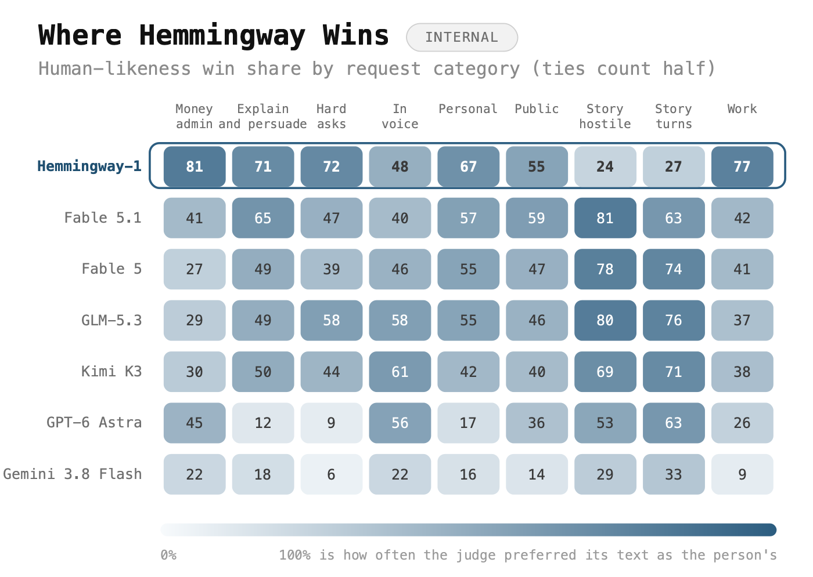
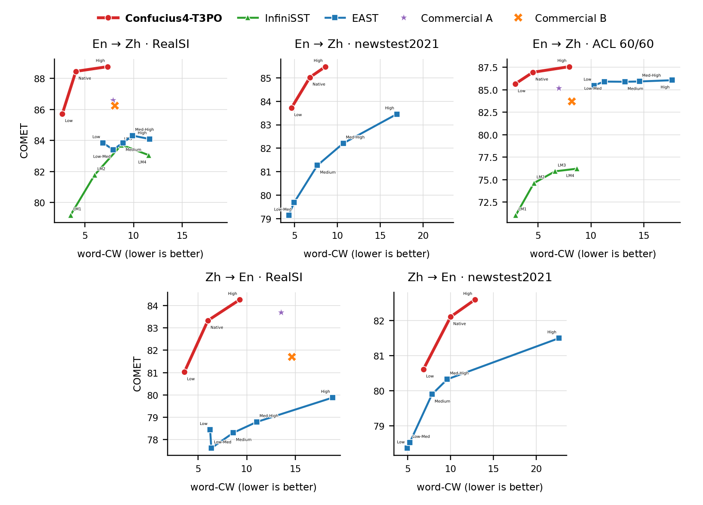
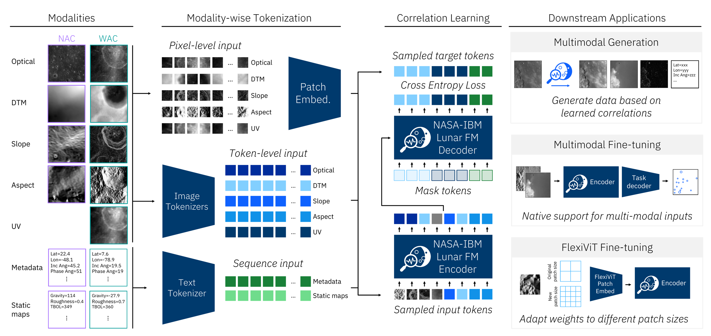

# 六个模型｜先看任务，再看开放条件

本栏沿用“开源模型”导航名，但逐项区分宽松开放许可、受限权重和需要申请的模型。六项覆盖写作、视频加速、低资源语言、表格、同传与月球影像；均未在本站执行推理，不将下载量当成独立用户数。

| 想研究的任务 | 候选 | 首要门槛 |
| --- | --- | --- |
| 英文日常沟通写作 | Hemmingway-1 | 27B规模；内部模型裁判评测 |
| MiniMax-H3少步视频生成 | HyperFlow | 需基础模型；地区及商业许可限制 |
| 非洲语言翻译 | MORENA-1.5B | 分方向检查质量；通用问答较弱 |
| 分类与回归表格任务 | TabPFN 3.5 | 受限申请权重；非生产研究许可 |
| 中英增量文本翻译 | Confucius4-T3PO | 14B模型；语音需另外接ASR |
| 月球多模态影像分析 | NASA–IBM Lunar FM | 专业数据、预处理与微调 |

## 01 · Hemmingway-1：把英文日常沟通作为独立目标

2026-09-20 · 新近实用或研究进展，热度待验证。许可：Apache-2.0。

这是基于Qwen3.8-27B调整的英文写作模型，面向解释、工作沟通和难开口的请求，而非以代码或数学总分为主要目标。模型卡给出262144上下文，但长窗口质量没有因此获得普遍保证。对于研究者，它提供一个“任务风格可以单独评估”的公开权重样本。

作者用80个真实请求构成内部沟通评测，并以模型裁判进行双顺序盲评；另有故事和EQBench等结果。下图最有价值的是分项差异：工作类、日常解释与故事写作表现不同，不能把“更像人”汇总成所有写作都更好。内部题集、裁判偏好和英文分布限制了结论，尚无本期独立复现。

最小使用路径是从模型卡的Transformers或兼容推理示例加载权重，准备一组自己的匿名英文草稿做盲评，同时检查是否改掉事实。27B的BF16参数本身约54GB只是数量级估算，缓存与运行开销另计；量化版本须核对对应发布者。权重开放不意味着私人沟通内容可以随意公开。

作者内部评测原图：数字是裁判偏好比例，平局按一半计；列代表不同任务。重点看同一模型跨列变化，不把小型内部题集的名次当成通用结论。（[来源原图](https://huggingface.co/Altworld/Hemmingway-1)；[查看大图](images/hemmingway-categories.png)。）

[模型卡与权重](https://huggingface.co/Altworld/Hemmingway-1)

## 02 · HyperFlow：用 LoRA 将 H3 视频采样压到八步

2026-09-17 · 新近实用或研究进展，热度待验证。许可：MiniMax H3 Community License（受限权重）；代码Apache-2.0。

HyperFlow是MiniMax-H3的少步生成LoRA，不能单独生成视频。它加入两个时间条件表示当前点与目标区间，将基础模型49次函数评估缩到8次，同时保留文本、首尾帧和参考视频等条件接口。研究重点是用一个适配器覆盖多种输入方式，仍需下载和运行基础模型。

作者在124帧、1344×768、固定seed和dense SDPA条件下，报告四张H200由175秒降到60秒；单张H200配CPU卸载由395秒降到130秒。这里是约2.9–3.0倍端到端生成加速，模型初次加载等约30秒不在该计时内。实际卡是141GB H200，约80GB峰值不能证明80GB卡一定能跑，质量对照也仍待更完整公开。

适配器约2.8GB，加载器与示例可作为复核起点，训练代码未完整公开。权重沿用H3社区许可：美国、欧盟、英国及韩国等地区需另行授权，年收入超过2000万美元的相关商业服务另有要求，公开输出还需标识AI生成。这里介绍可研究的加速方法，不将其称为无限制开源或消费级实时生成。

[模型卡与权重](https://huggingface.co/videorebirth/hyperflow)

## 03 · MORENA：把低资源语言覆盖与能力短板一起公开

2026-09-18 · 新近实用或研究进展，热度待验证。许可：Apache-2.0。

MORENA为从头训练的约1.485B参数模型，覆盖十二种采用拉丁字母书写的非洲语言，以及英语、法语等，默认上下文4096。仓库9月15日建立，模型卡将本版发布日期列为9月18日；本期保留这两个日期的区别。

其价值更接近低资源翻译研究。作者三样本提示实验中，英语译向五种非洲语言的chrF++为45.8，高于所比MADLAD-3B的37.8；反向翻译48.7，低于对照的53.6。方向不同，结论也不同。Belebele约0.309，接近0.25的随机水平，给定事实的完全忠实回答也只有约23%，不宜据此推荐为通用知识助手。

代码提供独立PyTorch实现和加载示例，BF16权重约3GB的量级不含运行缓存。所谓较高工具分数依赖预先填入工具标记，模型通常不会主动选择调用，因此也不应直接用作可靠Agent。若做语言研究，可从双向翻译与母语人工评价开始；已有模型裁判结果不能替代当地使用者的检查。

[模型卡与权重](https://huggingface.co/vamboai/morena-1.5b-instruct)

## 04 · TabPFN 3.5：统一分类回归入口，先核对使用许可

2026-09-09 · 近期补充 · 新近实用或研究进展，热度待验证。许可：TabPFN-3.5非商业、非生产研究许可（需申请）。

TabPFN 3.5把分类与回归放进同一检查点，并提供较快版本和实验性多分类变体。模型通过合成表格预训练，将一部分原本每个数据集重复拟合的工作转移到预训练阶段；使用者仍需提供自己的特征、标签与严格隔离的测试集。字符串、日期和较多特征的支持属于接口能力，不能自动等于任意真实表格都更准确。

上手入口是TabPFN包的类似scikit-learn接口。模型卡允许到两万个特征，但样本数、类别与设备限制应继续按对应版本文档核对，本期没有测出硬件最低要求或稳定延迟，也没有使用卡片中不存在的统一提分数字。

决定能否使用的首先是许可：权重需要申请，条款限制非商业、非生产的测试与研究，结果不得直接用于商业决策、客户交付或付费服务。其开放程度与Apache模型不同。适合先在公开研究数据上比较完整交叉验证流程，避免误把可下载权重当成可直接上线的免费预测服务。

[模型卡与权重](https://huggingface.co/Prior-Labs/tabpfn_3_5)

## 05 · Confucius4-T3PO：在等待与输出之间做同传取舍

2026-09-07 · 近期补充 · 新近实用或研究进展，热度待验证。许可：Apache-2.0。

T3PO是基于Qwen2.5-14B的中英同传文本模型，与先前介绍的语音识别模型R2T2任务不同。它接收不断到来的源文本，在WAIT和TRANS之间决定何时输出：等待时保留尚未处理的缓冲，翻译后将已提交内容加入历史并清空相应缓冲，避免重复提交。

这种设计的难点是尚未看见句尾就做决定。更早输出可能误判语序，等得更久则降低实时性。模型卡给出低延迟、默认及高质量三档，并以COMET质量与词级等待代价作对照；下图展示的是作者的质量—延迟取舍，不是某档在所有输入上都更好。

可先用官方推理示例输入分段中英文本，检查增量结果是否重复、改写已提交内容或长期等待。它不直接完成音频识别，语音同传还需接ASR；中英之外缺少严格评估，训练方法报告仍待进一步公开。14B的BF16参数约28GB只是权重数量级，部署还需缓存与运行空间，本站未运行。

作者原图：纵轴COMET越高越好，横轴词级等待代价越低越好；上排英译中、下排中译英，在不同数据集上比较。需同时看方向、档位与数据集，不能只摘最高点。（[来源原图](https://huggingface.co/netease-youdao/Confucius4-T3PO)；[查看大图](images/confucius-quality-latency.png)。）

[模型卡与权重](https://huggingface.co/netease-youdao/Confucius4-T3PO)

## 06 · NASA–IBM Lunar FM：让不同尺度的月球数据共同学习

2026-09-01 · 近期补充 · 新近实用或研究进展，热度待验证。许可：Apache-2.0。

该模型以ViT-B编码器—解码器为骨架，从约两百万块对齐的SomBench月球数据学习十一类模态，混合NAC米级与WAC百米级数据。地形、光学和观测几何信息共同进入模型，之后可微调用于陨石坑检测、分割与跨模态预测。它不是通用聊天模型，也不应直接处理未经对齐的任意影像。

作者五个种子实验中，WAC陨石坑50%训练数据下，完全微调的mAP为0.2541±0.0018，对照SwinV2-B为0.2313±0.0027；米级NAC任务的差距更小，不能宣布所有任务领先。几何输入与混合分辨率的各自贡献尚未完整消融，生成结果也不等于校准过的科学测量。

权重和TerraTorch相关使用路径公开，可先按配置复现一种下游任务。模型卡里的16张H100、约1100 GPU小时是预训练成本，不是推理最低配置。数据覆盖有区域限制，冰存在性代理并非直接观测，预测高程与绝对数值也需校准；不把实验模型当成着陆规划或科学结论的替代品。

从左到右看：对齐影像与几何信息分别编码，共同进行掩码预测，再接下游任务头。右下FlexiViT表示图块尺寸适配，不代表任意分辨率都已验证。（[来源原图](https://huggingface.co/nasa-ibm-ai4science/NASA-IBM-Lunar-Foundation-Model)；[查看大图](images/lunar-method.png)。）

[模型卡与权重](https://huggingface.co/nasa-ibm-ai4science/NASA-IBM-Lunar-Foundation-Model)
