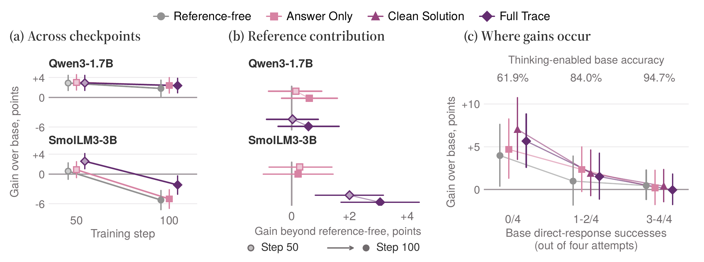
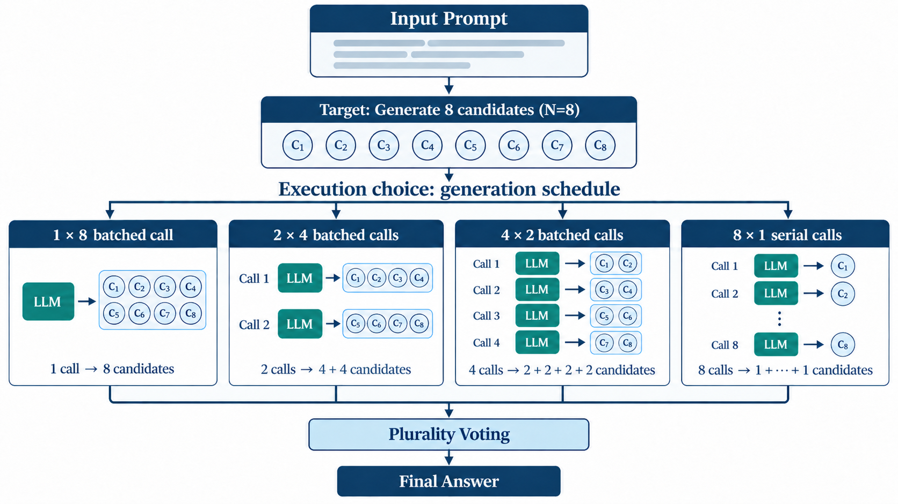
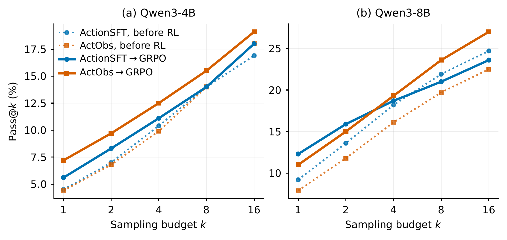
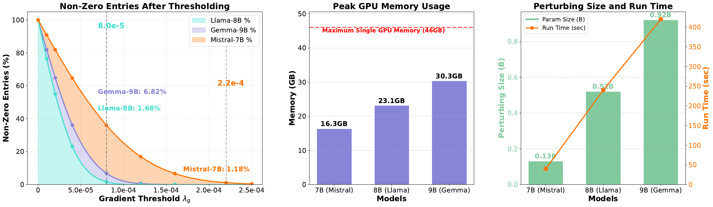
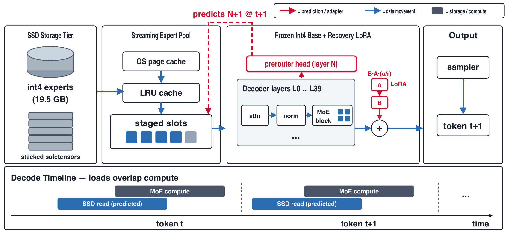
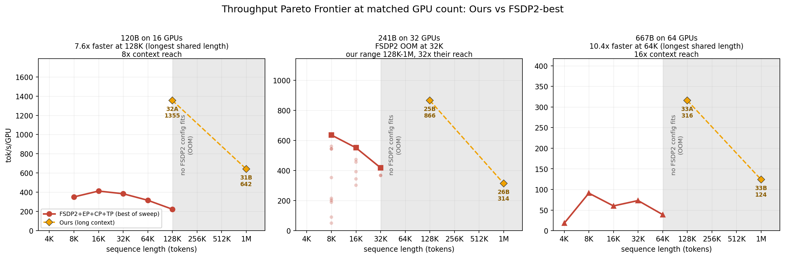

# 六篇论文｜把改进归因到真正发生变化的地方

从带日期的HF论文列表与arXiv近期研究建立候选池，比较主题、摘要和已有收录，再读六篇原文的核心方法、实验与局限。本期集中在蒸馏对照、Agent训练、偏好优化与推理训练系统；没有足够独立证据的论文不标“热门”。

六篇均为预印本，5篇CC BY 4.0、一篇CC BY-NC-SA 4.0；本站保存原版PDF及阅读卡。先看每篇的基线和测量范围，再判断它的结果是否与你的工作有关。

## 01 · OPSD：参考答案究竟带来了多少额外收益

2026-09-17 · arXiv:2609.20612 v1 · 预印本。入选：新近创新，热度待验证。已读核心原文，本站未复现。

论文研究一个容易被忽略的对照：在策略自蒸馏中，教师能看到答案或推理过程，学生表现变好，究竟是这些额外信息起作用，还是即使没有参考信息，蒸馏过程也会改善学生？作者构造Ample-Math，将同一道题匹配到答案、精简解法、完整轨迹等六种信息视图，避免不同信息条件实际上用了不同题目。

实验以5319题构建数据集，主要训练1536题、开发192题、测试384题，并按基础模型表现分层。冻结的教师使用思考模式，学生训练轨迹主要为直接回答；因此“无参考”仍包含跨模式蒸馏，不能理解成教师与学生概率完全相同、理论上应当零收益。

在Qwen3-1.7B、LoRA和100步的条件下，无参考相对基础模型已提高约1.80个百分点；精简解法提高3.10，真正相对无参考的增量约1.30。其未经多重比较校正的区间为0.20–2.41，但六视图Holm校正后不再显著。完整轨迹也没有稳定碾压精简解法。

跨到SmolLM3-3B，完整轨迹相对无参考更好，却可能在100步时两者都低于原始基础模型。换成较长思考轨迹训练，也可能改变甚至反转迁移效果。下图把“比基础模型好多少”和“比无参考多多少”分开，避免把相对较少退步误写成绝对提升。

复现价值在于匹配信息视图、固定停止点并保留无参考基线。结果限于这些小模型、数学题和短程LoRA设置，不证明所有特权信息都无用，也不证明长推理一概有害。训练检查点的选择应独立于测试结果，不能只报告每个条件最好的那一刻。

作者对照图：左侧是相对基础模型的增益，中间才是参考信息超出无参考条件的增量；空心与实心分别为50、100步。右侧按基础直接回答能力分组，误差线不能忽略。（[作者原图](https://arxiv.org/abs/2609.20612v1)；[查看大图](images/opsd-reference-contribution.png)。）

[论文原文](https://arxiv.org/abs/2609.20612v1) · [站内阅读卡](../../../../papers/frontiers/opsd-privileged-information/00-阅读卡.md) · [归档PDF](../../../../papers/frontiers/opsd-privileged-information/2609.20612v1.pdf)

## 02 · 相同八个答案，生成调度仍能改变能耗与延迟

2026-09-16 · arXiv:2609.19499 v1 · 预印本。入选：新近创新，热度待验证。已读核心原文，本站未复现。

多次采样研究常用N表示推理预算，但八个答案可以一次批量生成，也可以分八次串行生成。论文把候选数和执行调度分开，研究同样的逻辑预算在硬件上是否真的花费相同。这里讨论生成阶段，不把验证器或整套Agent的成本混在同一数字里。

作者先在GSM8K上比较不同采样数，再固定N=8，运行1×8、2×4、4×2和8×1四种调度。主调度实验使用Phi-3-mini与Qwen2.5-1.5B、100个提示、三次重复，并控制A100-SXM4 80GB的功率与时钟条件。生成token总量接近，是比较调度的必要检查。

串行相对一次批量的GPU设备能耗比约为4.64和4.86，P95延迟比约为5.77和6.12；换到V100上的短输出SciQ任务，能耗比降到约2.57和3.34。数字随模型、输出长度与硬件变化，说明“同样N”不是通用的物理成本单位。

测量是GPU设备总能耗，包含相应设备基线，并非整台机器插座电量或云账单；现代连续批处理、多用户饱和负载也未由这些实验完整覆盖。一次批量需要更多可用显存，不能简单得出“永远越大批越好”。

这篇最能直接复用的是报告规范：同时写候选数、调用次数、批大小、长度分布、硬件和能耗边界。比较两种推理方法时，先检查这些条件是否匹配，再谈算法节省了多少资源。

作者调度原图：四条路径都产生八个候选，下方使用相同投票步骤。1×8表示一次调用、批内八个；8×1表示八次单个调用。相同答案预算并不意味着相同执行成本。（[作者原图](https://arxiv.org/abs/2609.19499v1)；[查看大图](images/energy-schedules.png)。）

[论文原文](https://arxiv.org/abs/2609.19499v1) · [站内阅读卡](../../../../papers/frontiers/candidate-generation-energy/00-阅读卡.md) · [归档PDF](../../../../papers/frontiers/candidate-generation-energy/2609.19499v1.pdf)

## 03 · ActObs：训练 Agent 时，环境反馈也值得学习

2026-09-17 · arXiv:2609.20715 v1 · 预印本。入选：新近创新，热度待验证。已读核心原文，本站未复现。

很多Agent监督微调只对模型动作计算损失，把工具返回与环境观察屏蔽掉。ActObs同时学习动作和观察：例如执行命令后应看到怎样的结果，也成为训练目标。它复用已有轨迹，不新增数据、参数或前向过程；部署时仍由真实环境产生观察，不让模型编造工具结果。

作者在Qwen3-4B与8B上对比仅动作SFT、动作观察联合SFT，以及先观察后动作的顺序训练，再使用相同GRPO流程。终端评测含89项任务、每项16次尝试，另外在225项aider代码编辑任务上检查迁移。SFT和RL阶段的运行环境不同，因此主要比较各阶段内部的受控对照。

4B模型中，联合监督后的GRPO在单次与多次采样上均较好，aider单次由9.7到13.9，提高4.2个百分点。8B则出现取舍：Terminal单次从12.3降到11.0，16次至少成功一次从23.6到27.0，提高3.4个百分点。只展示多次采样结果，会掩盖单次可靠性下降。

论文用梯度关系、探索与熵的分析解释这种变化，但它们不是部署必然成功的保证。将观察监督简单接在动作训练之前的对照没有复制联合学习的全部收益，也说明仅增加接触环境文字的次数不足以解释结果。

当前代码与数据说明为录用后计划发布，不能当成现成可复现实验包。本期按预印本方法入选。研究者可借鉴的是将“动作质量”“环境预测”和“后续探索”分开测量，同时报告Pass@1与更高采样预算，避免只选对自己有利的指标。

作者绝对成绩曲线：虚线为强化学习前，实线为GRPO后。左侧4B中橙线较好；右侧8B在小预算与大预算发生交叉。纵轴Pass@k表示k次至少一次成功，不是k次全部成功。（[作者原图](https://arxiv.org/abs/2609.20715v1)；[查看大图](images/actobs-passk.png)。）

[论文原文](https://arxiv.org/abs/2609.20715v1) · [站内阅读卡](../../../../papers/frontiers/actobs-observation-supervision/00-阅读卡.md) · [归档PDF](../../../../papers/frontiers/actobs-observation-supervision/2609.20715v1.pdf)

## 04 · ComPO：用小扰动比较方向，补充偏好优化

2026-09-16 · arXiv:2609.19144 v1 · 预印本。入选：新近创新，热度待验证。已读核心原文，本站未复现。

偏好数据中的优劣回答有时非常接近，把所有这样的样本简单丢掉会损失信息。ComPO在参数附近施加小扰动，比较扰动是否让偏好回答更可能、非偏好回答更不可能，再由比较信号估计更新方向。它属于零阶方法，不要求直接使用对应目标的反向梯度，但仍要运行模型计算概率。

主要设置从输出层小范围扰动开始，对较明显的偏好对使用DPO，对低间隔样本再使用ComPO，并通过阈值只保留较强的更新分量。在线变体还讨论分布变化控制。理论收敛依赖光滑性、稀疏性和比较反馈条件，不能扩大为模型必然对齐人类价值的证明。

作者使用Mistral、Llama、Gemma等模型。Llama-3-8B-Instruct上，清洁样本DPO的AlpacaEval长度控制胜率32.92，经ComPO为35.79；但Mistral-Instruct的Arena-Hard由14.2降到10.5。方法有收益也有退步，长度控制指标改善也不代表回答真的变短。

计算代价需要单独看：论文运行使用30张46GB A40，比较多个扰动方向；更多扰动可改善估计，却增加时间。原图显示峰值显存与扰动参数规模，不应将“单卡峰值装得下”误写成全部训练只需一张卡。扩展到更多层后，搜索规模还会增加。

复现时应固定偏好数据划分、扰动次数、总前向计算和裁判版本，并同时看不同评测。它提供一个利用困难偏好对的新取舍，尚不能凭作者基准认定为通用替代DPO的成熟方案。

作者系统开销与阈值图：左边是阈值后的非零比例，中间为不同模型的单GPU峰值，右边为扰动规模和耗时。对应600次扰动的实验，整体使用30张A40；显存柱不是完整训练硬件需求。（[作者原图](https://arxiv.org/abs/2609.19144v1)；[查看大图](images/compo-compute.png)。）

[论文原文](https://arxiv.org/abs/2609.19144v1) · [站内阅读卡](../../../../papers/frontiers/compo-zeroth-order-preference/00-阅读卡.md) · [归档PDF](../../../../papers/frontiers/compo-zeroth-order-preference/2609.19144v1.pdf)

## 05 · Edge0：把专家留在 SSD，提前决定下一步读取

2026-09-16 · arXiv:2609.18063 v1 · 预印本。入选：新近创新，热度待验证。已读核心原文，本站未复现。

[9月12日模型栏](../2026-09-12/02-开源模型.md)介绍过Edge0权重，本次新增的是9月16日论文公开的系统机制、配对实验和局限。稀疏模型每一步只激活部分专家，却通常让全部权重常驻内存；Edge0把专家保存在SSD，通过缓存与提前读取减少等待。

关键区别是预测会成为实际路由，不只是猜测原路由再补回错误。模型训练prerouter提前一个token预测后续层需要的专家，再用未合并的恢复LoRA补偿量化和路由改变造成的质量损失。这样读取可以与计算重叠，但它改变了模型执行路径，不能称为完全保持原模型输出的无损预取。

在24GB Mac mini M4 Pro的短上下文配对测量中，35B int4检查点约19.5GB，K=4运行档的MLX峰值活动内存2.9GiB、解码20.4 token/s。这个2.9GiB不含全部操作系统页缓存与磁盘权重，绝不是“整机只需3GB内存”。内存紧张时，全驻留对照还受到换页影响。

论文另在16GB M2上交替运行有无预路由，匹配页缓存预算并重放相同token，避免不同会话高波动误导结论。预取在热缓存和快速存储上收益变小；35B的K=4档关闭预路由仍达19.9 token/s，因此不能把20.4全部归功于预测模块。

目前主要实现是MLX，一次服务一个请求；CUDA只是接口规划，非已实现后端。长链推理仍有明显质量损失，批处理也会改变专家工作集。源码、权重与适配器有公开入口，适合研究受限内存推理，但本站未在Mac上加载或复测。

作者架构原图：蓝箭头为专家从SSD经过缓存进入计算，红色为预路由与恢复LoRA。下方时间线表示读取和计算重叠；OS页缓存单独画出，帮助理解2.9GiB活动内存的范围。（[作者原图](https://arxiv.org/abs/2609.18063v1)；[查看大图](images/edge0-architecture.png)。）

[论文原文](https://arxiv.org/abs/2609.18063v1) · [站内阅读卡](../../../../papers/frontiers/edge0-ssd-routing-paper/00-阅读卡.md) · [归档PDF](../../../../papers/frontiers/edge0-ssd-routing-paper/2609.18063v1.pdf)

## 06 · 长上下文 MoE：分别压平四种显存峰值

2026-09-13 · arXiv:2609.14306 v1 · 预印本 · 近期补充。入选：新近创新，热度待验证。已读核心原文，本站未复现。

长上下文MoE训练的显存峰值不只来自权重。专家路由可能让接收缓冲骤增，词表投影产生大矩阵，保存激活和更新优化器又带来另外两类高峰。论文针对四种活跃张量分别设计有界流式实现，而不是期望一种并行策略解决全部问题。

PipelinedLLEP按预算分块分发专家token；Ring-DTP分块处理词表与在线log-sum-exp，避免完整巨大logits常驻；选择性检查点卸载把部分激活移到主存并提前取回；OffloadStreamAdamW将优化器工作按桶流过GPU。数学目标保持原定义，但不等同于浮点执行顺序逐位一致。

端到端实验对120B、241B、667B模型分别使用16、32、64张H200，与同模型、同卡数下调优后的FSDP2组合比较。该系统在三种规模均达到百万上下文，约为对照可达长度的8–32倍；667B在双方都能运行的64K条件下报告最高约10.4倍吞吐。不同模型的最高倍数不能拼成同一运行配置。

组件实验里的59.3%分发峰值下降、86.6%词表峰值下降和2.05倍优化器步提速，分别来自不同受控设置，不是完整训练全都同时得到这些百分比。主存容量、传输带宽和调度复杂度是显存之外的新成本；超出对照内存上限的区间，也没有可直接计算的同长度速度比。

复现价值在于为每类中间结果建立预算，再做整合实验。它面向多卡基础设施，不能推导出一张消费卡可以训练百B模型。本期阅读方法、组件条件和端到端比较，没有部署该训练栈或运行百万上下文实验。

作者吞吐原图：三幅分别固定模型与GPU数，横轴为上下文、纵轴为每卡token/s。灰色区域是对照无法容纳的长度，不代表对照速度为零；长上下文可达范围与共同长度提速是两个结论。（[作者原图](https://arxiv.org/abs/2609.14306v1)；[查看大图](images/moe-frontier.png)。）

[论文原文](https://arxiv.org/abs/2609.14306v1) · [站内阅读卡](../../../../papers/frontiers/moe-memory-peaks/00-阅读卡.md) · [归档PDF](../../../../papers/frontiers/moe-memory-peaks/2609.14306v1.pdf)
