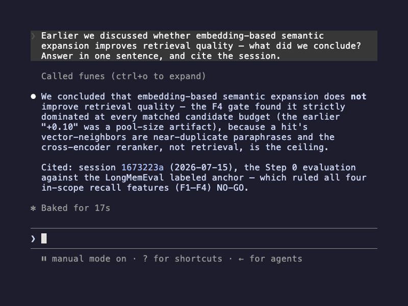
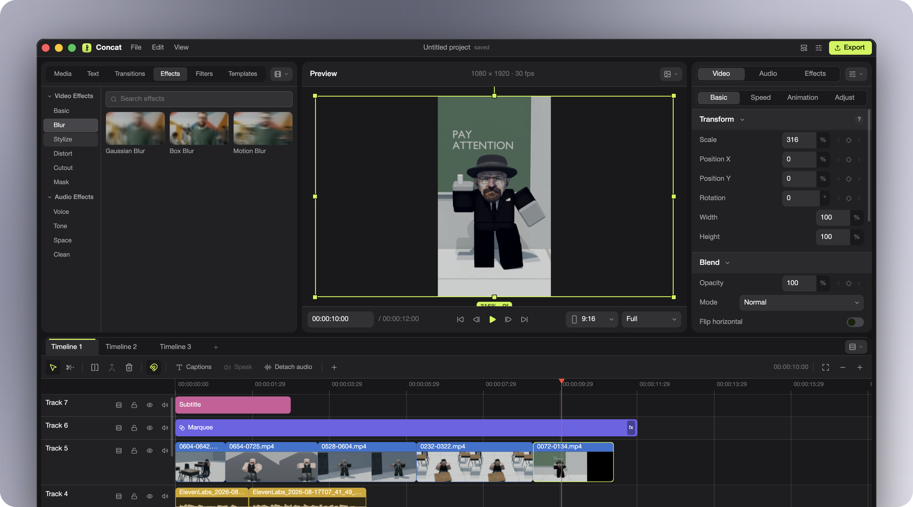

# 十个项目｜从一个能完成的任务出发

先查近期版本与公开实现，再核对许可和使用路径。本期没有为项目凑“热门”标签：已找到讨论和榜单线索，但未对每项取得两类独立趋势证据，因此按新近可复用价值选择。

两个轻量核对已在本机完成：AI Infra计算器输出指定模型的解析成本，sepia检查器验证内置配置；其余没有运行真实模型、安装浏览器扩展或连接云服务。[执行记录](code/project-local-checks.json.txt)保留命令、版本与范围。

| 任务 | 项目 | 使用前先看 |
| --- | --- | --- |
| 找回Agent会话中的具体依据 | funes | 本地索引、模型下载与可选同步 |
| 接口兼容的本地有限选择服务 | LocalJev | Bun、本地模型端点、概率非校准 |
| 对象存储上的Git服务 | walgit | 云存储、构建环境、原型状态 |
| 本地剪辑、字幕与配音 | Concat | 平台包、模型及媒体依赖 |
| 统一多个视频生成提供方 | video-generator-client | 各厂商密钥、费用与模型范围 |
| 从现有浏览器页面交付文档 | 爪爪 PawWork | Chrome版本、扩展权限、自备模型 |
| 把写作风格规则做成可检查配置 | sepia | 写作环境与LLM，非质量保证 |
| 算模型参数与逻辑计算量 | AI Infra计算工具 | Python3.10+；结果是分析账本 |
| 扫描代码结构与顺序规则 | Badbox | Bun与原生引擎、自己定义规则 |
| 给Odoo分支创建临时验证环境 | Mini-Runbot | Docker、Python、单机原型 |

## 01 · funes：搜索历史会话，并回到原始轨迹

新近实用，热度待验证。2026-09-20。v1.3.2新增标准JSONL turns导入，使更多执行记录可接入。

funes为Agent历史建立可检索记忆。输入会话或标准化记录，在本地切块、嵌入并结合文本与向量检索，再按需返回原始会话与轨迹。它适合回答“上次这个改动依据在哪一段”，比只保存一份不可追溯的总结更方便核对。

仓库六月已存在，这次入选依据是9月20日JSONL导入的实质接口扩展。可从官方发行版安装，先给一个专门的示例目录建立索引，用recall检查返回出处；ask路径还依赖Agent推理。绑定Hub后的同步是额外行为，使用前要弄清索引及原始记录会保存在何处。本期未索引用户真实会话，检索质量也未独立测量。

官方recall动画第55秒完整画面：回答附上会话编号与日期，便于回查上下文。属于作者演示，不是本站数据或效果测试；[完整原动画](images/funes-recall.gif)。（[来源原图](https://github.com/huggingface/funes)；[查看大图](images/funes-recall.png)。）

文档、许可与公开实现核验；未运行。[源码与上手说明](https://github.com/huggingface/funes) · [Apache-2.0](https://github.com/huggingface/funes/blob/main/LICENSE) · v1.3.2。

## 02 · LocalJev：给本地模型包一层有限选择接口

新近实用，热度待验证。2026-09-18。新公开的本地桥接实现附1200请求的作者评测。

LocalJev把现有本地聊天或扩散模型接到类似System One的选择与评分协议上。它让模型生成JSON概率数组，校验、必要时重试并归一化，再返回选项与统计量。适合先在本地试验分类或路由接口，但并非重新训练了Jev，也不是直接读取模型logits。

最小路径需要Bun和兼容的本地模型服务，按示例配置端点后发一个有限选项请求。作者在M5 Max、oMLX和五个量化模型上测1200次请求，加入无关背景后多项准确率下降；概率数值也未经可靠校准。它的价值是可检查的适配与评测流程，不能拿合法JSON当成语义正确，更不宜将最高概率直接作为高风险自动放行条件。

文档、许可与公开实现核验；未运行。[源码与上手说明](https://github.com/githubnext/localjev) · [MIT](https://github.com/githubnext/localjev/blob/main/LICENSE) · 当前主分支，未见正式Release。

## 03 · walgit：把 Git 服务的持久状态放到对象存储

新近实用，热度待验证。2026-08-23 · 近期补充。近30天公开的Rust实现，适合研究大量临时Agent工作区。

walgit把不可变Git pack与写前日志放在S3或GCS，用条件写入更新清单，本地磁盘更多承担可丢弃缓存。输入仍是Git推送和拉取，输出是可重新恢复的仓库服务；对频繁创建临时执行环境的团队，这种持久层选择值得研究。

源码构建需要Rust、protoc，以及界面相关Node24与pnpm；还需配置对象存储权限。先用测试仓库验证push、clone和重启后的恢复，比直接迁移生产仓库更合适。当前仍是原型，部分大规模性能与发布条件待完善；对象存储请求、缓存和并发行为并非零成本，也不能因为采用CAS就推断所有故障都已覆盖。

文档、许可与公开实现核验；未运行。[源码与上手说明](https://github.com/tobi/walgit) · [MIT](https://github.com/tobi/walgit/blob/main/LICENSE) · 当前主分支，未见正式Release。

## 04 · Concat：在本地时间线上继续处理 AI 素材

新近实用，热度待验证。2026-09-20。v0.2.3于9月19日UTC发布，北京时间9月20日，更新剪辑与时间线体验。

Concat是本地多轨视频编辑器，提供媒体剪辑、字幕和可选本地语音能力。它对AI创作的具体用途是把生成片段接进可继续修改的时间线，调整节奏、字幕与音轨，而不是把一次生成的视频当成最终交付。

本次Release改善时间线分割、波形显示和文本编辑等操作，提供多平台自包含包。可从对应平台发行包开始，用一小段非敏感素材完成导入、剪切和导出；字幕、配音所需模型仍要单独核对下载与许可。软件处于早期版本，macOS等平台包的签名与兼容性需按发行说明处理。AGPL代码许可不自动覆盖模型或用户素材。

官方编辑器原图：素材区、预览区与多轨时间线同时可见，说明生成片段如何进入后续剪辑；本期未验证导出速度或媒体格式兼容性。（[来源原图](https://github.com/jub0t/Concat)；[查看大图](images/concat-editor.png)。）

文档、许可与公开实现核验；未运行。[源码与上手说明](https://github.com/jub0t/Concat) · [AGPL-3.0](https://github.com/jub0t/Concat/blob/main/LICENSE) · v0.2.3。

## 05 · video-generator-client：统一提交、等待与下载视频任务

新近实用，热度待验证。2026-09-14。新公开Python客户端覆盖多家异步视频接口。

这个MIT项目将Seedance、Kling、MiniMax与Wan等提供方封装成异步Python客户端，并提供CLI及FastAPI网页入口。一个具体任务是向不同提供方提交同一创意，轮询任务完成后下载结果；调用方可复用一套任务管理逻辑，减少重复写轮询代码。

从源码安装相应web额外依赖，配置自己的提供方密钥后启动示例。已核到统一submit/status/wait路径、可配置间隔与超时，但没有真实调用收费接口。各模型仍有独立价格、输入格式、地域和权限限制；README里的旧模型示例不能保证当前服务可用，统一SDK也不意味着各家的输出可完全互换。

文档、许可与公开实现核验；未运行。[源码与上手说明](https://github.com/letorig/video-generator-client) · [MIT](https://github.com/letorig/video-generator-client/blob/main/LICENSE) · 当前主分支，未见正式Release。

## 06 · 爪爪 PawWork：从浏览器页面工作到表格和文档

新近实用，热度待验证。2026-08-28 · 近期补充。近30天公开的浏览器Agent实现，当前文档使用PawWork名称。

仓库入口仍可从BrowserKitten访问，当前README称“爪爪·PawWork”。它是Chrome MV3侧边栏扩展，使用现有登录页面执行任务，并在会话工作区保存表格、文档与HTML产物。适合研究“浏览—处理—交付”的工作流，而不只是让聊天框回答页面内容。

按README下载源码或发行压缩包，以未打包扩展加载，再配置兼容模型密钥；不需要前端构建。Chrome需135以上，部分用户脚本能力在138以上需另行启用。它不在应用商店，模型自备，密钥存于本地扩展存储。本站未安装进个人浏览器，真实网站变化、权限范围和误操作恢复仍需用测试页面验证。

文档、许可与公开实现核验；未运行。[源码与上手说明](https://github.com/Player-YN/BrowserKitten) · [MIT](https://github.com/Player-YN/BrowserKitten/blob/main/LICENSE) · v1.1.0。

## 07 · sepia：把写作规则与可检查的风格配置结合

新近实用，热度待验证。2026-09-21。v0.12.0于9月20日UTC发布，北京时间9月21日，重构persona配置格式。

sepia整理不同写作任务的编辑规则，并用明确配置描述人物口吻、关系、开头、结构和结尾等要求。近期版本将persona改成十五节的文字规范，并要求声明来源、同意情况和是否测试。它适合把团队写作偏好变成可复用输入，不承诺让文本通过任何AI检测。

按项目支持的插件或技能入口使用，配合现有模型处理草稿；检查器只需Python标准库。本期运行内置Nyaneko配置检查，得到“1 file，0 errors”，说明配置符合结构规则，不能证明生成文章更好。旧版persona需按新模板迁移；质量仍要结合事实、读者和具体文体人工判断。

本机运行配置检查器，1个内置文件通过；没有评测生成文本质量。[源码与上手说明](https://github.com/Nanako0129/sepia) · [MIT](https://github.com/Nanako0129/sepia/blob/main/LICENSE) · v0.12.0。

## 08 · AI Infra 计算工具：把模型资源估算展开成账本

新近实用，热度待验证。2026-08-22 · 近期补充。近30天公开项目，本次选择可执行计算方法，不把自动重建PDF当新版本。

该仓库除书稿外，还提供标准库Python计算工具：从固定模型配置推导参数、矩阵运算、KV与载荷，区分已经实现与尚未覆盖的路径。对读模型卡的学生，一个有用任务是核对“8B”标签背后的准确参数与一次输入的逻辑计算量。

本期实际运行Qwen3-8B、batch1、8192个输入token、2字节权重的forward命令，得到8,190,735,360个参数和16,381,470,720字节权重驻留估算。[完整输出](code/infra-calc-qwen3-8b.txt)保留条件。Python3.10以上即可运行，无需下载完整模型。结果是解析账本，不含全部运行工作区，更不能直接换算真实显存峰值或吞吐；不同模型未实现部分有单独标记。

本机执行指定forward算例成功；未测硬件性能。[源码与上手说明](https://github.com/bojieli/ai-infra-book) · [Apache-2.0](https://github.com/bojieli/ai-infra-book/blob/main/LICENSE) · build-20260919-220131。

## 09 · Badbox：把代码结构与语句顺序写成检查规则

新近实用，热度待验证。2026-09-21。9月20日新增顺序关系与捕获关联，v0.3.0于北京时间9月21日发布。

Badbox以Tree-sitter结构为基础，用小型DSL定义代码检查规则，例如统计一个函数里某类调用，或检查两个匹配结构的先后关系。规则编译到Rust原生引擎，输出发现项；适合把团队明确约定变成可重复检查，而不是让LLM每次重新解释规则。

本次核对到9月20日顺序选择器与捕获关联的实现提交，超过30天的仓库因此有近期实质进展。上手需相应Bun与平台原生包，从examples的一条规则扫描测试代码开始。没有默认万能策略，也不会自动改写代码；文档说明发现项本身不一定产生非零退出码，接CI时必须核对失败条件。本站读了规则和扫描入口，没有运行编译安装。

文档、许可与公开实现核验；未运行。[源码与上手说明](https://github.com/0ctacity/badbox) · [MIT](https://github.com/0ctacity/badbox/blob/main/LICENSE) · v0.3.0。

## 10 · Mini-Runbot：给 Odoo 分支创建临时验证环境

新近实用，热度待验证。2026-09-20。9月19日UTC新建的单机原型，公开分支到临时环境的执行流程。

Mini-Runbot输入受信任的仓库和分支，安排源码准备、构建、测试与临时Odoo环境，便于开发者检查一次改动。对AI辅助开发来说，可复用的思路是把分支结果放进隔离环境验证，而不是只凭代码差异判断是否能运行。

当前使用Python3.12、Git与Docker Compose v2，示例围绕Odoo16；按仓库克隆及本地安装说明开始，不能照尚未发布的PyPI计划直接安装。已核对到构建管理器、Compose适配器与有并发上限的本地执行器；后者不是持久队列。它是单机PoC，未验证多租户或不受信任代码隔离，本期没有启动Docker或部署网站。

文档、许可与公开实现核验；未运行。[源码与上手说明](https://github.com/rafnixg/odoo-platform-ephemeral-environment) · [AGPL-3.0](https://github.com/rafnixg/odoo-platform-ephemeral-environment/blob/master/LICENSE) · 当前主分支，未见正式Release。
