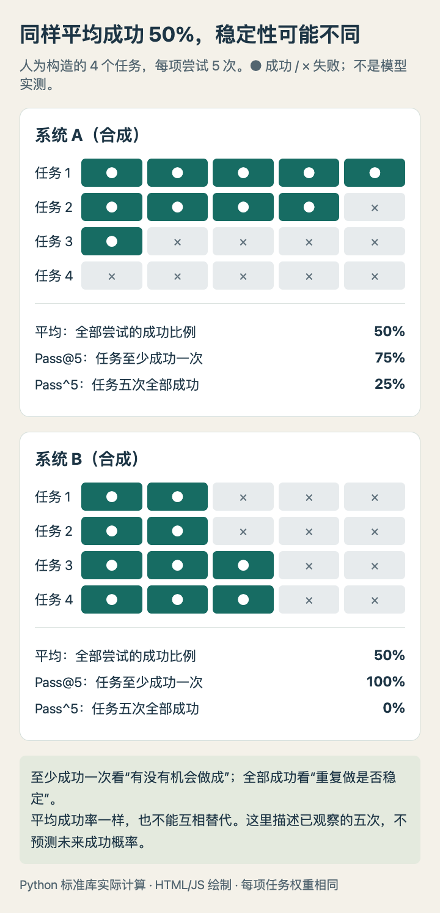

# 同样平均成功率，为什么稳定性不同

本篇已用Python 3.14.3 和标准库实际运行。输入是人为构造的成功/失败矩阵，没有调用模型，不是论文或IBM实验复现。它帮助理解[今天的Agent训练论文](03-论文精选.md)与[一致性分析新闻](01-AI动态.md)里不同指标回答的问题。

## 一张矩阵，三个问题

假设四项任务，每项尝试五次，成功记1，失败记0。平均成功率把二十次尝试一起计算；Pass@5问有多少任务至少成功过一次；Pass^5问有多少任务五次全成功。本例每项任务同权，每组只有五次，因此可直接数矩阵，不必假设每次尝试独立。




本站合成数据与Python实际计算结果，用HTML/JS绘制。A有一项始终成功，也有一项始终失败；B每项都成功过，却没有一项五次全成功。不是模型排行榜。（[可复现绘图源码](code/reliability-chart.html)；[查看大图](images/reliability-metrics.png)。）


| 指标 | 系统A（合成） | 系统B（合成） | 回答的问题 |
| --- | --- | --- | --- |
| 平均成功率 | 50% | 50% | 一次尝试总体上有多容易成功 |
| Pass@5 | 75% | 100% | 给五次机会，任务有没有做成过 |
| Pass^5 | 25% | 0% | 五次重复，任务是否次次做成 |

选择指标取决于实际任务。有可靠验证器、允许重试的代码问题可能关注覆盖；需要重复执行的固定业务流程，还要看稳定性和失败代价。只有至少一次成功的高分，不能证明用户每次操作都可靠。

## 最小实现

```python
def summarize(rows):
    task_count, attempts = len(rows), len(rows[0])
    return {
        "mean": sum(map(sum, rows)) / (task_count * attempts),
        "at_least_one": sum(any(row) for row in rows) / task_count,
        "all_success": sum(all(row) for row in rows) / task_count,
    }
```

下载[完整Python源码](code/reliability-demo.py)，在空目录运行 `python3 reliability-demo.py`。不需要第三方依赖，会在脚本旁生成[JSON结果](code/reliability-results.json.txt)和[HTML/JS图](code/reliability-chart.html)。源码对两个矩阵的六个指标作了精确断言，PNG由浏览器渲染同一HTML得到。

## 这还不是未来可靠性的估计

这里只有四个合成任务，不能据此判断两个真实模型谁更好，也没有置信区间、任务难度校正或失败相关性估计。真实评测若每题采样n次、估计较小的k，应使用与论文协议一致的估计方法，并固定预算、任务和评分标准。

不要把这里的五次全部成功比例写成“未来五次一定成功的概率”，也不要直接计算平均成功率的五次方：任务之间难度不同，重复尝试可能相关。实际报告应保留逐任务记录，同时检查环境故障、裁判误判与重复样本。
