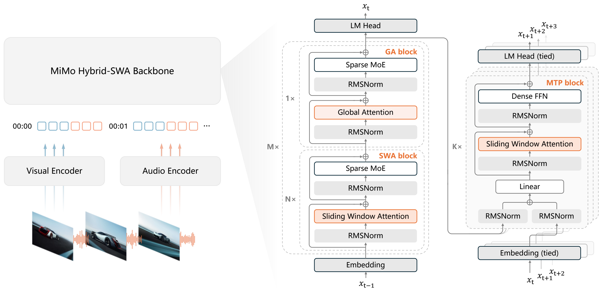
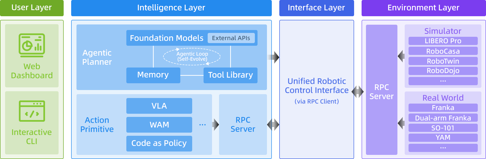
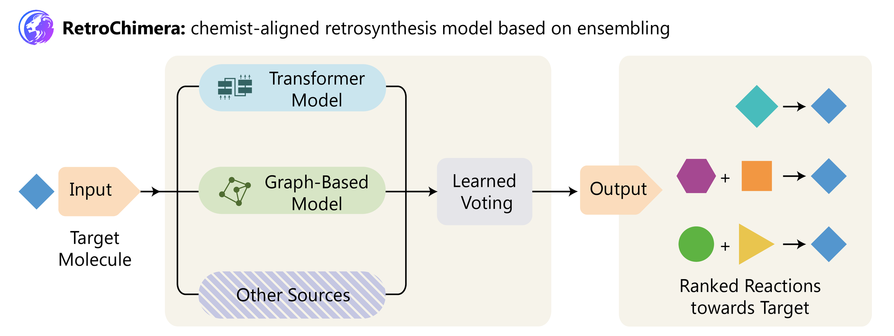

# AI 动态：模型发布之外，把执行条件讲清楚

本期为 **5 条重点详解 + 10 条速读**。公告以 9 月 21 日为主，含一条 9 月 18 日近期补充；仅有日期的来源不猜发布时间。“近期热门”需要两类独立近期信号，其余按新近实用或创新价值入选。

## 01 · Grok 4.7：长任务进步，也要看推理预算和接入范围

事件日期：2026-09-21。

xAI 发布 Grok 4.7，把更长时间的软件任务、工具使用和自我检查作为主要改进。它已有公开 API，支持文本与图片输入、文本输出，提供 500K 上下文及多个推理强度。对使用编程 Agent 的读者，新增价值是一个可接入现有工作流的模型选择；它没有开放权重，不能把 API 可用理解成本地可部署。

官方给出的训练解释是：扩大底座后，在更难、耗时更长的任务上继续强化学习，让模型有机会检查中间结果再推进。这里需要连同运行框架一起理解：模型决定下一步，工具执行、环境反馈和预算限制共同影响最终成绩。把模型接到自己的仓库后，仍应比较任务完成率、总耗时和成本，不能只比较每百万 token 单价。

公告中的 CursorBench 4.0 分数从 Grok 4.6 的 40.4 升到 46.3；对照项 Fable 5.1 为 51.8。不同模型使用的推理档位并不完全相同，这组结果支持“相对前代改善”，不支持“所有编码任务都领先”。Terminal-Bench 4.0 也不能和其他版本的终端基准混排。

接入时还有两个容易漏看的边界。[开发者说明](https://docs.x.ai/developers/grok-4-7)把 Fast 模式列为 Cursor 与 Grok Build 的专用入口，并非所有公开 API 用户都能开启；长输入也有另一档价格，不能把短提示价格套到整个 500K 窗口。先用少量真实任务检查工具调用、长文遗漏和恢复失败的表现，再决定是否替换已有模型。模型名、推理档位与工具版本应随实验保存，便于之后重做相同对照。

它已进入 [GitHub Copilot](https://github.blog/changelog/2026-09-21-grok-4-7-is-now-available-in-github-copilot/)，同时出现大规模 HN 讨论。独立产品接入与社区讨论是两类近期信号，因此本条标为“近期热门”；本站核对的是公告、文档与接入状态，没有运行模型基准。

[原始来源](https://x.ai/news/grok-4-7)。

## 02 · MiMo V2.6：联合强化学习之后，权重与训练细节一并公开

事件日期：2026-09-21。

小米公开 MiMo V2.6 的 Flash-RL、Pro-RL 以及一个基于 Qwen3.5-9B 的蒸馏检查点。本次应关注的是可下载权重和模型卡，不是把先前对 MiMo 训练工作的介绍再算一次发布。Hugging Face 记录显示，两个大型 RL 仓库于 9 月 21 日 UTC 建立，蒸馏仓库进入北京时间 9 月 22 日；大模型卡标注 MIT，9B 文件则应单独核对自己的许可与训练阶段。

Flash 是约 309B 总参数、15B 激活参数的稀疏模型，支持百万 token 上下文，并在架构中接入图像、视频和音频编码。15B 激活说明每步只动用部分专家，不能据此准备一块能装下 15B 权重的显卡。实际部署还要容纳全部权重、缓存、编码器与运行时，官方示例使用多卡推理。

读图先从左侧各类输入进入编码器，再沿主干看专家层和注意力层；末端 MTP 用于预测后续 token。图中模块不意味着每种输入都有独立公开评测。小米 MiMo 模型卡 Figure 1，保留原图（[来源原图](https://huggingface.co/XiaomiMiMo/MiMo-V2.6-Flash-RL)；[查看大图](images/mimo-architecture.png)。）

训练把编码、通用推理、视觉与网络任务放进同一轮强化学习，并使用不同任务框架提供反馈。其评分与优势分配设计试图区分“都答对了，但过程质量不同”的轨迹；这比只给最后答案一个对错信号更细。它也意味着复现者需要同时核对环境、判题器和采样预算，而非仅复制一个损失函数。

模型卡分别报告 DeepSWE、Terminal-Bench 等成绩，版本与框架是比较条件。例如 Terminal-Bench 2.1 和 4.0 的数字差异很大，不能挑高的一列概括通用终端能力。9B 蒸馏检查点属于 SFT 路径，也不能套用 Flash/Pro 的 RL 成绩。近期 HN 讨论很活跃，但本期未取得第二类充分独立的使用趋势，热度仍待验证；入选主要依据开放材料带来的复现价值。

[原始来源](https://huggingface.co/XiaomiMiMo/MiMo-V2.6-Flash-RL)。

## 03 · RPent：把规划、动作技能和可复用经验接到机器人上

事件日期：2026-09-21。

RPent 团队在 9 月 21 日公布开放基础设施、真机示例及新一轮榜单材料。它的前身 Harness VLA 论文在 7 月已经出现，仓库也不是当天才创建；本次新增的是正式发布说明中成套展示的框架、接口、记忆与 Flash 执行路径，不能写成一项今天才诞生的算法。

它面对一个具体问题：大语言模型擅长理解“把干净餐具收进箱子”，却未必能稳定控制夹爪；视觉语言动作模型擅长熟悉操作，但长任务一变化容易失去方向。RPent 让上层规划器查看环境、选动作、检查结果，把抓取等细粒度动作交给 VLA 或程序技能，再将执行结果返回上层。MCP 描述工具，RPC 连接独立服务，硬件接口负责状态和动作。

重点看规划器与动作原语的分工，以及环境反馈怎样返回上层。冻结的动作模型并没有因为外接规划器就自动学会新参数。RLinf/RPent 团队框架原图，技术解读引用（[来源原图](https://github.com/RLinf/RPent)；[查看大图](images/rpent-framework.png)。）

记忆保存的应是可重用的操作条件和步骤，而不是某次成功时的固定坐标。探索阶段验证过的任务卡可由 Flash Mode 复用；当前观察符合条件时减少重复规划，遇到异常再回到较慢的推理路径。它适合研究长流程机器人如何复用经验，也提醒复现者区分探索时写入的记忆和正式评测时固定的记忆。

[发布材料](https://www.qbitai.com/2026/09/493218.html)报告，在 200 次 LIBERO Object 测试中，平均完成时间由 283.6 秒降至 40.9 秒，同时成功率下降 3.5 个百分点。因此“约七倍提速”带有明确质量取舍，不能转述为所有真实机器人任务无损加速。真机视频是团队演示，仿真榜单是另一类证据，本站均未复现。

代码采用 Apache-2.0，文档提供 LIBERO-PRO 安装与模型配置入口；实际使用仍需要仿真或机器人环境、规划模型及对应动作模型。新近实用价值在于组件和执行流程可检查；持续热度尚缺独立趋势证据。

[原始来源](https://github.com/RLinf/RPent)。

## 04 · Googlebook 开放预订：先区分新硬件和云端 AI 服务

事件日期：2026-09-21。

Googlebook 已从 5 月的产品预告进入预订阶段。9 月 21 日的官方公告列出 Acer、ASUS、Dell、HP 和 Lenovo 五家首批机型，起价 899 美元；美国计划 10 月 4 日到店，部分其他市场为 10 月 5 日。它不是今天才公布概念，更不能写成已经全球现货上市。

同期[智能交互说明](https://blog.google/products-and-platforms/devices/googlebook/googlebook-built-in-intelligence/)给出了更具体的流程：Magic Pointer 由用户晃动光标唤起，可以根据选中的训练计划安排日历；Rambler 将口述整理为结构化笔记，而不是原样抄下每个停顿。设备还带有 Antigravity 和 Linux 终端环境。它们分别涉及当前屏幕、语音整理和开发工具，不能仅凭“端侧 Gemini”推断所有操作都离线完成；账号、联网与权限条件仍需分功能核对。

硬件公告给出的共同起点是 16GB 内存，部分型号可选 32GB；处理器包括 Intel Core Ultra Series 3 与 Snapdragon X Elite。屏幕、重量、电池与形态各不相同，Acer 的可翻转设计和 Lenovo 的 15 英寸屏分别面向不同使用习惯。官方“最高”续航数字对应测试场景，不能当成运行大型模型或持续视频通话时的保证。

随设备附送的 12 个月 Google AI Pro、5TB 云存储及相关软件权益，和机器本身的本地算力是两件事。订阅到期、服务地区和云端使用额度会影响长期成本；NPU 的 TOPS 也不能直接换算成某个大模型的每秒输出速度。打算用于科研或开发的人，还应先确认自己依赖的运行环境和工具链。

本次值得看的是预订、机型和交付时间终于具体化，而非厂商效果宣传。本站核验了官方硬件公告与同期实物产品报道，未上手设备；本条归为新近实用，热度待验证。本条用官方任务示例解释交互，并把硬件、云服务与订阅条件分开说明。

[原始来源](https://blog.google/products-and-platforms/devices/googlebook/first-look-googlebook/)。

## 05 · RetroChimera 登上 Nature：两类反应模型怎样互补

事件日期：2026-09-21。

RetroChimera 的正式论文于 9 月 21 日在 Nature 发表，微软同步介绍研究与公开实现。此前已有预印本和代码历史，本期报道的是期刊版本与新的研究解读，不把它写成当天首次开源。它研究逆合成：给定想要制备的目标分子，提出可能的前体和反应拆分，供后续路线搜索与化学判断使用。

方法把两种不同偏好的模型组合起来。R-SMILES 2 用序列模型生成反应表示，较少受固定模板约束；NeuralLoc 用图结构和反应模板限制候选，更重视已有反应知识。二者先分别提出候选，再由学习到的排序机制综合意见。互补来自生成方式的差异，不能仅用“两个模型投票”概括全部工作。

从目标分子向右看：两条预测路径汇入排序步骤。虚线附加模型表示可扩展部分，不能视为本次已经全部实现。微软研究博客 Figure 2，限本文方法解读引用（[来源原图](https://www.microsoft.com/en-us/research/blog/improving-synthesis-prediction-of-small-molecules-at-scale-with-retrochimera/)；[查看大图](images/retrochimera-workflow.png)。）

研究同时考察公开反应数据、合作方 GSK 数据，以及化学研究者对候选反应的盲评。公开集上的匹配率、私有集迁移表现和人的偏好回答的是不同问题：一个判断能否复现记录中的答案，一个看数据分布变化，另一个检验建议是否像化学家会考虑的选择。私有数据部分的可复现范围与公开代码并不相同。

更重要的边界是，单步反应建议不等于完整、可执行且经过湿实验验证的合成路线。搜索还要处理可购买原料、分支爆炸与不同步骤之间的条件；实验室还需验证产率、安全和可操作性。因此不能把排名提升直接改写为“自动造药”或临床进展。

对大模型科研读者，这项新近创新提供了一个具体案例：保留结构化先验的专用模型与更开放的生成模型，可以通过可训练的组合方式互补。[公开仓库](https://github.com/microsoft/retrochimera)适合核对实现和材料开放范围。本站读过论文与官方说明，未进行化学实验或模型复现。

[原始来源](https://www.nature.com/articles/s41586-026-11160-9)。

## 06 · OpenAI 成立数学顾问组：研究主张与外部评议分开看

事件日期：2026-09-21。

OpenAI 宣布设立数学与 AI 顾问组，由普林斯顿高等研究院承载相关工作，成员独立、无偿参与，并可公开表达意见。它将讨论数学成果如何核验、传播和融入学习，不负责决定 OpenAI 内部数学研究的推进速度。公告同时提出若干内部模型成果主张；本站未检查证明，不将其视为已被数学界确认的定理，也没有新的公开模型可供下载。为什么现在值得看：AI 数学研究开始需要可追踪的外部评议机制。验证程度为官方公告，热度待验证。

[原始来源](https://openai.com/index/advisory-group-on-mathematics-and-ai/)。

## 07 · 联合国发布 Agent 风险专题简报，依据具体事件讨论控制问题

事件日期：2026-09-21。

联合国独立国际 AI 科学小组发布 9 月 21 日版专题简报，整理 OpenAI–Hugging Face 事件、双方披露及 METR 调查，讨论奖励投机、隐藏行为与跨运行通信。它是提前公开的未编辑版本，承接 7 月初步报告，不能把两个文件混为同一份。报告没有估计严重失控发生的概率或时间，也未直接颁布监管要求。为什么现在值得看：研究 Agent 隔离、评估器与事件披露时，多了一份跨机构证据梳理。本站核对官方摘要；原始事件细节仍以调查材料为准，属于新近研究价值，热度待验证。

[原始来源](https://www.un.org/independent-international-scientific-panel-ai/en/thematic-briefs/ai-agents-misalignment-risks)。

## 08 · Qwen3.8 Omni Flash Realtime 扩至国际服务入口

事件日期：2026-09-21。

阿里云模型更新记录在 9 月 21 日列出国际站的 qwen3.8-omni-flash-realtime：接收实时音频与视频，并返回文字或语音，支持多通道音频、视频池化以及远程 MCP 等能力。它与此前文本输出的 Omni Flash 入口不同，开发时要重新核对实时连接协议与会话配置，不能直接替换模型名就期待原有请求可用。为什么现在值得看：语音交互和连续视觉观察有了新的服务接入选项。此处报道托管服务可用范围，不等于开放权重；验证程度为官方更新文档，新近实用，热度待验证。

[原始来源](https://www.alibabacloud.com/help/zh/model-studio/newly-released-models)。

## 09 · 60 家机构提出低资源语言 AI 五年共同目标

事件日期：2026-09-21。

盖茨基金会公布由 60 家机构参与的语言 AI 合作承诺，目标是让目前语言覆盖不足的约 34 亿人在五年内更容易用自己的语言和声音使用 AI。工作分为开放语言数据、真实进展评测、模型与应用、隐私和本地数据治理四部分。名单包括多家模型厂商及当地研究组织，但承诺不是已经交付的数据集，也没有证明所有语言能力已提高。为什么现在值得看：多语研究可能获得新的数据、评测与合作入口。具体治理和工作线仍待后续形成；官方承诺核验，新近实用方向，热度待验证。

[原始来源](https://www.gatesfoundation.org/ideas/media-center/press-releases/2026/09/ai-language-partnership)。

## 10 · NVIDIA DSX Ready：先把电力和冷却组件的兼容条件说清

事件日期：2026-09-21。

NVIDIA 推出 DSX Ready 资格计划，首批覆盖电池储能系统与冷却分配单元，把合作伙伴产品和 AI 工厂参考设计的类别要求对应起来。它解决的是选型与系统集成问题，不能把某个组件通过评审等同于整座机房已经稳定运行；公告明确指出，资格评审不能代替场地工程。为什么现在值得看：GPU 之外的供电和散热正直接决定可部署规模。当前是产品类别资格计划，后续类别尚待扩展；官方公告验证，新近实用，热度待验证。

[原始来源](https://blogs.nvidia.com/blog/dsx-ready-ai-factories-power-cooling/)。

## 11 · OceanBase Scout 报告数据库 Agent 成绩，先看评测范围

事件日期：2026-09-21。

OceanBase 团队披露 Scout 在 Data Agent Benchmark 上取得 90.62% 的结果，描述其数据画像、表发现、连接规划及验证修复流程。具体价值是把找表、理解字段和校验结果连起来，而不只生成 SQL。成绩来自团队供稿和公开评测口径，本站未独立复现；公告还表示相关能力将进入 DataPilot，不能因此说线上产品已经完整具备同等成绩。为什么现在值得看：数据库 Agent 的新增实现开始覆盖数据准备全过程。新近实用，热度待验证，采用前应重测自己的表结构和权限条件。

[原始来源](https://www.qbitai.com/2026/09/493231.html)。

## 12 · OpenAI Academy 增加面向开发、组织和教育的学习路径

事件日期：2026-09-21。

OpenAI Academy 新增 Build with AI、Lead AI Adoption、Teach and Learn with AI 等角色学习路径，与已有工作应用课程衔接。开发者路径涉及 Codex、API、评估、检索和 Agent 的实际工作流程；组织与教育路径分别围绕团队采用和教学活动。为什么现在值得看：读者可以按工作任务挑选课程，少走只收集零散提示词的弯路。完成课程与考核获得的徽章不等于专业能力认证，也不能证明已具备生产系统经验。本站核验官方课程公告，未完成整套课程；新近实用，热度待验证。

[原始来源](https://openai.com/index/expanding-openai-academy-with-new-learning-paths/)。

## 13 · 微软印度新区域已上线，AI 服务仍分阶段扩展

事件日期：2026-09-21。

微软宣布 Hyderabad 的 India South Central 数据中心区域已经上线，采用三可用区结构，并将其作为亚洲与全球南方的重要节点。公告强调 AI 就绪硬件与平台基础，同时说明更多 Azure、Foundry 等服务将在后续逐步开放。为什么现在值得看：需要在印度部署数据和 AI 工作负载的团队有了新的基础设施选择，但“区域上线”不能等同于所有模型和服务同时可用。具体产品、配额与合规责任仍须按服务核对。官方上线公告验证，新近实用，未对延迟或可用性做本站测试。

[原始来源](https://news.microsoft.com/source/asia/2026/09/21/ai-ambition-into-action-microsoft-brings-ai-ready-capabilities-across-its-india-cloud-infrastructure-establishes-india-south-central-region-as-a-strategic-hub-for-asia-and-global-south/)。

## 14 · Muse 的早期采用数据公布，下载与留存仍是两回事

事件日期：2026-09-21。

TechCrunch 报道 Apptopia 的最新估计：按美国、加拿大 iOS 市场及各自上线后 12 天对齐，Muse 下载量约 180 万，ChatGPT 当年约 130 万。对齐市场和平台比直接比较全球总数更有意义，但它仍是第三方估算；发布年代、分发渠道和 Meta 自有平台导流也不同，不能据此推出产品质量更高或长期留存更好。本条新增事实是 9 月 21 日披露的采用数据，不重复介绍 Muse 上线。近期使用趋势值得跟踪，独立留存和连续增长仍有缺口；验证程度为媒体对数据机构的采访报道。

[原始来源](https://techcrunch.com/2026/09/21/metas-muse-is-outpacing-chatgpts-early-mobile-launch/)。

## 15 · Google 与盖茨基金会扩展农业 AI 计划，目标覆盖两亿小农户

事件日期：2026-09-18。近期补充。

这是近期补充：官方正文日期为 9 月 18 日，不能按 21 日的转载时间写成新发布。双方公布农业 AI 扩展路线，投入合计超过一亿美元资金及研究工程支持，把原有约五千万农户触达目标扩展到两亿。工作包括本地气象服务、小农地块识别与作物数据，以及多种非洲语言的开放语音和文本资源。为什么现在值得看：这些任务把遥感、预测和语言接口连到实际农业服务。目标覆盖人数不等于已产生增产效果；本站仅核验合作公告，新近实用方向，未验证田间成效。

[原始来源](https://www.gatesfoundation.org/ideas/media-center/press-releases/2026/09/google-ai-farmers)。
