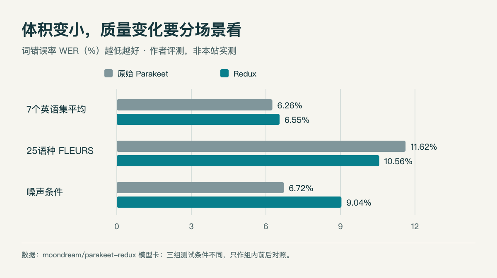
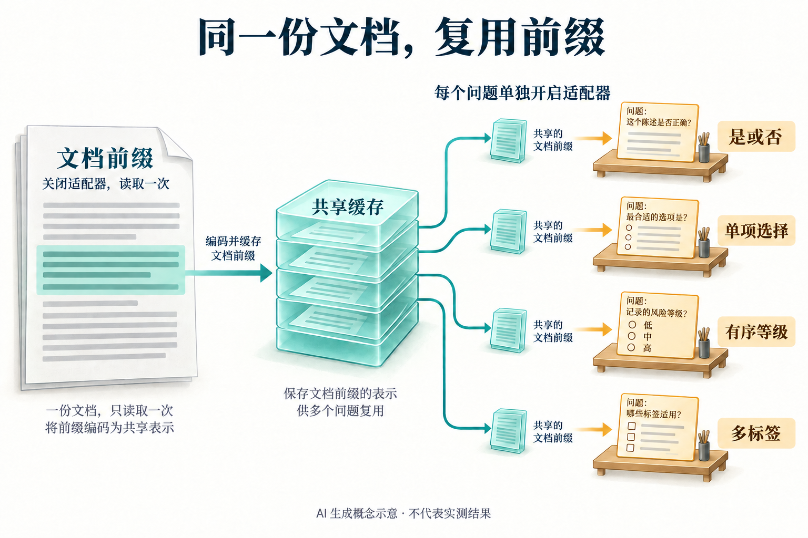

# 六个开放模型：先选任务，再看部署条件

本栏同时介绍宽松许可模型与带条件的开放权重，逐项写明区别。没有把门控、仅内部评估的 Nemotron 预览或缺模型卡与许可的新仓库计入六项。

## 01 · Parakeet Redux：语音编码器三值化，收益与误差一起看

发布日期线索：2026-09-18 建库。**新近实用；作者基准，本站未运行，热度待验证。** 它把 Parakeet TDT 0.6B v3 的编码器权重压到三值表示，面向低成本语音转写。178MB 是模型材料报告的体积，不是完整进程的内存占用；它覆盖 25 种欧洲语言，不能当作中文转写模型。

模型卡给出了 CPU、Metal 等路径与任务条件。例如 EPYC 9575F、8 个物理核心、逐条处理 LibriSpeech test-clean 的设置达到约 113 倍实时速度；Mac 测试使用另一小样本集，两者不可直接排列。实际部署还需要 Photon 运行时及配套组件，支持的硬件优化也不相同。

每一组只比较同一测试集合的前后结果，柱越低越好。多语 FLEURS 改善，不代表噪声集也改善；噪声集从 6.72% 升至 9.04%。数据来自模型卡，HTML/JS 绘制，非本站实测（[原始数据](https://huggingface.co/moondream/parakeet-redux)；[查看大图](images/parakeet-wer.png)。）

最值得复现的是自己录音条件下的质量变化。卡中七个英语集合平均 WER 从 6.26% 变为 6.55%，而噪声条件退化更明显。量化后的吞吐收益要和口音、环境声、切块及长录音处理一起衡量。权重采用 CC BY 4.0；使用时保留归属与许可说明。

[模型卡与权重](https://huggingface.co/moondream/parakeet-redux) · [绘图源码](code/explanations.html) · [数值数据](code/parakeet-data.json)。

## 02 · Supra2-IMG：小型扩散主干之外，还有文本编码器和 VAE

发布日期线索：2026-09-21 建库。**新近创新实验；作者样例，本站未运行，热度待验证。** Supra2-IMG 从头训练约 104M 参数的 DiT 图像生成主干，输出 256×256 图像。结构使用 14 层、576 隐藏维度和 9 个注意力头，适合观察较小主干怎样学习文本到图像的映射。

“约一亿参数”只描述 DiT，不包含冻结的 Flan-T5-Base 文本编码器和 SD VAE。示例使用 flow matching 推理、50 步 Euler、CFG 3；因此不能把模型文件大小或主干参数当作整个生成系统的成本。作者报告在合成图像数据上训练，未给出足以支持全面领先的独立评测。

这张样例用于观察低分辨率下主体轮廓、照明和背景的表达，不代表所有提示词质量。SupraLabs 模型卡的官方生成结果；未重新生成或修饰，限效果讨论引用（[来源原图](https://huggingface.co/SupraLabs/Supra2-IMG)；[查看大图](images/supra-jellyfish.png)。）

仓库提供 `model_final_ema.pt` 和推理代码，模型卡标注 Apache-2.0；文本编码器、VAE 与训练数据仍要分别核对来源条件。为什么现在值得看：它提供了一个可检查的小型生成模型实验入口，而不是又一个只给海报的模型发布。

[模型卡与权重](https://huggingface.co/SupraLabs/Supra2-IMG)。

## 03 · Solomon：读一次文档，再分别回答多个分类问题

版本：2026-09-21 的 1.1.0。**新近实用；作者实验，本站未运行，热度待验证。** Solomon 针对文档上的布尔、单选、有序等级和多标签判断。它在 Qwen3.8-27B 上提供 LoRA 适配器、读出头和服务代码，返回选项分布；并非下载一个小适配器就省去了 27B 底座。

设计将文档前缀与问题分支分开：前缀关闭适配器读入并缓存，各个问题单独开启适配器读取同一缓存。这样有机会减少重复编码，但缓存兼容性、精度和运行时绑定都需要检查。卡中不同实现输出仍存在数值差异，不能把逻辑上的问题隔离说成所有平台逐位相同。

先看共享部分，再看每个问题自己的分支。图仅帮助理解缓存与适配器的职责，不提供性能或准确率证据。依据已核验模型卡，用内置 imagegen 生成概念示意（[机制依据](https://huggingface.co/DoccyHealth/Solomon)；[查看大图](images/solomon-cache.png)。）

作者在 54 份真实文档、802 个问题上报告 706 个判断正确；相对旧版的改进为 3.4 个百分点，但按文档重采样的 95% 区间为 −1.3 至 +7.4，包含零。更关键的是评测标签由 AI 生成且没有人工逐项复核，不能据此认定达到业务准确率。相关句子提示也只是检索线索，不是结论证明。

作者 v1.1 的 BF16 测量使用 B200；INT8 在 48GB A6000 上报告文本峰值约 32.8GiB，MLX 包仍停留 v1.0，不能套用 v1.1 结果。发布包声明 Apache-2.0，底座另行下载；模型卡公开了训练材料来源与尚未独立完成的许可核验，不宜将声明理解成上游材料已全部审清。适合先在自己的已人工标注文档上比较，再讨论上线。

[模型卡与权重](https://huggingface.co/DoccyHealth/Solomon)。

## 04 · Decider 2B：给固定选项打分，校准仍取决于任务

发布日期线索：2026-09-16 建库；变更记录标明 v10 为 2026-09-19。**新近实用；作者评测，本站未运行，热度待验证。** 它基于 Qwen3.5-2B-Base，把工单、网页状态等输入和有限选项放入一次前向计算，从选项字母对应的 logits 读概率，不逐字生成 JSON。

例如输入一张退款工单，可以同时问“交给哪个部门”和“是否需要退款处理”。程序保证输出落在给定选项内，不保证选项选对；未给出的正确答案也不会凭空出现。API 提供低置信度弃答，但阈值应在自己的标注样本上选择。

v10 在监督训练之后加入浏览器和游戏结果驱动的强化学习，并用相对 v8 的 KL 约束限制漂移。作者重建后的评测集里，未见任务准确率 v8 为 0.757、v10 为 0.755，并非所有指标提升；旧集合和重建集合的数字不能直接相减。默认温度 1.30 也不意味着新领域自动校准。它主要面向英语；默认逐问题评分，选择打包模式时后面的问题能看到前面的题干，调整顺序曾改变最多 12% 的答案。

2B BF16 权重约 3.5GB，实际内存还需计入运行开销；提供 PyTorch/Transformers 与项目推理包入口，Apache-2.0。新价值在可训练、可检查的有限选项判断路径，适合路由与筛选，不替代开放式复杂推理。

[模型卡与权重](https://huggingface.co/Mapika/decider-2b)。

## 05 · XGEN-JING：第一视角生成已开放，因果版本仍待发布

发布日期线索：2026-09-16 模型仓库建立。**新近实用原型；官方演示，本站未运行，热度待验证。** JING 将动作键、参考图片、文字与观测历史作为条件，生成第一视角视频和音频，用于探索场景与角色互动。目前开放的是 JING-Flash-v1 四步双向推理，因果模型和技术报告仍在计划中，不能提前称为已开放的实时因果世界模型。

示例用 JSON 描述每段提示、重复次数和控制键，程序输出视频；方向键是生成条件，不等于真实三维环境里受物理引擎保证的位移。适合先比较相同初始图片下不同动作条件是否产生稳定差异，而不是由一段流畅视频判断世界一致性。

作者验证配置为 Python 3.12 与六张 H100：文本编码器、音视频 VAE 和 DiT 分工，且依赖固定版本的 SGLang、Diffusers 等组件。仓库中的 15 个 transformer 分片仍须搭配 MiniMax-H3 其余组件，部署门槛较高。

它采用带地域和商业条件的 [MiniMax H3 社区许可](https://github.com/XGEN-Labs/XGEN-JING/blob/main/LICENSE)，不是 Apache/MIT：文本排除欧盟、英国、韩国和美国，年度商业收入超过 2000 万美元需另行授权。这里只报道开放权重状态；使用和再分发应按原许可核对，不能把“可下载”当作无条件开源。

[模型卡与权重](https://huggingface.co/XGENlabs/XGEN-JING)。

## 06 · Altar-1：删掉部分专家，保留每步八个专家的路由

近期补充：2026-09-07 模型仓库建立。**新近实用部署方案；作者测量，本站未运行，热度待验证。** 它是 GLM-5.3 的剪枝与量化衍生版本，和本站此前介绍的 GLM-5.3-Flash 是不同权重。此处首次介绍具体压缩实现，不把基础模型的旧发布当作新事件。

每层专家从 256 个裁到 168 个，路由仍每个 token 选八个；选择依据考虑各个领域中专家的贡献，避免只按全局频率删掉少数领域专家。路由专家采用 INT4，注意力、共享专家及其他部分仍有 BF16，因此“4bit 模型”并不表示每个张量都是四位。

作者目标是在四张 H200 上用 vLLM 部署约 328GB 权重。其保真度指标是 25 条封闭提示上的 KL 0.506 nats，只衡量输出分布差异，不是端到端任务通过率，也不能证明所有语言和工具调用无损。模型卡命令中的旧命名空间与当前仓库不一致，复现时应使用实际的 `AikidoSec/altar-1` 并固定版本。

许可继承 [GLM-5.3 License](https://huggingface.co/zai-org/GLM-5.3/blob/main/LICENSE)，含特定超大型模型服务经营者的额外条件，不应简化标成 MIT。为什么现在值得看：它把专家裁剪、量化和硬件预算放进一个可核对的部署方案，读者也能明确看到证据尚未覆盖的质量风险。

[模型卡与权重](https://huggingface.co/AikidoSec/altar-1)。
