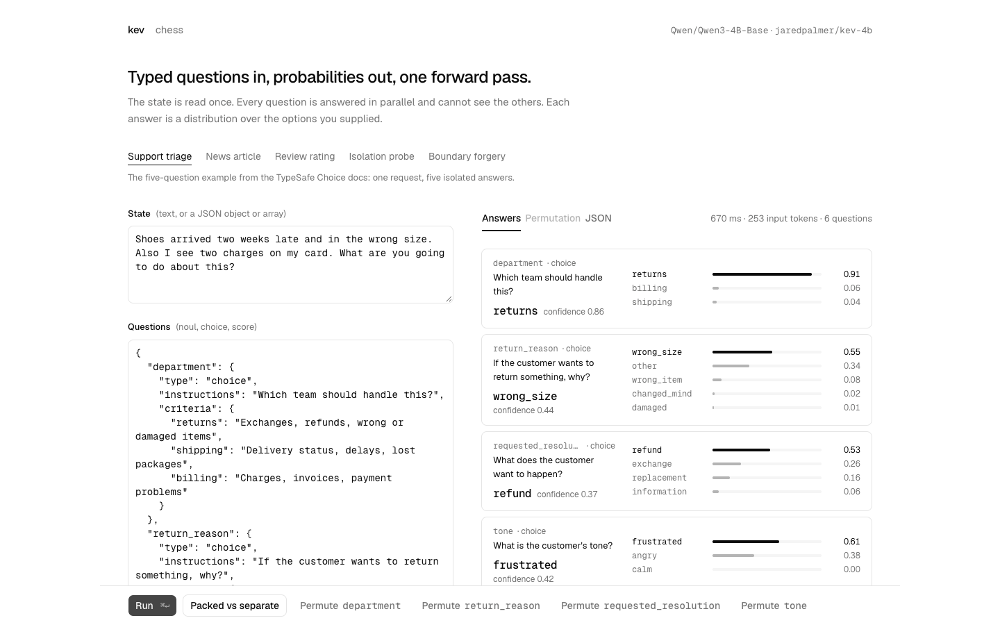

# 十个项目｜从输入、输出和门槛判断是否值得试

本期比较近期仓库、版本、社区线索与作者示例，并与过去 7/30 天逐项去重。以下项目按新近可复用价值入选；没有两类独立热度证据的，不标“热门”。除本期技术实践外，本栏没有进行安装或在线服务调用。

| 任务 | 项目 | 先看门槛 |
| --- | --- | --- |
| 编程工作台与运行时 | ZCode | Apache-2.0；依赖见下文 |
| 在 Kubernetes 管理 Agent 任务 | ax | Apache-2.0；依赖见下文 |
| 内部知识问答与来源追踪 | open-glean | Apache-2.0；依赖见下文 |
| 本地分类与决策模型实验 | kev | Apache-2.0；依赖见下文 |
| 分阶段审查代码改动 | jev-review | MIT；依赖见下文 |
| 给数据库文本增加分类条件 | pg-jev | PostgreSQL；依赖见下文 |
| Agent 轨迹评测和门控原型 | jevals | MIT；依赖见下文 |
| 英文表单的分层分类示例 | tax-doc-classifier | Apache-2.0；依赖见下文 |
| 研究汇报的图文排版检查 | minorun-marp-skill | Apache-2.0；依赖见下文 |
| 保存公开讲座与字幕素材 | qiaomu-download | MIT；依赖见下文 |

## 01 · ZCode：在网页和终端间复用编程 Agent

2026-09-20 建库，**新近实用；官方实现与示例，本站未运行，热度待验证。** ZCode 将终端 CLI、Web 工作台和桌面外壳接到共同的 Agent 运行时。一个适合研究者的场景是：在网页里查看实验代码和会话，再通过 CLI 接入同一个开发流程；开放的是工作台与运行时，模型账号和推理费用要另算。

源码路径需要 Git、Node 24.14 和 pnpm 10.33.2，先 `pnpm bootstrap`，再 `pnpm dev:web`；前端与后端使用不同本地端口。它相对从零拼聊天界面、工具调用和会话存储的价值，是提供可检查的完整工程。独立 CLI 也有 `zcode --web` 入口；本地回环地址与对外监听的认证行为不同，应按文档配置。刚公开的项目不代表已有长期稳定性证据，本期没有用 Star 总量认定热门。

[源码与上手说明](https://github.com/zai-org/ZCode) · [Apache-2.0](https://github.com/zai-org/ZCode/blob/main/LICENSE) · 当前主分支，无正式Release。

## 02 · AX：把长任务做成可恢复的集群资源

原仓库创建于 2026-03-30；本次看的是 **2026-09-20 v0.3.0，近期实质更新**。版本比较包含“重构为通用 Agent 任务编排层”、侧车进程跟踪和 `doctor` 诊断命令，并非把旧仓库重新当新项目。**新近实用；实现与文档核验，本站未部署，热度待验证。**

AX 把任务、工作区、模型连接与网络网关分开描述。输入一个任务配置，可以提交任务、观察执行、进入环境，以及暂停后恢复；适合多个人同时跑耗时的编码或分析工作。最小入口是 `go install github.com/google/ax/cmd/ax@latest`，但完整部署还依赖 Kubernetes、镜像仓库、ko 和可访问的后端 API，不是装一个 CLI 就有云端算力。

先按部署文档准备环境，再用 `ax apply -f examples/task.yaml` 提交示例。网关的出站控制与凭据注入有助于集中管理，但隔离强度仍取决于集群配置。项目处于 alpha 阶段，接口可能变化；官方规模目标不等于经过本站压力测试。

[源码与上手说明](https://github.com/google/ax) · [Apache-2.0](https://github.com/google/ax/blob/main/LICENSE) · v0.3.0。

## 03 · Open Glean：给资料检索补上引用和工作界面

2026-09-17 建库，**新近实用；官方示例与代码结构，本站未运行，热度待验证。** 它把资料集合选择、检索、带引用回答和研究过程放进一个 Web 应用。输入问题后，先查连接的数据，再呈现回答与来源；更复杂的研究会拆成分支并合并来源，适合想做团队知识问答原型的人。

相对从零开发，这个仓库提供了交互、会话与服务端调用路径。但“开源应用”不等于完整离线系统：它依赖 Hydra DB 的托管检索服务，还需 OpenRouter 或兼容接口的模型密钥。MongoDB 用于持久化，未配置时的本地存储行为也要留意。

仓库采用 Next.js 16、React 19。准备环境变量后运行 `npm ci`、`npm run dev`，连接资料集合再提问。先用无敏感信息的样本检查引用是否真的支持回答；仅有引用按钮不能证明检索和回答正确。

[源码与上手说明](https://github.com/hydra-db/open-glean) · [Apache-2.0](https://github.com/hydra-db/open-glean/blob/main/LICENSE) · 当前主分支，无正式Release。

## 04 · Kev：把模糊判断变成一组可检查的概率

2026-09-17 建库，**新近实用；作者演示与训练/推理实现，本站未运行。** HN 有近期讨论，但缺少连续增长与独立采用数据，仍标注热度待验证。Kev 在 Qwen3.5 的小模型上训练类型化决策：输入工单和几个候选类别，输出类别概率，不生成一段解释文字。用概率设置人工复核阈值，比只取最大类别更容易观察犹豫和误判。

项目包含训练、服务、评测和交互演示。Python 3.12、uv 是基础依赖；服务可从 `uv sync --extra serve` 起步，再按 README 加载 Kev-4B。作者的 4B/9B BF16 路径以 32GB Mac 为例，模型大小和后端影响实际内存，不应套成所有设备保证。

看状态文本如何对应右侧问题与概率；它展示了调试决策输入的操作界面，不是本站对准确率或延迟的测试。原截图来自 Jared Palmer 的 Apache-2.0 仓库（[来源原图](https://github.com/jaredpalmer/kev)；[查看大图](images/kev-playground.png)。）

问题隔离、选项描述和顺序都值得单独测试。概率输出需要用自己的标注数据校准，不能因为小数位多就把它当作事实置信度。

[源码与上手说明](https://github.com/jaredpalmer/kev) · [Apache-2.0](https://github.com/jaredpalmer/kev/blob/main/LICENSE) · kev-family。

## 05 · Jev Review：先找风险证据，再看代码审查结果

2026-09-16 建库，**新近实用；作者真实界面与示例，本站未运行，热度待验证。** 输入仓库改动后，它先建立风险和文件特征，再挑选相关证据，判断问题机制、严重程度和后续处理路径。与直接让模型读完整 diff 给一段评论相比，阶段结果保存在 JSON 中，便于检查哪一步漏看了上下文。

需要 Node 24、Git 和 TypeSafe API 密钥。在项目目录 `npm install` 并配置环境后，使用 `npm run review:changes:save -- /path/to/repo` 保存结果，`npm run dashboard` 打开本地看板。输入会用于外部决策服务，私有代码应先核对服务与组织的使用条件。

看板的作用是让判断路径可追溯。图中风险项是作者示例，不是本站仓库的审查结论；原截图来自 Dev Agrawal 的 MIT 仓库（[来源原图](https://github.com/devagrawal09/jev-review)；[查看大图](images/jev-review-dashboard.png)。）

它没有替代编译器诊断、静态分析和完整代码索引。某个阶段把问题标成高风险，只能作为复核线索，不能据此断言代码存在漏洞。

[源码与上手说明](https://github.com/devagrawal09/jev-review) · [MIT](https://github.com/devagrawal09/jev-review/blob/main/LICENSE) · 当前主分支，无正式Release。

## 06 · pg-jev：在 SQL 筛选之后做语义判断

2026-09-17 建库，**新近实用；文档和扩展实现，本站未部署，热度待验证。** 它给 PostgreSQL 加入概率、单选和评分函数。例如先用 SQL 限定时间与客户，再判断工单是否涉及退款，输出仍可与表字段一起查询。价值在于把结构化筛选与语义判断连接起来，减少另写导出、分类、回填程序的步骤。

需要 PostgreSQL 14–17、`plpython3u`、安装扩展的超级用户权限和 TypeSafe API 密钥；许多托管数据库不开放这些条件。可从 `pgxn install jev` 与扩展文档起步。它按批预读，使用并发请求及会话内缓存；`LIMIT` 可以停止新的窗口，但不能收回已经发出的请求。

作者报告的延迟与成本来自指定数据和网络，本站没有复测。先做常规 SQL 过滤可降低发送量；文本会离开数据库进入外部服务。许可文件核实为 PostgreSQL License，API 的未识别标签不能当作“没有许可”。

[源码与上手说明](https://github.com/realZachi/pg-jev) · [PostgreSQL](https://github.com/realZachi/pg-jev/blob/master/LICENSE) · 当前主分支，无正式Release。

## 07 · jevals：相关性高，也可能编造了工具结果

2026-09-20 发布 v0.1.1，**新近实用；官方示例与评测，本站未运行，热度待验证。** 它接受消息和工具调用轨迹，把是否正确选工具、是否引用结果、是否超出任务范围等检查组成一组问题，返回分项结果。README 的天气示例很具体：回答把“今天晴”扩成“整周晴”，相关性仍高，但依据检查能够指出额外断言。

Python 3.10+ 包提供 SDK、CLI、JSONL 输出和阈值校准，决策后端可用 Jev，也有兼容后端路径。先安装项目依赖、配置所选后端，再用 `jevals run traces.jsonl --evals agent.grounded,agent.stayed_in_scope` 检查小样本。批量示例表明确是示意数据；作者的真实费用比较只有 20 条 RAG 样本，Kev/Laya 的速度行还是估算。

它适合研究不同错误类型，而非把一个分数当安全保证。默认问题、概率和阈值都需用自己的人工标注校准；需要多步推理的判断也可能更适合较强模型。

[源码与上手说明](https://github.com/openlayer-ai/jevals) · [MIT](https://github.com/openlayer-ai/jevals/blob/main/LICENSE) · 已发布 v0.1.1；本文另核当前主分支（包元数据 0.1.4）。

## 08 · tax-doc-classifier：文档类别与拒判阈值一起设计

2026-09-18 建库，**新近实用；作者样本实验，本站未运行，热度待验证。** 这是一个可借鉴的文档工程例子：先把 PDF 单页提取为页眉、正文、页脚，再判断页面类型和表单类别；少数复杂类别继续问子问题。输出除类别外还包括概率与是否达到阈值，低置信度可回到人工流程。

作者在 314 页已填写样本上报告零严格错误；另一个 753 页空白表单集合有 38 页低于 0.95 阈值，严格错误率为 5.05%。因此不能只读首页的“100%”就推断所有文档准确。它只支持英文联邦表单；没有文字层的扫描件会被视为空白，必须先补 OCR。

依赖 Node 20+、pnpm、Poppler 和 TypeSafe API，可运行 `pnpm install`、`pnpm test`，再从 `classifyPage` 的文本输入起步。代码 Apache-2.0，DATA-LICENSE 明确 IRS 派生文件同用 Apache-2.0；本栏介绍分类方法，不提供税务判断。实际私有表单会涉及外部服务传输。

[源码与上手说明](https://github.com/kyotofin/tax-doc-classifier) · [Apache-2.0](https://github.com/kyotofin/tax-doc-classifier/blob/main/LICENSE) · 当前主分支，无正式Release。

## 09 · Marp Skill：把幻灯片检查变成可运行步骤

2026-09-20 建库，**新近实用；可执行检查脚本与样例，本站未运行，热度待验证。** 项目把故事组织、插图与暗色主题收在同一套 Marp 工作流中，同时提供溢出、边距和 SVG 文字框检查。它们合计为一个项目；有用之处是让生成幻灯片后的检查步骤落到文件和脚本上。

例如准备好 PDF 后执行 `python3 tools/check-dark-margins.py deck.pdf`，对图形运行 `node tools/check-svg-box-fit.mjs images/*.svg`，发现贴边内容或文字超框。环境涉及 Marp CLI、Chrome、Python/Pillow 及 PDF 工具，具体按 README 准备；检查失败后仍需要人工判断如何改版。

代码和主题采用 Apache-2.0，示例中的第三方插画另有素材条件，不能一并视为相同许可。几何检查能发现视觉错误，却不能核实论文结论、数据或叙事，本期不将其包装为自动生成高质量报告的保证。

[源码与上手说明](https://github.com/minorun365/minorun-marp-skill) · [Apache-2.0](https://github.com/minorun365/minorun-marp-skill/blob/main/LICENSE) · 当前主分支，无正式Release。

## 10 · qiaomu-download：下载之后，继续检查媒体文件

2026-09-19 建库，2026-09-20 发布 v1.3.0，**新近实用；脚本、测试与作者记录，本站未运行，热度待验证。** 对研究学习，可用它保存自己有权保存的公开视频和字幕：输入单个链接，调用 yt-dlp 解析、下载，再用 ffprobe 检查实际音视频流、时长和文件。比只看下载进程退出码，多了成品核验这一步。

基础依赖是 Python 3.10+、yt-dlp、ffmpeg/ffprobe。可先读 `scripts/download.py info URL` 的结果，再按需要下载视频或字幕；站点支持随 extractor 与页面变化，不代表所有链接都能成功。工具带有引擎更新和已有会话回退逻辑，使用前应了解它会访问哪些本地资源。

核心脚本为 MIT；可选视频号后端带 Commons Clause，不能把整条可选链路都称作宽松开源。Spotify 分支匹配的是其他公开视频音源，不能称为原始 Spotify 音频。本期只介绍代码与流程，没有连接账号、安装后端或测试这些平台。

[源码与上手说明](https://github.com/joeseesun/qiaomu-download) · [MIT](https://github.com/joeseesun/qiaomu-download/blob/main/LICENSE) · v1.3.0。
