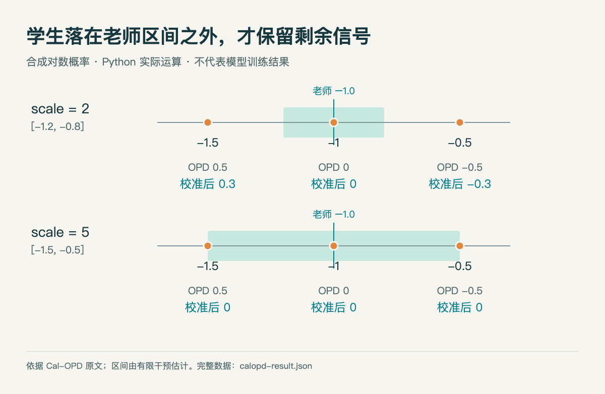

# 老师自己也会摇摆：用 30 行 Python 理解 Cal-OPD

**已运行验证：仅运行合成数值的区间运算，没有加载模型、调用 API 或进行训练。** 这篇实践帮助理解[今天的 Cal-OPD 论文](03-论文精选.md)，不能用来复现论文的准确率或训练速度。

## 从一个 token 开始

假设学生已经生成了一个 token。普通在线蒸馏比较老师与学生对这个同一 token 的对数概率：老师给 −1.0，学生给 −1.5，差为 +0.5，优化信号会倾向于提高学生给它的概率。这里的数是自然对数概率，既不是错误率，也不是奖励分数。

但如果只改变老师看到的辅助信息，同一 token 的老师分数就会从 −1.1 变到 −0.9，全部差异都让学生去学是否合适？Cal-OPD 先用有限的正负干预估计老师自身的变化范围，再保留学生落在范围之外的那部分差距。这个范围来自特定干预，并不覆盖老师所有可能的不确定性。

## 可复现的小实验

依赖：Python 3 标准库，无第三方包。将[脚本](code/calopd_toy.py)放进本地目录运行；本次运行版本为 **3.14.3**。

```bash
python3 calopd_toy.py
```

核心是下面三行。`low`、`high` 是老师分数加上按系数扩展后的上下偏移；两个 `max` 只保留越出边界的距离。

```python
low = teacher - scale * max(0.0, -min(delta))
high = teacher + scale * max(0.0, max(delta))
calopd = max(low - student, 0.0) - max(student - high, 0.0)
```

本例老师分数固定 −1.0，两次合成干预给出 −0.9 和 −1.1。先用 scale=2 得到 [−1.2, −0.8]，再用 scale=5 观察范围扩大时的变化。论文主实验使用 λ=5；这里选择两个数只是为了比较几何关系，不能把它们当作推荐超参数。

| 学生对数概率 | 普通 OPD | Cal-OPD，scale=2 | Cal-OPD，scale=5 |
| --- | --- | --- | --- |
| −1.5 | +0.5 | +0.3 | 0 |
| −1.0 | 0 | 0 | 0 |
| −0.5 | −0.5 | −0.3 | 0 |




青色区间表示合成干预估计的范围，圆点是三个学生分数。范围外才有剩余信号；scale=5 时三个点落入或处在边界，结果均为0。数据由本机 Python 实际运算，HTML/JS 绘图；不是模型训练结果（[运行输出](code/calopd-result.json)；[查看大图](images/calopd-result.png)。）


## 结果说明什么

scale=2 时，左右两个样本的信号幅度从 0.5 减为 0.3，方向保持不变；中间样本本来就在区间内，信号是零。scale=5 时，区间扩大到 [−1.5, −0.5]，这三个示例全部归零。范围越宽，保留的训练信号可能越少，因此“校准”并不是无条件保留有用差异、精准删除噪声的保证。

真实训练还涉及学生轨迹采样、正负干预的构造、逐 token 概率、停止梯度和批次优化。本例没有这些环节，也没有证明性能会提高。建议先改三个学生分数，观察边界附近的变化；若要复现论文结果，再使用作者实现与完整实验设置。

[完整运行输出](code/calopd-result.json) · [绘图源码](code/explanations.html) · [论文原文，公式 5–6 及校准方法](https://arxiv.org/abs/2609.21619v1)
