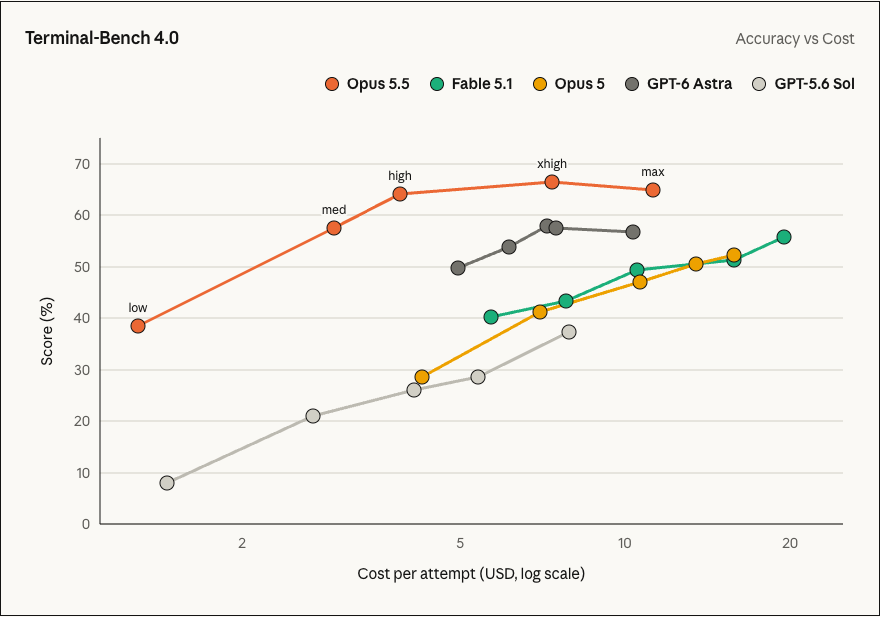
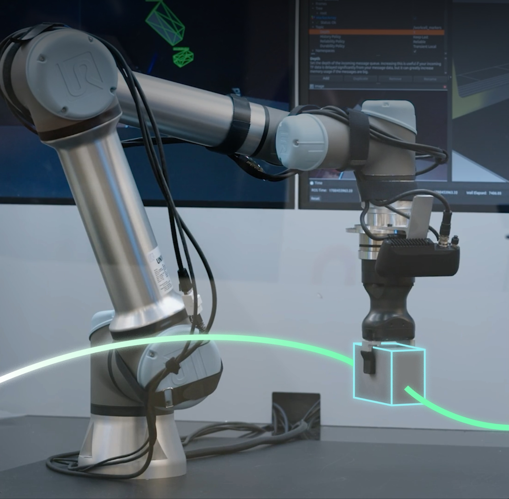
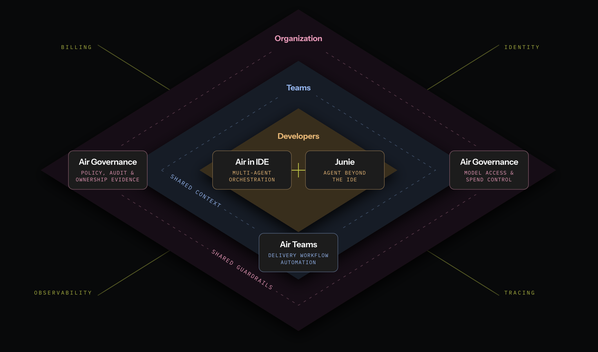

# AI 动态：模型降价之后，任务怎样真正交付

前五条重点详解，后十条速读。公告以来源原日期标注；9 月 21 日内容标为近期补充。厂商实验、使用案例与独立观察分别说明，不把讨论量当作能力证据。

## 01 · GPT-6 Sol / Luna：把模型能力与每次任务成本一起看

2026-09-22 官方发布。**近期热门、新近实用；官方评测与下游接入已确认，本站未实测。**

OpenAI 推出 GPT-6 Sol 和 Luna，分别面向日常复杂工作与成本敏感的高频任务。它们已进入 API，并向 ChatGPT Work 和 Codex 的相关用户逐步开放；不要把 Work 的开放范围理解成所有 ChatGPT Chat 入口已经同步切换。对开发者，最直接的变化是可以用 gpt-6-sol、gpt-6-luna 重新测试现有工作流，而不是只看最高能力型号的成绩。

本次值得对照的是三件不同的事：每百万 token 的标价、做完一项任务实际消耗多少 token，以及重复上下文能否命中缓存。Sol 输入 / 输出分别为 2 / 10 美元，Luna 为 0.10 / 0.50 美元。官方拿来对比的 GPT-5.6 对应价格中包含促销口径；因此“降价”必须带着基准一起看，也不能把价格变化直接当成任务总成本变化。

GPT-6 同时改进提示缓存：重复的长上下文更容易复用，改变推理强度或工具可用性时也能保留更多可复用部分，并提供显式缓存断点。缓存读取享有 90% 的输入价格折扣。这里的直觉是，Agent 连续检查同一仓库时，前面反复出现的材料不必每轮都按全价重新处理；第一次读入、后续新增内容和输出仍会计费。[缓存机制说明](https://openai.com/index/better-prompt-caching-for-gpt-6/)

选型时可先拿自己的一组真实任务比较完成率、重试次数与总账单。官方测试表明小型号的能力继续提高，但各家公开榜单使用的推理预算、工具和运行框架并不完全一致，不能据此承诺 Luna 在所有任务上替代大模型。长任务若频繁返工，便宜的单价仍可能带来更高总成本。

为什么现在值得看：本次是明确的新型号与价格变化。采集时 HN 对该发布有 1,050 分、548 条评论，GitHub Copilot 也公布接入，分别构成用户讨论与下游采用两类近期信号；这些是当时的观察值，不是持续增长趋势，也不是独立能力复现。

[HN 独立讨论](https://news.ycombinator.com/item?id=49805509) · [GitHub Copilot 接入公告](https://github.blog/changelog/2026-09-22-openais-gpt-6-sol-and-gpt-6-luna-now-available/)。Copilot 按方案逐步开放，组织账号还受管理员策略约束。

[原始来源](https://openai.com/index/introducing-gpt-6-sol-and-luna/)

## 02 · Claude Opus 5.5：降价之外，还要看 token 用量和防护条件

2026-09-22 官方发布。**近期热门、新近实用；官方实验、早期客户反馈及下游接入，本站未实测。**

Anthropic 发布 Claude 5.5 家族的首个型号 Opus 5.5，重点放在复杂编码、知识工作、沟通与成本效率。Sonnet 5.5、Haiku 5.5 仍是接下来几周的计划，不能算作今天已经可用的三个新模型。公告把它与更高档的 Fable 5.1 作比较，但“多数工作接近”属于厂商判断，需要放回具体任务验证。

价格变化有明确数字：每百万输入 token 从 Opus 5 的 5 美元降至 4 美元，输出从 25 降至 20，缓存读取从 0.50 降至 0.20。前两项降幅是 20%，缓存读取是 60%；公告所说典型工作成本降低约 40%，还包含模型完成任务所需 token 的变化，不能拿它替代自己的账单估算。反复读取大量项目材料的 Agent，受缓存价格影响尤其明显。

能力数字也有运行条件。官方 Terminal-Bench 4.0 报告 Opus 5.5 为 66.4%，Opus 5 为 52.3%，但前者使用 xhigh 推理强度；不同榜单也可能引用其他团队公开结果。更容易忽略的是防护触发后的处理：部分网络安全任务由 Opus 4.8 接手，生物学与前沿模型研发任务由 Opus 5 接手。因此表中系统表现包含这些条件，不应写成一个模型在无限制环境中的纯能力。

对日常开发，更有参考价值的试法是保留相同仓库、测试与验收标准，比较它是否减少了多轮修补，以及输出更快后人类审查是否跟得上。公告中的大型迁移案例来自早期测试者，说明值得试的方向，不能保证任意代码库都能复制相同时间收益。

本次发布还涉及付费订阅的五小时额度、可保存的重置，以及针对高风险专业用途的验证计划；具体可用性依账号与平台。HN 采集时为 1,085 分、763 条评论，Copilot 的接入公告提供另一类采用信号，因而标为近期热门。后续仍应看独立任务评估，而不是把讨论量当成效果证明。

[HN 独立讨论](https://news.ycombinator.com/item?id=49803892) · [GitHub Copilot 接入公告](https://github.blog/changelog/2026-09-22-claude-opus-5-5-is-now-available-in-github-copilot/)。Copilot 按方案逐步开放，组织账号还受管理员策略约束。

Anthropic 原页面忠实截图：横轴为每个任务成本（对数刻度），纵轴为准确率；比较同一预算附近的点，不把曲线解释为所有任务的保证。（[来源原图](https://www.anthropic.com/claude-opus-5-5)；[查看大图](images/news-opus-cost.png)。）

[原始来源](https://www.anthropic.com/claude-opus-5-5)

## 03 · 阿里云公布全栈 AI 路线图：把已提供、训练中和未来计划分开

2026-09-22 云栖大会公告。**新近创新方向与产品进展；官方声明，热度和实际收益待独立验证。**

阿里把模型、芯片、云基础设施与应用放进同一份全栈路线图。研究读者最需要先分清时间：Qwen4 正在训练，Qwen4.5、Qwen5 是后续规划；不能把演讲中的名字当成今天可下载或可调用的新模型。本期将同一次大会的这些内容合并成一条事件，避免把路线图拆成多条“发布”。

模型侧，官方讨论了自动化训练迭代，并以 Qwen3.8-Max 的内部迭代结果说明方向。它描述的是研发流程进展，外部还需要完整任务、基线、算力与对照才能判断增益来自哪里。与研究口号相比，开发者应继续以模型控制台和正式文档中的可用版本为准，不根据未来版本提前设计依赖。

硬件侧，真武 V900 的计划规格包括 216GB 内存与 1,200GB/s 互联带宽，量产目标是 2027 年第一季度；倚天后续芯片和更远期容量也属于路线图。芯片规格、系统吞吐、应用延迟是三个层面：即使前者公布，也不能直接推算自己的训练会快多少。公告中的对前代提升来自官方口径，尚不等于第三方实测。

应用与平台侧，阿里将模型能力、Agent 执行框架和上下文服务联系起来，涉及音频生成、图像后续版本及终端合作。可以这样理解其工程意义：一次业务任务既需要会推理的模型，也需要可调用的工具、正确的上下文和运行资源；模型变强不会自动补齐后三者。这是对路线图的解释，不是已经验证的统一系统性能。

这条值得现在看，是因为它明确了接下来的模型与基础设施方向。近期能做的是核对现有服务是否满足任务、把未来供给作为规划信息；不把“正在训练”“将推出”“计划量产”改写成“现已开放”。相关价格生效公告在第十条单列，属于另一项可直接核对的服务变更。

[原始来源](https://www.alibabacloud.com/en/press-room/alibaba-unveils-roadmap-on-full-stack-ai-strategy?_p_lc=1)

## 04 · Isaac ROS 5.0：把机器人感知组件接进可执行的开发流程

2026-09-22 ROSCon 公告。**新近实用；官方组件、合作案例和演示，本站未运行机器人。**

NVIDIA 发布 Isaac ROS 5.0，把 GPU 加速感知组件、ROS 生态和面向 Agent 的开发技能进一步连接起来。它支持 ROS Lyrical 与 Ubuntu 24.04，并推进加速计算的数据接口工作。对于已有机器人项目，价值首先在于组件能否顺利接入自己的软件栈，而不是“机器人有了聊天界面”。

以抓取任务为例，摄像头产生图像，感知模块估计物体位置和朝向，规划与控制系统再让机械臂动作。FoundationPose 这样的位姿估计组件解决的是中间一段；它并不会独自完成整套任务。公告展示了与 Intrinsic 的操作流程，以及 RealSense、Seeed、Magna 等伙伴的集成。读案例时应分清哪部分是感知、哪部分是规划控制，以及哪些结果来自伙伴特定系统。

面向 Agent 的 skills 则把环境设置、操纵流程、FoundationStereo 微调和 FoundationPose 推理等操作整理成可执行步骤。这有机会减少开发者查文档、拼配置的重复工作，但执行工具仍需要正确依赖、硬件权限和任务验收。让 Agent 帮忙配置感知栈，与让它不经验证控制真实机器，是不同的使用范围。

官方给出 FoundationPose 推理特定工作负载最高约 5.5 倍加速，不能推广成整个机器人任务都快 5.5 倍。完整循环可能受摄像头采集、数据传输、规划求解与执行器限制；要迁移这项收益，必须核对基线、硬件与感知模型配置。

现在值得关注的是已有开发组件与实际集成路径。对研究者，可从单独复现一段输入图像到位姿输出开始，再接入仿真或硬件在环；对产品团队，则还需考虑部署、更新和失效恢复。下图保留官方真实系统画面，帮助辨认软件感知结果与物理操作的关系，不把厂商演示写成本机验证。

NVIDIA / Intrinsic 来源原图：软件中的物体位姿与真实机械臂操作属于同一工作流的不同阶段；演示不能代替自己的端到端测试。（[来源原图](https://blogs.nvidia.com/blog/isaac-ros-5-0-agentic-open-source-robotics/)；[查看大图](images/news-nvidia-intrinsic.jpg)。）

[原始来源](https://blogs.nvidia.com/blog/isaac-ros-5-0-agentic-open-source-robotics/)

## 05 · JetBrains Air：把个人 Agent 使用延伸到团队协作与治理

2026-09-22 官方公告。**新近实用方向；产品体系与文档说明，本站未部署，热度待验证。**

JetBrains 将此前的 Agent 开发环境、Central、共享上下文、云端 Agent 和治理工作统一到 JetBrains Air 产品体系。这里的 Air 不是单独一个替代 IDE 的模型，而是连接开发者、团队和组织的一组产品。公告也明确采用逐步发布方式，不能将整张产品图中的能力都理解为已经全面可用。

个人一侧，IDE 仍是理解和检查代码的重要入口。Agent 可以执行任务，但人需要知道它改了哪些文件、为何这样修改、测试是否覆盖了目标。团队一侧，需要处理共享上下文、多个任务的协调与交接。组织一侧，还要看不同模型和服务的成本、权限、可追溯记录与策略执行。这三个层次的问题相互关联，却不是购买一个更强模型就会同时解决。

多供应商是此次定位的关键。JetBrains 通过 ACP Registry 等机制支持兼容 Agent，让团队在不同任务上选择模型或完整 Agent 执行框架，而不是只在一个固定框架里更换模型名称。Junie 仍是自家产品的一部分，但公告强调 Air 的设计不以只使用 Junie 为前提。

一个容易理解的场景是：开发者在 IDE 发起修改，耗时工作转到其他执行环境，结果回来后仍能检查代码、测试和成本。这个场景解释了产品体系想解决的问题；本期没有亲自部署，不能保证跨环境上下文与审计在所有组合中已经打通。移动、远程等进一步扩展也要等待各次发布的明确范围。

为什么现在值得看：它把“能生成多少代码”之外的交付责任提到台面上，适合正在把个人 AI 编程试验推广到团队的读者。选型时可用自己的交接、审查和成本归属问题核对各产品，而不是依据总览图采购全部能力。原图展示的是产品之间的关系，详细可用状态仍需以对应产品说明为准。

JetBrains 来源原图：沿个人环境、团队协作与组织治理阅读产品关系；图中能力采用逐步发布方式，不能推断全部已经开放。（[来源原图](https://blog.jetbrains.com/blog/2026/09/22/introducing-jetbrains-air/)；[查看大图](images/news-jetbrains-air.png)。）

[原始来源](https://blog.jetbrains.com/blog/2026/09/22/introducing-jetbrains-air/)

## 06 · OpenAI 提出第三方评估重点：要检查安全主张的证据

2026-09-22。**新近实用；官方政策提议，未等同于已完成的独立认证。** OpenAI 列出四类重点：安全论证、防护措施、能力与对齐评估，以及重大失对齐事件调查。它强调预先界定范围、相称的访问权限、利益冲突披露与评估者的编辑独立性。对研究者，值得看的是评估能否触及真实部署条件；公告同时说明这些工作常持续数周或数月，一般不与单次模型发布绑定。现在仍是原则和合作方向，不能写成所有新模型都已经通过统一第三方审计。

[原始来源](https://openai.com/index/priorities-principles-third-party-assessments/)

## 07 · 微软披露 EvilTokens 行动：AI 被用于分析被盗邮箱

2026-09-22。**新近实用；微软事件披露，本站未独立取证。** 微软介绍针对 EvilTokens 的联合打击：该工具被用于分析被入侵邮箱中的关系和业务信息，帮助欺诈者挑选目标。公司称涉及约 1.2 万个邮箱、1 万家组织，并披露域名处置与英国执法行动。值得关注的变化是 AI 不只生成诈骗文案，还可能整理失窃信息。对组织而言，邮箱访问控制、异常登录与会话处置比单独检测“AI 文风”更直接；这些规模数字仍应理解为披露方的统计。

[原始来源](https://blogs.microsoft.com/on-the-issues/2026/09/22/disrupting-eviltokens-the-ai-chatbot-built-for-cybercrime/)

## 08 · Muse 运行环境导出报告：读到容器文件不等于逃逸

2026-09-22。**新近实用；独立研究者报告，边界尚待平台确认。** Peter James 报告可导出其 Muse 会话运行环境，压缩后约 2.7GB；他已向 Meta 提交报告，没有公开归档、凭据或敏感日志。其发现能帮助理解 Agent 工作空间暴露了哪些环境信息，但报告没有证明容器逃逸，也没有证明所见密钥仍然有效。昨天的 Muse 使用讨论不能替代今天这项具体观察；评估安全影响时应区分“当前会话可读取的文件”和“跨越了隔离边界”，避免把标题放大成已确认平台入侵。

[原始来源](https://mouse.dev/blog/muse-runtime-export/)

## 09 · Kimi Work 3.2.12：文档可以围绕选中内容做局部修改

2026-09-22。**新近实用；官方发布说明，本站未实测。** 3.2.12 支持选中 PPT、Excel、Word 或 Markdown 中的内容后精确修改，并调整输入文件大小限制与归档页签。对反复修订材料的人，局部编辑有助于表达“只改这段”的意图，减少在长提示中重新描述位置的成本。取消文件大小限制不等于模型上下文无限，也不保证任意大文件都能完整处理。此处报道的是工作区交互更新，不把它包装成底层模型发布。

[原始来源](https://www.kimi.com/help/kimi-work/release-notes)

## 10 · 阿里云部分音频模型降价，先确认计费单位是否变化

2026-09-21 公告，2026-09-22 生效。**新近实用；官方价格表，未进行付费调用。** 阿里云公布国际站 Model Studio 部分音频模型价格调整。例如 qwen-audio3.0-realtime-flash 的文本与音频输出从每百万 token 15 美元降至 1.87 美元，具体区域和项目应核对公告。部分 TTS 条目的计费从字符变为 token，不能直接把表中前后数字相除算降幅。语音应用需要把输入、输出、缓存与计费单位分别算清，再用实际对话长度评估总成本。

[原始来源](https://www.alibabacloud.com/en/notice/model_studio_price_reduction_notice_for_selected_audio_models_891?_p_lc=1)

## 11 · Verda 获 1.89 亿美元 B 轮融资，投入欧洲 AI 算力供给

2026-09-22。**新近实用的基础设施进展；公司公告，未来供给尚待交付。** Verda 宣布由 Emergence 领投的 1.89 亿美元 B 轮融资，并说明资金用于扩大 GPU 云基础设施与服务能力。对训练和推理团队，关注点是区域、容量、可用性与实际服务条件，而不只是融资额。公司所称累计约 4.5 亿美元资金包含股权与债务，不能全部写成这一轮股权融资；扩容计划也不等于今天已经增加了相应可租算力。

[原始来源](https://verda.com/blog/what-189m-in-funding-unlocks-for-verda-customers)

## 12 · 微软更新 AI 使用扩散指标：18.8% 的口径是什么

2026-09-21，**近期补充；新近实用，机构研究与遥测估计。** 微软报告称，截至 2026 年 6 月，全球 15–64 岁人口中约 18.8% 使用生成式 AI，全球北方与南方估计分别为 28.8% 与 16.2%。这是依据遥测并作调整的估计，不是全球人口普查，更不是 9 月即时用户数。现在值得看的是扩散差距及指标方法：工具覆盖、样本与分母变动都可能影响跨期比较，不能把一个百分比当成所有国家相同的采用速度。

[原始来源](https://blogs.microsoft.com/on-the-issues/2026/09/21/the-continued-state-of-global-ai-diffusion-in-2026/)

## 13 · Grok Bot 客服案例：先做内部建议，再逐步放开操作

2026-09-22。**新近实用；公司内部应用案例，未获独立复核。** SpaceXAI 介绍合并客服业务后如何使用 Grok Bot：先接入工单和问题追踪，只生成内部备注、写入需人工批准，再增加运行追踪与评估，逐步处理简单工单。公司称工单量增加 175% 而未增加人手，部分工单成本可低至 0.20–0.30 美元；这些是特定业务结果，不是所有客户的服务承诺。最值得借鉴的是从受控试用到放权的过程，以及失败记录如何反馈到知识库与流程。

[原始来源](https://x.ai/news/grok-bot-customer-support)

## 14 · Unit 42 推出持续 AI 安全测试服务

2026-09-22。**新近实用；官方商业服务公告，本站未采购或测试。** Palo Alto Networks 宣布 Unit 42 Continuous Frontier AI Defense，将包括受限前沿模型的能力用于持续发现、验证与修复企业暴露面。其意义在于把一次性的安全测试推进到持续流程，面向授权企业环境。服务接入不等于相关模型向公众无条件开放，也不能仅凭公告判断检出率或修复效果；实际范围、模型选项和验收条件仍需按服务合同与文档核对。

[原始来源](https://investors.paloaltonetworks.com/news-releases/news-release-details/palo-alto-networks-delivers-anthropics-mythos-and-openais-gpt-56)

## 15 · Peridio 与 BayLibre 合作：补上物理 AI 设备的长期维护

2026-09-22。**新近实用；合作与工程方向公告，本站未部署。** 双方将 Avocado OS 的设备平台与 BayLibre 的 Linux、芯片适配能力结合，聚焦可复现系统镜像、更新与故障恢复。它解决的是机器人原型之外的问题：设备分散到现场后，如何让不同批次保持可追踪配置，并分别更新操作系统、应用和模型。公告称联合工程已经开始，但不能据此认定所有硬件都已完成验证；读者应对照具体板卡支持和交付范围，而不是把合作关系当作成熟度证明。

[原始来源](https://blog.peridio.com/peridio-and-baylibre-partner-to-bring-physical-ai-to-production)
