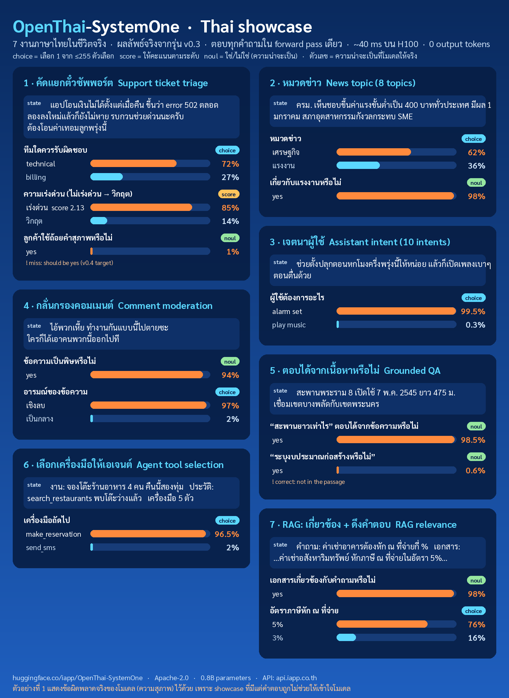

# 六个开放模型：任务、硬件与许可要一起选

开放权重不一定采用同一种开源许可，也不代表训练数据全部公开。下表方便先按任务缩小范围；更具体的运行依赖与证据边界在各条说明。

| 任务 | 本期对象 | 最需要先确认的条件 |
| --- | --- | --- |
| 设计图与透明图层 | Ming-Image-0.1-Design | 官方验证配置为单张 80GiB CUDA GPU |
| 小型数学推理 | Limite 1B Violetto | 当前需要专用 vLLM 插件 |
| 长时终端任务 | Tinfield 1 | 177B 总参数；BF16 分数不等于量化版分数 |
| 文字生成全身动作 | Light-O1-Preview | Linux / CUDA 13，动作还需控制器落地 |
| 泰语 / 英语结构化决策 | OpenThai-SystemOne | 不生成文本；校准和语言弱点仍需自测 |
| 对视频做结构控制与局部重绘 | ControlNet Union 2.0 | 13.5GB控制分支之外，还需基座、编码器与新版配置 |

## 01 · Ming-Image Design：把透明度也放进设计输出

2026-09-17。新近实用 / 新近创新；模型卡、代码与作者实验，本站未运行，热度待验证。

这个 6B 模型面向海报、信息图、UI 等视觉设计，除了普通 RGB 图像，也提供 RGBA 输出。透明度的价值是把主体或设计元素放回后续版式中，不必把带背景的整张图当作不可编辑素材。

模型卡提供 1024 与 2048 分辨率路径，示例采用 12 步、CFG 1、BF16，并明确主要验证环境为单张 80GiB CUDA GPU；不能因为参数只有 6B 就承诺消费级显存一定够用。运行依赖官方 Ming-Image 仓库，部分流程还涉及额外模型，应按对应例子准备组件。

权重采用 MIT。官方展示支持“可输出透明设计素材”这一判断，但漂亮样张没有证明任意文字都准确，也没有证明 UI 可直接变成可交互代码。现在值得试的是你确实需要透明素材或中文排版的任务；输出的字符、对齐与素材权利仍需检查。

官方 RGBA 展示。棋盘格用于表示透明区域，观察主体边缘及其能否与背景分离；这说明输出类型，不证明所有设计文字都正确。引用该效果图用于模型能力说明。（[来源原图](https://huggingface.co/inclusionAI/Ming-Image-0.1-Design)；[查看大图](images/model-ming-transparency.webp)。）

[模型卡与权重](https://huggingface.co/inclusionAI/Ming-Image-0.1-Design) · [许可](https://huggingface.co/inclusionAI/Ming-Image-0.1-Design/blob/main/LICENSE)

## 02 · Limite 1B Violetto：把小模型集中在数学单轮推理

2026-09-21。新近实用 / 新近创新；模型卡、代码与作者实验，本站未运行，热度待验证。

Limite 是从头训练的 1B 稠密模型，作者称预训练使用少于 300B token，再经过数学方向的合成数据、SFT 与强化学习。它刻意只做轻度指令调整，适合单轮数学解题，可能把普通请求重新理解成数学问题；不能按通用聊天助手的预期使用。

当前可执行路径是 Linux x86-64、CUDA 13 兼容 NVIDIA GPU，以及专用 vLLM 插件。仓库锁定 Python 3.12、vLLM 0.26.0、PyTorch 2.11.0 和 Transformers 5.6.2；普通 Transformers 直接加载支持仍在计划中。模型声称 131k 长度能力，但实际显存、吞吐与长题质量要按上下文实测。

BeyondAIME 的 74.25% 是作者报告，表中部分其他模型数字来自模型卡或 MathArena，未统一重新评估。权重与服务代码采用 Apache-2.0。新近价值是小体积专用数学模型的可下载实现，值得和同规模基线按同样题集、采样次数和时间预算比较。

[模型卡与权重](https://huggingface.co/paradigma-inc/limite-1b-violetto) · [许可](https://huggingface.co/paradigma-inc/limite-1b-violetto/blob/main/LICENSE)

## 03 · Tinfield 1：终端模型的激活参数不能当成显存需求

2026-09-21。新近实用 / 新近创新；模型卡、代码与作者实验，本站未运行，热度待验证。

Tinfield 1 基于 Qwen3.8-Flash-Next，针对终端操作和长时软件工程训练，总参数 177B、每 token 激活 6.6B，并提供 BF16 权重。激活参数描述每一步参与计算的规模，不表示其他权重无需存储，部署门槛不能按一个 6.6B 稠密模型估算。

模型卡在 mini-swe-agent、k=5 的完整任务集上报告 Terminal-Bench 4.0 为 33.0、DeepSWE v1.1 为 62.0；对应基座为 29.0、58.7。其他厂商排行榜可能使用不同 Agent 与推理强度，跨表排名不足以隔离模型本身的贡献。

量化包另列约 61GB 与 72GB，作者宣称能在 64GB 机器运行，但没有为量化版复测上述基准。它们的文件大小也不能当成峰值内存。许可是带条件的 Qwen Community License 1.0。现在值得看的是终端训练后的新权重；选量化版前应重新验证任务完成率、上下文和内存，而不是沿用 BF16 成绩。

[模型卡与权重](https://huggingface.co/badtheorylabs/Tinfield-1) · [许可](https://huggingface.co/badtheorylabs/Tinfield-1/blob/main/LICENSE)

## 04 · Light-O1：先解释动作意图，再输出身体动作序列

2026-09-20。新近实用 / 新近创新；模型卡、代码与作者实验，本站未运行，热度待验证。

Light-O1-Preview 基于 Qwen3.5-4B，把语言和人体动作联系起来：收到文字指令后，先输出可读的动作理解，再生成统一动作表示。官方 CLI 输出 float32 的 (frames, 138) 数组、20fps；它不是文本直接变成任意机器人电机命令，中间还需要动作解码与适配目标机器人的行为控制器。

代码与权重采用 Apache-2.0，检查点附动作解码器。当前推理支持 Linux x86-64、Python 3.11 和 CUDA 13 兼容 NVIDIA GPU，macOS / Windows 不在支持范围。最小路径是官方仓库 uv 环境、下载检查点，再用 light-deploy 将一条指令保存为 human_action.npy，并在三维查看器中检查动作。

技术博客提供 LightBot、G1 演示和 HY-Motion-Bench 比较，后者含 VLM 裁判；部分跨周人评图使用不同提示集，不能作严格同批比较。作者演示并不等于我们在实体机器人复现。现在值得关注的是可读意图与动作输出的衔接，可先验证单条动作是否符合方向、身体部位和时间约束。[技术博客与评测条件](https://www.lightorigins.com/en/blog/light-o1)

[模型卡与权重](https://huggingface.co/LightOriginsHQ/Light-O1-Preview) · [许可](https://huggingface.co/LightOriginsHQ/Light-O1-Preview/blob/main/LICENSE)

## 05 · OpenThai-SystemOne：泰语决策模型保留了一个高置信错误

2026-09-22。新近实用 / 新近创新；模型卡、代码与作者实验，本站未运行，热度待验证。

这是 9 月 20 日首次公开、9 月 22 日更新到 v0.3 的 0.8B 泰语 / 英语决策模型。它把文本或 JSON 状态和问题转成单选概率、有序评分或 yes/no 概率，一次前向返回结构化结果，不逐 token 生成解释。适合工单路由、意图判断和检索相关性，而不是开放式回答。

可通过 openthai-systemone Python 包加载权重或启动兼容接口；底座为 Qwen3.5-0.8B 文本部分，移除视觉编码器，并改用槽位预测头。作者报告约 40ms 的 H100 推理只是特定硬件测量，笔记本经网络请求的 170–220ms 又是另一口径，不能混成“本地 40ms”。

v0.3 加入真实训练集与针对弱点的合成记录，公开 13 子集宏平均从 63.2 到 74.3，但部分任务训练集已经进入训练，不能继续叫“从未训练过”。模型卡还保留对礼貌泰语以 99% 置信作出错误判断的例子。它说明校准不是每个子领域都可靠。权重采用 Apache-2.0；新近价值是明确面向泰语的可运行决策模型，采用前仍需自己的语言与类别测试。

作者 v0.3 的真实API输出。重点看左上工单：同一输入同时给出类别、紧急程度和礼貌判断；其中礼貌判断错误，作者明确保留了这个失败。数字是不同问题各自的概率，不能混为一个分布。Apache-2.0 来源原图；文字较密，请点大图查看。（[来源原图](https://huggingface.co/iapp/OpenThai-SystemOne)；[查看大图](images/model-thai-showcase.png)。）

[模型卡与权重](https://huggingface.co/iapp/OpenThai-SystemOne) · [许可](https://huggingface.co/iapp/OpenThai-SystemOne/blob/main/LICENSE)

## 06 · ControlNet Union 2.0：同一套视频控制分支增加三种输入

2026-09-22。新近实用 / 新近创新；模型卡、代码与作者实验，本站未运行，热度待验证。

2.0 把控制条件从五种增加到八种，新增涂鸦、布局框与灰度视频；控制分支从五层增至十层，并调整视频局部重绘的遮罩归一化。输入是控制视频、提示词和可选遮罩，输出是受其结构约束的新视频。适合已经在 VideoX-Fun 中处理视频、需要比纯文字更明确地控制画面的人。

这里开放的是约 13.5GB 控制分支，不是完整独立模型。还需 MiniMax-H3 基座与文本编码器，二者各约 62GB，完整加载无法放进一张 80GB GPU；模型卡提供分组卸载或CPU卸载加量化路径，但未给出所有配置的峰值内存与速度保证。

最重要的升级条件是改用 minimax_h3_control_inpaint_post_norm.yaml。沿用 v1 配置时，宽松加载可能静默丢掉一半控制层，程序能启动却生成错误结果。作者示例是40步、guidance_scale=1、控制强度1、seed43、704×1280像素预算、24fps；不要把几张精选样例当作严格优于v1的统一评测。

权重沿用 MiniMax H3 社区许可，明确排除欧盟、英国、韩国、美国等适用地域，并限制用途与再分发；不是无地域限制的通用开源许可。现在值得看的是9月22日实际公开的新分支与具体迁移要求，不是重新介绍基座。[9月17日的Meridian](../2026-09-17/02-开源模型.md) 用同一基座做新视角，这次是独立控制分支的新版本，任务与权重均不同。[运行代码](https://github.com/aigc-apps/VideoX-Fun)

[模型卡与权重](https://huggingface.co/alibaba-pai/MiniMax-H3-Fun-Controlnet-Union-2.0) · [许可](https://huggingface.co/alibaba-pai/MiniMax-H3-Fun-Controlnet-Union-2.0/blob/main/LICENSE)
