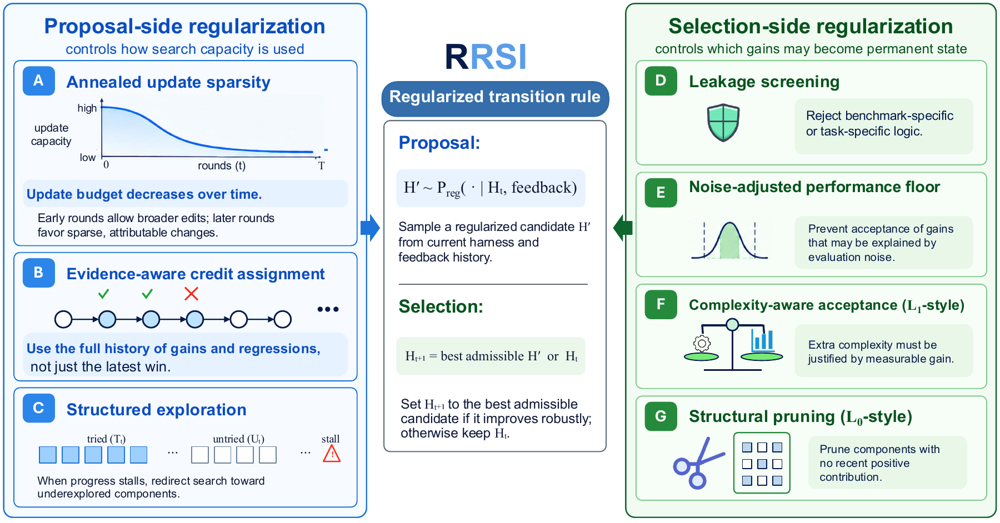

# 六篇论文：怎样保留有用信息，减少无效训练和搜索

先比较近期候选的主题、摘要、日期与既有收录，再精读这六篇的核心方法和实验。选题覆盖 Agent 框架演化、视频记忆、标注、蒸馏、低精度强化学习和线性注意力。论文榜单是发现入口，缺少第二类独立热度证据，因此均标注“热度待验证”。

下面的数字来自作者原文，本站没有运行完整训练。六篇提供站内阅读卡；WorldCrafter、onPanda、IER-OPD、Complex KDA 的对应许可允许归档 PDF，另两篇保留原站全文链接。

## 01 · RRSI：限制每次框架修改，让改进更容易迁移

2026-09-21 · arXiv:2609.24972 v1 · 预印本。新近创新，热度待验证。

这里的自我改进发生在 Agent 的执行框架，而不是模型权重。框架可以修改提示、工具、上下文管理和控制流程；问题在于反复根据同一小批题目调整，很容易记住题集特征，或者靠不断增加推理开销换分。

RRSI 约束搜索过程：早期允许较多可区分修改，后期逐渐减少；记录每次假设、差异、分数和成本，保留被否定的证据；选择候选前检查是否写入题目特有内容，再用基线重复运行估计的噪声范围判断增益。长期无贡献的组件进入删除候选，额外 token 成本必须有相应收益支持。原文借用了 L0/L1/L2 正则化的直觉，并不是在直接优化一组带这些罚项的模型权重。

主要实验冻结 Claude Opus 4.8，并让各演化方法共享初始框架、演化集与候选预算。在工作任务中，RRSI 的演化集提升并不最大，却把三个域外测试的平均分从 39.7 提到 43.6；Meta-Harness 的演化集分数更高，域外收益则较小。代码实验也有从 Terminal-Bench 到 SWE-bench 的迁移检查。

成本必须一起读：RRSI 每次试验约 242 万策略 token，低于无正则演化的 380 万，但仍高于原框架的 156 万。它不是“免费自我进化”。结果涉及有限任务、模型裁判与特定搜索预算，代码和工程测试的确定性判题补强了证据，却不保证迁移到任意环境。现在值得复现的是“只看演化集分数”与“同时约束噪声、成本、泄漏”的对照。

作者方法总览图（Figure 2）。上游限制如何提出修改，下游限制什么修改可以保留；顺着提案、评估、反馈循环阅读。限本条方法评论引用，不表示取得全文再分发许可。（[作者原图](https://arxiv.org/abs/2609.24972v1)；[查看大图](images/paper-rrsi.png)。）

[论文原文](https://arxiv.org/abs/2609.24972v1) · [站内阅读卡](../../../../papers/frontiers/rrsi/00-阅读卡.md)

此版本采用 arXiv 非独占分发许可，不能据此推断本站获准再分发全文；本站只保存阅读卡，PDF 请到原站阅读。方法图在本页针对性技术评论中作有限引用，未改动数据或关系，不表示可任意再分发。

## 02 · WorldCrafter：回到旧地点时，视频世界还记得什么

2026-09-21 · arXiv:2609.24984 v1 · 预印本。新近创新，热度待验证。

视频逐段生成时，最近几帧通常记得住，较早离开的场景却容易变化。WorldCrafter 把历史画面及其相机位置编码成紧凑记忆，再根据接下来要去的视角读出相关内容。它不是每一步都重建完整三维场景，也不是无条件把全部历史帧塞回模型。

具体做法是保留最近历史帧，再选八个能共同覆盖目标区域的历史帧；编码后读出相当于四帧 token 量的记忆，与近期上下文、当前噪声视频共同输入生成器。相机引导的读出优于不看目标视角的固定压缩，消融也比较了联合训练、历史帧选择与直接上下文记忆。

作者构造 145 张起始图、每图五条轨迹，共 725 段每方法生成的视频，包含动态和静态场景与闭环回访。所有方法接收相同起始图、文字和目标轨迹，输出统一缩至 640×384 评估；但部分基线是全步模型，部分是蒸馏模型，不能把所有结果当成等计算预算竞争。回访对照中，WorldCrafter 相对 Lyra 2.0 的 LPIPS 从 0.487 降至 0.255，PSNR 从 14.050 升至 18.016dB。

原文的 21.7 倍只比较记忆处理组件，排除了共享 VAE 解码与视频去噪，不是整体生成加速。蒸馏版报告四 GPU 下 16fps，也不是消费级单卡结论。其新价值在于把“以后会看哪里”用于分配有限记忆；真实世界动力学、几何估计误差与长时开放交互仍需继续检验。

作者方法图。历史画面先写入记忆，目标相机位置参与读出，所得记忆再进入视频生成。重点看“写入”与“按目标视角读取”的区别；CC BY 4.0 原图。（[作者原图](https://arxiv.org/abs/2609.24984v1)；[查看大图](images/paper-worldcrafter.png)。）

[论文原文](https://arxiv.org/abs/2609.24984v1) · [站内阅读卡](../../../../papers/frontiers/worldcrafter/00-阅读卡.md) · [归档 PDF](../../../../papers/frontiers/worldcrafter/2609.24984v1.pdf)

此版本许可允许再分发（CC BY 4.0 或 CC0，见下方原始许可），本站保存未经修改的原始 PDF，保留作者、版本和来源。

## 03 · onPanda：改掉第一个错误，再让模型接着写

2026-09-21 · arXiv:2609.24983 v1 · 预印本。新近创新，热度待验证。

人工把整段回答重写成完美答案，可能让训练数据偏离模型本来会生成的分布。onPanda 的交互是找到一个错误 token，选择候选或输入替代文字，截去其后的内容，再由同一模型沿修正后的前缀续写。前面的 token 保持不变，每次分叉及操作都保存在标注树中。

界面显示候选 token 和概率，但低概率不自动等于错误。它可将结构化推理、回答和工具调用映射回模型原始 token 流，允许纠正工具参数后再批准执行。输出的 .panda.json 能保留正负样本、纠正位置和操作轨迹，供后续训练数据整理；推理 API 必须支持前缀续写及 top-k logprobs，概率刷新还需 prompt_logprobs。

受控实验只有三名标注者、21 个图像描述任务，初始回答来自同一个 Qwen3.5-35B-A3B。中位耗时由 POTATO 手工后编辑的 681 秒降至 onPanda 的 330 秒，约少 51.5%；均值下降只有 27.5%，不能把中位数降幅推广到总人工成本。Argilla 排序模式中位为 336 秒，接近 onPanda，但它未必能选出合格答案。

比较同时改变了界面和标注范式，所以不能单独归因于某个控件。质量主要由模型裁判衡量，辅以小规模人评；作者明确没有证明这些细粒度数据能提高下游模型训练效果。新近实用之处是提供可追踪的纠错过程，最适合原回答大体合理、只有少数局部错误的情形。

作者 Figure 1，真实标注界面。观察概率提示、纠正位置和会话分叉如何相互对应；颜色是模型概率信息，不是“正确 / 错误”的人工真值。原版采用 CC0。（[作者原图](https://arxiv.org/abs/2609.24983v1)；[查看大图](images/paper-onpanda.png)。）

[论文原文](https://arxiv.org/abs/2609.24983v1) · [站内阅读卡](../../../../papers/frontiers/onpanda/00-阅读卡.md) · [归档 PDF](../../../../papers/frontiers/onpanda/2609.24983v1.pdf)

此版本许可允许再分发（CC BY 4.0 或 CC0，见下方原始许可），本站保存未经修改的原始 PDF，保留作者、版本和来源。

## 04 · IER-OPD：重要的 token，也可能给出嘈杂梯度

2026-09-21 · arXiv:2609.24432 v1 · 预印本。新近创新，热度待验证。

在策略蒸馏让学生沿自己的输出向老师学习。常见筛选器寻找“有用”的位置，例如双方分歧大、学生不确定；但一个位置即使值得学，单次采样给出的梯度也可能很不稳定。本文用信息效率比 IER 估计信号相对噪声的强弱，再与已有的重要性指标组合。

理论分析固定前缀下的梯度估计与最优基线；实际实现不遍历完整词表，而使用师生各自 top-k 候选和已采样 token 的并集近似。IER-AND 要求重要性和可靠性都高，IER-OR 则允许任一信号补足另一项。这些近似不是保证最优 token 集合的定理，和某些熵筛选器组合时也会变差。

数学实验包括 1.5B 同规模强弱模型蒸馏，以及 4B 到 1.7B 蒸馏，用 DAPO-Math-17k 进行 50 轮 rollout，报告 Bayes@32 而非单次正确率。医疗实验为 ClinAlign-4B 到 Qwen3-4B、100 轮训练，HealthBench 由 gpt-oss-120B 判分。极小预算下，部分 IER 组合接近或超过全 token 蒸馏，例如医疗总体分数在 0.1% 预算下接近 45.77 的全量基线；这不是临床有效性验证。

“1% token”指被选中施加监督的位置比例，不是总训练 FLOPs、老师调用或端到端时间只剩 1%。采样、打分和前向仍有成本。现在值得看的创新，是把“该不该学”和“这次梯度是否可靠”分开；复现时应同时记录时间、显存和最终任务分数。

作者 HealthBench 预算曲线（Figure 2）。横轴是监督 token 预算，阴影为 90% bootstrap 置信区间；比较同一基础筛选器加入 IER 前后，而不要把医疗基准分数当成患者效果。CC BY 4.0。（[作者原图](https://arxiv.org/abs/2609.24432v1)；[查看大图](images/paper-ier.png)。）

[论文原文](https://arxiv.org/abs/2609.24432v1) · [站内阅读卡](../../../../papers/frontiers/ier-opd/00-阅读卡.md) · [归档 PDF](../../../../papers/frontiers/ier-opd/2609.24432v1.pdf)

此版本许可允许再分发（CC BY 4.0 或 CC0，见下方原始许可），本站保存未经修改的原始 PDF，保留作者、版本和来源。

## 05 · 全流程 FP8 强化学习：量化改变了哪些 token 还能被惩罚

2026-09-19 · arXiv:2609.22870 v1 · 预印本。新近创新，热度待验证。

把 rollout 和训练都切到 FP8，不只是少存几位小数。本文发现量化扰动会改变新旧策略的概率比；对于负优势 token，概率比一旦被推过下裁剪边界，它本该受到的惩罚可能被截断。乱码等低质量输出因而可能持续累积，伴随异常熵增长。

Calibrated Clipping 用同批次的 BF16 参考前向校准：先让 FP8 下负优势 token 的裁剪比例接近 BF16，再调整上边界，平衡正负更新贡献。参考前向有代价，所以作者每 20 个训练步重校准一次，并平滑更新边界；这不是完全摆脱高精度计算的方案。

实验基于 VeRL、vLLM、TorchAO 和 FlashRL 补丁。Qwen3-8B 的 GRPO 数学任务中，blockwise FP8 的八项平均分由 54.1 到 58.6，BF16 基线为 57.6；但 tensorwise、rowwise 校准后仍低于 BF16。Qwen3-14B 的 DAPO 实验也恢复了不少性能，却没有全部追平 BF16。因此“稳定训练”不能改写成所有粒度都无损。

吞吐图是离线训练阶段测试，排除了周期性 BF16 参考前向；最高约 1.5 倍不能当成完整 RL 作业的端到端收益。为什么现在值得看：它定位了量化和裁剪规则之间的具体失配，给出可验证干预，而不只说 FP8 更快。复现还要关注硬件、响应长度、检查点选取与多随机种子稳定性。

作者案例分析图。把异常熵、训练表现与不同精度对照一起看，理解为什么“还能运行”不代表训练稳定。限本条方法评论引用，保持原图坐标、曲线和图例。（[作者原图](https://arxiv.org/abs/2609.22870v1)；[查看大图](images/paper-fp8.png)。）

[论文原文](https://arxiv.org/abs/2609.22870v1) · [站内阅读卡](../../../../papers/frontiers/full-pipeline-fp8-rl/00-阅读卡.md)

此版本采用 arXiv 非独占分发许可，不能据此推断本站获准再分发全文；本站只保存阅读卡，PDF 请到原站阅读。方法图在本页针对性技术评论中作有限引用，未改动数据或关系，不表示可任意再分发。

## 06 · Complex KDA：两次反射，让线性状态真正转起来

2026-09-21 · arXiv:2609.24797 v1 · 预印本。新近创新，热度待验证。

标准 KDA 将通道衰减门与低秩更新组合。CKDA 同时允许门取 −1 到 1、更新系数 β 取 0 到 2：带负号的门可以作一次坐标反射，β=2 时的 Householder 更新再作一次反射。两次方向不同的反射合起来就是旋转，于是状态能保存相位，而不只是沿实特征方向衰减。

这个变化仍保持对角加秩一形式和非扩张条件。论文给出正交转移矩阵的刻画及群状态跟踪结论，但可表达不等于训练一定学得会：普通训练未学好 A5，靠近理论构造的初始化才得到更好外推，而且该实验连架构和训练计划也变了，不能只归功于初始化。

状态跟踪实验训练长度到 32，图中报告三种种子的最佳结果，并将随机猜测到完美表现缩放为 0–1；不是种子平均原始准确率。S3、S4 外推在两项范围同时扩展时最好，S4 长序列仍下降。周期波形任务中，非线性 GRU 依然更准确，不能从特定 Transformer 对照推导它全面领先。

语言建模的 1.3B 参数、100B FineWeb-Edu token 实验里，循环 CKDA 与匹配 KDA 的平均准确率为 54.06% 和 54.09%，基本相当。实现保留约 96–97% 的 KDA 内核吞吐，而不是零开销。它现在值得读的核心是表达能力解释及可运行实现，不是一个夸大的通用语言性能突破。技术实践用二维算例演示这两次反射。

作者状态跟踪图（Figure 6）。比较同时放宽两个范围与只改一个范围；结果是最佳种子的缩放准确率，A5 使用不同的理论附近初始化设置。请结合正文条件阅读，CC BY 4.0。（[作者原图](https://arxiv.org/abs/2609.24797v1)；[查看大图](images/paper-ckda.png)。）

[论文原文](https://arxiv.org/abs/2609.24797v1) · [站内阅读卡](../../../../papers/frontiers/complex-kda/00-阅读卡.md) · [归档 PDF](../../../../papers/frontiers/complex-kda/2609.24797v1.pdf)

此版本许可允许再分发（CC BY 4.0 或 CC0，见下方原始许可），本站保存未经修改的原始 PDF，保留作者、版本和来源。
