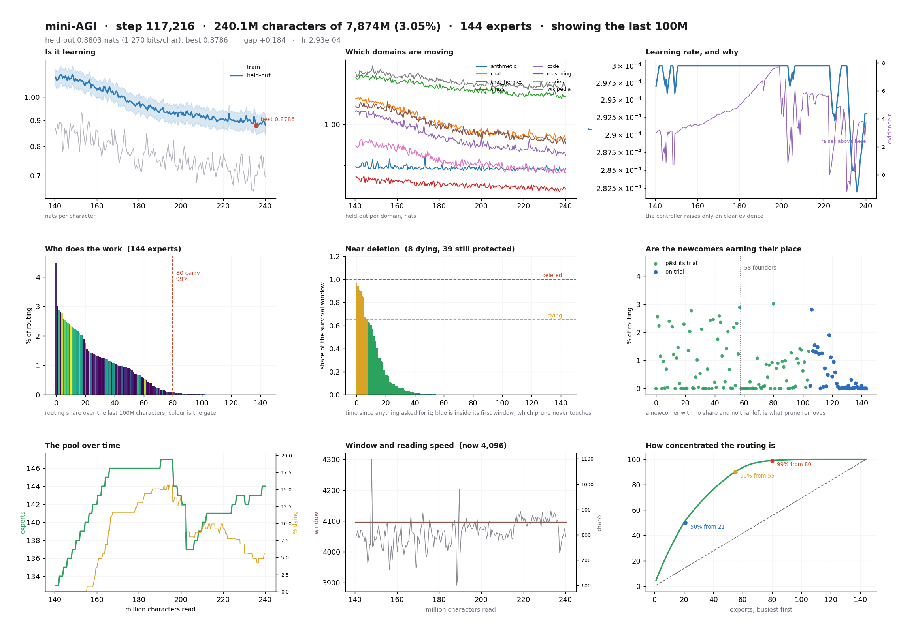

# 十个项目：从输入、输出和使用门槛判断是否值得试

本期同时从近期项目列表、社区线索与作者发布寻找候选，再回到仓库检查。没有用历史 Star 排名认定“热门”，以下项目均凭新近公开实现或实质版本入选；未安装第三方工具，也没有调用其付费 API。

| 你的任务 | 项目 | 输入 → 输出 |
| --- | --- | --- |
| 长工具任务仍要及时接收新输入 | Unreal Agent | 会话事件 → 异步操作与可恢复历史 |
| 看懂 Agent 正在读改什么 | Graphlin | 代码与工具事件 → 架构 / 活动视图 |
| 在现有 LLM CLI 中调用决策模型 | llm-typesafe | 文本与判断标准 → 类型化决定 |
| 编辑本地 Markdown / MDX | Fulvid | 普通文件 → 源码编辑与惰性预览 |
| Apple 芯片上做短决策 | Laya-CoreML | 状态与选项 → 本地概率 |
| 为手机消息起草回复 | Jev Chat Jarvis | 当前可见对话 → 候选回复与填入 |
| 研究低显存持续学习 | mini-AGI | 字节流 → 增长的玩具模型与训练记录 |
| 本地给编码 Agent 提供模型 | Splash | 兼容 API 请求 → Mac 上流式推理 |
| 把规划审查与大量实现分工 | Astra Flash Orchestrator | 需求 / 计划 → 分阶段补丁与验收材料 |
| 研究论文方法图的表达方式 | Top-Conf Figure Gallery | 标题、作者与筛选条件 → 原论文图例 |

## 01 · Unreal Agent：工具还在运行时，会话可以继续

2026-09-22。新近实用；文档、公开实现与作者演示，本站未运行，热度待验证。

传统的一问一答工具循环容易被长测试或远程操作卡住。Unreal Agent 把模型提出的工具调用翻译成独立、可序列化的操作，协调器继续接收事件；会话保存追加历史与操作状态，方便恢复或分叉。适合研究需要中途补充指令、多个耗时工具并行的 Agent。

仓库提供 Go 框架、cmd 可执行入口和基准运行器，先按 Makefile / go.mod 准备工具链，再选择示例和模型适配器；接入外部模型仍需对应账号或 API。工具翻译器负责验证和生成操作，实际 I/O 交给操作运行时，扩展时要保留这一分工。

作者新发布文章展示异步交互与基准，本期只核对实现、版本和说明，未复跑成本结论。v0.1 系列仍早期；可恢复日志也不自动等于所有外部动作可撤销。[发布说明](https://unreallabs.ai/blog/unreal-agent/)

[规范仓库](https://github.com/unreallabsai/unreal-agent) · [MIT](https://github.com/unreallabsai/unreal-agent/blob/main/LICENSE)

## 02 · Graphlin：让代码结构与 Agent 活动在同一张图里可见

2026-09-20。新近实用；文档、公开实现与作者演示，本站未运行，热度待验证。

Graphlin 读取仓库和 Agent 工具事件，把文件、符号关系及读写活动显示为实时视图。它适合边看 Agent 改代码、边确认改动落在哪个模块，也能选择代码、C4、Changes 和时间线视图。图表示可观察代码证据，不会证明真实运行时所有组件都按图连接，更不会展示模型私有思考。

需要 macOS / Linux、Node.js 22.14+ 以及 Claude Code 或 Codex CLI。可以先用 npx graphlin@latest demo 打开无需密钥的离线演示，再决定是否在仓库接入 hooks。纯本地解析覆盖 JS、TS、TSX 和 Python。

AI 分类是可选功能，需要 TypeSafe 密钥；source 模式可能发送筛选后的源码、提示与公开消息，不能把整套工具都笼统称作完全离线。当前属于开发预览，许可为 MIT。[作者发布](https://robotpaper.ai/graphlin-jev-enabled-live-architecture-visualizer/)

作者的架构回放界面：上层展示创建笔记、保存笔记与缓存的代码关系，下层展示应用与服务的调用。Code evidence 表示代码证据，不等于运行时测试；MIT 仓库素材。（[来源原图](https://github.com/royosherove/graphlin)；[查看大图](images/project-graphlin.png)。）

[规范仓库](https://github.com/royosherove/graphlin) · [MIT](https://github.com/royosherove/graphlin/blob/main/LICENSE)

## 03 · llm-typesafe：在熟悉的命令行里试类型化判断

2026-09-22。新近实用；文档、公开实现与作者演示，本站未运行，热度待验证。

这是 Simon Willison 为 LLM CLI 写的新插件，输入仍可来自文本文件或标准输入，输出则是 Jev 的 yes/no 概率、候选分类或有序评分。例如把报障文字交给它，按“信息不足、部分步骤、完整复现”给出评分，而不是让模型自由生成一段看似 JSON 的解释。

最小路径是已有 LLM 工具、llm install llm-typesafe，再配置 TypeSafe API 密钥。作者给出退款判断、工单分流和可复现性评分的实际命令与输出，适合做小批任务对照。代码开放不代表 Jev 服务也在本地或免费。

0.1a0 是初始 alpha，接口和错误处理还需关注后续版本；分数也不自动保证概率校准。新价值是降低把决策 API 接入已有脚本的成本，而不是重新推荐已经报道过的底层模型。[作者说明](https://simonwillison.net/2026/Sep/22/llm-typesafe/)

[规范仓库](https://github.com/simonw/llm-typesafe) · [Apache-2.0](https://github.com/simonw/llm-typesafe/blob/main/LICENSE)

## 04 · Fulvid：普通文件就是笔记和文档的来源

2026-09-19。新近实用；文档、公开实现与作者演示，本站未运行，热度待验证。

Fulvid 是 Markdown / MDX 桌面编辑器，直接打开和保存磁盘文件，适合维护论文笔记或 Git 文档库。源码旁可显示预览，文件夹模式提供搜索、标题大纲和文档链接图；MDX 中的 JSX 保留为源码，不会在预览中执行成应用。

仓库采用 Monaco 与 Electrobun，MIT 许可。当前 README 的稳妥上手路径是源码：Bun 1.4.2+、Node 18+，安装依赖后依次运行 doctor 与 dev；Linux 还涉及 WebKitGTK 等系统库。已核对 9 月 19 日 v1.0.0 发布记录，但 README 的安装段仍写“尚无已发布下载”，两处状态不同步，因此不保证读者能直接获得适合自己平台的安装包。

它的价值是降低专有笔记库格式的依赖。临时行注释只在会话保存，退出会消失；链接图展示真实文档引用，不是自动生成的知识正确性判断。

官方真实编辑界面：左侧文件与编辑区、右侧预览对应同一份 Markdown 源码。预览是阅读辅助，不执行 MDX 组件；MIT 仓库截图。（[来源原图](https://github.com/ManuelGil/fulvid)；[查看大图](images/project-fulvid.png)。）

[规范仓库](https://github.com/ManuelGil/fulvid) · [MIT](https://github.com/ManuelGil/fulvid/blob/main/LICENSE)

## 05 · Laya-CoreML：把短决策放到 Apple Neural Engine

2026-09-19。新近实用；文档、公开实现与作者演示，本站未运行，热度待验证。

[9 月 19 日介绍过 Laya 模型](../2026-09-19/02-开源模型.md)，这次新增对象是独立的 Core ML / Neural Engine 运行时与验证材料。输入状态、问题和选项，输出概率，不进行自回归文字生成；适合把短判断嵌进本地应用。贪吃蛇演示包含显式规划特征与安全层，不能把游戏成绩全归功于模型。

需要 Apple Silicon、macOS 15+、Python 3.11–3.13，下载对应转换权重后可离线运行；推理无需 PyTorch、Transformers 或 MLX。ANE 包总长度只有 96 token，较长任务需换 1024-token 的通用包，超长请求会报容量错误。

作者在 M3 Max 上报告短问题 P50 4.98ms，并提供能耗与移植对照，本站未复测。它还对过于激进的温度校准值作夹限并警告；低延迟不会自动带来可靠概率。代码 Apache-2.0，权重与上游条款分别查看。

[规范仓库](https://github.com/mizorewww/laya-coreml) · [Apache-2.0](https://github.com/mizorewww/laya-coreml/blob/main/LICENSE)

## 06 · Jev Chat Jarvis：手机对话的候选回复留给人决定

2026-09-22。新近实用；文档、公开实现与作者演示，本站未运行，热度待验证。

这个 Android 工具读取当前可见对话，给出候选回复，并能填入输入框，最终是否发送由用户决定。9 月 22 日 v1.3 增加判断、回复、视觉三路接口配置，本地笔记与联系人上下文，以及无障碍树读不到正文时的 OCR 兜底。

安装面向 Android 11+ 的 arm64 包，需要无障碍等系统权限，并配置相应模型服务密钥。离线 OCR 不上传截图，但提取出的对话用于云模型请求时仍可能离开设备，不能因此把完整回复流程说成离线。历史记录默认关闭，启用后存本机。

它适合需要跨聊天应用整理上下文和草拟回复的人。OCR 只看得到当前屏幕，长消息和识别错字会影响结果；作者注明部分 X 群聊场景未验证、部分系统存在后台冻结问题。MIT 是应用代码许可，第三方服务另计。

[规范仓库](https://github.com/jev-chat/jev-chat-jarvis) · [MIT](https://github.com/jev-chat/jev-chat-jarvis/blob/main/LICENSE)

## 07 · mini-AGI：可观察的持续学习玩具，不是通用智能成品

2026-09-19。新近实用；文档、公开实现与作者演示，本站未运行，热度待验证。

mini-AGI 从字节流训练小模型，把专家权重作为磁盘文件按需换入显存，并在训练中增长或修剪容量。适合研究路由、持续学习和硬件约束的读者；作者明确称它为玩具实验，当前样例仍有重复、算术和连贯性错误。

需要至少 8GB CUDA GPU、Python 3.10+ 与匹配的 PyTorch。可先构建小规模语料，或指向自己的文件，再运行 train.py read 并保留 held-out 数据；serve.py 提供观察界面。完整训练要持续较长时间，不能把支持 8GB 显存理解为几分钟就能训练出可用助手。

作者权重尚未发布，公开的是可复用训练实现、配置、样例和曲线。仪表盘让容量、损失和样例变化能被检查，但不足以证明彻底解决灾难性遗忘。MIT 代码与下载语料的许可需分开；本期未运行训练。

作者训练仪表盘：先看左上训练与保留集损失，再看下方专家数量与路由集中度；损失下降与容量增加是不同指标。这里是作者运行记录，不是本站实测或通用能力证明。（[来源原图](https://github.com/volotat/mini-AGI)；[查看大图](images/project-miniagi-dashboard.png)。）

[规范仓库](https://github.com/volotat/mini-AGI) · [MIT](https://github.com/volotat/mini-AGI/blob/main/LICENSE)

## 08 · Splash：为少量指定模型优化的 Mac 推理服务

2026-09-18。新近实用；文档、公开实现与作者演示，本站未运行，热度待验证。

Splash 在单台 Mac 上给编码 Agent 提供 OpenAI / Anthropic 风格接口。它不是任意模型的通用转换器，而是把特定模型的 Metal 内核、草稿模型和内存规划打包；输入兼容请求，输出流式回复和工具调用。

需要 M3 或更新芯片、macOS 26.4+、至少 36GB 统一内存，推荐 48GB。通过 Homebrew 安装后，splash serve 下载验证模型包并监听本地端口；普通 MLX / Transformers 目录不能直接替代它的包格式。代码 Apache-2.0，包内模型另受各自许可约束。

作者在 48GB M5 Pro、指定 SPEED-Bench 提示和输出预算上报告速度优势，32k 缓存命中的首 token 延迟又是单独条件，本站未复跑。现在值得试的是已有足够内存、想给本地编码工作流提供兼容服务的用户，不宜据此承诺旧 Mac 或所有模型同样加速。

[规范仓库](https://github.com/incoai/splash) · [Apache-2.0](https://github.com/incoai/splash/blob/main/LICENSE)

## 09 · Astra Flash Orchestrator：把大量实现工作交给单独执行角色

2026-09-17。新近实用；文档、公开实现与作者演示，本站未运行，热度待验证。

这套工作流让 Astra 负责需求范围、关键设计和验收，把连贯的实现任务交给 DeepSeek V4.1 Flash，再带着补丁与测试证据返回审查。它提供安装脚本、角色配置和恢复记录，适合已经在 Codex 中使用多角色分工、希望减少高成本模型重复阅读的人。

前提较多：支持原生子 Agent 的 Codex、Python 3.11+、已配置的 Codex Router，以及本地目录确实声明支持相应 worker 路由。install.py 默认只预览，显式 apply 才落盘；没有现成路由时不能靠复制配置假装可用。本期只检查代码与文档，不安装、不发起收费调用。

作者按“每千行实现代码”的成本展示节省，并对 Astra 使用 API 等价估算，不是订阅账单。更多代码行也不等于更好交付，因此不采用 97% 等数字作效果承诺。新近实用之处是可检查的分工和验收流程，仍属早期项目。

[规范仓库](https://github.com/ethanplusai/astra-flash-orchestrator) · [MIT](https://github.com/ethanplusai/astra-flash-orchestrator/blob/main/LICENSE)

## 10 · Top-Conf Figure Gallery：按表达任务寻找论文主图参考

2026-09-17。新近实用；文档、公开实现与作者演示，本站未运行，热度待验证。

这个静态工具按论文标题、作者、会议、年份和视觉模式检索 Figure 1 / teaser，帮助研究者比较方法图如何组织信息。库中论文来自 2023–2025 年；今天的新对象是 9 月公开的检索和整理工具，并不是把这些老论文包装成新研究。

可以直接打开在线画廊，或克隆仓库查看 index.html；网页不需要后端构建。若要复跑采集和处理管线，则需 Python 3.10+ 及 requirements 中的 PDF / 图像依赖。作者报告收录 2,730 张图并作筛选，本站未逐张复核，不把会议等级或作者审美当作论文质量排名。

许可文件明确 MIT 只覆盖代码、脚本和站点，论文图片仍属于各作者与出版方。适合借鉴信息顺序、空间关系和标注方式，使用具体图片必须回查原论文许可。本期不复制它的整套图集作为素材。

[规范仓库](https://github.com/qwdwqfwq/topconf-paper-figure-gallery) · [MIT](https://github.com/qwdwqfwq/topconf-paper-figure-gallery/blob/main/LICENSE)
