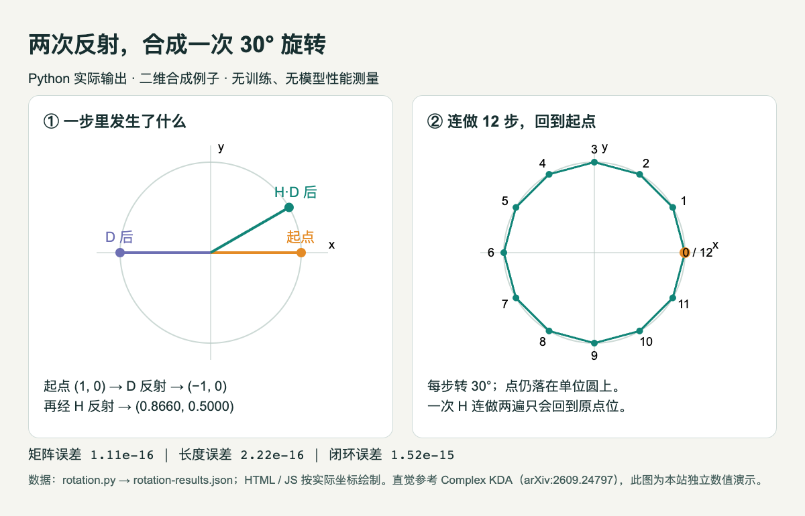

# 两次反射为什么能得到旋转：一段真正跑过的 Python

今天 [Complex KDA 的阅读卡](../../../../papers/frontiers/complex-kda/00-阅读卡.md) 涉及一个直觉：在循环状态更新里，允许有符号的逐通道门控，可以与反射组合出旋转。先不训练网络，我们把这句话缩成一个二维例子。

这是本机已运行的线性代数验证，只依赖 Python 标准库。没有 GPU、模型权重或外部 API，也没有复现论文的语言建模成绩。

## 从一个点开始

把状态写成列向量 p = (1, 0)。D = diag(−1, 1) 把横坐标翻转，得到 (−1, 0)，这是关于纵轴的一次反射。再选单位向量 k = (cos 15°, sin 15°)，定义 H = I − 2kkᵀ。H 同样是一次反射，但反射轴方向与 D 不同。

矩阵乘法右边先执行，所以 A = HD 表示先做 D，再做 H。直接展开可得 A 的第一行是 (cos 30°, −sin 30°)，第二行是 (sin 30°, cos 30°)，正好是逆时针旋转 30° 的矩阵。两次翻面合起来可以改变方向而保留长度；只有一次反射则不能连续绕圆前进。

## 核心实现

```python
theta = math.pi / 6
k = [math.cos(theta / 2), math.sin(theta / 2)]
D = [[-1, 0], [0, 1]]
H = [[(i == j) - 2*k[i]*k[j] for j in range(2)] for i in range(2)]
A = mm(H, D)
points = [[1.0, 0.0]]
for _ in range(12):
    points.append(mv(A, points[-1]))
```

mm 和 mv 分别是普通的矩阵乘矩阵、矩阵乘向量，完整实现没有隐藏的数值库。在仓库根目录运行：

```bash
python3 content/frontiers/2026/09/2026-09-23/code/rotation.py
```

## 实际结果怎么看



左图先看紫色点，再看绿色点；右图的编号是更新步数。图来自本次 Python 输出，用 HTML / JS 按精确坐标绘制，不是 AI 生成图或论文实验截图。[查看大图](images/practice-rotation.png) · [数据](code/rotation-results.json) · [绘图源码](code/rotation.html)。

本机 Python 3.14.3：第一次更新得到 (0.866025, 0.500000)。12 次后回到起点的距离误差为 1.515e-15，各点长度偏离 1 的最大误差为 2.220e-16，矩阵与解析旋转公式的最大逐项误差为 1.110e-16。此外验证了 H 连做两次等于恒等变换，全部断言阈值为 1e−12。

误差来自浮点计算；这里没有随机采样，不需要种子。把角度改成 60° 后应把闭环步数改为 6；任意角度不一定在 12 步闭合，不能把这个断言机械照抄。

## 这个例子证明到哪里

它只验证特定单位 k、β = 2、D = diag(−1, 1) 的二维构造。论文讨论的是更一般的状态更新、谱与表达能力，还包含真实训练中要学习的门控、注入项和高维状态。二维状态能旋转，不代表网络一定学会长期记忆，更不证明语言模型准确率会提高；论文的 1.3B 实验反而提醒我们区分表达能力与实际基准收益。

[完整 Python](code/rotation.py) · [原始运行输出](code/rotation-run.txt) · [绘图数据脚本](code/rotation-results.js) · [论文 v1](https://arxiv.org/abs/2609.24797v1)。
