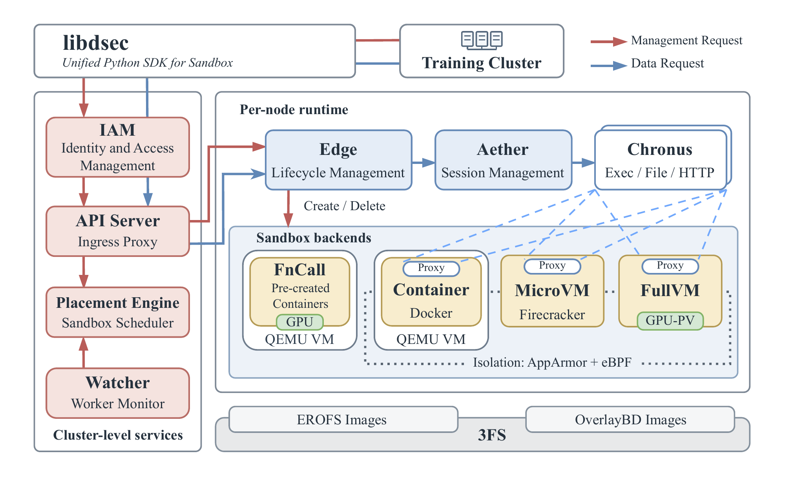
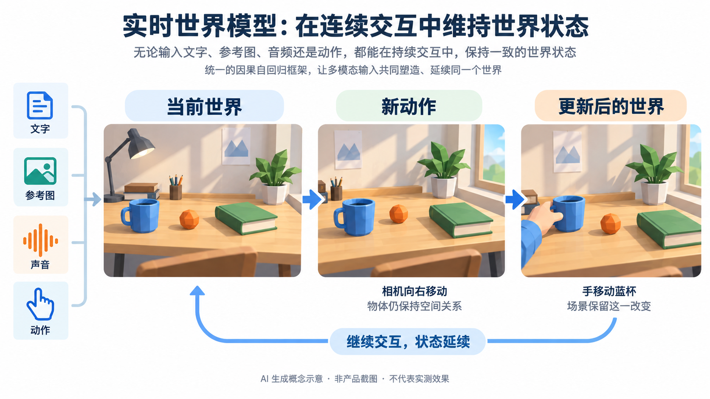

# AI 动态：语音进入工作流，Agent 需要可检验的边界

15 条独立事件，前 5 条重点详解、后 10 条速读。原始公告日期为 9 月 19–23 日；以 23 日为主，22 日和19日明确标为近期补充。北京早间复查加入 Meta Connect 新公告，按同一次发布合并。产品效果与研究数字均注明来源性质，本站没有实测这些产品；未凑足两类独立热度证据的条目统一视为热度待验证。

## 01 · Gemini 3.8 TTS：声音风格开始成为可编辑条件

2026-09-23。新近实用 / 新近创新；重点详解。

Google 推出 Gemini 3.8 Flash TTS 与 Flash-Lite TTS。前者侧重角色、语气和表现力，后者面向大批量、成本敏感的语音生成。它们接收文字与声音风格条件，输出音频；这与持续听取用户讲话并决定行动的实时语音 Agent 是不同层面的能力。

比较有用的变化，是把声音设计写成可修改的描述：角色、口音、情绪、语速可以参与生成，而不只是从固定音色列表选一项。官方还展示双说话人脚本、逐句控制和较长音频。做课程对话时，可以先固定两个角色，再改某一句的停顿和语气；这是使用场景解释，本站没有验证长音频的一致性。

Flash 还提供声音克隆路径，需要约30秒授权声音样本及本人同意验证；声音混合仍属后续计划，不能写成当天全部可用。官方提到100多种语言和方言、2000多种声音，但支持列表不等于每种口音都达到相同质量。研发评估宜分别听可懂度、角色稳定性和情绪是否过头。

发布从 Gemini API 和 AI Studio 开始，Enterprise API 稍后；不同消费产品采用的版本也不同。声音克隆存在地区限制，不能只看到按钮演示就假定自己的账号可以使用。官方以 SynthID 和 C2PA 表达来源标记，这些机制同样不能替用户取得他人的声音授权。

现在值得关注的是可控制声音的产品接口变多了。选型时应拿同一段专有名词、数字和双人脚本比较，保留生成设置，并单独计算返工和延迟。公告及官方评测支持功能与开放状态，不构成本站对自然度、价格或所有语言的独立测量。

[原始来源](https://blog.google/innovation-and-ai/models-and-research/gemini-models/gemini-3-8-text-to-speech/)

## 02 · Meta Connect：把 AI 放进眼镜，也把设备边界讲清

2026-09-23。新近实用 / 新近创新；重点详解。

Meta 在 Connect 同时更新多条眼镜产品线，并宣布把 Muse 个人 Agent 带到 AI 眼镜。共同方向是用声音、视线或手势处理信息，减少掏手机的步骤；但 Audio、拍摄眼镜、Display 与 VR 设备的硬件和可用时间完全不同，不能看作同一副“什么都能做”的眼镜。

Ray-Ban Meta Audio 约43克，主打开放式收听、通话和语音交互，349美元起预售、10月13日发货。Gen 3 则保留相机和视频功能，增加可自定义动作按键，官方称续航最长9小时，449美元起当天上市。续航为厂商口径，实际连续AI调用不能直接沿用这一数字。

[Display 更新](https://about.fb.com/news/2026/09/new-features-for-meta-ray-ban-display-navigation-hologram/)包含骑行、公交导航，以及以眼前地标描述转向。Hologram 先采集人脸，再以声音推断数字分身的表情，计划秋季在美国 WhatsApp Early Access 开放；它不是眼镜实时拍到佩戴者面部。国家、语言和功能批次仍有差异。

[新 VR Glasses](https://about.fb.com/news/2026/09/introducing-meta-vr-glasses-3d-movies-immersive-live-sports-100-grams/)约100克指脸上部分，计算、电池和存储移到有线连接的独立小主机。它支持多屏工作区、桌面虚拟键盘与手势操作，计划2027年春季1299.99美元上市。因此“100克完整电脑、今天已开卖”都不准确。

这组发布的新近价值，是让同一个个人助手出现在不同交互设备上，同时暴露工程取舍：轻量来自外置算力，免手持视频通话可能来自合成形象，功能也分批交付。我们核验的是官方公告与展示，尚没有独立佩戴、续航或导航准确性测试。

Meta 官方产品原图。观察镜腿连接到下方独立主机的线缆：约100克对应眼镜部分，计算、电池和存储在外置主机。图片用于解释分体结构，不证明佩戴舒适度；设备计划2027年上市。（[来源原图](https://about.fb.com/news/2026/09/introducing-meta-vr-glasses-3d-movies-immersive-live-sports-100-grams/)；[查看大图](images/meta-vr.jpg)。）

[原始来源](https://about.fb.com/news/2026/09/introducing-ray-ban-meta-audio-glasses-new-styles-plus-muse/)

## 03 · DeepSeek DSec：训练 Agent 的环境不能只是一层容器包装

2026-09-19 · 近期补充。新近实用 / 新近创新；重点详解。

Agent 训练既要在 GPU 上生成策略，也要在 CPU 环境里执行代码、使用工具并得到反馈。如果环境启动慢或执行尾延迟高，训练设备就可能等结果。DSec 讨论的是如何提供大量不同隔离程度的执行环境，而不只是给一个模型加上 Shell 工具。

论文把统一接口连接到函数调用、容器、microVM 和完整虚拟机等后端。更轻的环境启动负担小，更强的隔离通常资源开销更高；选择取决于任务，而不是宣称所有执行都该放到最重的虚拟机中。异步调度让 CPU 任务与 GPU 训练各自推进，统一接口则降低上层绑定具体后端的成本。

镜像和文件系统是另一个关键点。按需加载只读取任务真正用到的镜像数据，结合缓存减少同时启动大量环境的磁盘写入。直觉上，这类似先打开一本书需要的几页，而不是每个读者都先复制整套书；缓存命中后收益会变化，不能将冷启动比较套到所有运行阶段。

作者报告生产规模接近160节点、约每日300万沙箱；另在十个 CPU 节点的测试集群评测8192容器突发启动。两者是不同证据，不能把生产规模和受控实验条件拼成同一个基准。论文中冷拉取与按需路径差异明显，已缓存情形更接近，说明瓶颈与缓存状态有关。

现在值得读的是环境服务如何参与训练吞吐，而非只盯模型 token/s。本文是技术报告，本站读了架构与实验部分，没有部署DSec，也未确认一个可直接安装的完整开源服务。隔离强度、资源泄漏、任务取消与实际尾延迟仍需在自己的系统分别验证。

DeepSeek 作者架构原图。沿上层训练/推理请求到CPU执行集群阅读，不同执行后端共用接口；GPU训练与CPU执行的异步关系是重点。仅引用方法图，不是本站集群截图。（[来源原图](https://arxiv.org/abs/2609.22978v1)；[查看大图](images/dsec-architecture.png)。）

[原始来源](https://arxiv.org/abs/2609.22978v1)

## 04 · Claude 找到 ART 酶系统：发现线索还不等于可用编辑工具

2026-09-23。新近实用 / 新近创新；重点详解。

Anthropic 介绍了一组被称为 ART 的酶系统，包含逆转录酶附近的重复序列及伴随成分。模型参与发现此前没有被这样归类的组合，后续由人类研究人员检查并进行实验。标题中的“像 CRISPR 的重复”描述结构线索，不是已经得到另一个成熟的基因编辑工具。

计算筛选从大量候选逆转录酶序列开始，再逐层缩小到值得深读的候选与研究报告。官方介绍约950个 Agent 在21小时内消耗约2.1亿 token。规模说明搜索成本与组织方式，却不能当作发现正确率：大量代理的判断仍可能共享同一偏差，最终需回到序列、结构和实验记录。

值得理解的是推理与验证各自负责什么。模型可以把“附近哪些序列反复共同出现”变成候选解释，帮助研究者决定先查哪一类；实验则检查相关 RNA 等现象是否真实存在。发现共现、观察到表达、确认具体生物功能，是不同层级，前一步成立不自动推出后一步。

官方明确系统功能仍待弄清，实验由人类开展，研究也不涉及把这些候选直接应用于人体。外部科学家的评价说明问题值得研究，不能替代独立复现。尤其不能由公告推导出治疗效果、编辑精度或临床时间表。

这条研究的新近价值是呈现了可继续追问的发现路径。本站读取了官方长文，但其链接的预印本下载返回403，本期没有声称读过该预印本全部方法。因而仅归纳公告披露的筛选与验证边界，不把公司叙述升级为独立科学共识。

[原始来源](https://www.anthropic.com/news/claude-discovers-novel-enzyme-system)

## 05 · ChatGPT Voice：从口头问答走向插件与工作任务

2026-09-23。新近实用 / 新近创新；重点详解。

ChatGPT 的9月23日更新把 Voice 与插件、Work 连接起来。用户可以在语音对话中调用账号已有的插件，也能在具备对应权限的 Work 中制作文档、演示和表格，或使用浏览器。变化在于对话可以推动一个有交付物的任务，而不仅是把答案念出来。

例如先口述一份资料整理要求，让助手检查已连接来源，再形成可编辑文档；过程中继续补充范围和格式。这只是解释功能怎样连成流程，不是本站演示，更不意味着所有网站和应用都能被任意操作。具体工具能否用，仍取决于你已有的连接、账号方案、地区与工作区设置。

[Voice 文档](https://help.openai.com/en/articles/20001274-chatgpt-voice)区分 Live、Advanced 与 Standard。Live 支持更自然的轮流讲话和打断，可结合文字、图像及支持的小组件；需要手机视频或屏幕共享时，应核对相应模式，不能将不同模式能力混写成全部同时具备。

当插件动作需要批准时，用户必须在屏幕上审阅并点击，口头说“同意”不能代替该步骤。已有权限和组织限制继续生效。若 Work 任务在通话结束时尚未完成，可以转为文字继续；结束语音与取消任务也是两个不同动作。

为什么现在值得看：语音正在成为任务的输入和协作方式，最后仍应检查真实文件和执行结果。新版本减少了说话与工作之间的切换，但公告没有证明复杂任务都会更准或更快。本站只核验功能与使用边界，未进行端到端成功率测试。

[原始来源](https://help.openai.com/en/articles/6825453-chatgpt-release-notes)

测试时可分别记录语音识别是否正确、插件是否取得权限、任务是否真正完成；不能只凭助手口头答应就判断执行成功。

## 06 · PixVerse R2：把视频生成延伸到连续交互

2026-09-22 · 近期补充。新近实用 / 新近创新；速读。

PixVerse 发布 R2，接收文字、参考图、音频或动作，面向可连续交互、状态延续的世界。官方强调用统一因果自回归框架衔接离线质量与实时压缩，减少独立系统之间的交接。对互动内容制作，关键是新动作后场景能否保持，而不只是单段视频好看。现有展示不等于开放权重，也没有统一独立延迟和物理一致性评测；本期按官方演示报道，尚未实测。

[原始来源](https://pixverse.ai/en/blog/pixverse-introduces-r2-real-time-world-model)

AI生成概念示意，解释持续输入、画面变化与场景记忆之间的关系；画面中的一致性表示设计目标，不保证R2在所有场景都能做到。不是产品截图、实验结果或来源原图。（[已核验官方说明](https://pixverse.ai/en/blog/pixverse-introduces-r2-real-time-world-model)；[查看大图](images/pixverse-concept.png)。）

## 07 · Claude Marketplace：插件与企业采购入口合并

2026-09-23。新近实用 / 新近创新；速读。

Claude Marketplace 集中展示插件、连接器及合作伙伴服务，官方称目录超过2000项。对企业读者，新变化还包括将符合条件的合作产品采购计入已有承诺支出，降低分别采购的摩擦。目录中不同项目仍有独立权限、价格和服务条款；“进入Marketplace”不等于免费、开源或完成全部安全审查。现在值得看的是接入与采购路径，核验程度为官方公告。

[原始来源](https://claude.com/blog/claude-marketplace)

## 08 · WorkBuddy 接入 HyImage 3.5 preview

2026-09-23。新近实用 / 新近创新；速读。

腾讯官方作者在9月23日确认 WorkBuddy 接入 HyImage 3.5 preview，支持图像生成与编辑，展示海报、UI和知识卡片等应用方向。本条的新增事实是工具中的接入，不把模型先前发布重新算一次首发。对已经使用 WorkBuddy 的人，价值在于同一工作流内生成视觉材料；当前仍是preview，官方短文没有提供完整独立评测，不能由精选样图推导中文文字和复杂版式总能正确。

[原始来源](https://developer.cloud.tencent.com/article/2749902)

## 09 · YouTube：对话编辑与发布前反馈进入创作流程

2026-09-23。新近实用 / 新近创新；速读。

YouTube 介绍基于 Gemini 的对话编辑助手，可用自然语言调整片段顺序、裁剪和配乐，并在对话与时间线编辑之间切换。Studio 同时增加草稿反馈、调研和缩略图建议；测试三种视频剪辑仍是 coming soon，评论自动管理是选择加入的测试。新近实用点是把创作建议放在成片之前，当前公告与演示并未证明AI建议一定提高观看表现。

[原始来源](https://blog.youtube/news-and-events/made-on-youtube-new-tools-power-creation-journey/)

## 10 · Microsoft Defender：把安全调查接到同一上下文

2026-09-23。新近实用 / 新近创新；速读。

Microsoft 介绍集成安全运营中心 ISOC，尝试将威胁信号、调查上下文与 Agent 辅助流程放进 Defender，而不是让分析人员在孤立工具间搬运证据。对安全团队，真正的变化是调查与行动如何保留权限和责任边界。当前为预览范围，需按租户和功能确认开放情况；官方架构说明不能代替在自己告警分布上的误报、漏报和响应时间测试。

[原始来源](https://www.microsoft.com/en-us/security/blog/2026/09/23/reimagining-the-soc-for-the-agentic-era-in-microsoft-defender/)

## 11 · MentalHealthBench：评测对话回应，不能替代临床效果

2026-09-23。新近实用 / 新近创新；速读。

OpenAI 介绍 MentalHealthBench，由80多名持证专业人士参与，覆盖22国、19种语言，通过模拟现实语境的对话与专家评分规则检查安全、情境理解、用户自主性和行动建议。新近价值是让这类回应有更明确的审查标准；模型裁判只是评价流程的一部分。它衡量规定对话中的回答，不是治疗有效性试验，也不证明模型可替代专业照护。

[原始来源](https://openai.com/index/introducing-mentalhealthbench/)

## 12 · Airbnb 扩大 Astra 接入：采用案例和因果证据要分开

2026-09-23。新近实用 / 新近创新；速读。

Airbnb 宣布通过 OpenAI API 和 Amazon Bedrock 扩大工程及产品团队对 GPT-6 Astra 等模型的访问，用于难题调试、设计与工程讨论。它已有内部AI开发工具，并非当天从零引入Agent。公司称全年功能交付约增80%，但没有隔离模型、组织和工作量变化，不能把全部增量归因于Astra。使用方公告是可核验采用信号，仍不足以独立证明收益大小或全行业热度。

[原始来源](https://news.airbnb.com/expanding-access-to-openai-frontier-models-including-gpt-6-astra)

## 13 · 高通发布两款 Snapdragon 8 Gen 6 平台

2026-09-22 · 近期补充。新近实用 / 新近创新；速读。

高通同时发布 Snapdragon 8 Elite Extreme Gen 6 与 8 Elite Gen 6，采用2nm平台，更新 Oryon、Adreno 与 Hexagon，并强调端侧Agent、神经渲染和影像处理。对端侧应用开发者，新硬件扩大可探索的功耗与计算空间，但手机厂商配置、散热、系统接口仍影响实际效果。当前是平台公告，不能把芯片宣传数字直接视为上市手机的续航或模型速度。

[原始来源](https://www.qualcomm.com/news/releases/2026/09/snapdragon-leads-the-agentic-ai-age-with-two-of-the-world-s-fast)

## 14 · OpenRouter Batch API：用等待换批处理成本

2026-09-22 · 近期补充。新近实用 / 新近创新；速读。

OpenRouter 正式推出 Batch API，覆盖70多款模型，适合离线标注、评测和批量嵌入；支持的端点与单价依具体模型而定。官方给出最长24小时处理窗口，测试期已完成批次的中位数7分钟不能当成SLA。音视频及部分平台插件不支持，单项请求仍可能失败。新近实用点是将不着急的任务批量提交并检查结果，而不是要求实时响应的对话直接省一半成本。

[原始来源](https://openrouter.ai/blog/announcements/batch-api/)

## 15 · Copilot app 本地沙箱进入公开预览

2026-09-23。新近实用 / 新近创新；速读。

GitHub 为 Copilot app 本地项目会话推出沙箱预览，可约束文件读写、网络和凭据；默认关闭，组织还可设更严格上限。启用或改变策略后应开新会话或重启，不能认为旧进程自动获得新边界。若无法实施策略，系统应失败而不是无保护继续。它针对本地app会话，与云Agent、独立CLI的规则不同；本期核验官方发布说明，未做逃逸或兼容性测试。

[原始来源](https://github.blog/changelog/2026-09-23-local-sandboxing-in-the-github-copilot-app)
