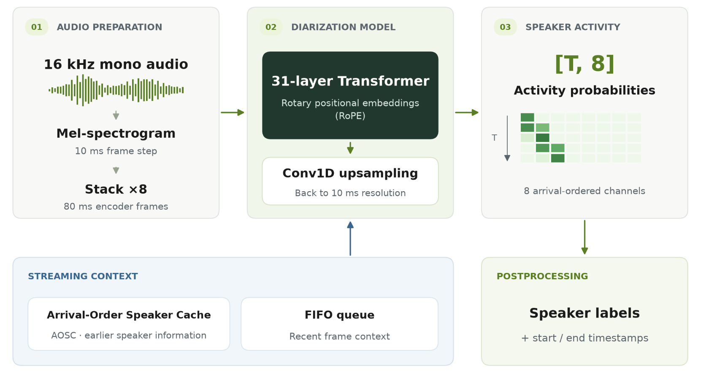
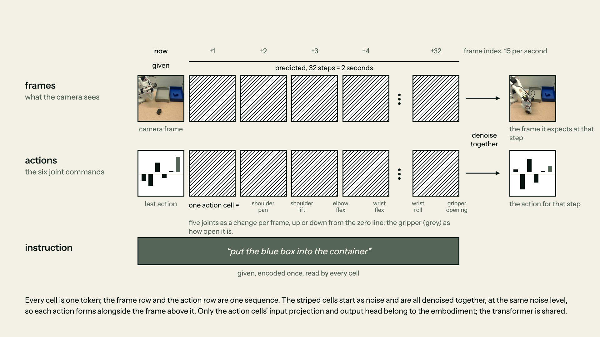
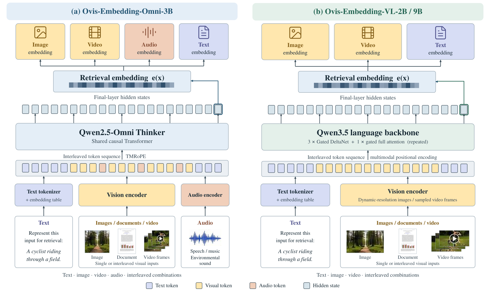

# 六项开放权重：先分清输出，再看许可

本栏延续“开源模型”栏目名，但逐项区分标准开源许可与受限开放权重。能下载不等于可以商用，也不等于训练数据全部开放。

| 你要做的任务 | 对象 | 关键门槛 |
| --- | --- | --- |
| 标记多人音频谁在何时说话 | Nemotron 3 Diarization | 不转写文字，不识别真实身份 |
| 联合预测机器人动作与视觉未来 | FLUX.3 Action | 动作头、机器人适配与有条件许可 |
| 压缩长文档，再按需看原页 | LensVLM 9B | Apple研究许可，不可直接产品化 |
| 跨文字、图像、音视频检索 | Ovis Omni Embedding | 查询与候选必须用相同投影 |
| 中英实时流式转写 | Audio8 ASR Infinite | 定制服务栈；中英指标分别看 |
| 将多视角图像压成几何表示 | GAE D64 1B | 学术用途限定；依赖额外编码器 |

## 01 · Nemotron 3 Diarization：先把说话的人分开

2026-09-23 · 新近实用 / 新近创新。核验：模型卡、实现或作者实验；本站未运行，热度待验证。

输入 16kHz 单声道音频，输出每个时刻最多八个说话人槽位的活动概率，再处理成匿名标签与时间段。它能表示重叠发言，但不知道“说话人2”是谁，也不直接输出对话文本；做会议纪要还需要 ASR 和文字对齐。

约 100M 参数，使用 NeMo Speech，需 Python 3.12+、近期 PyTorch 和音频依赖。一个检查点可调输入缓冲长度；最低推荐 0.32 秒，离线风格配置为 30.4 秒。缓冲等待不包含算力与网络耗时，不能写成整个系统响应只需 320ms。

作者对多套会话数据比较旧 Sortformer，并列出不同缓冲与说话人数的错误率。建议从自己的双人、多人、重叠片段分开评估，再决定延迟设置。权重采用 OpenMDW 1.1；训练含公开及许可数据，不意味着可取得全部原始语料。现在值得看的是低延迟设置下也能使用同一套八说话人模型，而非另造一个聊天模型。

NVIDIA 原始结构图。音频先变成时序特征，再形成多说话人的活动概率；槽位标签不等于个人身份。仅引用方法图解释模型任务。（[来源原图](https://huggingface.co/blog/nvidia/nemotron-diarization)；[查看大图](images/nemotron-diarization.png)。）

[模型卡、权重与许可说明](https://huggingface.co/nvidia/Nemotron-3-Diarization)

## 02 · FLUX.3 Action：视觉预测和动作预测放进同一框架

2026-09-23 · 新近实用 / 新近创新。核验：模型卡、实现或作者实验；本站未运行，热度待验证。

这是面向视觉与动作联合建模的 7B 基础权重。相机观察、状态与指令进入系统，动作与视觉未来在联合扩散框架中建模；实际用于机器人仍要对应的动作头、任务微调和控制接口，不能把通用底座直接当作电机控制程序。

官方给出 DROID、SO-101 等路径。文档中 DROID/game 动作块为 32 步、15Hz，SO-101 为 42 步、30Hz，这是动作序列口径；部分演示明确加速四倍并删去停顿，不能从播放速度推导端到端实时性能。API 当前可用输出与训练时的视觉预测能力也应分开看。

本地加载除 7B 权重还涉及编码器和解码器，本站未核实统一最低显存，不承诺消费级单卡可直接运行。FLUX Kommunity 1.0 对商用资格、输出处理和披露有条件，不能简写成 Apache 或无条件商用。新近价值是公开可适配的视觉动作模型与演示，但真实机器人成功率、安全和时延仍需在自己的平台验证。[架构与运行文档](https://docs.bfl.ai/flux_3/flux3_action_overview)

Black Forest Labs 官方示意。读图时区分视觉 token、动作 token 及解码后的输出；图展示联合建模，不是本站机器人运行截图。（[来源原图](https://docs.bfl.ai/flux_3/flux3_action_overview)；[查看大图](images/flux-action.jpg)。）

[模型卡、权重与许可说明](https://huggingface.co/black-forest-labs/flux-3-action-base)

## 03 · LensVLM 9B：先读压缩页，再回看真正需要的原页

2026-09-22 · 新近实用 / 新近创新。核验：模型卡、实现或作者实验；本站未运行，热度待验证。

这不是把五月论文改日期重报。此次关注九月公开的 9B 权重和 LensVLM 实现：多页文档先以压缩视觉表示进入上下文，模型发现证据不足时调用 read_page 查看指定页，再回答问题。压缩倍率越高，节省上下文越多，细节也越容易需要二次读取。

作者 README 用 15 页文档示例展示模型主动查看第十页，再回答 Shirley Temple 的职务问题。该轨迹有可检查的输入、选页和回答，但只是官方演示，不能证明所有文件都能准确定位。官方讨论 5×、10×、15× 压缩，应同时测页选择次数、细节答案和完整时延，不能只比初始 token 数。

代码与模型分别受 Apple 的源码及研究模型许可约束，模型限定非商业科研，不能把“免费研究”理解为可以开发商业或非商业产品。还需文档预处理、页面工具和足以容纳权重及激活的 GPU；论文评测裁判的多卡配置不是该 9B 模型的最低推理配置。[公开实现](https://github.com/apple-aiml-research/ml-lensvlm)

[模型卡、权重与许可说明](https://huggingface.co/apple/LensVLM-9B)

## 04 · Ovis Omni Embedding：用同一空间检索多种媒介

2026-09-21 · 新近实用 / 新近创新。核验：模型卡、实现或作者实验；本站未运行，热度待验证。

Ovis-Omni-Embedding-3B 把文字、图片、视觉文档、视频、声音和混合输入映射到同一向量空间。基于 Qwen2.5-Omni-3B，保留感知编码器与 Thinker，移除语音生成部分和语言输出头；取最后一个有效位置的状态再归一化。它输出可比较的向量，不生成回答或音频。

原生 2048 维；附加的 PCA 与残差适配器可投影到 1024、512、256 或 128 维。查询和资料必须采用相同变换，并在投影后归一化，不能把不同维度或不同版本的索引直接混用。适合把录音片段、截图和文档同时纳入检索的应用。

作者在 MMEB-v3 190 项任务上报告聚合分 58.46，但其中混有各自规定的 Hit@1 与 nDCG@5 等指标；不能当成每类任务的统一正确率。多约束检索及部分专用任务仍落后最优专用模型。权重采用 Apache-2.0；官方 GitHub 地址本轮未取得 README，具体代码依赖与最低显存仍需补查，模型卡与权重可核验。

Ovis 团队原始结构图。自下向上读：左侧Omni-3B额外接收音频，右侧是VL-2B/9B分支；顶部输出检索向量，而非生成内容。Apache-2.0 来源原图。（[来源原图](https://huggingface.co/ATH-MaaS/Ovis-Omni-Embedding-3B)；[查看大图](images/ovis-architecture.png)。）

[模型卡、权重与许可说明](https://huggingface.co/ATH-MaaS/Ovis-Omni-Embedding-3B)

## 05 · Audio8 ASR Infinite：把长录音拆成持续推进的流

2026-09-21 · 新近实用 / 新近创新。核验：模型卡、实现或作者实验；本站未运行，热度待验证。

Audio8 结合 Voxtral Realtime 4B 音频塔与 Qwen2.5-3B 解码部分，采用固定音频时钟和滚动 KV 缓存处理连续输入。时钟可选 80、120、160ms，解码延迟须与时钟成整数倍关系；30 秒缓存窗口与位置重定位用于长时运行，不是承诺所有录音永远无误差。

模型卡的中文 AISHELL-1 CER 为 1.750，所列 Voxtral 对照为 16.795；英语 LibriSpeech clean WER 则为 3.042，对照为 2.210，方向相反。中英文数据、指标和部分延迟条件不同，不能把它概括成全面领先，更不能将 CER 和 WER 求平均。

权重约 8.17GB，文件体积不等于峰值显存。运行依赖作者修改的 vLLM/Docker 路径、GPU 和音频前处理；语义 VAD 的部分能力还在完善。Apache-2.0 权重为研究流式中文转写提供了新选择，预览版的全天运行、长尾噪声与生产稳定性尚未由本站验证。

[模型卡、权重与许可说明](https://huggingface.co/Edge0/Audio8-ASR-Infinite)

## 06 · GAE D64 1B：让生成模型使用压缩的几何表示

2026-09-21 · 新近实用 / 新近创新。核验：模型卡、实现或作者实验；本站未运行，热度待验证。

GAE 用几何自动编码器把多视角视觉信息压到适合生成的潜空间，再同时解码外观与几何。D64 指潜表示的 64 通道，1B 是生成网络量级；它不是将任何单张图片无条件还原成真实三维世界。公开路径接受图像、提示词与相机条件，生成多视角内容及几何输出。

作者提供 672×378、81 个视角的示例，并使用冻结的 DA3 GIANT 编码器与几何解码头。运行需 Python 3.10–3.12、PyTorch 2.5.1 和 GPU，还要准备额外的 DA3 与 Qwen 编码器；这些依赖有各自许可，主权重大小不是总资源需求。

模型与代码采用腾讯的学术用途许可，明确不开放一般生产或商业使用。现在值得研究的是把几何表征作为生成模型接口的实现，而非“开箱即用的商业3D工具”。作者样例支持输出类型与流程判断，尚不能替代新场景上的几何精度和稳定性评估。[实现与完整许可](https://github.com/TencentARC/GAE-GeometricAutoEncoder)

[模型卡、权重与许可说明](https://huggingface.co/TencentARC/GAE-D64-1B)
