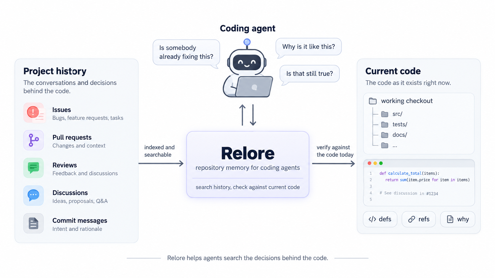
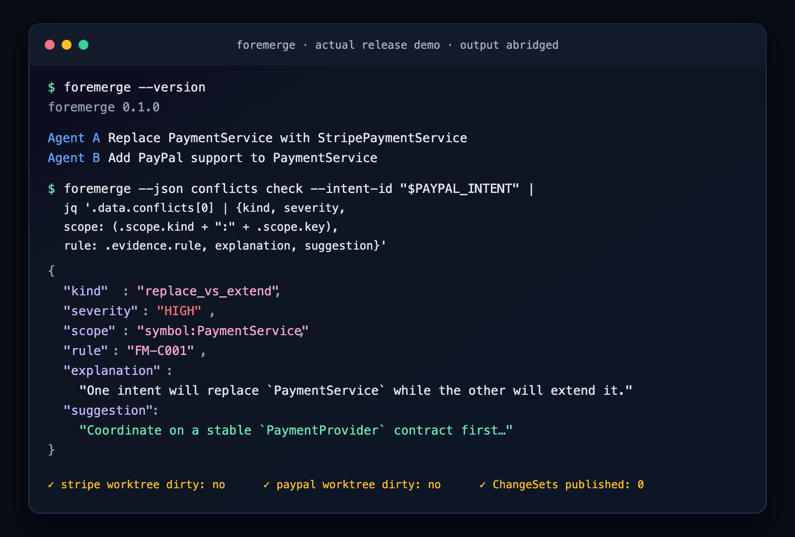
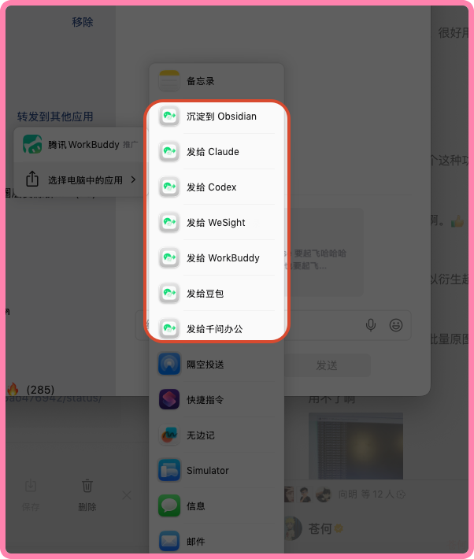

# 十个项目：从真实任务选工具

跨官方发布与版本记录、代码托管、HN / Show HN、Hugging Face 博客等渠道比较候选。下表按要完成的工作排列，未用历史 Star 总数排序。许可不明、只有旧版本或无法说明近期新增价值的项目不入选；本栏均未在本站安装运行。

| 具体任务 | 工具 | 最小产出 |
| --- | --- | --- |
| 把调研助手原型变成应用代码 | Strands harness | 可导出的 Python / TypeScript Agent |
| 理解仓库里一个设计为何这样改 | relore | 带 issue / PR 来源的历史依据 |
| 在多个工作树写代码前发现冲突 | Foremerge | 意图冲突和可核验的检查结果 |
| 在 Intel NPU 上运行自定义计算 | npunlock | 自定义核与 NumPy 结果对照 |
| 将主动选中的微信资料送到笔记 | WeChatBridge | 文本与媒体附件包 |
| 精简桌面资料阅读工作流 | Search | 浏览、阅读模式与多标签 |
| 查询过去某天到底说过什么 | lossless-memory | 带时间戳的原始日志 |
| 从文件与网页整理结构化资料 | ENZO | 可下载的 CSV / Excel 表 |
| 从照片、视频重建并编辑3D场景 | Spirula Studio | 3D Gaussian / mesh |
| 给编码 Agent 增加独立监督 | Foreman | 判断记录与验证流程 |

## 01 · Strands harness：先组装，再导出自己的 Agent

2026-09-22 · 新近实用。核验：官方文档、实现与示例；本站未运行，热度待验证。

这次关注的是旧 Strands SDK 上新增的完整 harness 与 CLI，不是把成熟 SDK 当新品。9 月 22 日版本记录包含 Python / TypeScript harness 合入、发布管线及新的上手入口。终端向导可配置模型、工具和记忆，再把选择导出为应用代码；示例任务是调研 API 版本策略并写入文件。

Python 从 strands-harness 的 create_harness 开始；CLI 用 @strands-agents/cli。需要对应模型服务凭据，或配置本地 Ollama；默认工具涉及文件、Shell 与网络，须明确运行目录与许可范围。持久会话用于续聊，长期记忆是另一层，不应混同。

新近价值是从可试用原型到可编辑代码的路径更短。当前官网与主分支对默认模型、Node 最低版本有不同口径，建议明确指定模型并按所装包的 engines 配置；本站没有运行其性能基准。[上手文档](https://strandsagents.com/docs/user-guide/harness/quickstart/)

[规范仓库与上手文档](https://github.com/strands-agents/harness-sdk) · [Apache-2.0](https://github.com/strands-agents/harness-sdk/blob/main/LICENSE.APACHE)

## 02 · relore：让 Agent 查到代码背后的讨论

2026-09-22 · 新近实用。核验：官方文档、实现与示例；本站未运行，热度待验证。

只给代码搜索，Agent 常能找到“在哪里”，却不知道某种写法为何留下。relore 把 GitHub issue、PR、审阅与工作区 HEAD 联系起来，按线程检索历史决定，并区分维护者意见、自动回复等来源。输入可以是路径、符号或问题，输出有来源的相关讨论，而不是把历史摘要当当前代码事实。

部署需工作区、PostgreSQL、GitHub 读取权限与索引进程；它比一个搜索框重，但适合讨论积累较多的仓库。更新关注活跃线程，不应假设所有远端记录实时同步。

作者用六组 Agent、39 个 issue 做探索，属于项目方实验，没有独立复现支持普遍提效。现在值得尝试的是“代码看懂了，但为什么这样设计”这一具体缺口；使用时仍须把讨论日期、当前实现和已失效的决定分开。

HF relore 原始架构图。沿 issue / PR 历史到索引，再到工作区查询阅读；检索到旧讨论不代表它仍适用于当前 HEAD。Apache-2.0。（[项目原图](https://github.com/huggingface/relore)；[查看大图](images/relore-diagram.png)。）

[规范仓库与上手文档](https://github.com/huggingface/relore) · [Apache-2.0](https://github.com/huggingface/relore/blob/main/LICENSE)

## 03 · Foremerge：把多人 Agent 的改动意图提前登记

2026-09-23 · 新近实用。核验：官方文档、实现与示例；本站未运行，热度待验证。

Foremerge 用本地 SQLite 账本登记每个工作树的修改范围、意图与依赖，在代码写完前发现可能相撞的改动。它依据显式声明协调，不是自动读懂所有程序，也不是禁止其他进程改文件的强锁。

9 月 23 日 v0.5.0 的关键变化是 HTTP 验证只能运行可信注册表中的检查名，不能再提交任意命令；验证必须在登记工作树根目录执行，防止子目录测试通过却替整个改动背书。这是旧项目的执行边界变更，CLI 直接传命令的行为另行保留。

可装发行版或用 cargo，先初始化仓库，再注册测试命令和 ChangeSet。更适合同机多工作树；升级需重启客户端，前1.0版本仍要留意接口变化。作者提供可追溯的检查流程，尚无独立数据证明能消灭合并冲突。

作者终端演示展示意图登记与冲突提示。截图来自较早演示版本，只说明工作方式；v0.5.0 的具体接口变化以本条正文和 Release 为准。Apache-2.0，非本站运行。（[项目原图](https://github.com/naw103/foremerge)；[查看大图](images/foremerge-demo.png)。）

[规范仓库与上手文档](https://github.com/naw103/foremerge) · [Apache-2.0](https://github.com/naw103/foremerge/blob/main/LICENSE)

## 04 · npunlock：为特定 Intel NPU 写自己的计算核

2026-09-23 · 新近实用。核验：官方文档、实现与示例；本站未运行，热度待验证。

这个项目探索绕开固定模型算子的限制，将自定义 C 运算编译进 Intel NPU 的计算路径，并把结果与 NumPy 对照。9 月 23 日新增的 FP32 一元、FP16 二元实现，比“芯片能跑模型”更接近研究者想控制某一段计算的需求。

当前可核验环境很窄：Windows x64、Meteor Lake NPU 3720、适配驱动、Python 3.10、MSVC / CMake，以及额外的 MoviTools。仓库代码采用 Apache-2.0，外部工具不是因此一并开源；不要把其他芯片或 Linux 当作已支持平台。

最小验证应先用仓库静态形状示例，检查数值误差与编译输出，再改运算。作者示例支持“能执行特定自定义核”，尚不支持任意网络都更快的结论；这更适合系统探索，而不是普通用户的一键推理加速器。

作者原始说明图。对照常规算子图与自定义核插入位置，理解工具改变的是哪一段执行路径；仅代表指定芯片上的实验实现。Apache-2.0。（[项目原图](https://github.com/hsfzxjy/npunlock)；[查看大图](images/npunlock-intro.svg)。）

[规范仓库与上手文档](https://github.com/hsfzxjy/npunlock) · [Apache-2.0](https://github.com/hsfzxjy/npunlock/blob/master/LICENSE)

## 05 · WeChatBridge：把选中的聊天资料送到笔记

2026-09-22 · 新近实用。核验：官方文档、实现与示例；本站未运行，热度待验证。

在微信中主动选中内容，通过 macOS 分享扩展，把文本和媒体附件包交给 AI 应用或 Obsidian。它处理用户发起的导出文件，不是解密微信数据库或自动读取全部聊天。对“这段讨论及其图片要一起进笔记”比复制零散消息更贴近需求。

需要 macOS 14、微信4.1.13及以上；源码构建用 Xcode 16 / Swift 6，也提供作者发行包。按用途涉及辅助功能粘贴、可选屏幕录制识别窗口标题等权限，先用不含私密内容的样例确认导出完整性。

MIT 代码继承并注明 Dukou 相关工作。桥接处理可在本机进行，但你选的 AI 应用仍可能把内容发到云端，不能概括成全程离线。新近实用价值是减少资料转存步骤；本站只核验官方界面与说明，没有读取或测试任何真实聊天。

作者提供的微信分享菜单截图。观察用户主动选择分享入口这一操作边界；不是后台扫描聊天，也不是本站用户的聊天记录。MIT。（[项目原图](https://github.com/freestylefly/WeChatBridge)；[查看大图](images/wechat-share.png)。）

[规范仓库与上手文档](https://github.com/freestylefly/WeChatBridge) · [MIT](https://github.com/freestylefly/WeChatBridge/blob/main/LICENSE)

## 06 · Search：为资料阅读做一个轻量 Mac 浏览器

2026-09-23 · 新近实用。核验：官方文档、实现与示例；本站未运行，热度待验证。

Search 是 WebKit 原生 Mac 浏览器，聚焦多标签、阅读模式、元素隐藏和较少界面干扰。它与模型研究的连接很直接：读论文项目页和文档时保留浏览上下文，再把需要的正文交给后续工具；它自己并不会验证网页事实。

最小路径是 macOS 14 上使用作者发行包，或 Xcode 16 / Swift 6 构建。阅读模式和内容拦截能减少噪声，但也可能隐藏交互图表，应能回到原页面对照。部分 Chrome 扩展桥接要求 macOS 15.4，不能把“兼容桥接”理解为所有扩展都可用。

MIT 代码和新发行记录已核验，项目刚公开，兼容性与长期维护没有足够观察期。现在值得看的是可检查实现的小型阅读工具，而不是未经实测的“比主流浏览器更快”宣传。

[规范仓库与上手文档](https://github.com/driceroland/Search) · [MIT](https://github.com/driceroland/Search/blob/main/LICENSE)

## 07 · lossless-memory：按时间找回原话

2026-09-04 · 新近实用。核验：官方文档、实现与示例；本站未运行，热度待验证。

近期补充。它保存带时间戳的 JSONL 原始对话，用 SQLite FTS5 建精确索引，先将“昨天晚上”转成时间范围，再按词匹配；结果不足时才回退到 sqlite-vec 语义检索。输出是原始记录和时间，不用压缩摘要替代证据。

最小路径是配置日志目录、时区并运行仓库索引与 recall 示例；语义回退是额外依赖。LLL 主题标记用于保存当前进度，由人维护。时间短语主要支持英文、日文，不应承诺中文自然时间表达同样可靠。

作者称七月起供一个人与一个 AI 日常使用，没有发布基准；这段私用历史与九月公开仓库日期明确区分。MIT，实现适合研究长期记忆的“准确回看”，但原始日志需要自行保护、备份与清理，不会因叫 lossless 就保证永不丢失。

[规范仓库与上手文档](https://github.com/aru-labs/lossless-memory) · [MIT](https://github.com/aru-labs/lossless-memory/blob/main/LICENSE)

## 08 · ENZO：把文件和检索结果整理成表

2026-09-17 · 新近实用。核验：官方文档、实现与示例；本站未运行，热度待验证。

ENZO 将文件解析、资料检索与结构化输出放进一个本地 Web 应用。输入 PDF 文本层、Excel、CSV、JSON 或检索主题，整理成可下载表格；v1.4.0 新增文件转换与研究表格提取，适合把零散资料带入后续分析。

上手用官方 Docker Compose，本地端口默认5001，再配置自己的模型服务密钥。扫描 PDF 没有文字层时不能假设内置完整 OCR；网页表格提取也需要核对单位、缺失项与原始行。作者页面与代码提供流程证据，本站未复测提取精度。

Apache-2.0 只覆盖项目代码，外部模型仍有费用及数据条款；本地解析不意味着发给所选模型的内容留在本地。首次配置包含实例认领机制，适合先在 localhost 设好再考虑部署。它的价值是一个可检查的整理工作流，而非保证所有文档自动变干净。

[规范仓库与上手文档](https://github.com/theguysudo/ENZO) · [Apache-2.0](https://github.com/theguysudo/ENZO/blob/main/LICENSE)

## 09 · Spirula Studio：从视频到可编辑的3D场景

2026-09-20 · 新近实用。核验：官方文档、实现与示例；本站未运行，热度待验证。

项目原于2024年开始，入选依据是9月20日的实质版本：视频自适应取帧、SfM / 360相机流程改进，以及点云和网格相关工作。输入照片或视频，先估计相机与稀疏结构，再训练可交互的3D Gaussian场景，并按需要输出网格。

工具使用 Vulkan，支持范围取决于 GPU 与驱动，不能把“跨厂商”理解为所有设备表现一致。内置 SfM 可减少手动衔接 Python / COLMAP 的步骤；最小任务宜从静态物体和视角重叠充分的短素材开始，先检查相机恢复，再训练。

GPL-3.0 代码可核验。作者展示的显存与高斯数量结果有特定场景条件，本站没有进行显卡性能测试。新近价值在于拍摄素材到可编辑结果的路径更完整，反光、透明和快速运动仍不能靠一个版本号消除。

[规范仓库与上手文档](https://github.com/harry7557558/spirula-studio) · [GPL-3.0](https://github.com/harry7557558/spirula-studio/blob/master/LICENSE)

## 10 · Foreman：让编码执行与是否完成的判断分开

2026-09-17 · 新近实用。核验：官方文档、实现与示例；本站未运行，热度待验证。

Foreman 把编码 Agent 的输出、Git 差异、退出状态和验证记录汇总给独立的 Jev 判断，再由确定性 Python 策略决定继续、引导、停止、复验或结束。它不替执行器选择每个文件和工具；当前一次只运行一个编码 worker，不能说成多 Agent 工厂已验证更高效。

需 Python 3.11+；真实任务需要 TypeSafe API 以及 Codex 或 OpenCode 的模型授权。可先看无需密钥的 foreman demo，确认事件、状态文件与验证器的关系，再接入真实项目。差异片段会发往判断服务，应先决定可发送的仓库内容。

MIT。作者明确称其为架构实验，没有宣称优于普通 harness。今天值得研究的是监督器与执行器并行观察、但由明确策略决定干预的实现。它使用 Jev 服务，与本期裁判论文是不同对象；论文成绩不能直接当这个应用的效果。

[规范仓库与上手文档](https://github.com/thruwire/foreman) · [MIT](https://github.com/thruwire/foreman/blob/main/LICENSE)
