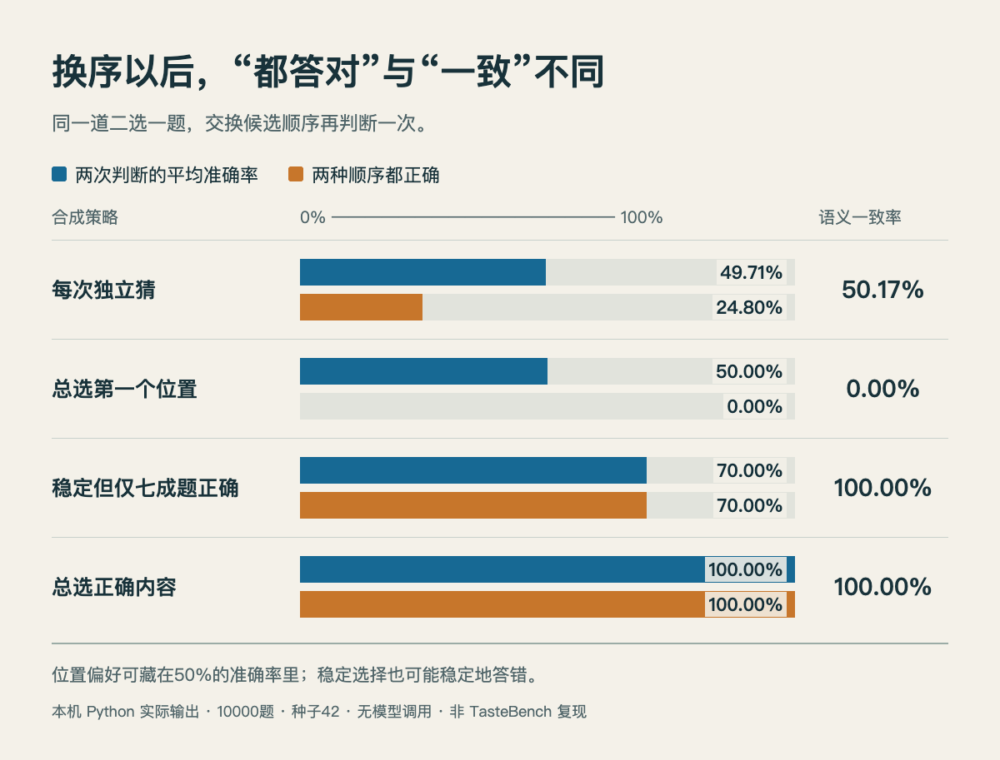

# 两个顺序都答对，和前后保持一致，是两回事

今天的 TasteBench 论文用交换选项顺序的方法减轻位置偏好。这个小实验只讲清评分含义：同一道二选一题，把候选 A、B 对调，再判断一次。**已在本机运行，数据为合成题目，没有调用模型，也不是 TasteBench 复现。**

## 先把“位置”和“内容”分开

假设较好的方案是“先查日志”，另一个是“直接重启”。交换它们在提示词里的顺序，较好的方案仍然是“先查日志”。如果裁判一直选第一个位置，看起来它的按钮选择很稳定，实际上选中的内容已经变了。

我们同时记录三项指标：

|指标|计算方式|它回答什么|
|---|---|---|
|两次判断的平均准确率|两个顺序分别计对错，再取平均|通常有多准？|
|两种顺序都正确|同一题必须两次都选对内容|多少题不受换序影响，且判断正确？|
|语义选择一致率|换序后是否仍选择同一内容|判断是否稳定？不保证正确。|

## 运行一个可检查的例子

使用 Python 标准库即可，不安装包、不连接外部服务。此次运行环境为 macOS arm64、Python 3.14.3，固定随机种子42，生成10000道平衡标签的题目。四种策略分别模拟独立乱猜、偏爱第一个位置、对七成题稳定正确而对三成题稳定错误、始终选择正确内容。

下载 [Python 源码](code/order_probe.py) 后运行：

~~~bash
python3 order_probe.py
~~~

核心判断需要把第二次选择的位置映射回内容，而不能直接比较两个位置编号：

~~~python
# 第一次顺序为 [A, B]，第二次为 [B, A]
chosen_first = first_position
chosen_swapped = 1 - swapped_position
both_correct = chosen_first == truth and chosen_swapped == truth
consistent = chosen_first == chosen_swapped
~~~

完整程序的参数与实现以附件为准；上面是用于理解指标的简化片段。

## 本机结果

|策略|平均准确率|两次都正确|语义一致率|
|---|---:|---:|---:|
|每次独立猜|49.71%|24.80%|50.17%|
|总选第一个位置|50.00%|0.00%|0.00%|
|稳定但仅七成题正确|70.00%|70.00%|100.00%|
|总选正确内容|100.00%|100.00%|100.00%|

本站 HTML/JS 根据本机 Python 输出绘制。重点看第二行：平均准确率50%，两次都正确和语义一致率均为0；再看第三行，一致率100%仍可能稳定地答错三成题。固定种子42、10000题，非模型性能评测。（[真实运行数据](code/order-results.json)；[查看大图](images/order-results.png)。）

独立乱猜的两次选择近似独立，每次正确概率约一半，因此两次都正确的概率约为四分之一。这个乘法只适用于独立假设；真实模型两次输出可能相关，不能直接拿单次准确率平方代替复测。

“总选第一个位置”在平衡标签上仍有50%平均准确率，但换序后不可能两次都正确。“稳定但七成正确”的策略则说明另一件事：消除位置偏好只消除一种误差，不会自动补上知识和推理能力。评测最好同时报告准确性、顺序敏感性与题目构成。

## 能迁移到哪里，不能迁移到哪里

评审两个摘要、两份代码或两条 Agent 下一步时，可以保留相同上下文，只交换候选位置，再保存两次完整输出。若裁判给出概率，还要另看校准；本例没有概率、真实语言、领域加权或多轮工具调用。

这套实验没有模拟 TasteBench 的轨迹采样、过滤和领域平均，也没有证明任何模型更有“品味”。它帮助理解一个更保守的评分规则。实际评测应先确定客观标签如何得到，再决定换序次数和统计方法。

附件：[运行结果与环境](code/order-results.json) · [可复现图表 HTML/JS](code/order-chart.html) · [Tasteful Agent 站内阅读卡](../../../../papers/frontiers/tasteful-agent/00-阅读卡.md) · [论文原文](https://arxiv.org/abs/2609.25804v1)
