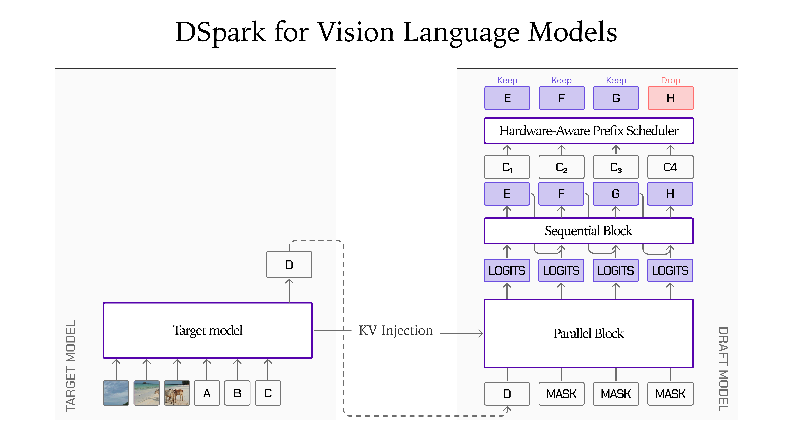
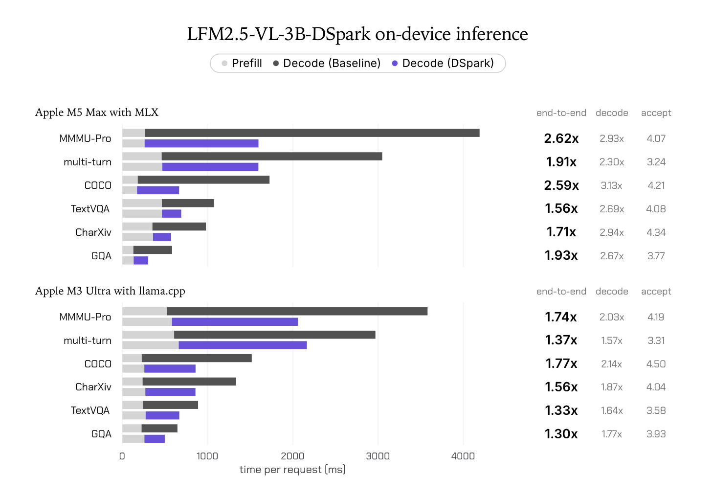
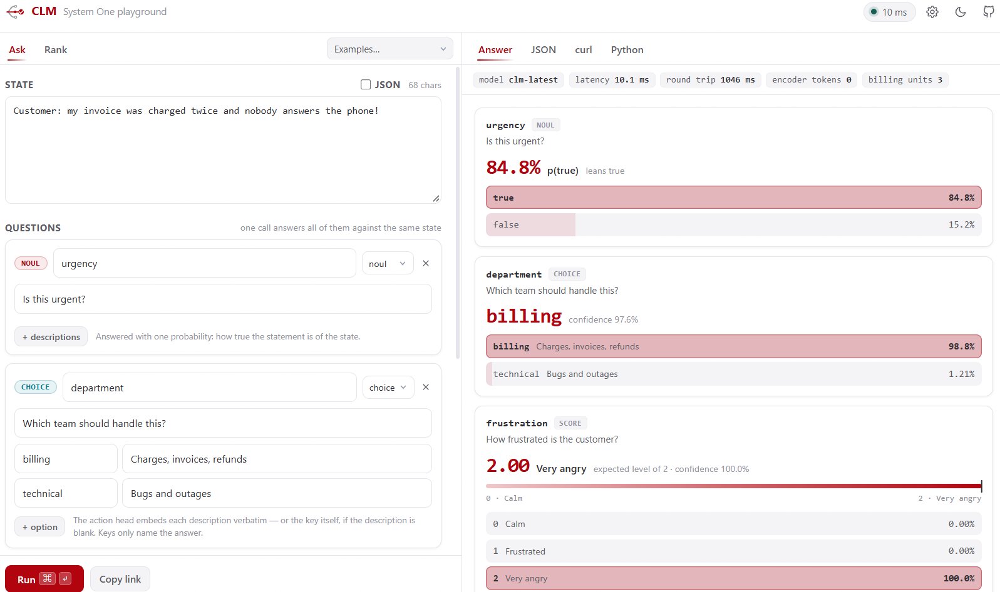

# 六个模型：把加速、判断和控制拆开看

本栏包含开放权重与带用途限制的研究模型，并非六项都采用无用途限制的开源许可。我们核验模型卡、文件列表和许可，未运行模型；下载数与点赞都是一次观察，不据此认定近期热门。

| 模型 | 最适合先检查的任务 | 许可与门槛 |
| --- | --- | --- |
| LFM2.5-VL-3B-DSpark | 给固定视觉语言模型加速解码 | LFM Open License；需目标模型和兼容运行时 |
| GLiNER2.5-Decide | 英文文本多头分类 | Apache-2.0；340M编码器 |
| CLM v0.1 8B | 给有限候选动作排序 | Apache-2.0；另需8B基础编码器 |
| Parakeet Ultra | 多语言语音转文字 | CC BY 4.0；公开成绩使用Photon与NVIDIA GPU |
| Qwen-Image ControlNet Union | 用线稿等条件控制出图 | Qwen Research，仅非商业研究/评估；需基础模型 |
| ThinkingCap Qwen3.8 27B | 比较推理长度与精度取舍 | PolyForm Small Business及个人使用补充；有访问条件 |

## 01 · LFM2.5-VL-3B-DSpark：小草稿模型加速大模型确认

2026-09-24。新近实用 / 新近创新；作者实验，热度待验证。

Liquid AI 的新说明把 DSpark 扩到3B视觉语言模型。权重仓库创建于9月18日，9月24日发布专门介绍；这里报告的是这次视觉解码加速说明，不把文章日期当成最早权重创建日。草稿模型只有279.5M参数，需要与指定 LFM2.5-VL-3B 一起运行，不能单独当聊天模型。

直觉是先让轻量部分连续提出若干 token，再由目标模型确认。模型卡称贪心解码输出保持一致；在匹配采样设置时保留目标分布。因此它改变计算路径，不是把模型准确率“提高三倍”。

Liquid AI 官方结构图。先看左侧目标模型，再看右侧并行草稿与顺序修正；图中的保留/舍弃表示提议选择，实际输出仍需目标验证。此图解释机制，不代表每次都会接受相同数量。（[来源原图](https://huggingface.co/blog/LiquidAI/lfm2-5-vl-dspark)；[查看大图](images/lfm-dspark.png)。）

作者在 M5 Max、MLX-VLM、FP16、batch=1、温度0条件下报告解码2.30–3.13倍、端到端1.56–2.62倍；同一任务的两个数字不能互换。图片编码与预填充还在，短回答往往更受这些固定部分影响。

原始性能图。看TextVQA：M5 Max解码2.69倍，但整体只有1.56倍；浅灰前段没有消失。下半部分是另一台M3 Ultra及另一运行时，不能横向当硬件公平比较。（[来源原图](https://huggingface.co/blog/LiquidAI/lfm2-5-vl-dspark)；[查看大图](images/lfm-speed.png)。）

最新模型卡列出 SGLang 0.5.19+、MLX-VLM 0.7.2+，苹果端示例用贪心解码。总内存还包含目标权重、视觉编码器与缓存。[LFM许可](https://huggingface.co/LiquidAI/LFM2.5-VL-3B-DSpark/blob/main/LICENSE)有商业营收门槛，不能当作Apache协议。值得试的是自己真实图片和回答长度下的整体等待时间，本站未复测。

[模型卡与权重](https://huggingface.co/LiquidAI/LFM2.5-VL-3B-DSpark)

## 02 · GLiNER2.5-Decide：一次编码回答多个分类问题

2026-09-23。新近实用 / 新近创新；作者实验，热度待验证。

这是340M的英文编码器分类模型，可在调用时给出标签，并在同一文本上组织多个分类头。例如，输入一段客服记录，输出部门、诉求和是否需要升级；它不会自然生成一长段解释。相较用大语言模型逐项回答，优势方向是固定输出、批量处理与较小部署负担。

作者在17个领域、每域300条留出样本的 fast-decisions 评测上报告60.2% exact match，对照1B模型59.6%。这是指定标签、相同输入的作者测试，不能读作超过所有大模型，也不能把英文结果直接外推到中文。标签写法、任务分布和拒绝判断规则都会改变效果。

最小入口是安装 `gliner2`，用 AutoExtractor 加载权重后定义问题与标签；CPU/GPU均有部署路径。[Apache-2.0许可](https://huggingface.co/fastino/GLiNER2.5-Decide/blob/main/README.md)与模型卡可核验。新近价值在于把小模型放到明确的分流步骤里；先用自己的人工标注集比较混淆矩阵，再决定是否自动执行。本期只读文档和实验，没有运行分类。

[模型卡与权重](https://huggingface.co/fastino/GLiNER2.5-Decide)

## 03 · CLM v0.1：把状态与候选动作分别编码

2026-09-21。新近实用 / 新近创新；作者实验，热度待验证。

Contrastive LM 解决有限候选集合的选择问题。输入当前状态与候选动作，模型分别编码并计算相容分数，输出排序；它本身不会生成候选之外的新动作。动作表示可以缓存，适合反复从工具、命令或已定义操作中挑选下一步。

公开检查点建立在冻结的 Qwen3-8B 编码器与投影头上。作者使用大规模问答、难负例和 Agent 轨迹训练；发布的投影头文件不等于整个8B基础模型。上手还需基础权重、`contrastive-lm`、相应编码/服务组件，推理内存不能只按头文件估算。

Contrastive-LM 官方演示界面原图。左侧同一工单配三个问题，右侧分别显示是非、分类和等级结果；这是标为clm-latest的官方服务界面，不把图中延迟或分数当成v0.1权重的独立实测。（[来源原图](https://huggingface.co/Contrastive-LM/CLM-v0.1-8B)；[查看大图](images/clm-playground.png)。）

模型卡中的 DeepSWE、Terminal 等高分涉及任务专门微调的头，不能算到通用 v0.1 的零样本成绩上。候选不完整、状态缺信息时，排序也无法补救。[代码](https://github.com/Contrastive-LM/CLM)采用Apache-2.0；现在值得看的取舍是用可缓存的匹配计算替代反复生成选择理由，收益仍需在真实候选规模下复测。

[模型卡与权重](https://huggingface.co/Contrastive-LM/CLM-v0.1-8B)

## 04 · Parakeet Ultra：后训练与运行时一起改变语音转写

2026-09-22。新近实用 / 新近创新；作者实验，热度待验证。

Moondream 在 NVIDIA Parakeet TDT 0.6B v3 上做后训练，保持0.6B规模与原有分词器，提供25种语言识别及词级时间戳。支持语言以欧洲语言为主，列表不包含中文；不要因为“多语言”就把中文会议直接交给它。

作者同文件评测中，25语言 FLEURS 平均词错误率由11.62%降到9.55%，七个英语集合由6.26%降到5.80%。但“每个组更好”不等于组内每个集合都更好：清洗后的 VoxPopuli 单项略退。长音频还改变了切分路径，Ultra 通过 Photon 使用自身VAD头在停顿处分段，而基线走NeMo路径。

速度表使用一张B200、128并发，比较新权重+Photon与原权重+NeMo，因此不能把收益全部归因于后训练。上手入口是 `moondream` 的 Photon 转写接口，权重为CC BY 4.0，需署名并保留许可。它适合评估批量转写和噪声语音，本文未进行本机音频测试，也不把吞吐倍数当作单条录音的延迟。

[模型卡与权重](https://huggingface.co/moondream/parakeet-ultra)

## 05 · Qwen-Image-2.1 ControlNet Union：线稿负责构图，文字负责补细节

2026-09-23。新近实用 / 新近创新；作者实验，热度待验证。

阿里 PAI 发布 Qwen-Image-2.1 的 Union ControlNet，支持边缘、深度、线稿、姿态、涂鸦等八类条件及局部重绘。一个条件分支处理多种控制信号，适合希望保留布局和姿势、又让文字补充外观的生成任务。它不是独立完整生成模型，仍需对应的 Qwen-Image-2.1 主干。

下方是作者同一示例的输入和输出。输入给出粗略空间关系，输出完成视觉细节；应观察轮廓和姿态是否跟随，不要把一张精选图当作所有提示词的成功率。

阿里PAI原始条件图，未修改；与下一张输出成对阅读。（[来源原图](https://huggingface.co/alibaba-pai/Qwen-Image-2.1-Fun-Controlnet-Union)；[查看大图](images/qwen-scribble-input.png)。）

阿里PAI原始输出，用于说明条件到成图关系；属于作者示例，不是本站运行结果。（[来源原图](https://huggingface.co/alibaba-pai/Qwen-Image-2.1-Fun-Controlnet-Union)；[查看大图](images/qwen-scribble-output.png)。）

公开控制分支约7GB，完整运行还要加载基础模型和其它组件。模型卡示例涉及控制强度、40步等参数，实际显存随分辨率、卸载与精度变化。[Qwen Research许可](https://huggingface.co/alibaba-pai/Qwen-Image-2.1-Fun-Controlnet-Union/blob/main/LICENSE)只授权非商业研究或评估，商业使用需另行授权。新近价值是可复用的控制能力，而不是无条件免费商用。

[模型卡与权重](https://huggingface.co/alibaba-pai/Qwen-Image-2.1-Fun-Controlnet-Union)

## 06 · ThinkingCap 27B：少想一些会在哪些题上付出代价

2026-09-23。新近实用 / 新近创新；作者实验，热度待验证。

BottleCap AI 发布基于 Qwen3.8-27B 的 ThinkingCap，目标是压缩推理 token。作者表格的平均准确率为85.8%，基线86.6%，并非所有任务保持相同质量：AIME一项从98.13%降到94.27%，而长上下文推理一项有改善。更适合拿它研究成本与精度取舍，不宜概括成“无损压缩思考”。

卡片所说37.2%是逐基准降幅的平均；把表中平均 token 15,735与12,144相除，得到的降幅约22.8%。两个汇总方式回答不同问题，不能把37.2%当作任意工作负载的账单或延迟节省。测试使用H200、vLLM及相应采样设置，仍缺同条件端到端等待时间测量。

公开模型卡和文件清单可读，权重访问有条件，本站没有接受条款或下载推理。许可为PolyForm Small Business 1.0.0，附个人非商业使用补充；上游Apache许可不能消除新增权重的限制。27B还需要相应内存与运行时，量化版本是另一组条件。现在值得看的是可检查的逐任务取舍表，而不是笼统的“更快”。

[模型卡与权重](https://huggingface.co/bottlecapai/ThinkingCap-Qwen3.8-27B)
