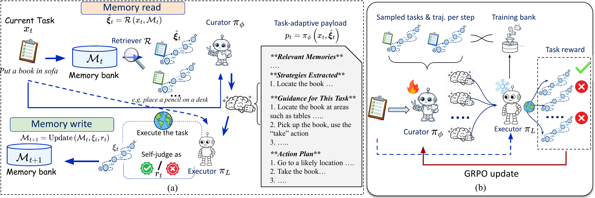
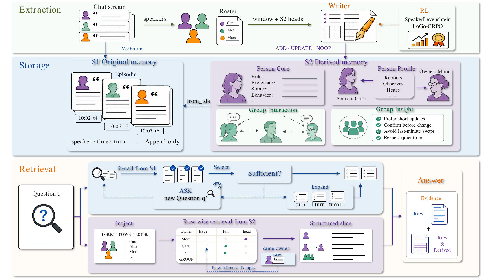
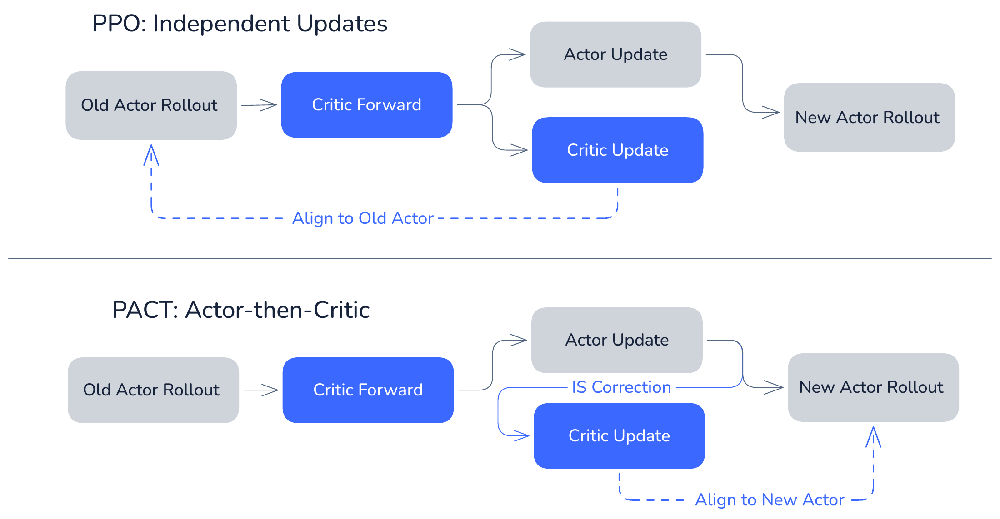
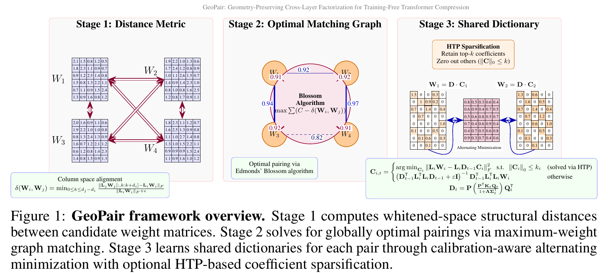
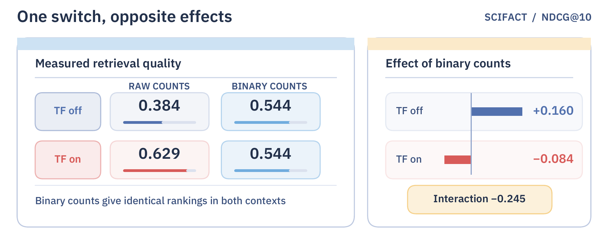
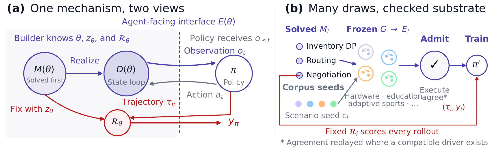

# 六篇论文：记忆怎样读，实验怎样解释，训练怎样归功

比较15篇近期候选后，精读六篇核心方法与结果。两篇记忆论文分别处理“什么时候提炼经验”和“多人信息归给谁”，不是同一个系统拆成两条；其余覆盖强化学习、压缩、实验理解与训练环境。所有数字来自作者实验，本站未复现重型训练。榜单用于发现，缺少第二类独立近期信号，不标“已验证热门”。

## 01 · JitMem：等问题来了，再决定旧经验怎么用

首发2026-09-23 · arXiv:2609.27334 v1 · 预印本。新近创新 / 新近实用，热度待验证。

许多 Agent 完成任务后，会把轨迹压成固定总结。问题是此时还不知道未来要问什么，删掉的细节以后可能正好有用。JitMem 保存原始轨迹，在新任务到来时先检索，再让整理器根据当前问题产生短小的临时记忆，交给冻结的执行器。

这也缩短了训练反馈的距离：整理器今天写出的提示立即服务今天的任务，能用当前成功与否训练，不必等很久才知道过去的摘要是否有价值。临时提示不会再次作为固定摘要写回库；部署时只把自评成功的轨迹加入原始记忆，错误自评仍可能污染它。

主实验用 Qwen3-8B，整理器训练100步GRPO，执行器冻结。ALFWorld 140题成功率77.4%，对照SkillOS 61.2%；WebShop 500题32.8%，对照16.5%。测试从空记忆库开始，按任务流积累。τ²-bench没有官方训练切分，文中比较的是未训练整理器，不能把该结果也归给同一RL训练。

作者报告执行器token更少，但相关统计不包含整理器开销。读原轨迹还会增加存储、检索和一次整理调用。现在值得借鉴的是“提炼延迟到需求明确之后”这一取舍；复现时应同时算整个系统成本，并检查任务顺序、自评误差与记忆泄漏。

作者Figure 1。左侧蓝色路径：原始轨迹入库，新问题到来后临时提炼；右侧只更新整理器，雪花表示执行器冻结。图中的任务奖励是训练信号，部署入库使用自评，二者不要混同。（[作者原图](https://arxiv.org/abs/2609.27334v1)；[查看大图](images/jitmem-method.png)。）

[站内阅读卡](../../../../papers/frontiers/jitmem/00-阅读卡.md) · [原文](https://arxiv.org/abs/2609.27334v1)

arXiv非独占分发许可不直接授权本站再分发全文，因此仅归档阅读卡与原站链接；单幅原图限本条方法或实验评论引用。

## 02 · SpeakerMem-R1：把“谁说的”和“说的是谁”分开

首发2026-09-22 · arXiv:2609.26780 v2；9月23日v2，已比对核心内容，变更为附录表格布局 · 预印本。新近创新 / 新近实用，热度待验证。

群聊里“甲说乙明天不来”，消息来源是甲，描述对象却是乙。把所有内容压成同一串摘要，很容易把转述写成甲的个人计划。SpeakerMem-R1 用两条轨道：S1保留带说话人、时间、轮次的原话；S2维护人物与群体层面的派生状态，并用来源ID回指原始证据。

更新不是简单覆盖旧文本，而是追加变化与被替代关系。回答时按人物、事件和时间组合原话与结构化视图。作者还用说话人归因相关的编辑距离奖励及GRPO训练Writer，回答器保持固定，目标是减少写入时就发生的对象归错与状态更新错误。

摘要的47.9%、69.2%、61.9%分别来自GroupMem、SocialMem与EverMem的最佳变体，不是同一配置同时取得三项成绩。例如SocialMem关闭ASK追问得到69.2%，完整ASK配置为64.9%；完整上下文对照为69.4%。因此不能只抄摘要写成全面超过长上下文。

在305问的受控Writer比较中，小模型SFT均值57.38%提升到RL后的68.20%，仍低于对应LLM Writer的71.48%。多方视角、原始证据和时间版本有清楚实用价值，但别名、隐含受众、人员变动与额外调用成本仍是难点。本期采用v2，已核对它与v1的核心方法、结果相同，主要修改附录表格排版。

作者Figure 2。中部左侧是仅追加的原话，右侧区分信息来源与状态所属人物；虚线from_ids将派生结论连回证据。下方两路检索在回答前合流，中文正文给出群聊转述的读图例子。（[作者原图](https://arxiv.org/abs/2609.26780v2)；[查看大图](images/speakermem-method.png)。）

[站内阅读卡](../../../../papers/frontiers/speakermem-r1/00-阅读卡.md) · [归档PDF](../../../../papers/frontiers/speakermem-r1/2609.26780v2.pdf) · [原文](https://arxiv.org/abs/2609.26780v2)

采用CC BY 4.0，归档未改动的原版PDF，保留作者、版本和许可。

## 03 · PACT：更新策略以后，让评价器跟上新策略

首发2026-09-22 · arXiv:2609.26355 v1 · 预印本。新近创新 / 新近实用，热度待验证。

强化学习只在一串行动结束后得到成败，如何给中间token分配贡献？PACT在完整性、前缀一致性和中立性三个条件下，得到基于前后条件期望差值的信用定义。直觉上，某一步的贡献是它让最终成功预期改变多少；这个刻画有明确假设，不是无条件证明某个实际神经网络知道真贡献。

方法针对一个训练错位：评价器常追着旧策略学习，策略已经更新时，评价还滞后。PACT先完成Actor更新，再用更新前后概率比修正同批轨迹的Critic目标；还把价值预测变成概率并使用BCE，令GAE的λ取1。实现采用当前token比率与范围屏蔽，是真实长轨迹比率的低方差替代，不是原理论式子的精确计算。

数学实验在Qwen3.5-4B、筛选的3200道训练题上进行，四个测试集Avg@16均值72.87%，GRPO为64.07%、PPO λ=1为59.71%。去掉重要性修正后67.74%，消融支持修正项有用。编码实验改用Qwen3.6-35B-A3B与OpenSWE，SWE-bench Verified pass@1为67.4%，GRPO65.4%。两组模型和评测指标不能混合排名。

新近创新是把信用理论与可执行的训练顺序联系起来；工程代价包括额外前向与Critic训练。理论等价常只在期望或理想教师下成立，实验也不是对所有PPO实现的结论。复现应固定采样、裁剪、长度和批量，再拆开比较BCE、更新顺序与重要性修正。

作者PACT流程图。上半部独立更新后Critic仍对齐旧Actor；下半部箭头从已更新Actor进入IS修正，再训练Critic。图里少了一次额外采样，因为修正复用了原批轨迹，但增加了前向计算。（[作者原图](https://arxiv.org/abs/2609.26355v1)；[查看大图](images/pact-method.png)。）

[站内阅读卡](../../../../papers/frontiers/pact-credit/00-阅读卡.md) · [原文](https://arxiv.org/abs/2609.26355v1)

采用CC BY-NC-ND 4.0；本期保留阅读卡和原站入口，方法图仅作有署名的技术评论引用。

## 04 · GeoPair：按几何相似度配对权重，再共享字典

首发2026-09-22 · arXiv:2609.25963 v1 · 预印本。新近创新 / 新近实用，热度待验证。

压缩Transformer时，不同层可能共享部分表示，但相邻层不一定最适合共享。GeoPair先根据校准激活衡量权重的结构相似性，用图匹配选择配对，再让一对权重共享字典D、各自保留系数C。不同层的激活几何仍分别保留，不把它们的统计量简单揉成一个平均。

“免训练”指不做反向传播微调，不代表完全不需要数据或优化。方法仍要计算校准统计、白化，再交替更新共享字典和稀疏系数；稀疏化保留重要系数，字典更新求解相应矩阵方程。论文的收敛结论针对其分块优化条件，不能解读为找到整个压缩问题的全局最优。

在Llama-3-8B、20%压缩设置下，八项任务平均准确率从原模型70.36%变成68.17%，对照BasisSharing为53.47%；WikiText困惑度则由7.26升至9.43。它在这个比较中更好地保留能力，但显然不是完全无损。视频侧的Wan实验只有50条提示、16帧与指定相似度指标，不足以概括所有长视频质量。

现在值得看的是把“哪些层共享”变成可检验的匹配问题。复现需要保留校准集、压缩率、稀疏度和完整评测表，不能仅报告权重变小。若关心实际部署，还需检查分解后的算子和运行时是否获得真实延迟收益，存储减少不自动等于推理更快。

作者Figure 1，裁取论文第3页的完整方法图与图注，未改数字或关系。左到右为几何度量、全局配对、共享字典；[完整原页](images/geopair-page3.png)保留上下文。CC BY 4.0。（[作者原图](https://arxiv.org/abs/2609.25963v1)；[查看大图](images/geopair-method.png)。）

[站内阅读卡](../../../../papers/frontiers/geopair/00-阅读卡.md) · [归档PDF](../../../../papers/frontiers/geopair/2609.25963v1.pdf) · [原文](https://arxiv.org/abs/2609.25963v1)

采用CC BY 4.0，归档未改动的原版PDF，保留作者、版本和许可。

## 05 · WhatWorkedBench：选到了最高分配置，还不算理解实验

首发2026-09-23 · arXiv:2609.27490 v1 · 预印本。新近创新 / 新近实用，热度待验证。

做一轮消融实验后，Agent能否预测“换掉某个组件会怎样”？WhatWorkedBench要求它在有限测量预算内选择实验，最后提交所有配置的预测分数表。评测者用穷举CPU运行获得真值，逐项比较某个开关在其它条件固定时的作用，而不只检查有没有挑到最佳配置。

这有一个很直观的难点：同一个开关可能在一种背景下变好，在另一种背景下变差。下图的SciFact例子中，二值词频在关闭次线性TF时提升检索分数，开启时却降低；仅记住“这个开关有用”就会出错。36个任务条件来自30个数据源、八类流程，共1248种配置，但这些是冻结的可计算工作流，不等于真实科学研究的全部复杂性。

在22个四开关任务、额外8次测量下，成对效应岭回归选中15个最佳配置，却只有3个达到所有效应误差均在规定容差内。对相同Agent观察离线拟合高斯过程，两个Flash批次的效应恢复率分别从0.632到0.698、0.621到0.720；这是固定信息后换推断方法，不是多买了实验。

原实验还记录429、超时和缺少提交，缺交付计零分。核心Agent研究108轮，新增家族只有少量完整提交；不能仅凭均值判断所有研究Agent的能力。新近价值是把实验选择、数值推断和代码结构约束拆开检查：能描述一条规则，不代表最终预测表真的遵守了它。

作者Figure 2。左右看同一二值计数开关为何出现正、负效应；其余条件为一元词、去停用词、关闭IDF且不归一化。表格显示值经过舍入，右侧差值来自未舍入数据，不能据末位差异重写作者数字。（[作者原图](https://arxiv.org/abs/2609.27490v1)；[查看大图](images/whatworked-effects.png)。）

[站内阅读卡](../../../../papers/frontiers/whatworkedbench/00-阅读卡.md) · [原文](https://arxiv.org/abs/2609.27490v1)

arXiv非独占分发许可不直接授权本站再分发全文，因此仅归档阅读卡与原站链接；单幅原图限本条方法或实验评论引用。

## 06 · VHD-Play：先解出机制，再把它变成可交互环境

首发2026-09-23 · arXiv:2609.27321 v1 · 预印本。新近创新 / 新近实用，热度待验证。

自动生成Agent训练环境，常见顺序是先写出环境，再想办法判断行为好不好。VHD-Play反过来：先抽样并求解一个数学或运筹机制，把约束、状态变化和参考结果确定下来，再让冻结的语言模型把它呈现成场景、数据库和工具。环境与评分从同一来源产生，减少“两套规则不一致”的问题。

作者生成3300个通过准入检查的环境，使用GRPO训练Qwen3.6-35B-A3B。三类训练机制之外，评估还覆盖八类未见机制。五类优化问题的诊断中，基座看完整书面题能得0.962，进入有状态交互却只有0.204；训练后交互得分0.815。即使参数提前给出仍有大差距，说明困难不只是缺信息，也包括跨步骤保持计划和预算。

外部迁移并非全面压倒更大模型。TravelBench从0.700提高到0.794，仍低于Qwen3.7-Max参照的0.891；选定的BFCL十个子项均值由61.25到64.08。365天电商模拟每组五次运行，训练模型五次完成，收益均值约为基座3.4倍，但这不是五家真实店铺的经营结果。

局限也很明确：机制需要可计算参考值，有些“上界”是事后全知的上界，在线策略未必能达到；生成家族结果只有一次训练、一个评估种子。现在值得复用的是环境与判分共同设计及准入复查，不能把数学场景的可验证性外推到任意开放世界任务。

作者Figure 3。左侧虚线分隔构建者掌握的机制与策略能看到的信息；红色评分路径和紫色交互路径来自同一已解机制。右侧先通过执行一致性检查再训练，检查覆盖范围有条件，详见论文。（[作者原图](https://arxiv.org/abs/2609.27321v1)；[查看大图](images/vhd-play-method.png)。）

[站内阅读卡](../../../../papers/frontiers/vhd-play/00-阅读卡.md) · [原文](https://arxiv.org/abs/2609.27321v1)

arXiv非独占分发许可不直接授权本站再分发全文，因此仅归档阅读卡与原站链接；单幅原图限本条方法或实验评论引用。
