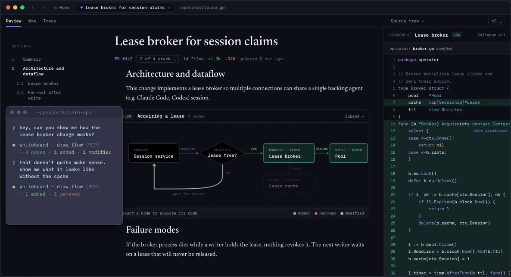
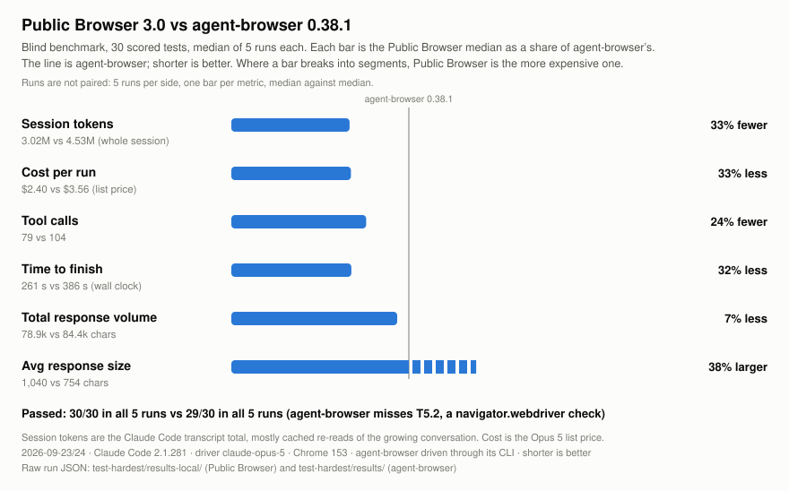
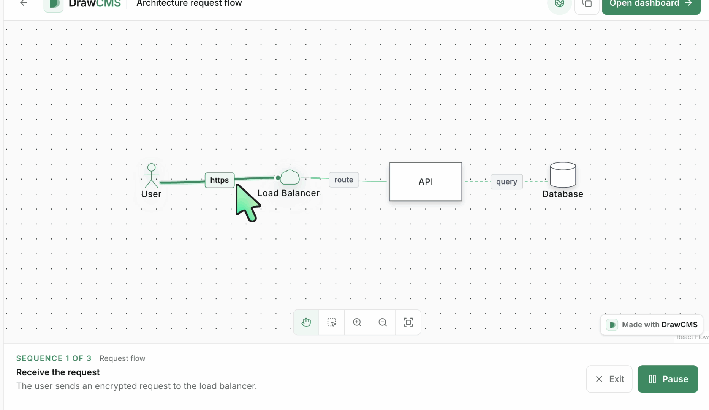
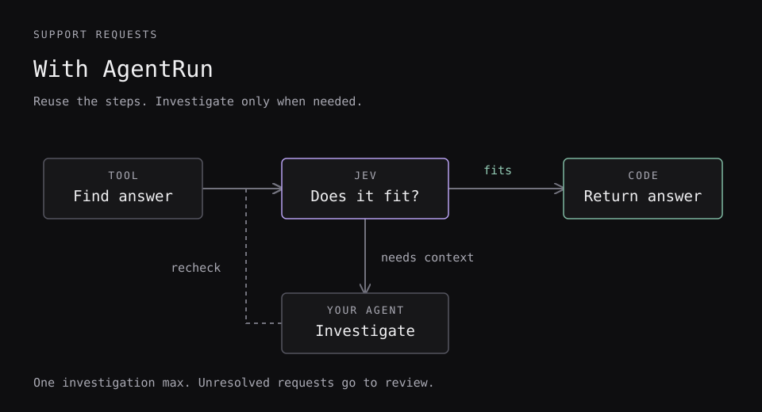
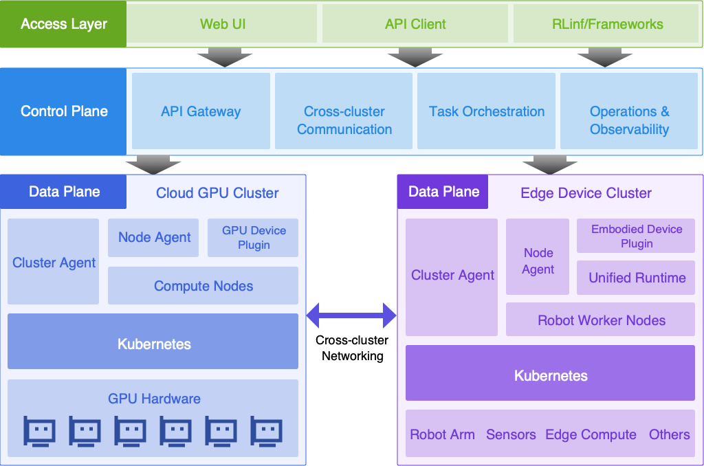
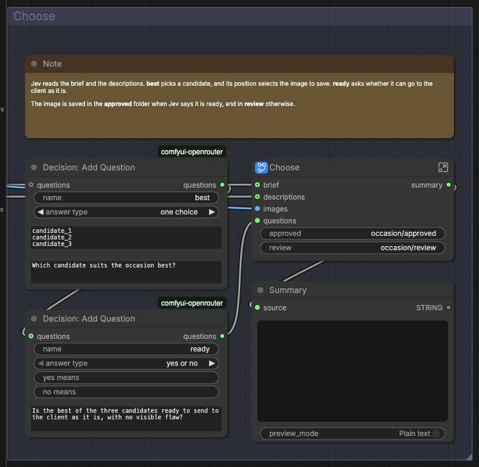

# 十个项目：先看任务，再看工具

比较20个仓库候选，结合近期 Show HN、项目官网/文档和版本记录。这里的“新近实用”有具体输入输出、实现或演示依据，不等于本站已安装验证。全部项目均核对许可、公开代码、近期维护和近7/30天收录记录；没有把总Star当成近期增长。

| 想做什么 | 可以先看 | 主要门槛 |
| --- | --- | --- |
| 把代码改动与设计解释放一起审查 | Whiteboard | 桌面客户端与既有编码Agent |
| 减少浏览器Agent反复读取页面 | Public Browser 3.0 | Node 20+、Chrome、MCP客户端 |
| 解释请求怎样在系统里移动 | DrawCMS | Node/Next.js；Agent协作需对应浏览器能力 |
| 给分支一套远程可见桌面 | Rig | 云运行环境与独立费用 |
| 从漏洞描述检索控制项 | AutoRMF ML Lab | Python、嵌入模型与标注数据 |
| 检查新生成代码的近似重复 | Treepeat 0.9 | Python、Tree-sitter；本次新增Lua |
| 把重复Agent步骤保存成工作流 | AgentRun | Node 22.19+；真实Jev调用另需密钥 |
| 连接云端GPU与边缘机器人任务 | RLark | Kubernetes、kcp、Docker及网络运维 |
| 在ComfyUI里编排云模型 | comfyui-openrouter | ComfyUI版本、账户额度与API密钥 |
| 按语义过滤终端文本 | grev | Go构建或二进制；Jev云服务 |

## 01 · Whiteboard：让代码审查有可追溯的设计画布

2026-09-24 · 9/24桌面发布批次加入统一差异视图与可保存设计数据。新近实用；热度待验证。

输入一个仓库或分支改动，Whiteboard 把差异、软件结构图和Agent解释放进同一桌面工作区。适合遇到大段AI改动时，先沿模块关系找到相关代码，再看为什么这样改。它本身强调审阅和设计，不是替代编码Agent去编辑整个仓库。

仓库8月18日已创建，不能称今天首次出现；9月24日版本记录包括统一/分栏差异视图与以JSON保存的软件图和审阅资料，随后版本主要修正打包和文档。最小路径是下载桌面版、打开仓库、连接已有Claude或Codex等Agent。MIT不包含外部模型调用权益。多仓库与协作仍有边界；Show HN 的一次讨论计数只能说明关注，未验证真实留存或长期采用。

dev.fast 官方演示原图。观察画布、审阅说明与代码位置如何对应；这是产品演示，不是对本站分支的审查结果。（[来源原图](https://github.com/devdotfast/whiteboard)；[查看大图](images/whiteboard-demo.gif)。）

[源码](https://github.com/devdotfast/whiteboard) · [MIT](https://github.com/devdotfast/whiteboard/blob/main/LICENSE)

## 02 · Public Browser 3.0：把多步浏览操作合成一次计划

2026-09-24 · 3.0新版本与9/23–24公开对照。新近实用；热度待验证。

它通过Chrome DevTools Protocol控制浏览器，用无障碍树引用定位元素，再用 `run_plan` 连续执行带变量与条件的步骤。输入网页任务，输出页面变化和操作结果；适合表单、跨页资料收集等需要反复观察的工作。

Node 20+和Chrome是主要环境，MCP客户端运行 `npx public-browser` 接入。作者在自建30项页面、五轮测试中报告会话token约3.02M对4.53M，耗时261对386秒；后者是耗时少约32%，不能说耗时下降48%。模型、浏览器和测试页固定，且平均响应更长，是取舍而非所有网页的胜利。项目始于4月，本次依靠3.0实质变化入选；MIT，未在本站执行浏览任务。

作者原始比较图。每个指标相对于各自基线归一化，短条通常更好；最后一行平均响应体积更大，保留这一不利项。自建测试页、Claude Opus 5、五轮中位数，非独立通用评测。（[来源原图](https://github.com/Silbercue/public-browser)；[查看大图](images/public-browser-benchmark.svg)。）

[源码](https://github.com/Silbercue/public-browser) · [MIT](https://github.com/Silbercue/public-browser/blob/master/LICENSE)

## 03 · DrawCMS：把架构图做成可讲解的请求过程

2026-09-19 · 近期补充：9/4创建；9/19发布可直接使用的无头引擎包。新近实用；热度待验证。

输入系统描述或已有图，DrawCMS输出可编辑的 `.drawcms` 文件、PNG或动画GIF。它把节点连线、运动效果和讲解步骤分开保存，适合解释请求先经过网关、再排队、最后落库的过程，比一张静态拓扑更容易看出等待与先后关系。

本次版本提供预构建无头引擎，减少CLI使用前的本地构建步骤。手工编辑可自行运行Next.js项目；Agent直接协作依赖兼容WebMCP的浏览器环境，普通浏览器仍可用普通编辑器。AGPL-3.0-only适用于代码和引擎，不能当作宽松MIT。动画内容由作者或使用者定义，不会自动证明系统实际按图运行，生成后仍应与代码核对。

DrawCMS官方动画第3秒的忠实单帧截图，未改连线与文字。它展示有顺序的交互图；完整动画可在源码README查看。截图只用于解释编辑器输出，不是本站系统追踪。（[来源原图](https://github.com/drawcms/drawcms)；[查看大图](images/drawcms-demo-frame.png)。）

[源码](https://github.com/drawcms/drawcms) · [AGPL-3.0-only](https://github.com/drawcms/drawcms/blob/main/LICENSE)

## 04 · Rig：让编码Agent的分支有一套远程桌面

2026-09-23 · 9/23创建的新公开实现，当前主分支。新近实用；热度待验证。

Rig给代码分支配置远程Linux桌面，使本地编码Agent能同步文件，在远端启动开发服务、运行浏览器和检查界面；人也能进入同一桌面接手。输入分支与未提交改动，产出可见预览和执行环境，适合本机资源紧或需要隔开开发环境的工作。

README提供 `rig up`、同步和MCP入口，实际使用仍依赖云运行环境、网络与认证，开源CLI并不等于远程算力免费。浏览器登录状态迁移属于额外功能，不能默认复制所有个人会话。MIT，尚无正式Release；本期核验了代码目录与官方桌面示例，未启动云机器，也未测试休眠、账单和隔离保证。

Rig仓库中的真实桌面示例原图。终端、浏览器与文件处在同一个远程开发环境，帮助理解本地Agent与远端可视检查怎样衔接；非本站运行。（[来源原图](https://github.com/ShadowWalker2014/rig)；[查看大图](images/rig-desktop.png)。）

[源码](https://github.com/ShadowWalker2014/rig) · [MIT](https://github.com/ShadowWalker2014/rig/blob/main/LICENSE)

## 05 · AutoRMF ML Lab：把漏洞措辞映射到控制项候选

2026-09-24 · 9/24 v1.0.0，新公开可复用训练与检索方法。新近实用；热度待验证。

输入CVE漏洞描述，项目用领域微调嵌入模型检索NIST控制项，输出候选映射。适合研究“技术症状”和“管理控制措辞”很不相同的跨域检索；公开实现含数据处理、训练与评估流程，避免只有一个模型演示链接。

作者2000条评测中，110M编码器top-1为77.45%，加入7B生成式重排后反而72%。这支持在该数据集上比较领域表示和通用重排，不能推成所有合规映射都不需要人工，或系统已经证明机构合规。Python 3.10+、嵌入推理、向量索引和相应数据是上手条件；Apache-2.0仅约束本项目代码，控制文本与外部数据仍应按原来源使用。本站未训练或复现数字。

[源码](https://github.com/applied-inference-lab/autormf-ml-lab) · [Apache-2.0](https://github.com/applied-inference-lab/autormf-ml-lab/blob/main/LICENSE)

## 06 · Treepeat 0.9：为Lua代码增加结构重复检查

2026-09-22 · 成熟项目9/22新增Lua解析与归一化支持。新近实用；热度待验证。

Treepeat通过Tree-sitter语法树和局部敏感哈希寻找相似函数或代码块。输入代码目录，输出重复位置、并排差异或可进入CI的SARIF报告；改了变量名但结构相似的AI生成代码，比逐行文本匹配更适合用它检查。

仓库始于2025年，这次入选只依据0.9版新增Lua：函数、匿名函数和表结构能够进入相似性检查，模块形式的函数名也有专门处理。用 `pip install treepeat` 后先比较none/default/loose三个规则，规则越宽越可能把本应不同的代码归在一起。Apache-2.0，作者仍称其概念验证；结构相似不等于行为等价，不能让检测报告自动决定删除或重构。

[源码](https://github.com/dsummersl/treepeat) · [Apache-2.0](https://github.com/dsummersl/treepeat/blob/main/LICENSE)

## 07 · AgentRun：把可重复的Agent步骤保存成工作流

2026-09-24 · 9/23新项目，9/24 beta.4。新近实用；热度待验证。

AgentRun用JSON或TypeScript描述工具调用、判断、分支、循环与人工升级。输入请求和已有工具，输出结构化结果或需要复核的状态。支持示例先查帮助文档，让Jev判断答案是否适用，不通过才调用Agent调查，再检查一次，避免每个请求都走完整自由探索。

Node 22.19+可运行无密钥的脚本化demo，但该demo的决策和回答是预置值，不是模型效果测试。真实Jev调用需要单独的TypeSafe密钥，宿主仍负责权限、费用和取消。Apache-2.0，当前beta版本；代码节点以进程权限执行，类型检查不能证明答案正确，也不自动提供不可信工作流沙箱。

Parcha官方支持流程原图。先检查已有答案，失败才进入调查，再决定回复或升级；图对应README里的脚本化示例，不能当作真实客户工单成功率。（[来源原图](https://github.com/Parcha-ai/agentrun)；[查看大图](images/agentrun-support.svg)。）

[源码](https://github.com/Parcha-ai/agentrun) · [Apache-2.0](https://github.com/Parcha-ai/agentrun/blob/main/LICENSE)

## 08 · RLark：统一管理云端训练与边缘任务

2026-09-24 · 9月开源，9/24同步控制面、数据面与网络实现。新近实用；热度待验证。

RLark用统一的Domain、Node、Job、Task抽象连接不同集群的训练与边缘设备任务。输入声明式作业，控制面安排任务，数据面提供跨集群连接和运行反馈；适合有云端GPU与机器人设备协同需求的团队，不是普通单机脚本的必要替代。

仓库7月创建，9月公开；9月24日提交同步API、控制面、Agent、网络与界面，并改进SSH连接池。快速开始可用Docker、kind和kubectl建立两个本地Kubernetes数据面，检查跨集群连通。当前主要运行时是Kubernetes，Docker/Raw轻量后端仍在路线图，不能写成已完整支持。Apache-2.0，尚无稳定Release；本期未搭集群或测试真实机器人。

RLinf官方架构原图。从控制面向多个数据面读，跨域网络连接与实际作业执行是两层职责；当前实现边界以README和路线图为准，未证明所有列出的未来后端可用。（[来源原图](https://github.com/RLinf/RLark)；[查看大图](images/rlark-architecture.png)。）

[源码](https://github.com/RLinf/RLark) · [Apache-2.0](https://github.com/RLinf/RLark/blob/main/LICENSE)

## 09 · comfyui-openrouter：把云模型结果接入可视工作流

2026-09-23 · 9/23创建的新扩展，当前主分支。新近实用；热度待验证。

该扩展给ComfyUI增加聊天、图像、视频、音频、检索和决策节点，把文件或提示输入云模型，再把文本、媒体或概率接回后续节点。适合已有ComfyUI流程、希望增加云端能力的用户，而不必分别维护每个服务的自定义调用。

要求Python 3.12+、ComfyUI 0.34.6+与兼容前端，还需有额度的OpenRouter账户。请求经服务端转发并计费，扩展MIT不包含模型权限或推理费用。示例中Jev可筛选候选图，但筛选分数仍需要任务验证；决策接口是alpha，可能变化。图片素材要自己填入，本站仅核验代码与示例工作流，没有发送真实付费请求。

扩展官方真实界面原图。左侧两项决策问题连接到右侧Choose子流程，并分别接收通过与复核结果；图说明节点如何配合，不代表这些判断在所有图片上可靠。（[来源原图](https://github.com/stefanionescu/comfyui-openrouter)；[查看大图](images/comfy-workflow.png)。）

[源码](https://github.com/stefanionescu/comfyui-openrouter) · [MIT](https://github.com/stefanionescu/comfyui-openrouter/blob/main/LICENSE.md)

## 10 · grev：用一句判断条件过滤终端记录

2026-09-24 · 9/24新公开实现。新近实用；热度待验证。

grev把“哪些日志说明上游超时”这样的语义问题放进Unix管道，输出匹配的原始记录；同一工具组还提供分类、排序、相邻去重与概率列。它适合关键词变化大、但判断条件相对清楚的文本整理，也保留后续awk等工具能处理的形式。

可使用发布二进制或Go构建，判断由TypeSafe Jev云服务完成，需要密钥、联网和费用预算。日志及文本会进入远程推理，使用前要明确数据范围；概率阈值不是事实保证，不能把示例里的秘密检测当成完整安全扫描器。代码可选Apache-2.0或MIT，本期已核对Apache许可原文。作者的速度、成本描述未独立复测，宜先用小份人工标注记录比较误筛与漏筛。

[源码](https://github.com/aurorainfra/grev) · [Apache-2.0](https://github.com/aurorainfra/grev/blob/main/LICENSE-APACHE)
