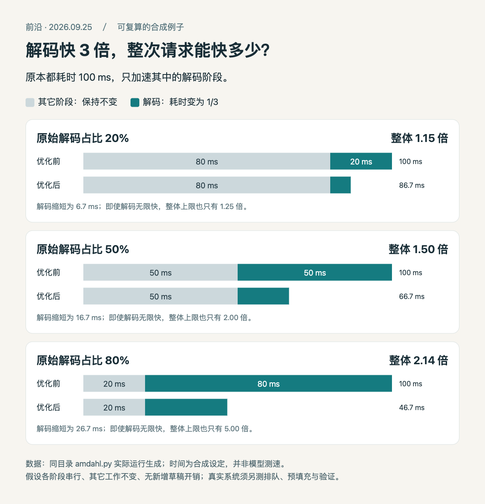

# 解码快3倍，为什么整次请求可能只快1.15倍

**已运行验证：Python公式与合成阶段数据；未运行模型测速。** 本例呼应[LFM视觉解码的原始性能图](02-开源模型.md)，把“局部阶段加速”和“用户总等待时间”之间的关系拆开算。只需要Python标准库，运行版本为 3.14.3。

假设一次请求原本100毫秒，其中解码占比例 `p`，其余阶段保持不变。只把解码提速 `s` 倍，新的耗时比例就是 `(1-p) + p/s`，所以整体加速为它的倒数。这里把图片编码、预填充等合成一段固定工作，暂时假设各阶段串行，也没有新增草稿验证开销。

```python
def overall_speedup(decode_share, decode_speedup):
    return 1 / ((1 - decode_share) + decode_share / decode_speedup)

for p in (0.2, 0.5, 0.8):
    print(p, round(overall_speedup(p, 3), 3))
```

实际执行[完整脚本](code/amdahl.py)后，得到以下结果。脚本将所有阶段数据保存为JSON，图中的条长直接来自这些数字。

| 原始解码占比 | 固定阶段 | 优化后解码 | 优化后总耗时 | 整体加速 |
| --- | ---: | ---: | ---: | ---: |
| 20% | 80 ms | 6.667 ms | 86.667 ms | 1.154倍 |
| 50% | 50 ms | 16.667 ms | 66.667 ms | 1.500倍 |
| 80% | 20 ms | 26.667 ms | 46.667 ms | 2.143倍 |



HTML/JS按本机Python计算结果绘制。浅灰条保持不变，因此解码占比越小，优化整体的空间越小。所有毫秒数是合成设定，不是任何模型的实际延迟。[查看原尺寸](images/amdahl.png) · [数据](code/amdahl-results.json) · [原始输出](code/amdahl-output.txt) · [可复现HTML/JS](code/amdahl.html)。

如果解码原来只占20%，即便它变成零耗时，总体也最多快1.25倍。增加图片数量、输入长度或缩短回答，可能改变这个占比；批量、排队和并行执行又会改变上面的串行假设。因此看到模型“快几倍”，先确认分母是解码、首token、完整响应还是整批吞吐。

复算方法是在本目录执行 `python3 code/amdahl.py`。若要重新导出图，在本目录启动 `python3 -m http.server 8000`，浏览器打开 `http://127.0.0.1:8000/code/amdahl.html`。更改脚本的占比或解码倍数后重新运行，再刷新页面。它帮助理解收益上限，不估算实际硬件性能，也没有把合成结果包装成模型实测。
