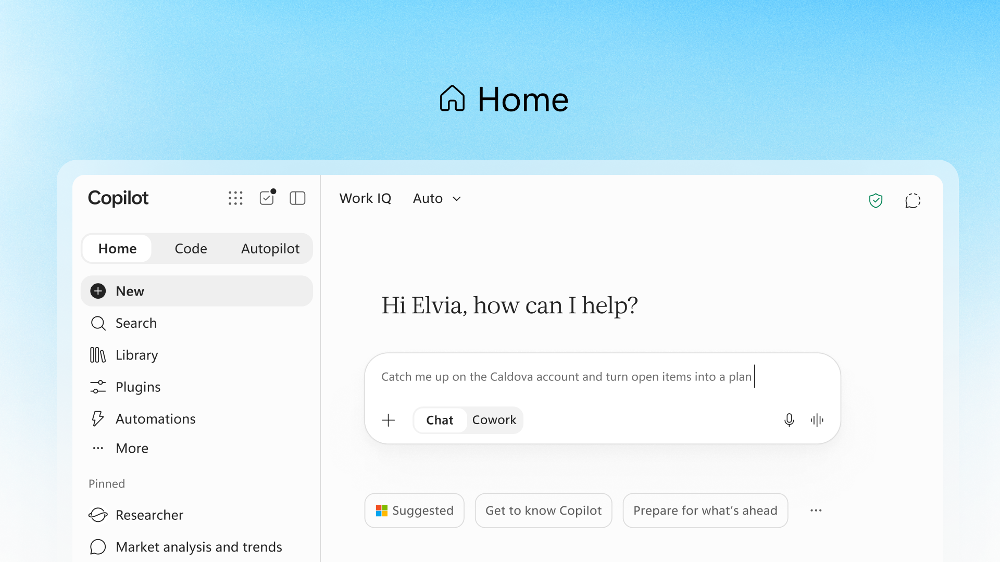
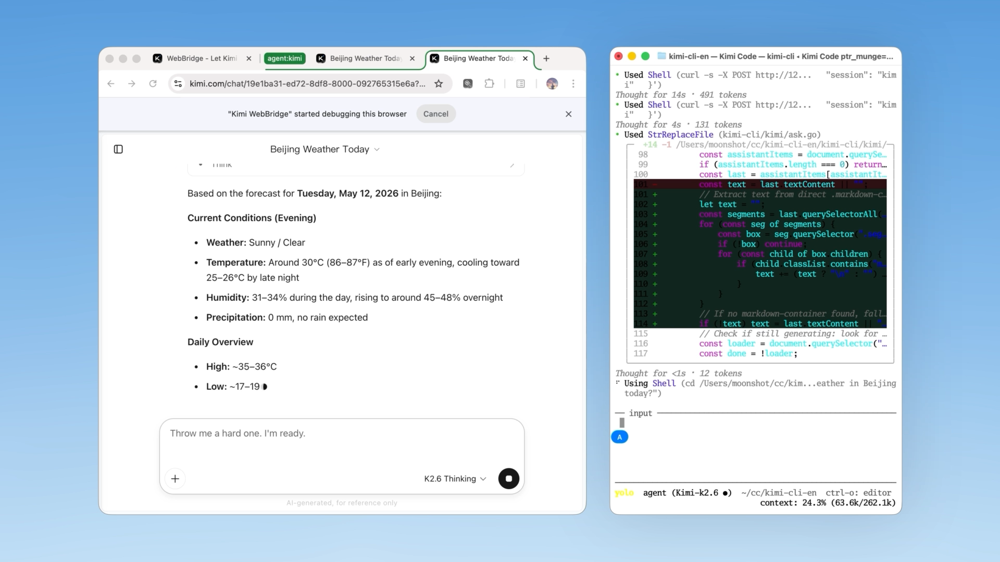
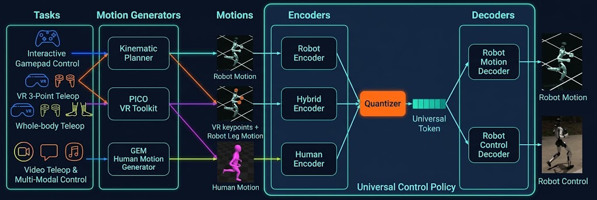
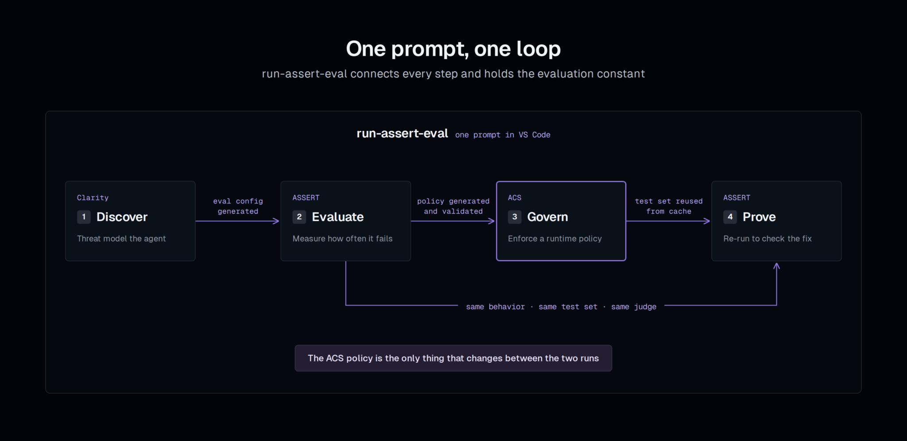

# 从回答问题到持续工作：15条 AI 动态

前5条重点详解，后10条速读。公告原日期覆盖9月22日至25日；日期精度不足的来源不猜首发时刻。所有产品效果和研究数字均标明出处，未在本站做重型模型或机器人实测。“热度待验证”表示尚不足两类独立近期信号，不影响具有具体新价值的内容入选。

## 01 · Copilot 改版：办公、写应用与持续代理进入同一工作入口

2026-09-25。新近实用；热度待验证。

Microsoft 公布新版 Copilot，以 Home、Code 和 Autopilot 组织不同工作方式。Home 把对话与 Cowork 放在一起，让任务能延续到 Office 文件；Code 面向从需求构建应用；Autopilot 则让代理在专属环境中持续跟进工作。这里真正的变化，是聊天、产物和后续执行开始连接起来。

以整理客户资料为例，Home 可以围绕资料问答、与人共同改文档；当任务变成“把这套处理步骤做成内部应用”，Code 接手构建流程。这个例子用于解释产品分工，不是本站完成的业务测试。Code 基于 GitHub Copilot 技术，并受组织环境及权限约束，不能把宣传中的构建能力理解成所有应用都能一次成功。

Autopilot 原名 Scout，具有自己的身份、工作区、计算环境与记忆，支持通过工作渠道接收任务、持续追踪并交付结果。持续运行的意义是人离开一次对话后，任务仍有承载环境；相应地，组织需要看清它能访问什么、调用哪些工具以及何时由人接手。

开放状态尤其要分开读：Home 与 Code 将面向 Frontier 计划在接下来数周推出，Autopilot 计划于月底进入私有预览；Managed Runtime 已进入预览。公告同时区分日常订阅权益与部分工作负载的用量计费，不能据此说所有新能力已向所有用户免费开放。

为什么现在值得看：这次改版给出了从文档到应用、再到持续代理的具体产品路径。研究者可以据此比较任务状态、权限与产物如何留存；采购或部署前仍需核对本组织的实际入口和预算。上述是官方公布的能力与时间表，尚不是独立可靠性评测。

Microsoft 官方 Home 界面。看左侧Home/Code/Autopilot入口，以及中央Chat/Cowork切换：它解释的是工作方式如何组织，不是模型准确率。仅引用这一界面用于产品评论，版权归 Microsoft，未作界面重绘。（[来源原图](https://blogs.microsoft.com/blog/2026/09/25/introducing-the-new-copilot-with-home-code-and-autopilot/)；[查看大图](images/copilot-home.png)。）

[原始来源](https://blogs.microsoft.com/blog/2026/09/25/introducing-the-new-copilot-with-home-code-and-autopilot/)

## 02 · Kimi 浏览器插件：把网页操作记录变成可复用工作流

2026-09-25。新近实用；热度待验证。

Kimi 浏览器插件原名 WebBridge。本轮更新被9月25日的报道带出，官方产品页确认了浏览器侧栏与操作录制入口。产品页没有给出精确上线时刻，因此这里的日期是公开报道日期；它不是把整个插件当成今天才出现的新产品。[日期线索](https://www.qbitai.com/2026/09/497075.html)。

侧栏让用户一边查看网页，一边向 Kimi 提问或安排任务，减少在网页内容和独立聊天窗口之间搬运上下文。对研究资料整理而言，可以先让它围绕当前页面工作，再检查结果；涉及账户或页面操作时，仍应辨别它读到了什么、准备执行什么，而不是把“在浏览器里”误解成完全没有远端处理。

另一个更实用的变化是录制工作流：用户示范一组网页操作，插件将步骤整理成可复用的 Skill。直觉上，这相当于把“每次重新解释一次流程”变成“先教一遍，再检查重复执行”。它依然依赖页面结构、登录状态和任务上下文；网站改版、弹窗或流程分支都可能使重放失效。

原有连接本地 Agent 的模式仍保留，官方说明使用浏览器调试连接已有会话。侧栏需要登录，Chrome 与 Edge 是官方列出的使用环境。官方演示可帮助理解录制到生成 Skill 的交互，但演示视频没有提供跨网站成功率、长期稳定性或与传统脚本的公平比较。

现在值得看的是把用户熟悉的网页操作变成可检查的工作说明。它更适合先从重复、可回退的资料处理开始评估，再决定是否扩展到复杂流程。本站只核对了产品页与演示，未接入私人浏览器会话，也未把演示效果计为本机实测。

Kimi 官方“Convert Workflow to Skill”视频第18秒的忠实帧。左侧浏览器、右侧本地Agent相互配合，展示沿用的WebBridge调用路径；画面含旧模型与5月示例，不代表9月25日新侧栏实测。新侧栏和录制能力依据产品页文字核验。截图不是本站执行结果，版权归月之暗面，仅用于说明该交互。（[来源原图](https://www.kimi.ai/products/kimi-browser-extension)；[查看大图](images/kimi-workflow.png)。）

[原始来源](https://www.kimi.ai/products/kimi-browser-extension)

## 03 · LeRobot 展示人形机器人流程：慢速规划与快速身体控制分工

2026-09-25。新近创新 / 新近实用；热度待验证。

Hugging Face 的 LeRobot 团队发布人形机器人集成说明，把 Unitree G1 的遥操作、数据记录、训练与运行连接起来。公告中有些控制器和数据早已存在，本次值得关注的是可一起使用的接口和工作流程，不应把所有硬件、数据和权重都改写成9月25日首发。

最难理解的一点，是为什么机器人既能执行语言任务，又能维持身体稳定。示例中的 π0.5 根据语言、相机和状态决定动作方向，输出 SONIC 的低维动作表示；SONIC 再把它变成全身关节目标。上层负责“做什么”，底层持续处理“怎样站稳和动起来”，两者并不以相同速度工作。

作者给出的拿罐任务训练设置包括约百段示范、三路相机，以及在4张 H100 上对 π0.5 基座进行12000步微调。它说明一条具体的模仿学习路径，不能被解读为买来 G1 就获得通用家务能力。真实部署仍涉及夹爪、相机、通信和校准，仿真跑通也不自动保证硬件表现。

另一条视觉避障实验不使用 VLA：深度画面经过冻结视觉编码器与时序模块，再通过 LoRA 适配 SONIC。在三种随机种子的模拟评测中，公开策略躲过79.1%的已判定投掷；遮空深度输入为0%，直接获得真实球状态的理想对照为97.4%。这组消融支持视觉输入有作用，但不是现实机器人的成功率。

现在值得借鉴的是分层接口、原始数据与对照条件。官方还提供硬件展示视频，但视频未明确对应检查点和相机设置；本站据此只确认演示存在。研究复现应先固定模拟环境、控制频率和观察输入，再比较不同控制器，避免只凭一段流畅视频判断系统成熟度。

LeRobot / SONIC 原始结构图。左侧不同遥操作和动作来源，经中间编码器形成统一动作表示，再由右侧解码器输出机器人动作与控制；不要把上层推理频率与底层控制频率混为一谈。图仅用于方法说明，版权归原作者，保留原图全部连接与标签。（[来源原图](https://huggingface.co/blog/nepyope/bringing-humanoids-to-lerobot)；[查看大图](images/lerobot-sonic.png)。）

[原始来源](https://huggingface.co/blog/nepyope/bringing-humanoids-to-lerobot)

## 04 · run-assert-eval：让发现风险、加拦截和回归测试连成闭环

2026-09-24 · 近期补充。新近创新 / 新近实用；热度待验证。

Microsoft 介绍 run-assert-eval，把 Agent 风险发现、测试和运行时治理接成一个循环。原文日期为9月24日，新闻索引后续展示的日期不替代它。现在值得看的是“修好以后怎样证明”，而不是又增加一份笼统的安全要求。

流程先把风险转成可测试的行为定义，ASSERT 固定测试案例与判断方式，运行基线后定位失败。接着为 Agent Control Specification（ACS）编写策略，在工具执行之前检查调用。最后仍用缓存的同一组定义、案例和裁判回归，避免换了一把尺子后声称问题已经消失。

官方示例是账单支持 Agent：它不应读取其他客户的账户，也不应在缺少验证时改变信息。与只在提示词里写“不要越权”相比，工具前的策略检查有明确执行位置。但策略仍需人工审阅，身份、资源和参数如何映射到判断条件，决定拦截是否可靠；不是把生成的规则直接当成完整安全证明。

跨客户访问这一汇总项，基线记录为40条适用对话中12条违规，加策略后为34条中2条。违规占比由30%降至约5.9%，但两组适用分母不同；正文保留原数，技术实践再演示怎样复算。更细的提示切分和场景切分也有残留失败，不能把某个子集的0写成从此不会出错。

ASSERT 与 ACS 以 MIT 许可开放，仓库提供七个工作领域、十四组风险套件。当前证据是作者的特定配置评测，未在本站重跑 Agent。实际采用时应同时记录合法请求被拒、工具错误和不适用项，先把失败变成稳定回归用例，再逐步扩大领域。

Microsoft 原始闭环图。重点看最后回到同一评测的箭头：加了策略还要复测，不能把“已配置拦截”当成“已验证修复”。只引用该方法图用于评论，图中步骤不代表本站已执行完整 Agent 测试。（[来源原图](https://commandline.microsoft.com/run-assert-eval-responsible-ai-agent-risk-discovery-at-runtime/)；[查看大图](images/assert-loop.png)。）

[原始来源](https://commandline.microsoft.com/run-assert-eval-responsible-ai-agent-risk-discovery-at-runtime/)

## 05 · Claude 的九圈振幅计算：有外部核验，也有明确问题边界

2026-09-25。新近创新 / 新近实用；热度待验证。

Anthropic 刊出物理学家 Matt von Hippel 的说明，讨论 Claude 完成九圈振幅计算的工作。这里的“圈”是微扰计算的阶数，不是机器人跑九轮任务；研究对象是平面 N=4 超杨–米尔斯理论中的六粒子 MHV 振幅。这是一种高度对称的理论设置，不等于解决了真实世界全部粒子相互作用。

方法直觉可以理解为逐步收紧答案允许满足的条件：利用已知的振幅结构与约束，把待定表达式压缩到能被求解和检查的形式。系统沿用了已有 bootstrap 和 form-factor 方法，编写并运行符号计算程序。重要成果是推进了一项繁重计算，不能因此说模型独自发明了新物理定律。

文中区分了生成结果与核验结果。物理学家 Lance Dixon 对结果作了外部检查；另一组研究者也有并行研究。不同团队的工作范围和产物需要逐一比较，单看新闻标题不能判断研究优先权，更不能把作者认可扩大为所有细节已经同行评审。

资源条件同样影响可复现性。文中描述的符号计算使用多核机器并持续运行，模型调用也有额外成本。因此“把问题扔给聊天框就得到答案”不是准确复现说明。对科研读者更有意义的是检查程序、约束、独立交叉检查以及最终数学产物是否可以相互对照。

这篇文章披露作者获得了 Anthropic 的写作报酬，参与核验的研究者获提供 Claude 使用额度。它仍可作为一项具体进展的原始说明，但利益关系与未完成的独立复核不能省略。本站阅读了作者叙述，没有重新执行高阶符号计算；热度线索不足两类独立证据，保留为待验证。

[原始来源](https://www.anthropic.com/research/yes-claude-can-do-nine-loops)

## 06 · Gemini Call for Me 开始有限试点：替用户打电话前仍需确认

2026-09-24 · 近期补充。新近实用；热度待验证。

Google 的帮助文档确认 Call for Me 可按用户任务拨打电话，开始前需核对号码及信息；通话会说明 AI 身份，用户可看记录并接管。9月24日为本轮报道日期，帮助页未提供精确首发时间。

当前条件包括美国、美国 SIM 卡、18岁以上、Pixel 11、英语及符合要求的付费 AI 与 Phone 公测设置。实用变化是把预约或咨询延伸到电话渠道；地区、设备和业务限制使它尚不能作为普遍可用的电话助手。证据为官方文档，本站未拨测。

[原始来源](https://support.google.com/gemini/answer/18336420?hl=en)

## 07 · Akamai 披露 Anthropic 长期算力协议，金额取决于交付条件

2026-09-24 · 近期补充。新近实用；热度待验证。

Akamai 在9月24日的8-K中披露，与 Anthropic 于9月18日签署两项专用云算力与支持计划，合计承诺约116亿美元，各自从服务启动日起计算七年。金额受交付、可用性及终止条件约束。[官方新闻稿](https://www.akamai.com/newsroom/press-release/akamai-announces-11-6-billion-multi-year-agreement-with-anthropic-to-support-growing-demand)说明主要承接CPU工作负载需求。

本条报道的是新公开的协议事实，签约日期并非今天。值得关注的是 AI 服务对长期容量的配置需求；合同金额不代表已确认收入、现成可调用容量或模型马上降价。证据是公司正式披露，未把未来建设当成已完成。

[原始来源](https://www.ir.akamai.com/static-files/db805670-271e-406b-91a5-e0b4ed226b5a)

## 08 · GitHub Agentic Autofix 开始读写 Copilot Memory

2026-09-25。新近实用；热度待验证。

启用 Copilot Memory 的用户，现在可让 Agentic Autofix 在处理安全警报时读取相关记忆，并将有用的修复模式留给后续任务。新增点是修复流程与记忆的连接，不是再次发布整个记忆产品。

两项能力仍为公测。对长期维护仓库，已有修复经验可减少重复摸索；错误约定也可能被复用，仍需检查补丁与测试。官方说明没有给出通用的安全修复成功率，本站未运行对照。

[原始来源](https://github.blog/changelog/2026-09-25-agentic-autofix-now-uses-copilot-memory)

## 09 · Copilot 在 Slack、Teams 中补齐附件与问题跟踪上下文

2026-09-25。新近实用；热度待验证。

GitHub 更新 Slack 和 Teams 的 Copilot 集成：加强附件、图片、转发消息及线程上下文处理，创建 issue 前检查相似问题，并保留对话关联。还新增会话级模型控制及长任务恢复改进。

适用场景是把讨论中的缺陷和素材交给编码代理，而不是手工重新拼一遍需求。公测面向 Copilot Business、Enterprise 组织，管理员需开启相应策略，部分能力逐步推出，用量计入现有权益与预算。证据为官方版本说明，未接入本站工作群。

[原始来源](https://github.blog/changelog/2026-09-25-updates-to-github-copilot-for-slack-and-microsoft-teams)

## 10 · Claude 插件开发者入口：提交、审核状态和使用数据连起来

2026-09-25。新近实用；热度待验证。

Anthropic 面向付费开发者提供插件门户：提交远程 MCP 或含 Skills、MCP 的 GitHub 包，接收自动检查与审核反馈，通过后由创建者选择发布；发布后可看安装与发现数据。

这次新增的是开发者从打包到分发的入口，区别于[前期 Marketplace 消息](../2026-09-24/01-AI动态.md)。它能减少提交过程的不透明，但通过审核不等于所有外部服务都免费或可靠；统一发现等部分变化仍在逐步推出。核验程度为官方流程说明。

[原始来源](https://claude.com/blog/build-plugins-for-claude)

## 11 · Intrinsic Core 开源工业机器人基础运行栈

2026-09-22 · 近期补充。新近实用；热度待验证。

Intrinsic 在 ROSCon 公布 Intrinsic Core，开放 ROS 兼容的本地运行时、实时控制、运动规划及硬件抽象，并提供机床上下料参考方案 OMTS。规范仓库采用 Apache-2.0。

现在值得看的是原型与工业执行共用基础组件的路径。它仍要求机器人开发经验、对应硬件及部署配置；高级 AI、Flowstate 和企业云服务并未因此全部变成开源。官方给出参考实现，本站未连接机械臂验证。

[原始来源](https://www.intrinsic.ai/blog/posts/introducing-intrinsic-core)

## 12 · OpenAI 将 Daybreak 访问扩展到乌克兰民用基础设施防御

2026-09-23 · 近期补充。新近实用；热度待验证。

OpenAI 宣布与乌克兰数字转型部门合作，为民用基础设施防御团队提供 Daybreak 访问，帮助定位软件漏洞、开发与测试修复。公告强调获授权的安全工作，涉及医院、能源和通信等公共服务。

这是一项新的机构合作与访问安排，不是全民开放网络攻击工具，也不是已证明所有基础设施攻击都能防住。值得关注的是模型能力如何配合实际防御流程；当前可核验材料是官方公告及活动记录，本站没有该项目的独立效果数据。

[原始来源](https://openai.com/index/openai-extends-cyber-access-to-ukraine-for-civilian-defense/)

## 13 · Google Beam 扩展到六国，十月将有按需体验场地

2026-09-23 · 近期补充。新近实用；热度待验证。

Google 宣布 Beam 相关 HP Dimension 设备扩展到美国、加拿大、英国、法国、德国和日本，并扩大渠道伙伴；Industrious 计划十月在部分美国城市提供预约体验。系统连接 Meet、Zoom 等会议流程。

实际变化是可交付地点与体验门槛，不能把公司内部用户研究当成所有远程协作的效率保证。对关心空间通信的团队，先验证场地、设备和会议兼容性，比只看沉浸感展示更有用。本站未体验设备。

[原始来源](https://blog.google/innovation-and-ai/technology/research/google-beam-expansion/)

## 14 · arXiv 获得1720万美元多年支持，投入基础设施与组织建设

2026-09-23 · 近期补充。新近实用；热度待验证。

arXiv 公布来自 Simons Foundation International、XTX Markets 与 Siegel Family Endowment 的合计1720万美元承诺，覆盖三至五年，用于日常服务、技术平台及独立组织建设。

这次的新事实是资金承诺，不是把早已宣布的独立转型再算一次首发。公告将 AI 生成内容管理列为平台面临的新挑战，但没有宣布新的论文真实性认证。对科研读者，它关系到长期访问、投稿与平台治理；金额不是已完成投入的成果。

[原始来源](https://blog.arxiv.org/2026/09/23/arxiv-receives-multiyear-investment/)

## 15 · Ollaya：把不生成长文本的决策模型放到本地运行

2026-09-25。新近实用；热度待验证。

Ollaya 在9月25日进入公开社区讨论；仓库创建于9月23日。它提供本地模型下载、守护进程与 CLI，用给定选项或分数回答问题，并兼容 TypeSafe 的接口。用途包括邮件分类、工单分流和路由判断。

运行时采用 Apache-2.0，下载模型另有许可；Mac 当前走 CPU，CUDA 条件另查文档。官方本地与云端延迟对比同时包含网络差异，不能据此认定模型全面更快、更准。HN 当日讨论只是一个热度信号，本条按新近实用入选，未本机运行。

[原始来源](https://ollaya.dev/)
