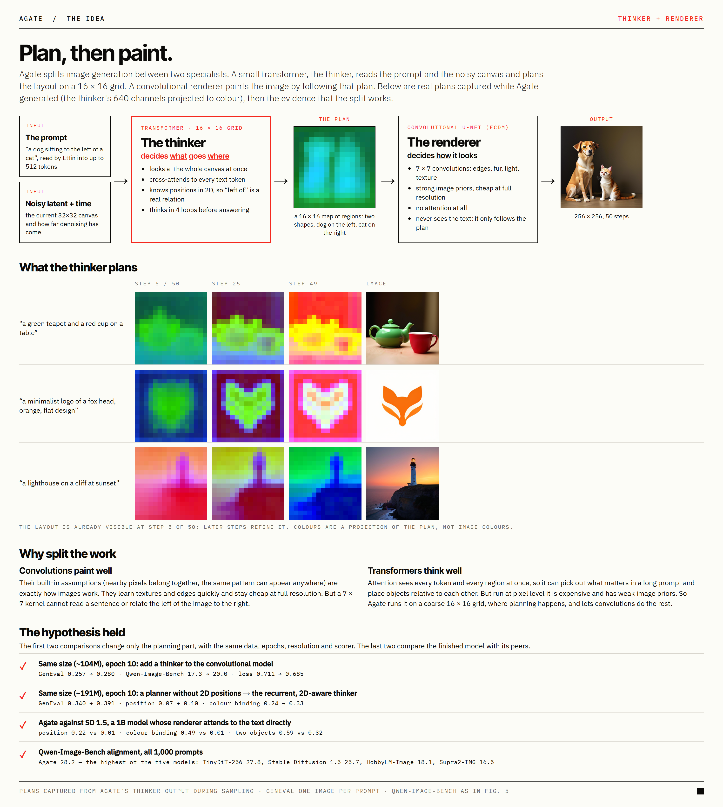
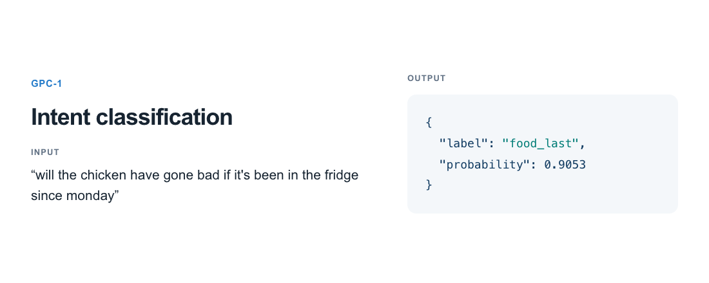

# 六个模型：生成、压缩、语音与结构化判断

本栏包含开放权重及带用途限制的研究模型，并非六项都可自由商用。已核对模型卡、权重文件清单、日期和许可；本站没有下载运行这些权重。模型新发布不等于已证明热门，单次下载数和点赞数不能代替近期使用趋势。

| 模型 | 先看什么 | 主要门槛 |
| --- | --- | --- |
| Agate preview | 小型文生图中的规划与生成分工 | MIT；预览版主要是英文、256像素 |
| OrcaSAQ-2-27B | 压缩权重与并发吞吐的取舍 | Apache-2.0权重；专用推理内核 |
| Pianissimo sv | 瑞典语及方言转写 | CC BY 4.0；NeMo与音频预处理 |
| GPC-1 | 从有限候选中输出类别或数值 | Apache-2.0；35B-A3B基础权重与适配器 |
| Swift 1.5 Flash Next | 推理token减少是否损伤任务 | Swift及上游许可；有访问和商用条件 |
| Texture-fix VAE | 减轻图像解码纹理伪影 | Qwen Research；非商业研究用途 |

## 01 · Agate：先写一张小计划，再铺出图像

2026-09-25。新近实用 / 新近创新；作者实验，热度待验证。

Logolabs发布的Agate把文生图分成Thinker和Generator：前者根据文本迭代形成16×16的空间计划，后者通过卷积式流匹配把计划变成图像。生成部分不再直接对文本做注意力操作。使用TAESD时整套约260M参数，换成另一VAE约308.5M；不能把生成器自己的191M当作全部部署体积。

新近创新在于用一个小型可检查系统研究“先安排空间、再补外观”。作者用565万张训练图像、26个epoch，报告约144.7个GH200小时。模型主要面向英文和256×256图像，适合作为结构与训练流程的研究材料，不是高分辨率商用出图能力的保证。

Logolabs模型卡原图。沿文本、计划、生成图像的路径阅读；中间计划不是最终图像，也不是单独由用户提供的草图。下方颜色是计划特征的投影，并非图像真实颜色；底部28.2对25.7比较的是对齐子项，正文28.2对29.1则是综合分，两者不要混用。MIT资料，保留作者署名。（[来源原图](https://huggingface.co/Logolabs/agate-preview-001)；[查看大图](images/agate-concept.png)。）

作者报告每条提示生成四张图的GenEval均值0.550，单张设置0.535；另一套1000提示比较中约28.2，对照SD1.5约29.1，并非所有指标都领先。数量超过三、准确文字和否定关系仍易失败。最小路径是按仓库示例加载完整组件，先固定种子和步数检查自己的提示；[MIT许可](https://huggingface.co/Logolabs/agate-preview-001/blob/main/LICENSE)与模型卡可读，本站未做本机生成测试。

[模型卡与权重](https://huggingface.co/Logolabs/agate-preview-001)

## 02 · OrcaSAQ-2-27B：权重更小，不代表并发一定更快

2026-09-24。新近实用 / 新近创新；作者实验，热度待验证。

这组Qwen3.8-27B压缩权重采用约3.21 bit/weight表示，将作者列出的54GB权重压到12.3GB。权重采用Apache-2.0，但SAQ压缩方法本身没有全部公开；可读权重、推理内核与能否重做压缩是不同开放范围。

模型卡在WikiText-2的16,376个token上给出困惑度5.6468→5.6482，token最高概率选项的一致率93.2%。这些测量支持该语料上的接近程度，不能替代代码、长程Agent或中文任务的能力测试，也不能把“困惑度近乎不变”写成所有输出无损。

性能表更值得细读：16GB内存预算、单流MTP设置约90.1对65.3 token/s，但八流时约220对332，压缩方案反而更慢；可分配KV缓存也更少。适合先研究单用户受限显存部署，上线并发服务则要另测。上手需匹配的专用运行时，标称长上下文不能视为16GB下可用长度。[权重许可](https://huggingface.co/orcarouter/OrcaSAQ-2-27B/blob/main/README.md)与逐条件表可核对，本文没有下载测试。

[模型卡与权重](https://huggingface.co/orcarouter/OrcaSAQ-2-27B)

## 03 · Pianissimo sv：瑞典语专门训练，方言仍要单独看

2026-09-23。新近实用 / 新近创新；作者实验，热度待验证。

KlangAI在Parakeet TDT 0.6B v3上，用约5万小时瑞典语音频微调出600M的Pianissimo sv。输入16kHz单声道音频，输出瑞典语转写，适合当地录音归档、字幕和语音检索。它是语言专门化权重，不是新增通用多语聊天能力。

作者同表中，Common Voice v26词错误率从基座18.54%降至4.46%，FLEURS从15.18%降至6.51%。不过在KlangDialect180上，Pianissimo为4.85%，低于基座25.82%，仍高于KB-Whisper large的2.30%；不能概括为所有方言最佳。

推理依赖NeMo和相应音频处理。卡片吞吐结果使用A100 80GB及批处理条件，不等于普通笔记本一条录音的等待时间。[CC BY 4.0许可](https://huggingface.co/KlangAI/pianissimo-sv/blob/main/README.md)要求保留署名与许可。现在值得看的是小于大语言模型的专门ASR路线及明确语言边界；本站未转写真实音频，也不把作者数据集覆盖当作对任意口音的保证。

[模型卡与权重](https://huggingface.co/KlangAI/pianissimo-sv)

## 04 · GPC-1：输出一个选择，而不是生成一段解释

2026-09-21。新近实用 / 新近创新；作者实验，热度待验证。

GPC-1建立在Qwen3.5-35B-A3B上，配合专门适配器做结构化预测。调用者给出问题、上下文和候选类别，模型返回有限集合上的结果；数值模式把指定范围离散成101个位置，联合模式需要明确枚举完整候选记录。它不等于一个可以任意生成JSON结构的通用接口。

例如把用户留言分到“支付、运输、账号”，输出可直接交给业务分流；数值评分则要事先说明上下限及任务含义。相比让语言模型先写解释再解析答案，这条路径减少了输出格式的不确定性，但错误分类依然存在，概率也不能自动当成校准过的置信度。

作者原始意图识别示例。观察候选标签如何约束输出，不将图中分数当成本站准确率或校准测量。文本来源：Larson等人的CLINC OOS，CC BY 3.0；GPC作者制作呈现，完整归属见[素材说明](https://huggingface.co/harshatheg/GPC-1/blob/main/docs/DATA_AND_LICENSES.md)。（[来源原图](https://huggingface.co/harshatheg/GPC-1)；[查看大图](images/gpc-choices.png)。）

本次公开的是新模型与使用方式，尚缺独立任务复现。需加载匹配的基础模型和适配器，BF16权重本身约70GB，激活参数少不代表只存储3B权重；服务端上下文上限也不是硬件可用长度保证。[代码及基础模型许可说明](https://huggingface.co/harshatheg/GPC-1/blob/main/docs/DATA_AND_LICENSES.md)区分了第三方数据与素材。适合先以自己的标注集验证分流，而非直接触发不可逆操作。

[模型卡与权重](https://huggingface.co/harshatheg/GPC-1)

## 05 · Swift 1.5 Flash Next：思考更短，但收益要逐任务计算

2026-09-22。新近实用 / 新近创新；作者实验，热度待验证。

ukisai基于Qwen3.8-Flash-Next后训练，目标是减少不必要的长思考。权重仓库9月22日创建、24日更新；这是另一基座的新检查点，不把此前27B版再次换日期推荐。作者通过训练约束推理长度，给出逐任务质量和token表。

在xhigh条件下，GPQA准确率89.8→89.6，平均思考token从17,683降到7,823，约少55.8%；中位数降幅则是另一个统计量。Terminal-Bench的输出token从40,591增加到45,428，说明不是每类任务都更短。token变少也不自动等于同比例的端到端延迟或费用下降。

BF16文件总体约360GB，文档示例采用8路张量并行；低位GGUF仍在约66.5–76GB量级，不能只按激活参数估计内存。模型访问有条件，本站没有申请、接受条款或下载权重。[Swift许可](https://huggingface.co/ukisai/Swift1.5-Qwen3.8-Flash-Next/blob/main/LICENSE)包含商业营收门槛，上游Qwen条款也仍适用；不能当作无条件Apache模型。近期价值在于可比较的推理长度取舍，而不是已经独立证明的通用加速。

[模型卡与权重](https://huggingface.co/ukisai/Swift1.5-Qwen3.8-Flash-Next)

## 06 · Texture-fix VAE：修掉网格纹理，也可能改变真实细节

2026-09-24。新近实用 / 新近创新；作者实验，热度待验证。

madebyollin对Qwen-Image-2.1的VAE解码器做非官方微调，主要针对规则性的棋盘或网格纹理。它只替换潜变量到像素的解码部分，不是重新训练整套文生图主干；约750万可训练参数、5000步是作者这次微调的设置。

下面是一组作者原始局部放大对照。应观察平滑区域的周期纹理，而不是据一张精选图判断整体更真实。前、后文件分别保留，未重画或改动图像内容。

madebyollin发布的原VAE示例局部放大图；放大范围由作者提供，本期未再次裁切。与下一张对应。（[来源原图](https://huggingface.co/madebyollin/texture-fix-vae-for-qwen-image-2.1)；[查看大图](images/vae-base.png)。）

madebyollin发布的修改后解码结果。用于比较周期纹理与细节取舍，属于作者示例，不是本站生成。两幅图仅限本条技术评论引用。（[来源原图](https://huggingface.co/madebyollin/texture-fix-vae-for-qwen-image-2.1)；[查看大图](images/vae-texture.png)。）

作者在COCO 5000张、256像素重建中报告rFID从3.37降至2.08，但PSNR从33.30降至32.86、LPIPS从0.0357升到0.0373。感知分布改善与逐图保真退化可以同时发生，细节也可能被平滑或改变。最小使用需匹配基础模型及VAE加载方式。[Qwen Research许可](https://huggingface.co/madebyollin/texture-fix-vae-for-qwen-image-2.1/blob/main/LICENSE)限定非商业研究/评估，不能因改动规模小就忽略许可。

[模型卡与权重](https://huggingface.co/madebyollin/texture-fix-vae-for-qwen-image-2.1)
