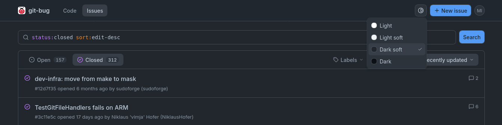
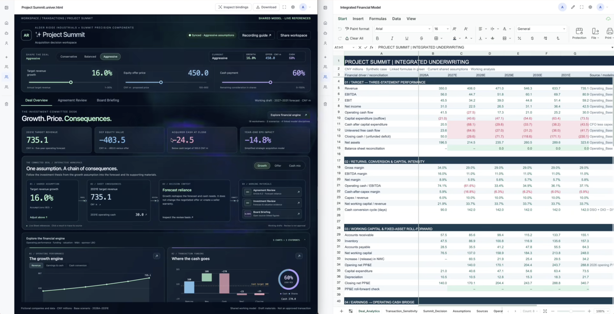

# 十个项目：按真实任务选择工具

本期比较至少15个候选，结合GitHub近期榜单与版本记录、Hacker News讨论、作者文档及软件包目录。没有用历史总Star认定“近期热门”；只有一类近期信号时仍标热度待验证。下面均为公开实现与作者示例核验，本站未安装运行这些项目。

| 想完成的任务 | 项目 | 上手要注意 |
| --- | --- | --- |
| 离线维护问题记录，再随Git同步 | git-bug | Git身份与独立的issue存储 |
| 在应用内嵌入表格和文档 | Univer 1.0 | 开源核心与商业Pro功能边界 |
| 比较两次编码Agent为何走向不同 | AgentLens | Node 20+、Git及Codex CLI |
| 从长访谈挑出有完整语义的短片 | jevcut | FFmpeg、转写与决策服务 |
| 在终端使用较小的编码Agent界面 | kiss | Rust二进制、模型账户或密钥 |
| 跟踪多Agent项目任务和对话 | StarNet | 桌面环境、后端服务与模型费用 |
| 用容器启动本地模型服务 | RamaLama | Podman/Docker、驱动和权重 |
| 检查Power BI模型改动是否越界 | pbi-guard | PBIP/TMDL文件、Python与断言 |
| 快速翻看一批图片与视频 | Carosello | Linux、GTK/GStreamer |
| 在CPU本地按语义过滤文本记录 | gutcheck | 首次下载模型、独立阈值验证 |

## 01 · git-bug：把问题记录放进Git，而非聊天历史

2026-09-22 · v0.11近期实质更新。新近实用；热度待验证。

git-bug把问题、评论和状态放进Git对象存储，再通过远程仓库同步，工作区代码不需要混入一堆issue文件。适合离线开发、迁移项目或希望问题记录跟着仓库保留的研究小组。输入问题与评论，输出可查询、可同步的记录，网页界面只是其中一种入口。

v0.11结束了较长的发布间隔，新增网页创建/评论、搜索筛选与可分享筛选链接等功能。最小流程是安装发布包，在已有Git仓库里创建用户、添加issue，再启动`git bug webui`；代码与issue各自的同步规则需要理解。新Web界面不能自动当成带完整权限控制的公网服务。

维护者v0.11发布中的真实界面原图。顶部用status和排序表达式筛选本地问题，并提供新建入口；它帮助理解网页操作与Git内issue记录的关系。GPL-3.0项目文档，保留项目归属。（[来源原图](https://github.com/git-bug/git-bug)；[查看大图](images/gitbug-web.png)。）

9月25日HN讨论提供一类近期关注信号，尚无第二类独立增长证据。本期依据新版本可用功能入选，没有把单次讨论或总Star当成长期采用。

[源码](https://github.com/git-bug/git-bug) · [GPL-3.0](https://github.com/git-bug/git-bug/blob/trunk/LICENSE)

## 02 · Univer 1.0：给应用加上可操作的表格和文档

2026-09-24 · v1.0主要版本发布。新近实用；热度待验证。

Univer是可嵌入应用的表格、文档等编辑框架。与把电子表格导出成静态预览相比，它让开发者通过数据模型与API控制内容、公式和用户交互，适合研究数据标注、内部分析和Agent辅助编辑界面。

1.0发布调整统一API与组件组织，旧接入代码需要迁移，例如表格创建入口发生变化。先从官方Sheet示例创建工作簿，再接入业务数据；完整源码开发要求Node 22.18+、pnpm 11+，普通应用使用预设包可减少初始配置。产品宣传涉及更多编辑器，不代表全部功能都在开源核心。

维护者README的工作区原图。左侧应用调整假设，右侧表格显示关联数据与公式，二者共享工作模型；这是作者合成业务示例。图中展示范围不等于Apache核心的功能清单；协作、部分导入导出和服务端能力需另查Pro商业许可。（[来源原图](https://github.com/dream-num/univer)；[查看大图](images/univer-workspace.png)。）

[源码](https://github.com/dream-num/univer) · [Apache-2.0](https://github.com/dream-num/univer/blob/dev/LICENSE)

上手前对照[1.0发布记录](https://github.com/dream-num/univer/releases/tag/v1.0.0)与核心/Pro边界，尤其不要把在线演示中所有功能都算作免费开源。本站未构建这个工作区。

## 03 · AgentLens：定位两次Agent运行的分叉点

2026-09-16 · 9月16日新项目；9月25日Show HN，近期补充。新近实用；热度待验证。

同一任务跑两遍，最后补丁不同，光看聊天结尾很难知道原因。AgentLens记录编码Agent的会话过程，把命令、输出、文件变化和检查结果放在时间线上，并比较两次运行在哪里分叉。适合调提示、换模型或复盘失败修复，不是一个覆盖整台机器的安全审计系统。

公开代码使用Node 20+、Git及已登录的Codex CLI。先记录一个小仓库任务，再用比较视图检查首次不同的工具调用与后续补丁；别只比较最后一句总结。默认脱敏依赖规则，不能保证所有业务秘密都已移除，分享前仍要检查原始记录。

本期核对代码入口与作者合成演示，没有记录用户真实任务。9月25日的讨论属于近期发现线索，原项目日期仍是9月16日；资料尚不足以称为已验证热门。

AgentLens作者的合成演示截图。左右两次会话用于说明分叉比较，内容并非本站或真实用户运行结果；关注差异定位和检查输出的对应关系。（[来源原图](https://github.com/fang520huang-lgtm/AgentLens)；[查看大图](images/agentlens-compare.png)。）

[源码](https://github.com/fang520huang-lgtm/AgentLens) · [MIT](https://github.com/fang520huang-lgtm/AgentLens/blob/main/LICENSE)

## 04 · jevcut：先找合法剪辑边界，再让模型挑片段

2026-09-20 · 9月20日新项目，主分支持续更新。新近实用；热度待验证。

输入长访谈或讲话视频，jevcut先转写并测量停顿，再从句末、说话人切换和转写起止位置等候选中选边界；模型给候选片段评分，最后由FFmpeg输出短片和复核页面。单纯停顿可能出现在句中，不能直接当成完整语义边界；代码分别保留测量位置和实际裁切位置，不让模型凭空编造时间码。

相较“让大模型直接写一串时间码”，这种约束更容易检查是否切断语句。上手需要Python/uv、FFmpeg，以及转写和TypeSafe/Jev等服务配置，外部调用可能产生费用。先用一段授权访谈检查字幕对齐和切点，再批量处理。

公开实现与README支持上述工作流，暂无正式Releases。转写错误、长时间无语言的视觉片段和多人重叠说话仍会影响选片；作者演示不能代替剪辑质量的独立评测。

[源码](https://github.com/VBS2004/jevcut) · [MIT](https://github.com/VBS2004/jevcut/blob/master/LICENSE)

## 05 · kiss：保持终端编码流程简单，同时保留选择状态

2026-09-23 · v0.0.18加入服务支持与连续推理状态处理。新近实用；热度待验证。

kiss提供较小的终端编码Agent界面，核心操作围绕读、写、编辑文件与执行命令。输入仓库任务，输出工具调用和补丁，适合希望直接观察操作过程、少依赖大型工作台的开发者。

这次版本新增服务支持，并处理连续推理中的选择检查点及过期选择，属于会影响长会话行为的变化。最小路径是下载官方发布二进制，配置已支持的模型账户后在小仓库运行；从源码构建需要Rust。提供某种订阅登录方式，不等于所有上游模型费用都包含在内。

项目仍处于0.0.x快速迭代阶段，多服务兼容和实验性选择路径应以该版本文档为准。本期查看版本与代码，没有用它修改实际仓库，自动命令的权限边界仍由用户运行环境决定。

[源码](https://github.com/racetozero/kiss) · [MIT](https://github.com/racetozero/kiss/blob/main/LICENSE)

## 06 · StarNet：让项目对话、委派任务和状态留在同一处

2026-09-20 · v0.12.4加入持续项目协调与任务通信。新近实用；热度待验证。

StarNet以桌面工作区呈现项目和多个Agent，最近版本让项目协调者保留对话，通过通信与委派队列把任务交给不同角色，并显示执行状态。它的实用点是把“谁正在处理哪件事”及上下文交接放在一起，而不是视觉外观本身。

输入项目与任务，产出可跟踪的委派、对话和工作结果。先安装受支持的Windows/macOS发布包，配置模型服务并给项目指定工作空间；底层包含Tauri与Node侧车，模型调用有独立费用，不能因桌面端MIT就认为服务免费。

该项目已有历史，本期入选依据是近期持续协调与通信能力更新。尚缺独立长期使用记录，复杂任务仍需检查权限、结果和失败重试，不应把多角色展示当成自动提高质量的证据。

[源码](https://github.com/androoAGI/starnet) · [MIT](https://github.com/androoAGI/starnet/blob/feat/harness-backend/LICENSE)

## 07 · RamaLama：把模型、容器和本地服务连起来

2026-09-25 · v0.25容器环境及服务默认地址更新。新近实用；热度待验证。

RamaLama用命令行管理本地模型，把权重来源、运行时容器和硬件选择接到一起。输入模型引用，输出交互运行或本地API服务，适合反复试验不同模型、又不想让每个Python环境互相污染的研究者。

0.25加入toolbox相关支持，并把服务默认监听调整到回环地址；已有远程客户端的部署需要明确检查绑定配置。安装发布版后，从文档的`ramalama run`和`ramalama serve`最小示例开始，仍需Podman/Docker、匹配驱动与足够的模型存储。

这次入选基于容器使用和服务暴露方式的实际变化，而非老项目知名度。Linux与macOS硬件路径不同，容器也不等于完全隔离风险；模型权重的许可和资源需求要独立检查。本站核对版本、PyPI条目和维护者文档，未启动GPU推理。

[源码](https://github.com/containers/ramalama) · [MIT](https://github.com/containers/ramalama/blob/main/LICENSE)

## 08 · pbi-guard：检查BI模型文件有没有越过约定

2026-09-19 · 9月19日新公开的断言检查工具。新近实用；热度待验证。

让Agent修改Power BI模型后，如何检查它没有改掉关键度量或引入禁止的字面量？pbi-guard读取PBIP/TMDL文件与YAML断言，检查DAX表达式、引用和约定，再输出审计报告。输入是模型源码，输出是通过/失败与相应证据，适合作为提交前的静态检查步骤。

依赖Python 3.9+与PyYAML，仓库示例用`python main.py -c pbi_tests.yml -m ../Sales.pbip --export-report uat_audit.md`。可先写一条关键公式不得改变的断言，故意修改文件，检查报告能否指出差异。

必须区分文本断言和执行DAX：该工具并未重新计算报表真实结果，静态检查通过不代表商业指标正确。公开实现可检查，仍处于早期维护阶段；本期未运行Power BI工程，也未把作者的“审计”表述当作独立认证。

[源码](https://github.com/Patens-dev/pbi-guard) · [MIT](https://github.com/Patens-dev/pbi-guard/blob/main/LICENSE)

## 09 · Carosello：按文件夹快速翻看混合图片和视频

2026-09-14 · 9月14日新项目，近期补充。新近实用；热度待验证。

Carosello是Linux桌面的图片与视频查看器，适合检查一批生成图片、短视频或实验输出。它以文件夹为单位浏览，结合元数据与预加载减少来回切换程序；输入真实媒体文件，输出快速人工筛查，不替用户判断生成质量。

项目用Rust、GTK4/libadwaita及GStreamer，优先按README选择适用的Flatpak包或构建路径。当前并非macOS通用应用。旋转、镜像等保存操作可能写回文件，检查数据集时先使用副本，避免把查看动作混成数据修改。

仓库9月14日创建，本期按30天窗口补充；9月26日虽有1.2.4版本，但缺少足够变更说明，不包装成当日重大升级。入选依据是新工具已提供明确本地媒体工作流及代码，热度仍待验证。

[源码](https://github.com/grigio/carosello) · [GPL-3.0](https://github.com/grigio/carosello/blob/master/LICENSE)

## 10 · gutcheck：用CPU本地模型给文本记录打分

2026-09-26 · 9月26日新项目。新近实用；热度待验证。

gutcheck把语义判断放进命令行管道：输入日志、段落或JSON字段，按自然语言问题返回筛选结果、标签或分数。与昨日介绍的云服务型grev相比，这里新增的具体条件是本地CPU推理，不需要API密钥或常驻Python服务；它仍是另一套实现，能力不能直接类比。

工具用ONNX Runtime运行322M的多语Laya编码器，首次运行需下载模型。代码MIT、权重Apache-2.0分开提供。可以先使用`-s`查看每条记录的分数，再决定阈值，不要直接信任默认0.5；作者也记录了明显风险语句漏判的例子。

文档给出的约每秒10条属于作者测试。长于1024 token的记录会截断，每条独立判断，没有自动保留相邻上下文。近期价值在于可直接嵌入本地文本流程的输入输出约束，本站核对实现结构与限制，未下载模型复测。

[源码](https://github.com/sfmqrb/gutcheck) · [MIT](https://github.com/sfmqrb/gutcheck/blob/main/LICENSE)
