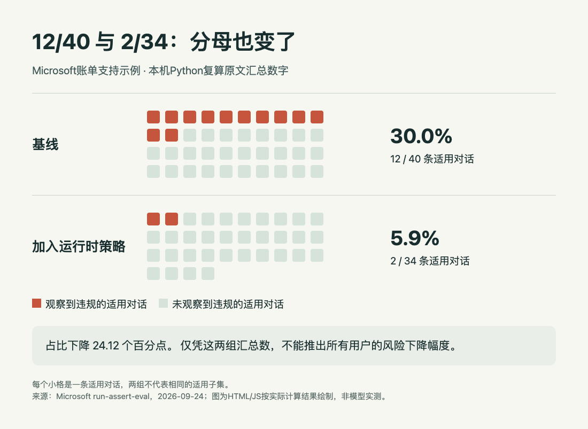

# 看到“违规减少”，先把分母写出来

**已运行验证：本机Python复算公开汇总数字；未重新运行Agent评测。** 本例接着[run-assert-eval新闻](01-AI动态.md)做一个很小的检查：变化的是违规次数、占比，还是所有用户的风险？只用Python标准库，本次运行版本为 3.14.3。

Microsoft原文在账单支持示例中报告：基线40条适用对话有12条违规，加运行时策略后34条适用对话有2条违规。注意是“适用对话”，不是所有对话或所有客户。策略可能改变一条对话是否进入某项检查，因此两个分母不能悄悄当成同一批对象。

## 第一步：同时保存计数和分母

```python
rows = [("基线", 12, 40), ("加入策略", 2, 34)]
for label, violations, applicable in rows:
    if applicable <= 0 or not 0 <= violations <= applicable:
        raise ValueError("invalid counts")
    print(label, violations / applicable)
```

[完整脚本](code/recount.py)还保存运行版本、原始来源和未舍入数值。本机执行结果：

| 测量 | 结果 | 回答的问题 |
| --- | ---: | --- |
| 基线占比 | 30.0000% | 40条适用对话里有多少违规 |
| 加策略后占比 | 5.8824% | 34条适用对话里有多少违规 |
| 占比之差 | 24.1176个百分点 | 两个比例相差多少 |
| 占比相对降幅 | 80.3922% | 以原比例为基准，比例减少多少 |
| 次数相对降幅 | 83.3333% | 12次变2次，计数减少多少 |



每格代表一条适用对话，先数全部格子，再数红格。图由HTML/JS读取本机Python的实际输出绘制；它展示复算结果，不冒充Agent重新运行的结果。[原尺寸](images/recount.png) · [数据](code/recount-results.txt) · [运行输出](code/recount-output.txt) · [制图HTML/JS](code/recount.html)。

## 第二步：选择与问题一致的表达

`12 - 2 = 10`是少了10次观察到的违规；`30% - 5.8824%`是少了约24.12个百分点。把二者都叫“下降80%”会丢掉比较对象。这里可以准确写成“在两次运行各自的适用对话中，观察到的违规占比由30%降到约5.9%”，并紧跟12/40和2/34。

仅凭汇总数，不能知道哪些对话在两次都适用、是否同一条反复失败、是否遗漏其它风险，也不能据此完成配对显著性检验。相同测试提示与相同判分器能减少部分变化因素，但不自动保证适用子集相同。若某子项观测为0，有限样本里的0也不是未来风险为0。

## 复算与下一步实验

下载三个脚本/数据文件，在本期目录运行 `python3 code/recount.py` 即可重新计算。若要查看或导出图，在本期目录启动 `python3 -m http.server 8000`，打开 `http://127.0.0.1:8000/code/recount.html`。HTML不调用外部模型或收费服务。

真正复测时，应额外保存匿名案例ID、两次适用状态、判分结果及合法行为是否受阻，再比较共同适用子集和全部案例。本次只做算术核验，没有获得原始逐案例日志，不估计真实部署风险或统计显著性。

[数据原文与实验条件](https://commandline.microsoft.com/run-assert-eval-responsible-ai-agent-risk-discovery-at-runtime/)。原文已有流程图，但没有本例逐格呈现不同分母的图；生成式图片不适合准确保持40和34个对应格子，因此采用可复算的HTML/JS。
