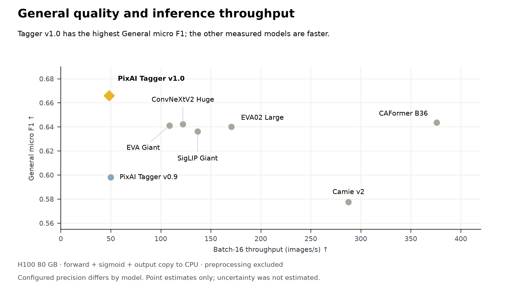

# 六个模型：选择、标注、局部编辑与视频加速

本栏沿用“开源模型”栏目名，具体包含宽松许可模型、开放权重和有限制的研究适配器，开放范围逐项说明。已核对权重文件、模型卡和许可；未在本站下载运行，作者演示不算独立复现。新近价值依据来自明确任务与实验，单次下载数不用于认定热门。

| 对象 | 输入 → 输出 | 先检查的门槛 |
| --- | --- | --- |
| Julia-1 | 文本与候选 → 选项 | Apache-2.0；CPU可跑，任务外推有限 |
| PixAI Tagger v1.0 | 插画 → 多类别标签 | Apache-2.0；计算更重、适用图像有偏向 |
| Krea2 inpaint edit | 蒙版图、文字 → 局部编辑 | 需Krea-2-Raw及LoRA；社区许可有营收条件 |
| Veda H3 predictor | 视频注意力特征 → 稀疏保留计划 | 并非完整视频模型；MiniMax许可有地区限制 |
| Viggle Qwen turbo | 提示词 → 少步图像 | Qwen研究许可，仅非商业研究/评估 |
| Nanosaur2 | 提示词 → 插画 | MIT模型卡；上游编码器许可另查 |

## 01 · Julia-1：用小型编码器完成有限选项判断

2026-09-23。新近实用；热度待验证。

Julia-1以约144.3M参数的mmBERT-small为基础，面向给定候选的选择任务。文本和候选一起进入编码器，返回所选答案；原生支持2至20个选项，检查点约550.5MiB。与让大模型生成整段理由相比，它提供更小的分类接口，但可选答案需要事先定义。

作者报告H200、BF16设置下，2000题的typed评测答对1463题，即73.15%；表中的Jev数值是参考结果，不是本站同机对跑。模型原生长度8192，但主要历史准确率实验使用1024长度，8K通过输入烟测不能当作8K准确率证据。Banking77试验还用了候选缩短流程，不能把它当成完整77类同设置对照。

为什么现在值得看：9月23日的新权重给文本路由提供了可用的小模型路径。按模型卡使用Python 3.11和对应加载代码，CPU即可尝试；权重与推理资料采用Apache-2.0，完整训练流水线未公开。MASSIVE实验采用18种场景类别，不是槽位抽取全任务；作者结果尚待独立复现。

[模型卡与权重](https://huggingface.co/SupersonicLabs/Julia-1)

## 02 · PixAI Tagger v1.0：标签更细，吞吐代价也更大

2026-09-15 · 近期补充（近30天）。新近实用；热度待验证。

这个插画标注器采用约486.3M参数的SAM3骨干，将1008×1008图像转换为六类、约3.09万种标签。适合给插画素材建索引、整理训练数据或检查角色特征；它不是通用自然图片描述模型。本期作为近30天首次收录的近期补充，保留15日原日期，不将22日模型卡更新改写成首发。

在50,416张留出图像的公共标签交集上，作者报告通用标签micro-F1从v0.9的0.5980升至0.6660，角色标签从0.8198升至0.9242。交集仅含8407种通用、2099种角色标签，因此不能把这一比较扩大到各模型全部词表。完整词表实验使用另一测试集和阈值口径，也不直接横比。

PixAI官方质量/吞吐原图。横轴是H100、batch=16吞吐，纵轴是共享标签上的F1；右上更理想，但本版并非最快。图用于解释质量与成本取舍，不能视为普通CPU速度。Apache-2.0资料。（[来源原图](https://huggingface.co/pixai-labs/pixai-tagger-v1.0)；[查看大图](images/pixai-tradeoff.png)。）

H100、batch=16不含预处理约48.3图/秒，端到端约21.8图/秒，比多种较小标注器慢。最小路径需要PyTorch、torchvision、Transformers、timm、Pillow等，并审查模型卡的自定义加载代码。许可为Apache-2.0，图像领域偏向和标签阈值仍应在自己的素材集上验证；本站没有重新推理。

[模型卡与权重](https://huggingface.co/pixai-labs/pixai-tagger-v1.0)

## 03 · Krea2 inpaint edit：修改蒙版区域，同时观察其余画面是否漂移

2026-09-24。新近实用；热度待验证。

这组LoRA为Krea-2-Raw增加局部修补与扩图用法。输入带黑色遮挡区域的图片和编辑提示，模型补全指定内容；作者提供default、mild和strong变体，分别兼顾编辑力度、未遮挡区域保留及扩图。它们是适配器，不能脱离基础模型单独生成。

官方比较同时放出参考图、生成结果和差异图，目的不是只看新物体画得像不像，而是检查原本无需改变的区域是否被一起改写。当前依据是作者示例，没有大规模盲评或标准化误差统计，不能保证蒙版外像素完全不变。

Cierpliwy模型卡完整原图：左列为蒙版输入/参考，中列为本适配器，右列为另一公开方案；每组下方差异图显示保留区域仍可能变化。此为作者生成示例，非本站实测；仅引用比较图评论能力，素材权利归原作者及相关权利人。（[来源原图](https://huggingface.co/Cierpliwy/krea2-inpaint-edit)；[查看大图](images/krea-comparison.png)。）

上手需ComfyUI、Ostris编辑节点和完整Krea基座，并按说明启用默认关闭的kv_cache。9月24日的新权重值得局部编辑工作流试验；[Krea社区许可](https://www.krea.ai/krea-2-licensing)并非宽松开源，商业使用的公司整体年营收需低于100万美元，达到门槛需另获企业许可，还需遵守其余条款。本站只核对文档与图像。

[模型卡与权重](https://huggingface.co/Cierpliwy/krea2-inpaint-edit)

## 04 · Veda H3 predictor：下载的是稀疏预测器，不是一套完整视频模型

2026-09-25。新近创新 / 新近实用；热度待验证。

Veda公开约275M参数的预测器，用来为MiniMax H3的视频注意力选择计算区域。这个600步预览检查点按128-token分块、约10%保留率工作，需要H3基座、8步turbo LoRA和配套的12种tiling plan共同运行。输入最终仍是视频生成条件，但下载这一个文件并不能直接生成视频。

作者以20条留出提示，在RTX 4090上测试多种时长，单条样本由一张卡配合卸载执行；训练主要覆盖约5.17秒，较长时长属于外推。计时排除了首次编译，稀疏注意力与端到端速度也不是同一指标。模型卡汇总加速比与总时长直接相除不完全一致，本期不将其写成固定收益，逐项结果仍待复核。

现在值得看的是一个具体稀疏化组件怎样接入少步视频管线，而不是“文件很小所以整套显存很小”。FP8文件加载后会恢复BF16，存储节约不等于相同幅度的运行内存节约。[许可](https://huggingface.co/Veda-Sparse/Minimax-H3-T2VA-Veda-8NFE-600Step-Preview/blob/main/LICENSE)排除欧盟、英国、韩国和美国等地区，并有商用及输出用途条件；这是有限制的开放权重，本站未运行。

[模型卡与权重](https://huggingface.co/Veda-Sparse/Minimax-H3-T2VA-Veda-8NFE-600Step-Preview)

## 05 · Viggle Qwen turbo：少步适配器的收益，要和文字质量一起看

2026-09-22。新近实用；热度待验证。

Viggle公开Qwen-Image-2.1的蒸馏LoRA，以6次前向、免CFG的方式减少采样开销；v0.2.1在24日更新。rank256文件约1.3GB，rank128约0.68GB，但基础Transformer、文本编码器和VAE仍要加载，适配器大小不能当作总部署体积。

作者提供同提示、同种子的32个比较例子，多数6步，五个密集文字例子使用8步。新近价值是给已有模型增加一条明确少步路径；作者声称的速度提升没有完整匹配硬件条件，不宜照搬成所有设备的倍数保证，2K质量也主要来自目视样例。

最小路径要求固定的Diffusers提交、Transformers版本区间与CUDA/PyTorch环境；模型卡给出全组件INT8约26GB显存的特定配置，并非任意24GB卡均可照跑。ComfyUI路径的覆盖测试较少。[Qwen Research许可](https://huggingface.co/Viggle/Qwen-Image-2.1-viggle-turbo/blob/main/LICENSE)仅允许非商业研究或评估，商用需单独许可。本站未运行生成或复测文字质量。

[模型卡与权重](https://huggingface.co/Viggle/Qwen-Image-2.1-viggle-turbo)

## 06 · Nanosaur2：用670M参数探索插画生成的训练取舍

2026-09-25。新近创新 / 新近实用；热度待验证。

Nanosaur2是约670M参数的插画DiT实验，结合中间层稀疏计算、DION3训练，以及Gemma文本编码器与带语义训练的VAE。作者报告使用约400万张插画、11个H100训练日；另有VAE和审美组件训练。这个账本不等于任何人都能以同样金额复现。

现在值得看的是小型生成模型如何分配编码器、VAE与主干的计算。作者明确承认角色识别、细节与成熟大模型仍有差距，没有统一公开基准能证明全面竞争力。图中样例用于观察风格和纹理，单张成功图也不能证明长尾提示可控。

well9472模型卡原始PNG，保留文件所附ComfyUI工作流信息。它展示作者的一次插画输出，不是本站生成结果，也不代表人物、文字或复杂构图均可稳定完成。仅引用这一示例进行能力评论。（[来源原图](https://huggingface.co/well9472/Nanosaur2-670M)；[查看大图](images/nanosaur-sample.png)。）

上手需按模型卡下载主干、VAE、文本编码器并安装对应ComfyUI节点；示例是50步Euler、CFG=4和1024分辨率分桶。模型卡标注MIT，上游Gemma及其他组件需分别核对许可，训练图像也未因权重开放自动获得再分发授权。本期未下载模型或执行图中工作流。

[模型卡与权重](https://huggingface.co/well9472/Nanosaur2-670M)
