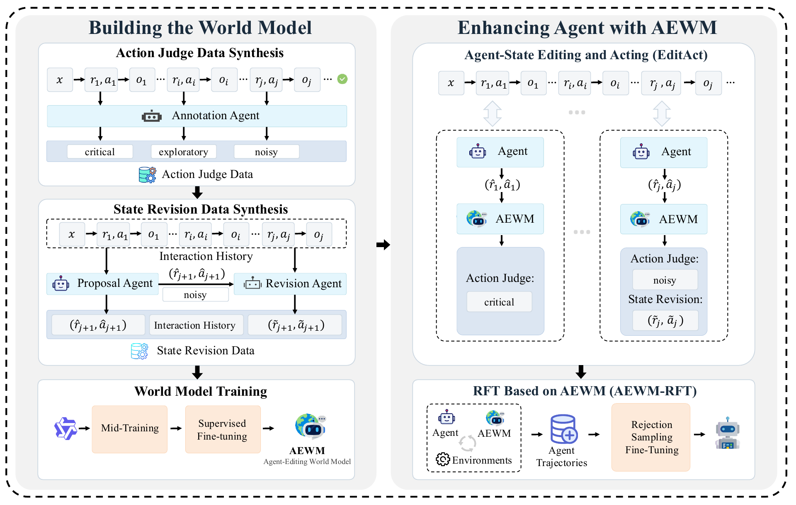
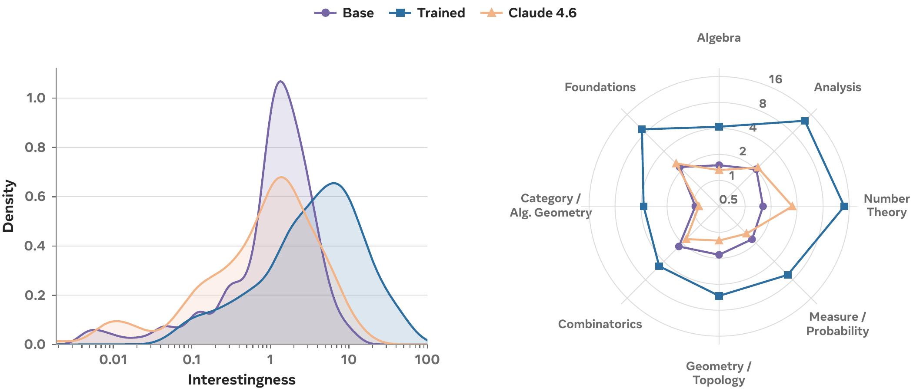

# 六篇论文：空间声音、行动修订与可检查的发现

比较22篇近期论文候选的摘要、日期及历史收录情况后，选出六篇，继续读其核心方法、结果、对照和局限。以下均为预印本和作者实验，本站未复现训练；榜单关注不足以证明热门，统一标注热度待验证。每篇提供站内阅读卡，许可明确允许的三篇另存原版PDF。

## 01 · OmniEcho：声音不只告诉你“是什么”，还告诉你“在哪里”

首发2026-09-20 · arXiv:2609.23407 v1 · 预印本。新近创新 / 新近实用，热度待验证。

普通单声道输入能保留“有人说话”的语义，却会损失声源来自哪个方向的信息。OmniEcho在Qwen3-Omni-30B-A3B旁增加一条FOA空间音频支路；FOA包含四个声场通道，作者将其编码成带空间线索的token，再与原有音频语义token一起交给语言模型。原来的单声道路径保留，避免把空间与语义压进同一接口。

训练先用10万段合成声音场景对齐语义，再学习文字指定声源的方位、俯仰和距离，最后将冻结的空间编码器接入多模态主干。评测覆盖197个真实录制空间视听场景、2972组问答，以及来自30个环境的900项导航样本。它同时提供数据与任务定义，比单独展示“能听声找人”更容易定位错误。

音频加视觉问答的总体分数为28.5，对照Qwen3-Omni为18.5；但三维定位子项仍只有14.2。导航中FOA方法成功率16.2%，双耳SoundSpaces对照5.4%；文本指令导航是另一种输入条件，不应把不同引导方式的数字直接排成公平榜单。导航任务使用真实录音场景构建的评测，不是通用实体机器人部署证明。

现在值得借鉴的是空间与语义两条路径的接口设计，以及按任务拆分的诊断。复现应先验证FOA通道约定、同步与朝向，再看定位和闭环导航能否一起改善。源码包读取失败后本期改读PDF，图与正文均来自原文；没有将合成训练数据与真实场景测试混为一谈。

Ruixun Liu等人的图5，截取PDF第6页的完整图和图注，已注明裁切；[完整原页](https://arxiv.org/pdf/2609.23407v1#page=6)。粉色是保留的语义音频路径，蓝色是新增空间路径；右侧编码器输出再投影成主干可读的token。火焰与雪花区分训练和冻结部分，不能理解成两路音频都重新训练。（[作者原图](https://arxiv.org/abs/2609.23407v1)；[查看大图](images/omniecho-method.png)。）

[站内阅读卡](../../../../papers/frontiers/omniecho/00-阅读卡.md) · [原文](https://arxiv.org/abs/2609.23407v1)

arXiv非独占分发许可不直接授权本站再分发全文，因此仅归档阅读卡与原站链接；单幅原图限本条方法或实验评论引用。

## 02 · AEWM：在执行之前，修订会把任务带偏的下一步

首发2026-09-23 · arXiv:2609.28416 v1 · 预印本。新近创新 / 新近实用，热度待验证。

长程Agent会把过时计划或没有证据的假设带入后续决策。AEWM不预测一段假的工具返回来替代真实世界，而是判断拟执行的“推理—动作”状态：关键、探索性或噪声性。EditAct只修订噪声状态，让关键动作与合理探索保留；实际交互历史仍以真实观察为准。

作者以Qwen3.5-35B-A3B为编辑模型，结合约52B token中期训练及12万条监督样本，覆盖搜索、终端和软件任务。实验对比常规ReAct、按步骤或整段轨迹选优等方法，在六组评测上运行三次。新增价值是把“需要重想”变成有门控的局部操作，而非每一步都重写整段历史。

作者报告4B、9B、35B代理相对ReAct平均提高13.3、9.6、6.6个百分点。9B加编辑器的平均44.1高于35B ReAct的42.2，但额外编辑器本身约35B-A3B，这不是小模型以更少总计算免费超过大模型。强代理的增益也较有限，门控与修订消融比单个最好成绩更能解释方法有效在哪里。

将筛选轨迹用于RFT后，可以在推理时移除编辑器；BrowseComp由40.9到45.4，平均交互轮数由56.2降到39.3。但Doc任务轮数从78.1升到89.8，并非全部任务都更省。训练数据、验证器、额外调用和任务难度共同影响结果；本期按作者实验判断方法价值，未独立重跑。

Shuang Sun等人的AEWM方法图（图2），裁去源PDF周围空白与游离排版标记，完整方法框和连接保持；[原图文件的论文来源](https://arxiv.org/abs/2609.28416v1)。左侧训练Judge/Revision，右上仅修订noisy状态，右下将成功轨迹用于RFT；RFT与在线编辑是两种使用方式。（[作者原图](https://arxiv.org/abs/2609.28416v1)；[查看大图](images/aewm-method.png)。）

[站内阅读卡](../../../../papers/frontiers/agent-editing-world-model/00-阅读卡.md) · [原文](https://arxiv.org/abs/2609.28416v1)

arXiv非独占分发许可不直接授权本站再分发全文，因此仅归档阅读卡与原站链接；单幅原图限本条方法或实验评论引用。

## 03 · 词性与SAE：能预测一个概念，不代表找到专属神经元

首发2026-09-24 · arXiv:2609.29362 v1 · 预印本。新近创新 / 新近实用，热度待验证。

原文首页注明这是将收入ENLSP 2026论文集的预印本；本期未另核会议录用列表。论文用词性作为可检查的语言学目标，研究SAE稀疏特征是否对应名词、动词等类别。设置为LLaMA3-8B第30层、131072个SAE潜变量，以及含17类词性的英语GUM语料；通过带L1约束的线性探针寻找少量特征组合。问题不是能否给潜变量起一个好听名称，而是这些组能否在没见过的词上仍有区分力。

达到95%覆盖所需的各类特征并集约498个，约12%跨类别共享。留出测试中，选出特征组的准确率约0.89、macro-F1约0.81；原始层表示对照约0.92、0.84。SAE提供更稀疏的描述，并没有在这个设置中自动带来更高分类准确率。

核心限制在非专一性：对角线显示目标词性召回较高，但非对角线也有不少激活。在控制词汇的180项模板实验中，所选组召回约0.937、精确率约0.192，说明许多“会响”的特征并非只为该词性而响。读出信息也不等于因果控制；论文没有因此证明干预某组就能可靠改变语法行为。

本期还发现原文正文与对照表的macro-F1有不一致：正文一处写0.97，对照表对应值为0.78。这里保留缺口，采用明确的表格口径，不引用0.97作效果宣传。新近价值是可复用的诊断思路；结论仍限一个模型、层、SAE与英语语料，未证明所有语言或架构都如此。

Alessandro Bondielli等人的留出集共激活原图（图6，CC BY 4.0）。每行是真实词性，每列是某组特征触发；对角线是召回，非对角线是其他类别上的触发率。这不是每行加总为1的普通互斥分类混淆矩阵，不能按那种方式读数。（[作者原图](https://arxiv.org/abs/2609.29362v1)；[查看大图](images/sae-coactivation.png)。）

[站内阅读卡](../../../../papers/frontiers/sae-parts-of-speech/00-阅读卡.md) · [归档PDF](../../../../papers/frontiers/sae-parts-of-speech/2609.29362v1.pdf) · [原文](https://arxiv.org/abs/2609.29362v1)

采用CC BY 4.0，归档未改动的原版PDF，保留作者、版本和许可。

## 04 · AV-GRPO：音画一起训练时，先把比较的一侧固定

首发2026-09-24 · arXiv:2609.29816 v1 · 预印本。新近创新 / 新近实用，热度待验证。

联合音视频生成需要同时优化画面、声音和二者同步。若一组候选连声音和画面都各不相同，很难分清奖励变化来自哪一侧。AV-GRPO每次固定一条音频轨迹，采样多条视频来比较；另一阶段反过来固定视频、训练音频。共享锚点让同组候选面对相近的同步难度。

实验使用LTX-2.3 22B、5760条5DAV提示、8张A800 80GB，输出544×960、97帧、24fps，采样15步。论文比较了2、4、8步的交替间隔，并选择4步设置；这不是每个视频帧简单交替更新，也不是仅训练一个完全独立的音频后处理器。

在Javis评测中，完整微调的AQ由5.097升至5.798，CLAP由0.408到0.468，DeSync由0.757降至0.607。LoRA版本的DeSync更低，却在部分画面指标上回落；完整版本也并非所有视觉指标都优于基座。数字来自自动代理指标，不能直接等同于所有人听感或观感提升。

为什么现在值得看：它提供了多模态奖励归因的具体处理办法，并保留联合训练与交替训练的对照。理论分析依赖理想化核与假设，不是给实际神经网络训练作无条件收敛保证。本期源码包下载中断后改读完整PDF，未执行昂贵训练；复现还应补真实用户偏好与不同声音事件的误差分析。

Zhiyu Xu等人的图1（CC BY 4.0），裁取PDF第3页完整方法图与图注；[完整原页](https://arxiv.org/pdf/2609.29816v1#page=3)。左半固定音频比较多条视频，右半固定视频比较多条音频；看雪花与火焰以及共享轨迹，理解奖励比较的条件。（[作者原图](https://arxiv.org/abs/2609.29816v1)；[查看大图](images/avgrpo-method.png)。）

[站内阅读卡](../../../../papers/frontiers/av-grpo/00-阅读卡.md) · [归档PDF](../../../../papers/frontiers/av-grpo/2609.29816v1.pdf) · [原文](https://arxiv.org/abs/2609.29816v1)

采用CC BY 4.0，归档未改动的原版PDF，保留作者、版本和许可。

## 05 · 发现有意思的数学：奖励“短命题、长证明”，会学到什么

首发2026-09-23 · arXiv:2609.28603 v1 · 预印本。新近创新 / 新近实用，热度待验证。

能生成正确定理，不代表生成了值得研究的定理。这篇论文用一个操作性指标近似“有意思”：在给定前提下，证明越难、命题和定义越短，得分越高。作者用Mathlib前提展开构造约10万条样本，训练模型估计证明难度，再以该奖励训练命题生成器。

难度预测器基于Qwen3.6-27B；生成器进行75步GRPO。评估时由Claude Code配合Opus 4.6尝试证明，在八个领域各收集20个经验证的结果，每模型160项。训练后这批结果的平均interestingness从1.76升至7.58。这里的分母是成功获得并验证的定理群体，不是所有尝试都能成功，更不是生成定理的整体成功率。

论文还用模型裁判评估与现有Mathlib的包含关系；这支持检查重复程度的研究路径，却不能代替数学家判断新颖性和价值。指标会受证明写法、自动化工具、定义长度和前提选择影响：一个较长证明未必更深刻，一个简短证明也可能极有启发。

现在值得看的是把开放研究目标转成可分析奖励，并公开验证、筛选与领域比较。难度预测器在留出集上仍低估长证明，作者的效用相关性还受样本筛选与共享长度因素影响。本站按原文核对这些条件，没有把指标提升改写成已发现人类未知的重要数学。

Niket Patel等人的结果原图（图4）。左侧横轴interestingness为对数刻度，右侧径向也为对数；每模型只比较八领域各20个已验证结果。蓝线外扩说明该指标提高，不表示所有生成尝试成功率提高，也不直接衡量数学家的评价。CC BY-NC-SA 4.0，未修改图中数据，仅作有署名技术评论。（[作者原图](https://arxiv.org/abs/2609.28603v1)；[查看大图](images/math-interest.png)。）

[站内阅读卡](../../../../papers/frontiers/discover-interesting-mathematics/00-阅读卡.md) · [原文](https://arxiv.org/abs/2609.28603v1)

采用CC BY-NC-SA 4.0；本期保留阅读卡和原站入口，仅引用一幅有署名的实验图作技术评论，未修改其数据。

## 06 · 编码Agent做任务与运动规划：先写策略，再冻结测试

首发2026-09-24 · arXiv:2609.30233 v1 · 预印本。新近创新 / 新近实用，热度待验证。

传统任务与运动规划（TAMP）通常需要人工设计谓词、操作和采样器。本文让现成编码Agent得到任务说明与模拟器接口，在预算内自己编写Python、NumPy、SciPy代码，调用reset、step、render做试验，最终交出一份策略程序。测试阶段冻结程序，不再让大模型为每个动作持续思考。

研究覆盖28个环境、七种程序合成方法、每配置五次运行，每个程序测试100个留出实例，共980份程序、98000回合。主要设置不提供环境源代码，也没有互联网；另设提供源代码的条件用于比较。新增价值是把代理的调试能力转成可重复执行的规划产物，而不是把一个成功演示当作泛化。

总体上，Opus配置无源码约74%、有源码约84%；Astra约86%与95%。但动态三维任务更难，Astra相应组约65%，不能由均值推断每类场景都接近解决。与LLMGenPlan的对照还存在反馈方式、推理配置等差异，因此改进不宜全部归因于单一组件。

论文报告的约1.3毫秒每动作，来自15个满足特定成功条件的环境子集，不是全部实例、更不是含真实视觉感知和硬件通信的控制延迟。现在值得借鉴的是冻结产物、留出测试与源代码可见性的分开评估；本研究仍是模拟器中的有限分布泛化，本站未连接真实机器人。

Matteo Merler等人的图1（CC BY 4.0）。中间对比人工规划组件与通过环境API生成策略程序；下方曲线只聚合有规划器、且有多个物体数量设置的环境，横轴问题规模与上文全28环境平均值的口径不同。（[作者原图](https://arxiv.org/abs/2609.30233v1)；[查看大图](images/tamp-method.png)。）

[站内阅读卡](../../../../papers/frontiers/coding-agents-generalized-tamp/00-阅读卡.md) · [归档PDF](../../../../papers/frontiers/coding-agents-generalized-tamp/2609.30233v1.pdf) · [原文](https://arxiv.org/abs/2609.30233v1)

采用CC BY 4.0，归档未改动的原版PDF，保留作者、版本和许可。
