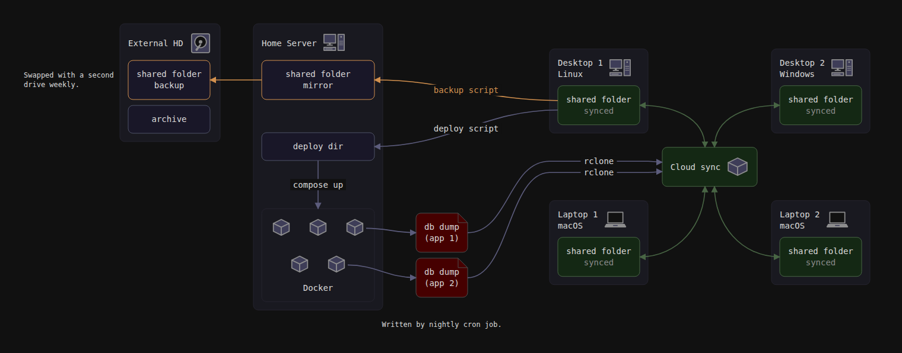
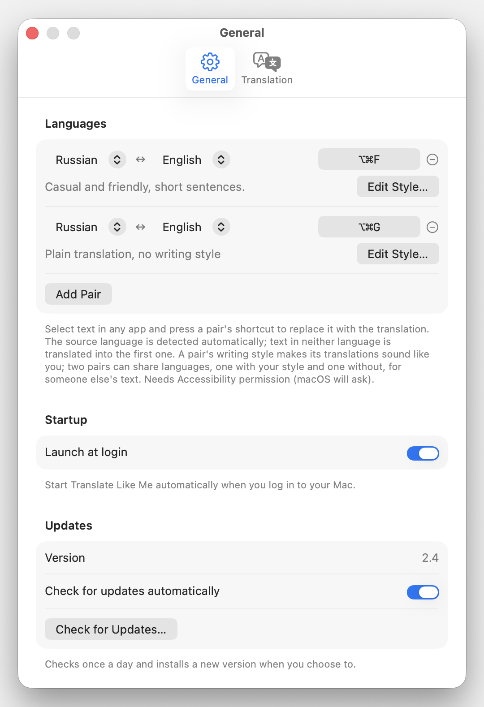
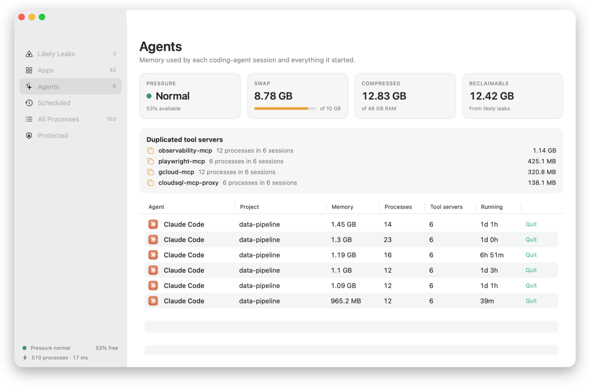

# 十个项目：从一项具体任务开始

比较21个仓库候选，结合Hacker News/Show HN、GitHub版本与实现、作者文档及项目展示。以下均为公开实现核验，未在本站安装运行；没有完整7/30天增长基线，不以总Star或一张榜单认定热门。仓库创建日期、版本日期和社区讨论日期分别保留。

| 任务 | 项目 | 主要依赖与边界 |
| --- | --- | --- |
| 精确安排架构图相对位置 | reladraw | 浏览器或Node；语法仍在发展 |
| 用棋谱和思考记录复盘 | chess-postmortem-skills | Stockfish、Python；生成解释仍需核对 |
| 不同语言对使用不同文风 | Translate Like Me | macOS 15/Apple Silicon；远端模型服务 |
| 在苹果设备做有限选项判断 | swift-newt | macOS/Xcode 27；4B权重与校准验证 |
| 每次启动Agent带上所需MCP | withmcp | Rust或发布包；认证由各服务处理 |
| 查编码Agent留下的后台占用 | Leftovers | macOS 14+；启发式诊断须人工判断 |
| 查询代码调用关系与变更影响 | Graf | Rust/原生CLI；静态解析有盲区 |
| 离线读Markdown与Mermaid | Tim's Markdown Reader | Apple Silicon；远程图默认阻止 |
| 在TypeScript组织可组合SQL | SQLBraid | npm及数据库驱动；类型不等于运行时校验 |
| 将Google Docs导成保真HTML | GDocs-Me-Up | Node20.9、Docs/Drive权限；MIT声明在README |

## 01 · reladraw：用相对约束描述图的布局

2026-09-27 · 9月7日建立；v0.6.0于27日09:22北京时间发布。新近实用；热度待验证。

写架构图时，“B在A右边、两组对齐”往往比手工计算坐标更接近需求。reladraw提供文本语法描述这些相对关系，并支持连线路径控制，输出可渲染图。当前有浏览器playground与Node CLI，适合维护代码仓库里的结构图。

现在值得看的是近期0.5/0.6版本和可读的完整图例，而非历史知名度。先在playground打开示例，再调整一个约束检查结果，比一次生成几十个节点更容易定位问题。项目仍早期，诊断和无约束边的布线存在局限；文字式布局不保证所有图自动美观。Apache-2.0，作者示例已查看，本站未运行渲染器。

reladraw官方渲染示例。图中节点组和跨组连接说明相对放置能表达什么；这是维护者的实际输出，不是本站用别的绘图库仿制。Apache-2.0项目资料。（[来源原图](https://github.com/reladraw/reladraw)；[查看大图](images/reladraw-example.png)。）

[源码](https://github.com/reladraw/reladraw) · [Apache-2.0](https://github.com/reladraw/reladraw/blob/main/LICENSE)

## 02 · chess-postmortem-skills：把“当时为什么这么走”放进复盘

2026-09-27 · 25日UTC创建；27日新增单局面分析技能。新近实用；热度待验证。

输入PGN棋谱，再可选加入自己的语音思考记录，技能会借助Stockfish检查局面，产出带注释棋谱、HTML棋盘或视频。它适合训练复盘：引擎指出战术问题，个人记录帮助解释当时遗漏了什么，而不是只给每步贴一个好坏标签。

依赖Python chess、CairoSVG、Stockfish及Claude Code；视频、语音路径另需FFmpeg、Piper或Whisper。作者流程可能持续约一小时，生成解释也可能出错，不能把有引擎核验理解成每段教学都可靠。25日首次公开及新增单局面入口构成本次价值；主代码MIT，chess.js与棋子素材另有BSD/CC BY-SA等通知，不能忽略素材许可。

[源码](https://github.com/brumar/chess-postmortem-skills) · [MIT；附属库与棋子素材另有许可](https://github.com/brumar/chess-postmortem-skills/blob/main/LICENSE)

## 03 · Translate Like Me：为每个语言对保留自己的写作风格

2026-09-27 · 旧项目6月28日创建；2.4于27日北京时间发布。新近实用；热度待验证。

这款Mac菜单栏工具读取选中文本，按语言对与写作风格生成翻译，可通过全局快捷键调用。2.4把文风从全局设置扩展到每个语言对，最多配置三对；工作邮件的英语与日常消息的日语不必共用同一套描述。

最小路径是macOS 15以上的Apple Silicon设备，配置Claude、Codex或Grok CLI/API，并授予所需辅助功能权限。它调用所选提供商处理文本，不是纯本地离线翻译。Apache-2.0开放桌面实现，模型服务费用和账户另计；旧项目本次因明确功能更新入选，本站只核对作者界面和版本，未处理私人选中文本。

维护者2.4设置原图。看每个语言对旁的设置入口，理解“多语言对”与“分别指定风格”如何落在实际操作中。截图示例不代表本站的账户或偏好。Apache-2.0。（[来源原图](https://github.com/wiltodelta/translate-like-me)；[查看大图](images/translate-pairs.png)。）

[源码](https://github.com/wiltodelta/translate-like-me) · [Apache-2.0](https://github.com/wiltodelta/translate-like-me/blob/main/LICENSE)

## 04 · swift-newt：本地选项分数，仍然需要校准

2026-09-27 · 27日北京时间首次公开。新近实用；热度待验证。

swift-newt把Qwen3-4B有限选项评分接入Swift/Core AI，给文本与选项返回相对判断，可用于设备端分类和路由。作者在M3 Pro、18GB机器报告约435ms热启动延迟；这个单设备结果不是全系列苹果硬件保证。

需要macOS 27、Xcode 27、Apple Silicon和约2.1GB导出权重；iOS路径目前只做构建检查，不能写成已在真机跑通。作者还记录同一模糊问题改写提示后分数大幅变化，这比孤立的高置信样例更有参考意义。代码MIT，基础模型许可另计。本次新实现适合研究端侧接口；本站未运行，技术实践另用合成数据说明如何检查概率。

[源码](https://github.com/willswire/swift-newt) · [MIT](https://github.com/willswire/swift-newt/blob/main/LICENSE)

## 05 · withmcp：按任务启动带不同MCP组合的Agent

2026-09-27 · 27日北京时间首次公开，v0.1.0。新近实用；热度待验证。

withmcp是一个薄启动器：用配置组和目录规则，给Claude、Codex或pi带上本次需要的MCP服务，再启动原有代理。输入服务组合，输出代理可用的配置，适合在不同仓库切换数据库、文档或开发工具接口。

它不充当新的MCP代理层，也不替各服务完成认证。上手可用已发布平台二进制，或以Rust构建；首批发布平台有限，需核对自己的系统。配置展开到命令参数时还要理解本机进程可见性。MIT或Apache-2.0双许可；新近价值来自可组合启动流程，未有充分独立使用证据，本站未改动现有MCP配置。

[源码](https://github.com/lava/withmcp) · [MIT OR Apache-2.0](https://github.com/lava/withmcp/blob/main/LICENSE-APACHE)

## 06 · Leftovers：先按会话查占用，再判断哪些后台工作该结束

2026-09-27 · 27日首次公开，v1.4.0加入worktree清理视图。新近实用；热度待验证。

编码Agent退出后，开发服务器、浏览器和子进程可能继续占用资源。Leftovers把进程按会话组织，展示应用、疑似泄漏、定时任务及worktree相关信息；1.4.0继续补充工作树清理与更新提示，适合先找出“内存到底花在哪里”。

它区分包含压缩与交换的footprint和普通驻留内存，两个数不能直接混算。疑似泄漏只是启发式判断，不能证明进程已经无用；清理前仍应确认关联任务与工作树状态。要求macOS 14以上，提供Intel和Apple Silicon路径，代码MIT。本站仅查看作者界面与实现说明，未终止进程或删除工作树。

Leftovers官方会话视图。按编码会话聚合进程和内存，让资源归属比单个PID更清楚。画面中的占用属于维护者示例，不是对用户电脑的扫描；“疑似”不能作为自动删除依据。MIT。（[来源原图](https://github.com/arpwal/leftovers)；[查看大图](images/leftovers-sessions.png)。）

[源码](https://github.com/arpwal/leftovers) · [MIT](https://github.com/arpwal/leftovers/blob/main/LICENSE)

## 07 · Graf：把代码调用关系留成可增量查询的索引

2026-09-22 · 16日创建；0.6.0于22日更新。新近实用；热度待验证。

Graf用原生CLI扫描仓库，将函数和调用关系存入SQLite，供查询、影响分析与Agent上下文检索。适合在大项目里追踪一个函数变化可能影响哪些入口；输入代码目录，输出可定位到文件和符号的关系，而不是只返回关键词命中。

最小流程是安装发布包或用Rust 1.90和C编译器构建，再index后query/impact。作者展示大仓库的增量更新与查询计时，但冷启动、解析完整性及硬件不同，不能概括成所有代码搜索都快千倍。0.6.0是本次近期版本线索；Apache-2.0，静态解析对动态调用有盲区，结果仍要回到源码核对，本站未建立用户仓库索引。

[源码](https://github.com/ctxrs/graf) · [Apache-2.0](https://github.com/ctxrs/graf/blob/main/LICENSE)

## 08 · Tim's Markdown Reader：离线读本地文档和Mermaid

2026-09-22 · 20日UTC创建；1.0于22日发布。新近实用；热度待验证。

这个原生Mac阅读器面向本地Markdown，支持Mermaid、表格和本地图片，适合检查Agent生成的方案、日志说明或研究笔记。它以阅读为主，MDX仅按文本处理，不能代替运行完整前端文档站。

要求Apple Silicon，声明最低macOS 14，作者实际检查集中在26/27，较老版本仍需自行验证。远程图片默认阻止，更新由用户发起；上手打开一份本地Markdown即可。MIT许可，本次是新近1.0版本与公开实现，而非推荐旧常用编辑器。本站读了说明和界面材料，没有安装替换系统默认应用。

[源码](https://github.com/temir-dev/tims-markdown-reader) · [MIT](https://github.com/temir-dev/tims-markdown-reader/blob/main/LICENSE)

## 09 · SQLBraid：保留SQL表达力，同时组合条件与参数

2026-09-10 · 9月10日首次公开；近期补充（近30天）。新近实用；热度待验证。

SQLBraid用TypeScript标签模板组织SQL片段和参数，提供条件组合及不同驱动的执行路径。输入结构化条件，输出参数化查询，适合已有SQL经验、又想复用筛选逻辑的应用；它不是把数据库所有能力隐藏起来的完整ORM。

上手通过npm和所选数据库驱动，Node内置SQLite路径要求22.18以上。条件分支要实现惰性求值时需按文档接入编译转换；结果上的泛型只影响类型检查，不等于运行时数据验证，需要时另接Standard Schema/Zod。Apache-2.0，保留10日首次公开日期，25日文档整理不算新功能首发；本站检查示例实现，未连接数据库运行。

[源码](https://github.com/Clickin/SQLBraid) · [Apache-2.0](https://github.com/Clickin/SQLBraid/blob/main/LICENSE)

## 10 · GDocs-Me-Up：导出HTML时保留Google Docs的图片裁切

2026-09-21 · 旧项目2025年2月创建；21日增加图片裁切保真与导出体积优化。新近实用；热度待验证。

GDocs-Me-Up把Google Docs转成带样式和本地图片的HTML，适合自托管文章或留存可读副本。9月21日提交新增保留图片裁切、旋转和导出尺寸处理，解决“文档里显示局部，导出后却变回整张”的具体问题；这才是老项目本次入选的新增事实。

需要Node20.9以上、Google Docs/Drive API与获授权的服务账户，输入文档ID再导出。在线字体仍可能依赖Google Fonts，不能将所有输出笼统称作完全离线。维护者README明确声明MIT并允许改用，但当前仓库缺少独立LICENSE文件，许可声明入口已附；部署团队可据此先核对。本站未连接用户文档，产出示例来自作者。

[源码](https://github.com/behdad/gdocs-me-up) · [MIT（README明确声明；未附独立LICENSE文件）](https://github.com/behdad/gdocs-me-up#readme)
