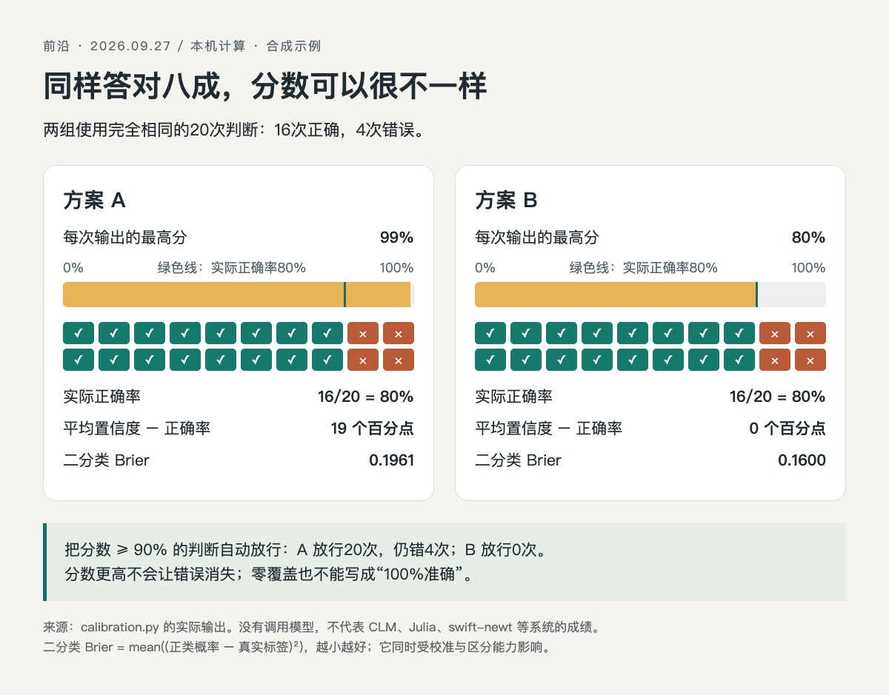

# 别把选项分数直接当作成功概率

本期的Colibri、Julia和swift-newt都涉及有限选项判断。一个结果返回0.99时，它究竟意味着“在这组选项里更偏向它”，还是“这类判断长期约99%正确”？两者需要额外的数据来连接。本节在本机实际运行Python 3.14.3标准库程序，用合成数据演示这个差别；**没有调用或测评上述模型**。

## 固定判断结果，只改变分数

构造20次二分类，正负预测各10次，每组答对8次、答错2次。A和B的预测、真实标签完全相同，因此准确率都是16/20，即80%。A每次给被选类别99%，B给80%；对预测为负类的样本，正类概率相应为1%与20%。

二分类Brier取每次“正类概率减真实0/1标签”的平方，再求平均。它会惩罚信心很足的错误，但同时受到区分能力与校准影响，不能单凭较低Brier断定所有意义上的校准更好。[指标定义与适用口径](https://scikit-learn.org/stable/modules/model_evaluation.html#brier-score-loss)。

```python
correct = sum(r["predicted"] == r["actual"] for r in rows)
brier = sum((p - r["actual"]) ** 2
            for p, r in zip(probabilities, rows)) / len(rows)
```

完整代码见[calibration.py](code/calibration.py)。将文件保存到本地后执行：

```bash
python3 calibration.py
```

无需安装第三方包，脚本在同一目录写出[逐项数据与结果](code/calibration-results.txt)，[本次终端输出](code/calibration-output.txt)也已保存。只会写本例结果文件，不访问外部服务。

## 实际算出来什么

| 口径 | A | B |
| --- | --- | --- |
| 判断正确数 | 16/20 | 16/20 |
| 每次最高分 | 99% | 80% |
| 平均置信度减正确率 | 19个百分点 | 0个百分点 |
| 二分类Brier | 0.1961 | 0.1600 |
| 分数≥90%时放行数 | 20 | 0 |
| 放行部分准确率 | 80% | 不定义（没有样本） |




HTML/JS读取本机Python实际输出绘制，所有格子来自已保存的20条合成数据。它不是模型推理成绩，也没有证明B在真实任务上更聪明。原文没有这组本机输出，生成图不适合准确计数，因此采用可复现程序图。（[绘图源码](code/calibration.html)；[查看大图](images/calibration.png)。）

这里的0个百分点只说明这组人为构造、单一置信度的样本均值一致，不能推出总体校准良好。样本少且没有抽样过程，不宜据此估计真实部署风险，也没有进行模型温度校准或参数学习。

## 换成真实任务时怎样做

先保留每条输入、候选集合、版本、概率和独立标注，固定一份未用于调参的测试集。再按分数区间查看实际正确率，分别报告样本量、覆盖率与错误类型；如果调整阈值或做温度校准，应在独立验证集完成，最后回到留出测试集。

例如“分数不够就转人工”，需要同时比较放行错误与转人工数量。把所有样本都拒绝，可能让有定义的错误数变少，却没有完成自动化任务；零覆盖时准确率应保留为空。本文只演示计算口径，不为任何真实模型推荐固定90%阈值。
