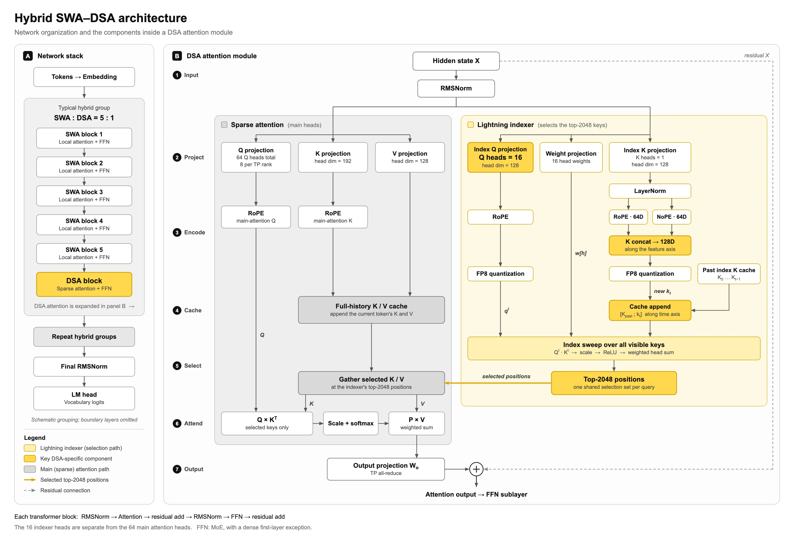
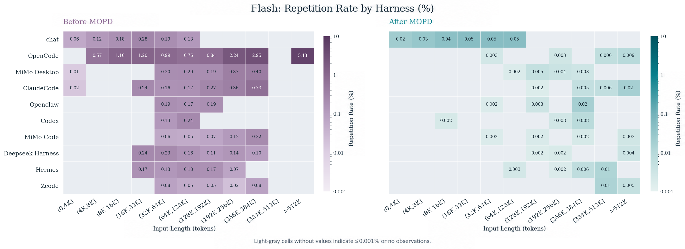
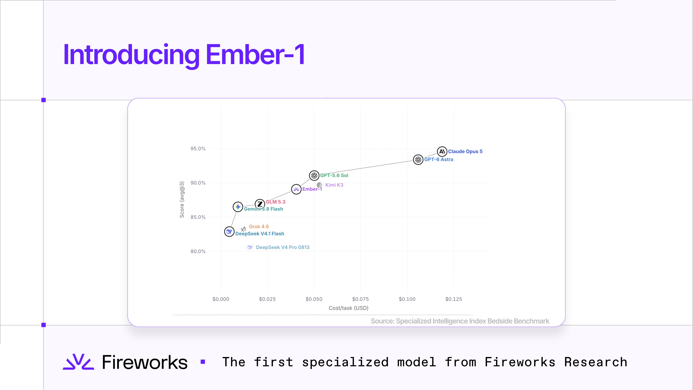
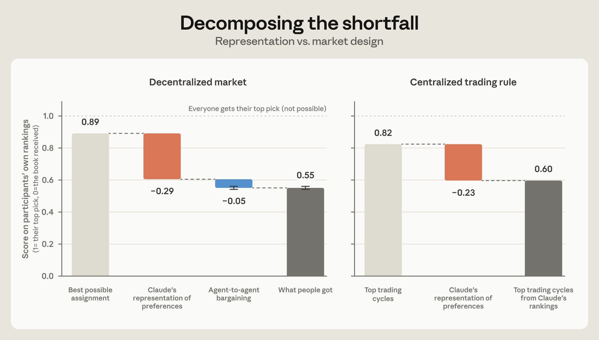
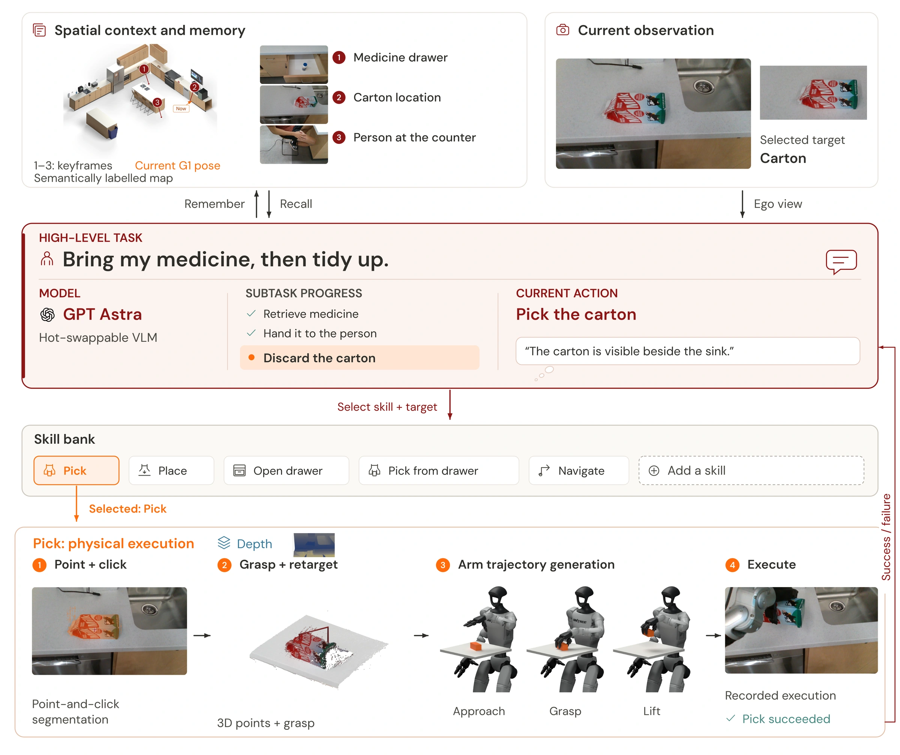
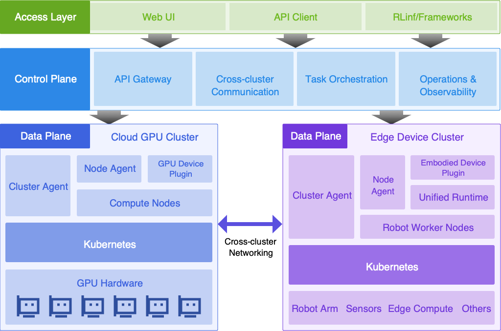

# AI 动态：速度、重复调用与代理真正理解了什么

15条独立事件，前5条重点详解、后10条速读。事件日期覆盖9月22日至27日；仅有日期的公告保留来源日期，不推测首发时刻。以下性能和演示均来自作者或厂商，本站未运行这些大模型。没有两类独立近期热度信号的条目，不因总Star、转发或单次榜单就称为热门。

## 01 · Naive-N0.5-Flash：稀疏注意力和运行时一起优化，速度口径要分开看

2026-09-27。重点详解；新近创新 / 新近实用，热度待验证。

Naive公布N0.5-Flash，一款由MiMo-V2.5衍生的混合专家模型：总参数309B、每token激活15.5B，原生上下文1M。现在可在Hugging Face获取MIT许可权重；公告同时介绍NaiveRT，但运行时源码、部分内核和复现实验材料列为10月12日前开放，不能把“介绍了系统”写成所有组件今天都能下载。

结构上的取舍是：多数层只看附近的128个token，少数层先从完整历史中挑出最多2048个位置，再做注意力。可以把它理解为日常局部阅读，间隔调用一次全局检索。39个局部层和9个稀疏层分工，降低全局注意力的计算；不过历史KV仍要保存，索引器也要扫描历史，并不等于1M上下文不占内存。

Naive官方结构原图。左侧看层的交替，右侧黄色路径先选位置，灰色路径才读取被选中的KV。保留完整历史缓存是读图关键；仅引用本图解释公告设计，图权归Naive。（[来源原图](https://naive.ai/en/research/)；[查看大图](images/naive-architecture.webp)。）

最吸引眼球的2122 token/s，是8卡系统在41条HTML/SVG提示中、关闭思考后的“最佳一秒”解码速度，排除了预填充。它不是所有请求的持续吞吐，也不是把100万token读入再完成回答的端到端速度。另一个3.4ms对12.3ms的数字比较的是特定推测解码轮次，与用户整段任务耗时也不同。

为什么现在值得看：这次把可下载权重、注意力选择与运行时流水线联系起来，给推理优化提供了具体研究对象。但能力表混合了不同公开来源与作者设置，并非所有模型在同一系统上的重跑；单凭图上的速度不能断言长任务质量不变。准备部署的人应先核对多卡资源和公开组件进度，再用自己的长输入、工具调用与输出长度评估。

[原始来源](https://naive.ai/en/research/)

## 02 · MiMo V2.6发布MOPD检查点，专门处理反复调用同一工具

2026-09-27。重点详解；新近创新 / 新近实用，热度待验证。

小米这次处理的是一种具体故障：Agent在同一次回复里反复发出同样的工具调用，消耗时间和额度，却没有推进任务。新公开的Flash-MOPD、Pro-MOPD权重对应专门修正后的模型；API已于9月25日06:00北京时间切换，模型名保持不变。它是[9月22日V2.6报道](../2026-09-22/01-AI动态.md)之后的实质训练更新，本期不再重复介绍基础架构。

团队先把“并行调用很多工具”“调用密度过高”和“同一调用重复”分开。报告中的重复率只统计一次助手回复内，工具名与标准化JSON参数完全相同的调用，以重复次数除以总调用次数。跨回复重复、近似参数和代码内嵌调用不在口径里，因此这个指标更接近保守诊断，不能覆盖所有无效循环。

修正路线也值得理解：先用少量针对性训练教出一个较少重复的教师，再通过MOPD蒸馏回主要模型，并约束它不要偏离原有能力太远。作者估算，直接对完整混合任务继续强化学习会很贵；最终采用专门教师与回滚后的蒸馏路径。公告中的约9万美元是作者报告的该训练运行成本，不能和另一条路线的约231万美元估算当成两笔实际账单。

小米模型卡原图。每行是一个框架，横轴是输入长度区间，两图均为百分比且颜色采用对数尺度。浅灰表示不超过0.001%或没有观察，不能一律解释为零重复。MIT模型资料；本图是作者统计，非本站实测。（[来源原图](https://huggingface.co/XiaomiMiMo/MiMo-V2.6-Flash-MOPD)；[查看大图](images/mimo-repetition.png)。）

对使用者，价值在于可以检查同一工作流升级后是否还会陷入循环，而不必更换API模型名。对研究者，重复率的定义、训练阶段与能力回归检查比一个总榜分数更有复用意义。作者表示能力总体保持，但这里没有独立复现；MIT权重已开放，大型MoE部署仍需相应多卡资源，不能把“激活参数少”理解为普通笔记本即可运行。

[原始来源](https://mimo.xiaomi.com/blog/mimo-v2-6-tool-call-repetition)

## 03 · Ember-1：减少推理token有收益，也有不能忽略的任务退步

2026-09-23 · 近期补充。重点详解；新近创新 / 新近实用，热度待验证。

Fireworks推出Ember-1研究预览，在Kimi K3基础上优化推理长度，提供服务端API试用。它面向编码和Agent等可能产生长思考轨迹的任务：希望模型少走重复的推理步骤，而不是简单截断回答。当前是有期限的研究预览，并没有据此确认开放完整模型权重或长期稳定的产品定价。

公告给出35%—50%推理token减少的总体描述；其中一组对照从约4.93万token降到2.99万，分数由0.751到0.753。这个例子说明效率有机会改善，但不能把一组近似持平的分数推广到所有任务。成本表也按相同K3费率估算，属于固定计价假设下的比较，不是新的实际账单。

分任务看，Terminal-Bench 2.1的89项评测中，K3最大思考配置为82.0，Ember为80.9；SWE-bench Verified的500项由92.2到93.2，而DeepSWE 1.1的113项从75.2降到66.4。对照任务数也不同，几十题的波动不宜和数百题的结果等量看待。更短的轨迹可能保留多数常规工作，也可能损失某些复杂任务的探索，不能只摘取上涨的一列。

Fireworks官方分数—成本原图，横轴是任务成本，纵轴是其专项基准分数；它不是token长度曲线。不同模型与任务条件见原文，图用于解释成本与质量取舍，仅作公告评论引用。（[来源原图](https://fireworks.ai/blog/ember-1)；[查看大图](images/ember-tokens.png)。）

为什么现在值得看：对经常让Agent运行多步任务的团队，推理长度是可直接记录的成本变量。较稳妥的试验是固定一批真实任务，同时看完成率、调用次数、token与耗时；不能只以输出更短判定优化成功。公告含两个匿名客户的A/B反馈，但仍属于厂商披露，尚不足以当作独立复现或持续热门的证据。

[原始来源](https://fireworks.ai/blog/ember-1)

## 04 · Project Swap：代理谈判前，先确认它真的知道你想要什么

2026-09-24 · 近期补充。重点详解；新近创新 / 新近实用，热度待验证。

Anthropic让201名员工参与换书实验：先用短访谈了解偏好，再由代理代表用户交换书籍。研究并不是测谁的语言更有说服力，而是追问两个环节：代理是否准确表示了用户的喜欢程度；在已有偏好下，交易机制能否给出合适的分配。不同分析使用的有效样本并不相同，部分办公室数据被排除，人工排序分析涉及188人。

五分钟访谈之后，模型预测用户对十本书的排序。成对偏好判断约61%正确，流行度基线约53%、协同过滤约55%。这说明访谈提供了一些个体信息，但61%不是“61%用户满意”，更不能把模型自认为的满意度直接当成用户真实偏好。

最有启发的是误差分解：按人的真实排序，可实现的最佳分配得分约0.89；先换成模型推断的偏好，再做最优分配，降到约0.60；实际分散式代理交易约0.55。也就是说，在这组设置下，大部分损失发生在表示偏好时，后续谈判只解释较小部分。这个分数是对排序的归一化，不是金钱收益率。

Anthropic Project Swap图4。左侧橙色降幅约0.29、蓝色约0.05，分别对应偏好表示与分散交易损失；右侧为另一种集中交易规则，不可与左侧相加。仅引用单图进行方法评论，图权归Anthropic。（[来源原图](https://www.anthropic.com/research/project-swap)；[查看大图](images/swap-welfare.png)。）

为什么现在值得看：个人购物、安排日程或替用户协商的Agent，可能需要先展示自己理解的约束，让用户纠正，而不是不断升级“谈判能力”。这只是从有限换书实验引出的设计启示，不是所有代理市场的定律。参与者是公司员工，商品与偏好较简单，模型推断和真实排序之间仍有差距；研究也没有证明某个代理能在现实交易中可靠代表每个人。

[原始来源](https://www.anthropic.com/research/project-swap)

## 05 · HomeBody：把视觉语言模型接到可复用动作库，而非每次重新学动作

2026-09-26 · 近期补充。重点详解；新近创新 / 新近实用，热度待验证。

斯坦福团队展示HomeBody：视觉语言模型观察环境、读取空间记忆，并从技能库选择抓取、放置、开抽屉和导航等动作。演示包括整理厨房、寻找暂时不在视野中的物品。关键新增事实是这套系统的公开流程和演示，并非发布了一台可以购买、到任意家庭都能工作的机器人。

高层模型负责“做什么”，技能库负责把目标变成机器人能执行的动作。以抓取为例，模型先在图像中指定位置和手，随后借助分割、深度与三维几何求抓取和手臂轨迹，并检查碰撞；失败后在有限次数内局部重试，再把结果反馈给高层。这里仍使用预训练低层运动控制器，不能称为完全没有学习过动作的系统。

HomeBody作者架构原图。先读上方的地图记忆和当前图像，再沿红色箭头看任务、技能、抓取与成功/失败反馈；右侧回路说明计划要接收执行结果。仅引用该结构图解释研究，署名Gio Huh等及Stanford TML。（[来源原图](https://tml.stanford.edu/homebody/)；[查看大图](images/homebody-architecture.webp)。）

为了把“不在眼前”的物体纳入计划，系统先建立地图、保存带语义的关键帧，并把真实场景和数字环境对齐。这些准备工作需要相机、深度感知、定位和标定，不能从视频直接推断只接一个大模型API就能复现。新技能可以接入同一个高层接口，是这套设计的复用价值。

目前证据是作者在有限厨房环境中的演示，没有覆盖多家庭、多物体与长期运行的统一成功率。视频存在加速播放，动作耗时不能按观看时长估计；机械可达范围、手部发热与模型调用延迟也会限制使用。公开仓库目前主要承载展示页面，未发现足以确认整套系统开源的许可，因此放在研究新闻，不计入十个开源工具。

[原始来源](https://tml.stanford.edu/homebody/)

## 06 · RLark：把GPU、机器人和相机纳入同一个任务调度

2026-09-24 · 近期补充。速读；新近实用，热度待验证。

RLark将云端GPU、边缘设备、机器人与相机放进统一资源管理，通过Job、Task和Worker组织实验。9月24日的系统介绍展示跨地域训练路径；“几分钟接入”建立在设备已连接、网络和驱动就绪的条件上，不是任意机器人物理接线的总时长。Apache-2.0代码已公开，适合管理多设备实验室；跨地域案例为团队提供的演示，本站未连接硬件。

RLark仓库原图，Apache-2.0。上层接收任务，中间控制面编排，底部两类集群通过网络交换数据；机器人本体与GPU不能互相替代。（[来源原图](https://github.com/RLinf/RLark)；[查看大图](images/rlark-architecture.png)。）

[原始来源](https://github.com/RLinf/RLark)

## 07 · Google Vids接入Gemini Omni 1.1 Flash视频能力

2026-09-23 · 近期补充。速读；新近实用，热度待验证。

Google将Gemini Omni 1.1 Flash带入Vids，支持1080p视频生成及场景延展等编辑流程，覆盖相应个人和Workspace账号，额度随账号而异。生成内容带SynthID；公告预告的部分文字转语音能力不能一并写成已上线。现在可关注已有脚本如何进入编辑流程，实际可用性仍应以账号界面为准，官方样例不是本站制作结果。

[原始来源](https://blog.google/products-and-platforms/products/workspace/gemini-omni-in-google-vids/)

## 08 · Liquid与Qualcomm探索设备端上下文层

2026-09-23 · 近期补充。速读；新近实用，热度待验证。

Liquid Context面向Qualcomm设备端算力，将用户授权的上下文整理成可供助手使用的记忆层，目标是减少反复解释背景。当前主要面向设备厂商评估与集成，并非所有手机用户已能下载。上下文在本地处理，不代表用户选用的云端Agent永远不会收到所授权的信息；应分别检查采集、存储和分享边界。

[原始来源](https://www.liquid.ai/blog/liquid-context-qualcomm)

## 09 · Cloudflare披露并修复Containers跨租户残留数据问题

2026-09-24 · 近期补充。速读；新近实用，热度待验证。

Cloudflare披露Containers底层磁盘块重用可能暴露同主机其他租户的残留片段。问题9月4日报告，7日部署清零措施，19日完成旧缓存处理，24日对外说明；不能把披露日写成修复开始日。官方表示保留的遥测中未见利用证据，这不等于证明从未暴露。无需客户操作，但该案例提醒开发者：容器隔离还依赖磁盘初始化与回收流程。

[原始来源](https://blog.cloudflare.com/containers-cross-tenant-vulnerability/)

## 10 · Worker Previews让分支有自己的运行入口

2026-09-22 · 近期补充。速读；新近实用，热度待验证。

Cloudflare为Workers提供分支预览，代码、配置、访问地址和日志可分开，Durable Objects及Containers也支持独立命名空间。它适合检查Agent生成的改动能否在真实运行环境中工作。R2等资源仍需按文档指向所需测试桶，不能理解为全部生产数据自动复制且隔离；访问控制也应明确配置。

[原始来源](https://blog.cloudflare.com/worker-previews/)

## 11 · Copilot应用增加集中OpenTelemetry配置

2026-09-22 · 近期补充。速读；新近实用，热度待验证。

GitHub Copilot应用支持通过受管理设置统一配置OpenTelemetry端点，方便企业观察模型与工具调用。提示和回复正文默认不纳入，收集内容需要显式启用，不能把启用遥测等同于默认上传全部对话。适合已有监控基础的团队分析耗时与失败；连接配置和数据权限仍需自行核对。

[原始来源](https://github.blog/changelog/2026-09-22-opentelemetry-in-the-github-copilot-app/)

## 12 · 微软公布至2030年的中东投资计划

2026-09-23 · 近期补充。速读；新近实用，热度待验证。

微软宣布，从现在至2030年在科威特、卡塔尔、沙特和阿联酋投入超过100亿美元资本及运营支出，涉及云、AI与数字韧性等。这个数字是多年计划，不是本季度已经完成的支出，也不是全部用于采购GPU。对开发者的现实意义是关注相应地区服务容量、部署与本地化路线，不能据此承诺每个新服务已可用。

[原始来源](https://blogs.microsoft.com/on-the-issues/2026/09/23/microsoft-strengthens-its-commitment-to-the-middle-east-by-investing-in-technology-digital-resilience-and-people/)

## 13 · ChatGPT广告测试扩展至东南亚和台湾

2026-09-23 · 近期补充。速读；新近实用，热度待验证。

OpenAI将ChatGPT广告测试扩展到印尼、马来西亚、菲律宾、新加坡、泰国、越南和台湾，面向相应Free与Go用户，Plus、Pro和Enterprise维持无广告。Ads Manager也向符合条件的企业开放。官方称广告与回答独立并有标识；本期仅核对发布说明，没有独立验证展示和排序机制，也不推定所有用户会同时看到广告。

[原始来源](https://openai.com/index/chatgpt-ads-expands-southeast-asia-taiwan/)

## 14 · UiPath：结构化业务上下文转为正式能力，高级Agent仍在预览

2026-09-22 · 近期补充。速读；新近实用，热度待验证。

UiPath Agents将Data Fabric结构化业务上下文接入列为正式可用，沿用既有权限；同日高级Agent能力仍属预览，包括文件工作区保存中间产物、子代理和程序化工具调用。对长文档与多步骤流程，价值在于减少把所有状态塞回提示词。两者开放阶段不同，不能把整组功能统一称作全面正式上线。

[原始来源](https://docs.uipath.com/agents/automation-cloud/latest/release-notes/september-2026)

## 15 · Copilot代码审查增加触发和强度选项

2026-09-23 · 近期补充。速读；新近实用，热度待验证。

GitHub扩展Copilot代码审查的请求与配置方式，可按草稿状态、后续推送等条件调整触发，并设置Lite、Balanced等审查强度。组织策略和仓库配置存在继承关系，团队应先确认实际生效层级。现在值得关注的是减少重复评论并决定何时需要深入分析；这些选项不构成对代码正确性或安全性的保证。

[原始来源](https://github.blog/changelog/2026-09-23-copilot-code-review-more-ways-to-request-and-configure-reviews/)
