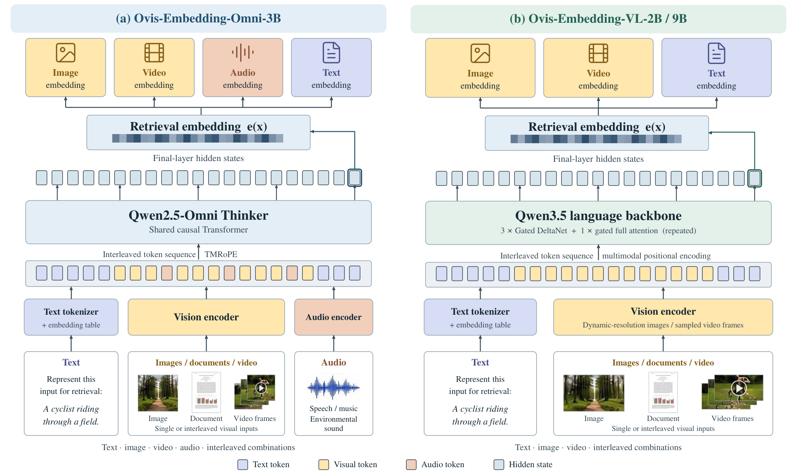
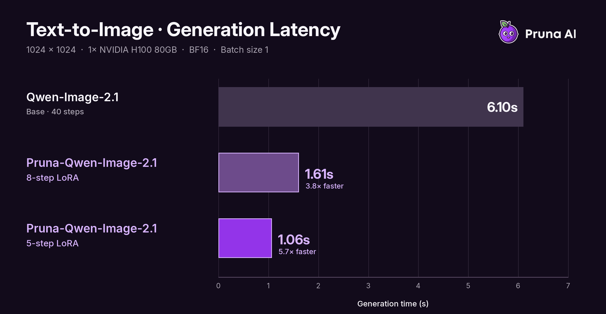

# 六个模型：决策、检索、图像、声音和三维表示

本栏保留“开源模型”的栏目名，逐项区分宽松许可、开放权重与受限适配器。核对了模型卡、权重清单和许可，均未在本站下载推理；作者实验与样例不等于独立复现。权重仓库建立日期只用来确认本次公开进展，不替代上游基座的首发日期。

| 模型 | 输入 → 输出 | 主要使用条件 |
| --- | --- | --- |
| Intern-Decision-4B | 问题、有限候选与图像 → 概率化选择 | Apache-2.0；需对应加载实现 |
| Ovis-VL-Embedding-2B | 文字、图片或视频帧 → 检索向量 | Apache-2.0；不是音频Omni版本 |
| Pruna-Qwen-Image-2.1 | 提示词与可选参考图 → 少步图像 | Qwen研究许可，仅非商业研究/评估 |
| H3 Character Swap | 视频、参考角色 → 换角视频 | MiniMax社区许可有地区与商用条件 |
| Kokoro clone tuner | 英语参考音频 → 音色包 | 适配器Apache-2.0，编码器另有CC BY-SA |
| nnFoundationViT | 单通道3D影像 → 特征或下游适配 | CC BY-SA 4.0；研究用途，需任务训练 |

## 01 · Intern-Decision-4B：不生成长解释，直接判断候选项

2026-09-26。新近实用 / 新近创新；热度待验证。

这款基于Qwen3.5-4B的模型，把决策任务写成带候选项的问题，通过一次前向计算读取指定位置的分数，输出候选概率。原生路径支持1至16个问题、每题最多62项及最多8张图像，默认输入长度8192。适合把“这条请求该送往哪个工作流”变成可检查接口；题目和答案范围需要事先定义。

作者报告RTX 4090上的平均前向时间约44.16ms，并在独立于校准训练的数据上展示温度缩放。一个96例评估集的Brier分数从0.628降到0.550，ECE从0.213降到0.089；这是该小样本条件下的结果，不能保证所有领域的“80%概率”都真的有80%正确率。前向时间也不含完整业务链路。

为什么现在值得看：26日公开的检查点提供多题、多模态有限选择的具体实现，比任意生成后再解析文本更容易约束输出。需要按仓库安装模型与加载代码，并在自己的类别、长度和图像分布上重新检验概率。Apache-2.0权重与实现可用；本站只核对示例和作者结果，未复测速度。

[模型卡与权重](https://huggingface.co/internlm/Intern-Decision-4B)

## 02 · Ovis-VL-Embedding-2B：把文档图像和文字放进同一个检索空间

2026-09-21。新近实用 / 新近创新；热度待验证。

Ovis-VL-Embedding-2B使用Qwen3.5-2B，将文字、图像、文档页面和视频帧转为2048维归一化向量。查询和候选各自编码后比较相似度，因此可以先建库再检索；它不是把每一对查询与文档同时送进大模型的交叉编码器。

方法取最后一个非填充token的隐藏状态作为表示。模型卡原图同时介绍Omni和VL家族，本期只选右侧VL-2B：不能看到左侧音频入口，就给2B版补上音频能力。

ATH-MaaS模型卡原图，Apache-2.0资料。右侧文字和视觉输入进入Qwen3.5骨干，末端输出检索向量；左侧为另一Omni模型，仅为家族对照，不是本期2B权重的音频能力。（[来源原图](https://huggingface.co/ATH-MaaS/Ovis-VL-Embedding-2B)；[查看大图](images/ovis-architecture.png)。）

作者在78个数据集的MMEB-v2汇总中报告77.46，对照75.42；视频子项67.12低于对照68.84。总分提升不能改写成每种模态都更好。21日公开权重适合尝试混合文档搜索，最小流程是统一预处理、分别编码、归一化并建立向量索引。Apache-2.0许可，运行需相应Transformers和视觉依赖；长视频的帧采样与领域检索准确率仍需自行评估。

[模型卡与权重](https://huggingface.co/ATH-MaaS/Ovis-VL-Embedding-2B)

## 03 · Pruna-Qwen-Image-2.1：五步和八步之间，保留可观察的质量取舍

2026-09-23。新近实用 / 新近创新；热度待验证。

Pruna公开Qwen-Image-2.1的DMD少步LoRA，提供5步和8步路径。它与[昨日的Viggle适配器](../2026-09-27/02-开源模型.md)来自不同团队和训练实现，本次新增的是另一组可核对硬件条件的对照，不把Qwen基座再次当作新模型发布。

作者明确说v0.1质量仍低于基座，5步通常比8步牺牲更多；训练主要覆盖1K和最多三张参考图，不能把2K输出当作已充分验证。应使用给定的采样时间表，不额外叠加CFG或任意改变时间偏移。

PrunaAI原始计时图。H100 80GB、BF16、batch=1，预热后3次取中位数；基座40步开启KV缓存，Pruna这组计时未开。三者质量不相同，也不是普通消费卡速度。仅引用图作性能评论；权重受Qwen研究许可约束。（[来源原图](https://huggingface.co/PrunaAI/Pruna-Qwen-Image-2.1)；[查看大图](images/pruna-time.png)。）

为什么现在值得看：固定设备与设置后，可以清楚比较采样预算减少多少，以及质量是否值得交换。安装仍需完整基座、文本编码器、VAE和对应推理依赖，LoRA文件小不代表总体显存小。[许可](https://huggingface.co/PrunaAI/Pruna-Qwen-Image-2.1/blob/main/LICENSE)仅允许非商业研究或评估，商用另需授权。本站未推理；图上的加速不能视为等质量保证。

[模型卡与权重](https://huggingface.co/PrunaAI/Pruna-Qwen-Image-2.1)

## 04 · H3 Character Swap：小量数据训练的换角适配器，先从短镜头试起

2026-09-25。新近实用 / 新近创新；热度待验证。

这组rank16 LoRA为MiniMax H3的参考视频编辑流程提供角色替换：输入源视频和参考人物，输出尽量保留原动作的新视频。作者使用76个静态编辑样本与32个不改变角色的正则样本训练1000步，并留出少量对照。静态训练样本并不等于已经学会任意长视频的一致性。

作者示例中，4至5秒连续镜头更可靠，14秒片段、切镜、快速运动和复杂面部变化较弱。原视频音轨在后处理时复制，不能把听起来声音一致解释为模型生成了同样的声音。现在值得看的是少量样本如何接入已有Ref2VA工作流；目前依据主要是作者定性视频，尚无独立量化评估。

需要H3基座、相关VAE、ComfyUI及对应工作流。作者训练使用32GB级显卡，不足以证明每种推理配置都能装进同样显存。[MiniMax许可](https://huggingface.co/akatz-ai/MiniMax-H3-Character-Swap-LoRA/blob/main/LICENSE)有地域、商业及输出用途条件，适用范围排除美国、欧盟、英国和韩国等地区；它属于受限开放权重。本站未生成视频。

[模型卡与权重](https://huggingface.co/akatz-ai/MiniMax-H3-Character-Swap-LoRA)

## 05 · Kokoro clone tuner：把参考声音变成小模型可读取的音色包

2026-08-31 · 近期补充（近30天）。新近实用 / 新近创新；热度待验证。

这款约6.6M参数、FP16约24MB的适配器，接收3至30秒干净英语参考音频，经WeSpeaker编码，再映射到Kokoro-82M使用的音色表示。输出是音色包，实际语音合成还要依赖冻结的Kokoro基座；不应把24MB当作整套语音系统大小。本期为近30天首次收录的近期补充，保留8月31日原日期。

作者用LibriSpeech中39个留出说话者、1127段语音评估身份相似度，归一化指标约0.32，原有音色约0.15，F5对照约0.94。这支持“比固定音色更接近参考”的有限结论，也说明与强克隆系统仍有距离。4060 Ti上约0.07实时率是特定运行条件，不保证任何CPU都有相同表现。

最小路径需要对应Python推理环境、语音编码器、适配器和Kokoro模型。适配器代码/权重为Apache-2.0，但附带的enc.*编码器采用CC BY-SA 3.0，不能将整个下载包统一写成Apache。它适合研究轻量语音个性化；非英语、带噪参考和长段韵律表现仍待验证，本站未合成音频。

[模型卡与权重](https://huggingface.co/remsky/kokoro-inno-clone-tuner)

## 06 · nnFoundationViT：三维影像编码器已经开放，下游接口仍需逐项确认

2026-09-24。新近实用 / 新近创新；热度待验证。

nnFoundationViT公开约674M参数的三维影像预训练检查点，采用Primus结构，40层、隐藏维1056、16个头和8×8×8 patch。输入是单通道三维体数据，模型卡建议192³块、Z-score标准化并按计划处理空间信息；它不是输入一张截图就能给出可靠诊断的聊天模型。

研究论文比较了CNN和ViT等路径：精细空间定位任务更偏向CNN，全局语义任务更有利于ViT，不能把整个家族的最佳分割成绩全算给这一个ViT权重。模型卡目前给出nnssl及nnU-Net适配路径；检测、分类和报告生成的配套说明仍标为待补充，因此论文已经做过的任务不等于下载页每个接口都已齐备。

为什么现在值得看：24日新开放的权重和适配计划，让三维表征研究有了可检查的起点。上手需对应PyTorch、nnssl/nnU-Net环境、三维数据预处理与下游任务训练，许可证为CC BY-SA 4.0。这里介绍研究材料，不据此推荐临床使用；本站未运行模型或验证临床效果。

[模型卡与权重](https://huggingface.co/MIC-DKFZ/nnFoundationViT)
