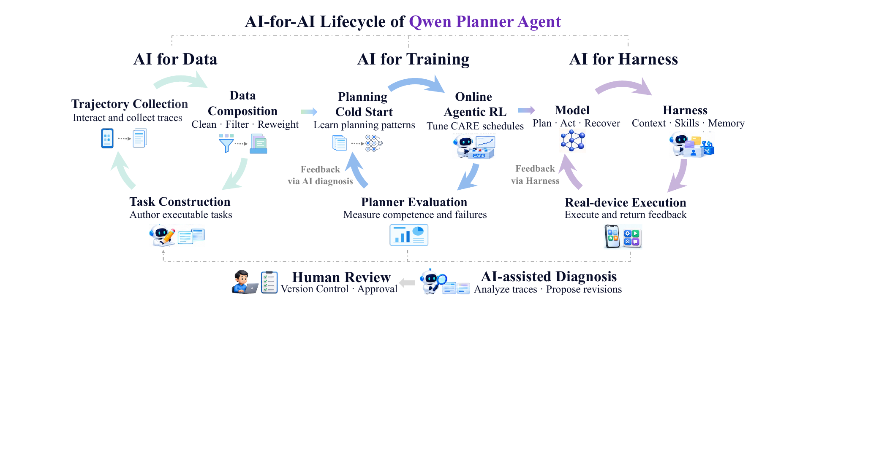
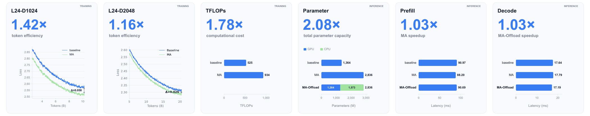
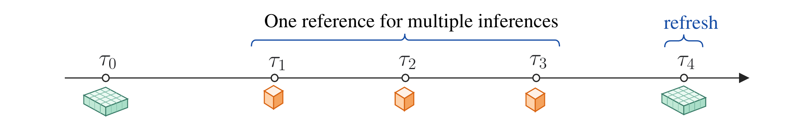

# 六篇论文：少算一点之前，先弄清究竟省掉什么

结合近期论文榜单、arXiv原文、方法与任务需求比较候选，并检查过去7/30天收录。下面六篇都读了核心方法、对照、实验条件与局限，均为预印本与作者实验，本站未训练复现；有榜单关注不等于已有独立复现。每篇保存站内阅读卡，其中三篇CC BY 4.0论文另存原版PDF。旧稿日期、近期提交与真正新进展分别说明。

## 01 · Qwen-Planner-Agent：先学会完成任务，再限制多余推理

arXiv提交2026-09-24 · arXiv:2609.29892 v1 · 预印本。新近创新 / 新近实用，热度待验证。

手机Agent既要完成任务，又不能在已经会做时无限调用工具。Qwen-Planner-Agent提出CARE：成功率低的组多看可验证的中间进展，成功与失败混合时强化任务结果，成功率高后才加入执行成本。这里的“组”是同一任务采样的一批轨迹，不是给所有难度统一套一个节省token奖励。

一个容易忽略的问题是GRPO式组内归一化。全组都成功时，奖励差异主要来自成本；把成本权重缩小，标准差也同比缩小，相除后影响几乎抵消。论文为高成功率组的归一化分母设置下限，让小效率权重仍对应较小的优势幅度，同时保持组内排序。今天的技术实践用合成数据单独检查这个代数现象，不冒充完整训练。

MobilePA覆盖1700多项训练任务、200多项测试任务与13个领域的工具。27B规划器的分数从67.22到训练后的71.90，再到加入harness后的77.05；35B路径分别为54.90、64.79、69.91。不能把训练、执行框架和接口改善都归给单一奖励公式，也不能把与另一模型0.21点的差值称为统计显著领先。

作者报告的每千任务2.41美元仅计算输出token收费，不含输入、工具、设备与运行框架。闭环中的模型控制器也只在预设参数范围内调节，并经过人的审核，不是无约束自我改造。现在值得复用的是按能力分阶段的目标设计与可核验反馈；真实手机、私有任务分布和长期成本仍需独立评估。

Qwen团队图1的生命周期原图，CC BY 4.0。三个环分别组织数据、训练和执行框架；下方Human Review说明有人审核与版本控制。箭头表示反馈，不代表所有改动都自动采纳。（[作者原图](https://arxiv.org/abs/2609.29892v1)；[查看大图](images/planner-lifecycle.png)。）

[站内阅读卡](../../../../papers/frontiers/qwen-planner-agent/00-阅读卡.md) · [归档PDF](../../../../papers/frontiers/qwen-planner-agent/2609.29892v1.pdf) · [原文](https://arxiv.org/abs/2609.29892v1)

采用CC BY 4.0，归档未改动的原版PDF，保留作者、版本和许可。

## 02 · ViRDM：视频后训练可以移除在线教师和评论器，但仍需要好的起点

arXiv提交2026-09-24 · arXiv:2609.28923 v1 · 预印本。新近创新 / 新近实用，热度待验证。

ViRDM研究少步、分块生成视频的后训练。传统DMD同时维护生成器、大教师与在线评论器；它改为预先编码6505组视频与文字，训练时让生成视频的表征分布靠近这个固定参照。视频编码器和文本编码器仍存在，只是不再维持那两个扩散分数模型，不能理解为只剩一张网络且无其他计算。

把图像方法直接搬到视频会爆显存，也容易得到“画面像样但运动很少”的输出。作者随机选择一个去噪步骤做反向传播，使用轻量VAE解码器，并分阶段计算向量—雅可比积，让几段反向计算图不同时驻留。之后增加弱光流约束，修正视频表征对运动强度不敏感的问题。

在Wan2.1-1.3B、81帧、832×480、四步因果生成条件下，VBench总分84.87，对照Causal Forcing为84.51。相同8张A100的最终分布匹配阶段，显存峰值每卡77.1GB到48.3GB，墙钟22小时到2小时。这个16 GPU小时不包含共享初始化，也不包含从头预训练；少更新20步不代表从零训练视频模型只要两小时。

因果初始化是必要条件：短后训练不能可靠把任意双向模型直接变成因果生成器。主实验还未覆盖更大模型、更高分辨率和很长视频，固定表征与参照集会带来偏向。arXiv提交为9月24日，稿内日期写9月4日，本期保留两者，按近30天近期补充处理，不推定24日就是研究首次公开。为什么现在值得看：它把资源瓶颈、运动不足与初始化分别做了对照，提供可诊断的后训练路线。

Zichong Meng等人的图1，忠实裁取PDF第1页的完整图与图注；[完整原页](https://arxiv.org/pdf/2609.28923v1#page=1)。左侧三扩散网络换成中间固定分布匹配，右侧资源只计最终后训练阶段。保留数据与坐标，单图限本条技术评论引用。（[作者原图](https://arxiv.org/abs/2609.28923v1)；[查看大图](images/virdm-method.png)。）

[站内阅读卡](../../../../papers/frontiers/virdm/00-阅读卡.md) · [原文](https://arxiv.org/abs/2609.28923v1)

arXiv非独占分发许可不直接授权本站再分发全文，因此仅归档阅读卡与原站链接；单幅原图限本条方法或实验评论引用。

## 03 · Memory Attention：参数增加，也可能减少每个token的计算

arXiv提交2026-09-23 · arXiv:2609.28399 v1 · 预印本。新近创新 / 新近实用，热度待验证。

标准注意力分别计算查询Q、键K和值V。Memory Attention让V由未做旋转位置编码的K，加上每层、每个token对应的可学习记忆构成，再进行归一化；其中固定于token的部分可折入查表。直觉是把一部分每次都要算的映射，换成根据词表索引读取的参数。

这不是等参数比较。词表通常比隐藏维大，记忆表反而让参数量增加：论文中的1.364B对照对应约2.836B的MA。作者以匹配训练token而非匹配总算力比较，在所列评测中平均分49.06到50.22。新方法可能用更多存储换取更少计算，不能只看模型名字里的参数规模。

H800、BF16、batch=8、长度2048的单次前向计时中，标准注意力预填充90.970ms，MA为88.202ms；解码17.636ms与17.788ms，后者反而略慢。将记忆放到CPU的MA-offload得到17.189ms，但这些数值不含完整采样、token处理与启动流程；图上的1.03倍不是端到端应用保证。

现在值得看的是参数量、训练token、设备内存与实际延迟不再沿同一方向变化。主实验仍保留普通KV缓存，文中的MA-Recall及KV减半是另行讨论的扩展，不能当作主实验已经测得的收益。复现时应同时报告CPU访问、词表规模与实际长输入，而不是仅用一个理论FLOPs值解释速度。

Memory Attention作者的损失与效率汇总原图。前两个面板比较训练token，参数面板明确MA更大；最后解码优势属于MA-offload，而非普通MA。图中文字密集，可打开原尺寸阅读；仅引用这一完整图作技术评论。（[作者原图](https://arxiv.org/abs/2609.28399v1)；[查看大图](images/memory-efficiency.png)。）

[站内阅读卡](../../../../papers/frontiers/memory-attention/00-阅读卡.md) · [原文](https://arxiv.org/abs/2609.28399v1)

arXiv非独占分发许可不直接授权本站再分发全文，因此仅归档阅读卡与原站链接；单幅原图限本条方法或实验评论引用。

## 04 · DeltaWAM：用稀疏变化接续观察，避免每次重算完整世界

arXiv提交2026-09-23 · arXiv:2609.28811 v1 · 预印本。新近创新 / 新近实用，热度待验证。

DeltaWAM把视频式机器人世界模型拆成较稠密的锚点与随后较稀疏的变化表示，并联合产生动作。它不是每个时刻都重新生成完整高成本状态：Streaming Delta Memory将后续真实观察对应的变化放进KV记忆，定期刷新锚点，让长期状态不必只依赖旧预测。

作者在RoboTwin的十个任务上评测，但使用两个各覆盖五任务的训练模型，并非单一模型通吃十个任务。每任务550条演示、100次评估，汇总的干净/随机条件成功率为85.4/83.9，对照FastWAM为81.3/75.8。看分组时，增加流式记忆并不总有收益：第一组干净条件从86.4到82.8，随机条件却从82.6到86.6。

论文另给出单步去噪延迟从121.02ms降到76.76ms，约少36.57%。它属于较低成功率的单步设置，不能和主要多步配置的86.6成功率拼成一个同时实现的结果。真实双臂实验只有三项任务、每项20次，总体41.67%；样本规模小，且不同基线的额外预训练条件不完全相同。

为什么现在值得看：它把“何时刷新完整状态、何时只传变化”变成可测的系统设计。实际部署仍要处理动作时效、感知延迟与累积误差，论文的有界异步方案不是所有设备上的稳定保证。CC BY-NC-SA 4.0原文，本期保存阅读卡与原站入口，不将整篇PDF再分发。

DeltaWAM作者的推理时序原图（inference）。绿色大块为锚点与刷新，橙色小块为中间变化；读图重点是一个参照支持多次推理，不能由方块大小推出固定显存比例。CC BY-NC-SA 4.0，仅作有署名方法评论，未改数据。（[作者原图](https://arxiv.org/abs/2609.28811v1)；[查看大图](images/delta-memory.png)。）

[站内阅读卡](../../../../papers/frontiers/deltawam/00-阅读卡.md) · [原文](https://arxiv.org/abs/2609.28811v1)

采用CC BY-NC-SA 4.0；本期保留阅读卡和原站入口，仅引用一幅有署名的实验图作技术评论，未修改其数据。

## 05 · Just Ask Jev：能把失败排在前面，不代表概率已经校准

arXiv提交2026-09-24 · arXiv:2609.29429 v1 · 预印本。新近创新 / 新近实用，热度待验证。

这项研究把闭源Jev 1.13 API作为零样本失败检测器，输入任务或输出，让它估计出现某种对齐失败的概率。评测收集44个基准、7193个实例、十类失败；少数类不足的任务被排除，部分统计只覆盖38个。标签有规则、模型裁判及人工核对等不同来源，不能统称全部为人类金标准。

通用提示在31项可比较数据上的AUROC中位数约0.886；定向提示在38项上约0.911，两者分母不同，不宜直接相减当提升。严格留出的定向措辞收益约0.006，置信区间跨零；根据同一数据选择提示会带来更大的乐观偏差。因此“换一段聪明提示就稳定更好”并不由这些数字保证。

另一关键是排序与校准：把更危险样本排前面，可以得到较好AUROC，却未必能相信它报出的80%概率。论文合并数据的ECE约0.047，逐基准中位数却约0.168；把不同任务混在一起，会掩盖某一具体任务的偏差。

阈值也不能照搬。在一组数据中交叉验证阈值让F1从0.706到0.822，但仅看验证标签的子集，结果反而从0.721降到0.694。现在值得借鉴的是把模型分数接入本地校准和标签审查，而非将一个远端模型视作通用可靠裁判。本站已读方法和分组结果，没有调用API复现；服务版本和成本仍会影响可复现性。

Just Ask Jev图5，CC BY 4.0。左图对比合并与逐任务校准，中图展示任务阈值分散，右图是减少覆盖后的准确率；丢弃不确定样本会改变覆盖率，不能只报准确率上涨。（[作者原图](https://arxiv.org/abs/2609.29429v1)；[查看大图](images/jev-calibration.png)。）

[站内阅读卡](../../../../papers/frontiers/just-ask-jev/00-阅读卡.md) · [归档PDF](../../../../papers/frontiers/just-ask-jev/2609.29429v1.pdf) · [原文](https://arxiv.org/abs/2609.29429v1)

采用CC BY 4.0，归档未改动的原版PDF，保留作者、版本和许可。

## 06 · Neural Spectral Capacity：先用数学代理筛架构，再验证真实能力

arXiv提交2026-09-19 · arXiv:2609.23087 v1；近期补充（近30天） · 预印本。新近创新 / 新近实用，热度待验证。

Neural Spectral Capacity为网络设计一个可加的谱指标：单个矩阵计算log det(I+WᵀW)，也就是把奇异值平方加一后取对数求和。作者借助随机矩阵的渐近规律，从尺寸和初始化方差直接近似这个分数，避免先实例化并训练大量候选网络。

指标借用了高斯信道容量的直觉，但不是证明整个带非线性的神经网络等于一条高斯信道。逐层相加是代理设计，归一化、非线性和嵌入等也未被完整建模；随机初始化的独立性与大维条件不能随意推广到任意训练后权重。

在分数和资源成本可加、候选离散化的条件下，动态规划可以找出给定网格的最佳代理分数。但“全局最优”针对的是这个指标，不是测试集准确率。FlexiBERT500的参数量近似匹配比较中，代理与表现的相关性高于只数参数；这支持筛选用途，不等于每次排名都正确。

作者报告TXL约40M配置的困惑度23.087，对照38M为23.279，搜索约2秒CPU时间；训练成本没有算进去。LLaMA超网实验约5.7B子网平均65.47，对照方法63.83，未剪枝模型69.72；0.46秒搜索也不包含建立预训练超网。9月19日原文作为近期补充入选，价值在于快速提出候选，再花训练预算验证，而非跳过实验宣布架构已经最优。

Neural Spectral Capacity作者的Pareto原图，CC BY 4.0。左侧蓝线是代理指标与计算预算的前沿，右侧红点是选定子网的实际任务表现；两边纵轴不同，说明代理最优与实测最优必须分开。（[作者原图](https://arxiv.org/abs/2609.23087v1)；[查看大图](images/nsc-pareto.png)。）

[站内阅读卡](../../../../papers/frontiers/neural-spectral-capacity/00-阅读卡.md) · [归档PDF](../../../../papers/frontiers/neural-spectral-capacity/2609.23087v1.pdf) · [原文](https://arxiv.org/abs/2609.23087v1)

采用CC BY 4.0，归档未改动的原版PDF，保留作者、版本和许可。
