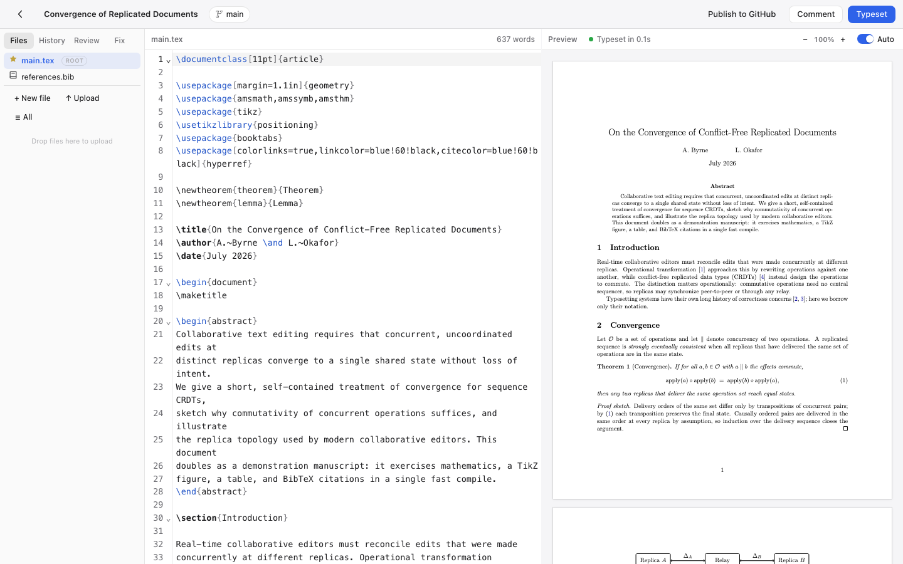
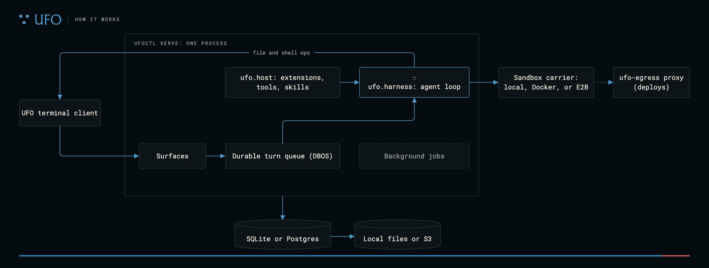
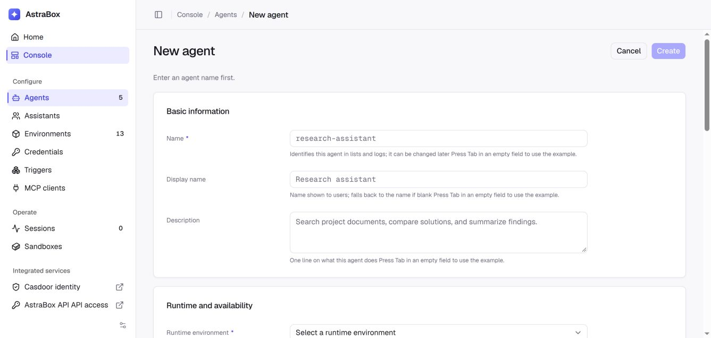
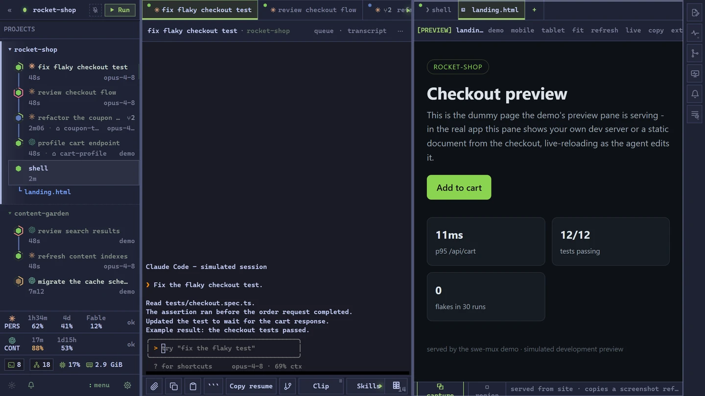

# 十个项目：把新工具放到具体任务里判断

比较20个仓库候选，实际检查Hacker News/Show HN、代码与版本记录、作者文档和演示。以下十项均有公开实现和可核验许可；本站未安装运行。近期讨论只作发现线索，没有两类独立趋势证据就不标热门。仓库创建、版本发布与被社区发现的日期分开记录。

| 任务 | 工具 | 先检查的门槛 |
| --- | --- | --- |
| 在Elixir里组织与优化LLM程序 | imp | Elixir 1.19+、编译工具、模型服务 |
| 自托管协作LaTeX写作 | Aldine | Docker、Node22、TeX Live；AGPL-3.0 |
| 跨编码会话保存可读记忆 | jevmem | Node、相应Agent接入；远端判断服务 |
| 给真实截图添加展示样式 | Shotcandy | 浏览器或本地前端；不生成虚假界面 |
| 按目标过滤推荐信息流 | Rot Guard | Chrome扩展、API key、外部判断 |
| 运行持久Agent工作流 | UFO core | Python3.12、Rust客户端；配置执行权限 |
| 统一托管Agent与凭据入口 | AstraBox | Docker、沙箱、模型网关及身份配置 |
| 用单个Go程序承载pi式会话 | PiG | 平台二进制、模型账户；兼容范围有限 |
| 手机查看并接续多Agent会话 | swe-mux | Python/uv、原Agent CLI、远程网络 |
| 将大文件与Git历史分开存储 | gat | Git、对象存储或本地后端、独立同步命令 |

## 01 · imp：把LLM程序放进Elixir的类型与进程体系

2026-09-28 · 7月10日建库；首个Hex发布v0.5.0于28日02:02北京时间上线。新近实用；热度待验证。

imp借鉴DSPy，将输入输出签名、模块组合和提示优化接入Elixir。一个分类或抽取任务可以先定义结构，再用训练、验证与测试集分别优化和检查，运行过程由OTP管理。9月27日UTC发布的v0.5.0是首个Hex发行，不能把随后主分支的0.5.1标记当成已发布版本。

最小路径是在Elixir 1.19以上项目加入依赖，经ReqLLM配置模型服务；首次构建可能需要C/C++工具链和网络。GEPA等优化器会反复调用模型，训练与测试集应分开，调用成本另计。MIT许可，适合已有Elixir系统的团队；目前是早期库，README示例和作者说明不等于大型生产基准，本站未运行优化。

[源码](https://github.com/deepfates/imp) · [MIT](https://github.com/deepfates/imp/blob/main/LICENSE)

## 02 · Aldine：协作LaTeX编辑也可以保留文件与Git工作流

2026-09-24 · 7月7日建库；v0.11于24日加入自有OIDC与Agent API进展。新近实用；热度待验证。

Aldine将浏览器协作编辑、PDF编译、Git和文献管理放在一个自托管工作流中。输入LaTeX与参考文献文件，协作修改后生成PDF；项目保留文件形式，适合希望自己管理论文素材的团队。24日版本补充身份与Agent访问能力，构成本次近期实质更新。

上手可用Docker部署应用和TeX编译环境；源码开发需Node22与TeX Live等依赖。Agent/MCP入口需显式配置，并不因部署编辑器就自动向代理开放全部文档。主程序AGPL-3.0，模板素材可能另有许可。作者界面已核对，本站未部署多人协作或验证全部LaTeX包。

Aldine维护者的编辑器原图：左侧源文件，中间LaTeX，右侧编译预览；图用于说明编辑与产物的对应。AGPL-3.0项目资料，示例论文不属于本站创作。（[来源原图](https://github.com/trahloff/Aldine)；[查看大图](images/aldine-editor.png)。）

[源码](https://github.com/trahloff/Aldine) · [AGPL-3.0](https://github.com/trahloff/Aldine/blob/main/LICENSE)

## 03 · jevmem：让代理记忆落在能读、能修改的文件里

2026-09-22 · 22日新公开。新近实用；热度待验证。

jevmem把编码会话中的事实整理进JEVMEM.md，便于人检查、删除和修改，再让后续会话回忆。Claude采用钩子捕获，Codex有活动会话监测与MCP接入，Cursor主要靠代理主动调用；这些入口并非同一种自动化程度。

需要Node及对应Agent配置，部分筛选和判断调用外部Jev服务；即使发送前清洗信息，也不能称为完全离线记忆。作者给出回忆与污染测试，但有漏检案例，不保证不可信文本永远不会进入长期记忆。MIT实现，适合先用公开小项目检查“写入了什么、下次取回了什么”；本站未处理私人会话或复现实验。

[源码](https://github.com/Avinash-jetwani/jevmem) · [MIT](https://github.com/Avinash-jetwani/jevmem/blob/main/LICENSE)

## 04 · Shotcandy：用真实截图做展示图和短视频

2026-09-27 · 26日UTC建库，27日北京时间公开。新近实用；热度待验证。

Shotcandy把已有截图放入背景、边框与倾斜样式中，输出适合文档或项目介绍的图像，也提供短视频展示路径。输入应是你真实拥有的界面截图；它改变呈现，不负责生成产品功能或伪造使用结果。作者提供前后对照，可直接看清改动范围。

可在浏览器使用，或以React/Vite源码本地运行。维护者说明处理在浏览器端完成，无需账号；若自己托管，仍应核对部署版本和附加服务。MIT许可，新近价值是把截图美化整合为具体可复用流程。本站只查看官方样例，没有上传用户截图或测试各种视频导出格式。

Shotcandy作者的输入与输出原图。左边是原截图，右边只改变背景、透视与边框，数据内容没有被AI重新生成。MIT项目资料，仅用于说明实际工具操作。（[来源原图](https://github.com/btahir/shotcandy)；[查看大图](images/shotcandy-example.webp)。）

[源码](https://github.com/btahir/shotcandy) · [MIT](https://github.com/btahir/shotcandy/blob/main/LICENSE)

## 05 · Rot Guard：按自己的目标过滤信息流，同时保留查看入口

2026-09-27 · 27日新公开。新近实用；热度待验证。

Rot Guard是浏览器扩展，依据用户目标判断推荐条目是否相关，再将不合适内容折叠，并允许手动显示。适合试验更主动的信息选择：例如阅读技术资料时减少娱乐推荐，而不是仅依靠网站自身推荐系统。

源码路径需Node18以上构建并在Chrome加载，配置Jev API key；标题、摘要和偏好等会参与远端判断，不是纯本地过滤。MIT实现，主观目标的表达方式会影响结果，误屏蔽和漏屏蔽都应预期。27日公开的界面展示了折叠与撤回，但本站未安装扩展或验证长期注意力改善。

Rot Guard维护者的YouTube过滤示例：上方两条被折叠，下方保留可见内容；Show anyway用于人工恢复。截图只说明交互，不证明过滤准确率。MIT代码，平台界面及缩略图权利归原权利人，限本项评论引用。（[来源原图](https://github.com/plusminushalf/rot-guard)；[查看大图](images/rot-guard.png)。）

[源码](https://github.com/plusminushalf/rot-guard) · [MIT](https://github.com/plusminushalf/rot-guard/blob/main/LICENSE)

## 06 · UFO core：把代理回合、后台任务与工具执行分开管理

2026-09-27 · 27日新公开。新近实用；热度待验证。

UFO core用持久队列保存Agent回合，将交互入口、工具宿主和后台工作组织成一个服务。输入任务与工作区授权，服务推进调用并保存状态；SQLite单进程路径降低起步复杂度，DBOS提供持久执行基础。适合需要任务恢复和多入口的自托管代理实验。

环境以Python3.12、uv和Rust客户端为主，模型服务另配。默认本地命令以用户身份执行；选择远程运行也不自动意味着已进入Docker隔离，需明确配置carrier与出口权限。Apache-2.0代码，新项目的可恢复设计有实用价值，但故障恢复、权限和并发行为尚未由本站实测。

UFO维护者结构原图，Apache-2.0。看客户端、回合队列、工具执行与存储四条路径；图列出的local、Docker、E2B是可选执行环境，不代表默认全启用。（[来源原图](https://github.com/ufo-ai/ufo-core)；[查看大图](images/ufo-architecture.png)。）

[源码](https://github.com/ufo-ai/ufo-core) · [Apache-2.0](https://github.com/ufo-ai/ufo-core/blob/main/LICENSE)

## 07 · AstraBox：把Agent、运行环境和凭据做成可管理资源

2026-09-27 · 22日建库；23日v0.1.0，27日v0.1.1补充访问边界修正。新近实用；热度待验证。

AstraBox提供自托管控制台，统一创建Agent、绑定运行环境、管理凭据与会话，并接入MCP等工具。与单个聊天窗口相比，它更关注部署和管理：为研究助手建立独立环境，再配置允许访问的模型与资源。

最小部署涉及Docker与OpenSandbox；模型网关可配LiteLLM，身份可接Casdoor，相关模型CLI和账户仍需自行具备。离线演示仅覆盖有限流程，不能等同于所有连接都已可用。Apache-2.0；本次以新平台及早期版本进展入选，不把一次小修复当成独立产品。项目很新，本站未验证其隔离或生产可靠性。

AstraBox作者控制台原图，Apache-2.0。创建Agent时既填写用途，也选择运行环境；界面上的可配置项不保证对应后端已经部署完成。（[来源原图](https://github.com/Colton-z/AstraBox)；[查看大图](images/astrabox-console.png)。）

[源码](https://github.com/Colton-z/AstraBox) · [Apache-2.0](https://github.com/Colton-z/AstraBox/blob/main/LICENSE)

## 08 · PiG：用Go二进制承载熟悉的pi式编码流程

2026-09-26 · 17日建库，v0.2.0于26日北京时间发布。新近实用；热度待验证。

PiG尝试把pi编码Agent的会话、工具与扩展工作流移植到Go，实现更简便的二进制分发。输入编码任务、连接模型服务后使用工具与扩展；对需要在多台机器部署的人，分发方式可能比新增一层界面更有价值。

当前兼容目标固定于特定pi版本，不能假设所有TypeScript扩展与未来接口都等价支持，Windows路径仍属预览。按平台下载发行包或用Go构建，模型账户与调用费用另计。MIT许可，本次关注的是近期首次公开发行及可检查的兼容范围；它并非上游官方完整替代品，本站未运行扩展兼容测试。

[源码](https://github.com/MichaelKinsy/PiG) · [MIT](https://github.com/MichaelKinsy/PiG/blob/main/LICENSE)

## 09 · swe-mux：在手机上检查多个编码Agent的工作

2026-09-26 · 8月16日建库；26日v0.2.9扩展移动端标签与实时预览。新近实用；热度待验证。

swe-mux把多个编码Agent会话放在网页工作区中，能查看输出、切换任务和预览正在开发的页面。26日版本改进移动端与预览交互，是旧项目本次的实质更新；使用场景是离开电脑后检查进度和继续输入，而不是承诺代理可以无限后台运行。

可通过uv安装Python工具，前端已打包，不要求用户额外装Node；仍需原有Agent CLI和模型账户，远程访问可结合Tailscale。断电会结束运行进程，记录可用于恢复不代表进程永生。Apache-2.0；作者演示中的代理活动有模拟内容，本站未远程接管私人会话。

swe-mux官方演示界面，Apache-2.0。中间会话与右侧开发预览相邻；屏幕明确为模拟Agent活动，不能当作真实完成结账功能的验收证据。（[来源原图](https://github.com/jatoran/swe-mux)；[查看大图](images/swe-mux.webp)。）

[源码](https://github.com/jatoran/swe-mux) · [Apache-2.0](https://github.com/jatoran/swe-mux/blob/master/LICENSE)

## 10 · gat：Git保留历史，大文件交给单独的存储与同步

2026-09-26 · 9月7日首次公开（近期补充）；26日v0.0.14改进批量缓存与并行处理。新近实用；热度待验证。

gat让Git保存大文件的版本指针与元数据，把实际内容放到对象存储或本地后端。适合带模型、数据集或实验产物的仓库：文本历史仍走Git，较大的二进制独立存取，减少把所有对象塞进普通仓库。

上手需在每个克隆中初始化钩子，配置后端，并理解gat push/pull与普通git push/pull的区别；只推Git元数据，不意味着大文件也已上传。可用发行包或Rust 1.91以上构建，存储服务另有成本与权限。Apache-2.0，26日版本的批量与并行改进有明确近期价值；仍处0.0.x阶段，本站未测试断网恢复和大规模数据一致性。

[源码](https://github.com/getgat-dev/gat) · [Apache-2.0](https://github.com/getgat-dev/gat/blob/main/LICENSE)
